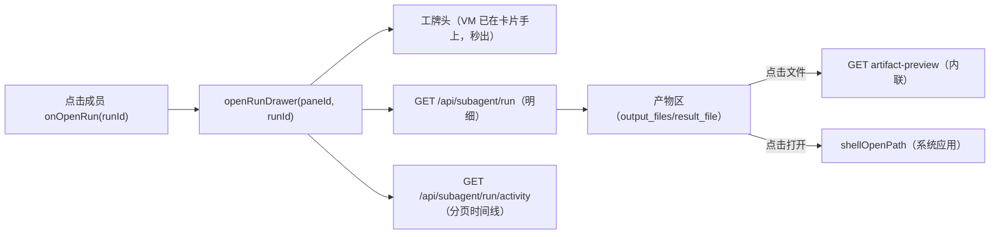

# Sub-Plan D：右侧子智能体落盘 Drawer（活动日志时间线 + 产物 + 落盘路径）

Planned-with: Claude Opus 4.8
Plan-Id: 2026-07-05-subagent-artifact-drawer
Plan-File: .cursor/plans/2026-07-05-subagent-artifact-drawer.plan.md
父规划: `.cursor/plans/2026-07-05-subagent-cluster-persistence.plan.md`
依赖: Sub-Plan B（数据）+ Sub-Plan C（卡片点击入口）
Suggested-Impl-Model: Sonnet 5 (Medium)（中等前端，复用现有右侧列布局范式、创造性低，性价比最佳；极省可降 Sonnet 4.6 Low）

## 1. 需求

### FR（功能需求）

- **FR-1**：点击集群卡片内某个子智能体（Sub-Plan C 的 `onOpenRun(runId)`）→ 在 `ChatPane` **右侧列**打开子智能体落盘 drawer（`SubAgentRunDrawer`），对齐图5/图6 的「Kimi's Computer」右侧面板体验。
- **FR-2**：drawer 顶部为该子智能体**工牌头**（复用 Sub-Plan C 的 `AgentBadge` full 态：头像/名字/角色/模型/状态）+ 「复制」+「关闭」。
- **FR-3**：drawer 主体是**活动日志时间线**（`RunActivityTimeline`）：按 `run/activity` API 分页渲染每条 `ActivityEntry`（读取待办 / 思考已完成 / 搜索网页「N 个结果」/ 编写报告…），工具类条目可展开看 detail；对齐图5 左侧时间线。
- **FR-4**：drawer 底部/末尾为**产物区**（`RunArtifactList`）：列出 `output_files` / `result_file`，每项显示文件名 + 落盘**绝对路径**（对齐图6「报告文件路径：/mnt/agents/output/report.md」），点击文件名走 `run/artifact-preview` 内联预览（Markdown/文本），点击路径/「打开」走 `shellOpenPath` 用系统应用打开。
- **FR-5**：drawer 数据源统一走 Sub-Plan B 的 `run` + `run/activity` + `artifact-preview`；对**正在运行**的 run，drawer 也能打开并随 SSE/轮询实时增长活动日志（复用 B 的运行态合并）。
- **FR-6**：drawer 与既有右侧面板（Spawns/工作区/记忆图谱）互斥或叠加规则明确：打开落盘 drawer 时按 `cycleSidePanel` 同族语义管理，避免多面板打架；关闭回到原布局。

### NFR（非功能需求）

- **NFR-1**：drawer 复用既有右侧列布局范式（`border-l` + `startResize*` 可拖拽宽度，参考 `SpawnsColumn`/`WorkspacePanel`），背景/tint 走主题 token 与成员色。
- **NFR-2**：时间线分页加载（滚到顶/底加载更多），长任务（数百条）不一次性渲染。
- **NFR-3**：产物预览截断（沿用 B 的 truncated），二进制走 open_hint 不内联。
- **NFR-4**：Markdown 产物在三态主题下有可读代码高亮（复用现有 `CitationMarkdownBody` / 代码主题，避免浅色退化为无高亮纯字）。
- **NFR-5**：drawer 打开/切换即时响应（乐观 UI）：先出工牌头与骨架，再异步填活动日志与产物，不白屏等待。

### AC（验收标准）

- **AC-1**：点击成员 → 右侧 drawer 打开，顶部工牌头正确，主体渲染活动日志时间线，末尾产物区列出落盘路径。
- **AC-2**：点击产物文件名内联预览文本/Markdown；点击「打开」用系统应用打开该路径（`shellOpenPath` 生效）。
- **AC-3**：对运行中 run 打开 drawer，时间线随执行实时增长。
- **AC-4**：drawer 宽度可拖拽；关闭后回到原右侧布局，不残留。
- **AC-5**：三态主题下 drawer（含 Markdown 产物）可读、无溢出、代码有高亮。
- **AC-6**：重启 / 切 session 回看历史 run，drawer 仍能拉到当时的活动日志与产物路径（数据来自 B 的落盘源）。

## 2. 技术方案

### 2.1 新增组件

```
desktop/src/components/subagent/
├── SubAgentRunDrawer.tsx      # 右侧 drawer 容器（工牌头 + 时间线 + 产物 + resize）
├── RunActivityTimeline.tsx    # 活动日志时间线（分页/展开 detail）
└── RunArtifactList.tsx        # 产物列表（预览 + shellOpenPath 打开）
```

### 2.2 store / 面板接线

- `store.ts` 新增 per-pane 状态：`runDrawerOpen: boolean`、`runDrawerRunId: string | null`（随 pane 持久化到 `agx-workspace-state-v1`，重启后可恢复「上次打开的 run drawer」，对齐断点续开偏好）。
- 新增 action：`openRunDrawer(paneId, runId)` / `closeRunDrawer(paneId)`，纳入 `cycleSidePanel` 同族互斥管理（打开落盘 drawer 时按需收起 Spawns 等，避免右侧列拥挤）。
- `SubAgentClusterCard` 的 `onOpenRun` → `openRunDrawer(pane.id, runId)`。

### 2.3 布局

`ChatPane` 右侧列新增一档（在 Spawns/工作区之后），布局与现有右侧列一致（`border-l border-border`、可拖拽宽度、tint 用成员色）。参考现有 `SpawnsColumn` 的 `width` / `startResize` 实现。

### 2.4 数据流



- 运行中 run：drawer 除首屏拉一次外，订阅全局 `subAgents[runId].events` 增量追加（与 B 的运行态合并互补），完成后切 B 的落盘分页为准。

## 3. 验收标准与用例

- **用例 1（历史钻取）**：对已完成 run 打开 drawer → 时间线 + 产物路径完整，预览与打开均可用。
- **用例 2（运行态）**：对 running run 打开 drawer → 时间线实时增长。
- **用例 3（三态 Markdown）**：产物为 Markdown → 三态下渲染有代码高亮、可读。
- **用例 4（resize/关闭）**：拖拽宽度、关闭回原布局、重启恢复上次打开的 drawer。
- **用例 5（安全）**：产物预览仅限白名单路径（B 保证），越权路径 UI 显示结构化错误。

## 4. 风险与资源排期

| 风险 | 等级 | 缓解 |
|---|---|---|
| 右侧多面板（Spawns/工作区/drawer）互斥逻辑打架 | 中 | 统一走 `cycleSidePanel` 同族管理，打开 drawer 时明确收起冲突面板；写清优先级 |
| 运行态增量 + 分页落盘态双源拼接错乱/重复 | 中 | running 用内存事件流、completed 切 B 分页；按 seq 去重；状态切换点单一 |
| drawer 持久化字段污染旧 localStorage | 中 | 新字段可选 + 缺省合并 + 可选链读取（对齐既有 pane 新字段兼容纪律） |
| 大时间线渲染卡顿 | 低 | 分页 + 虚拟化（可选）+ 展开 detail 惰性 |

**排期**：2 人天（1 drawer 容器 + 时间线 + 产物区 + 0.5 store/面板接线与互斥 + 0.5 三态视觉与回归）。依赖 B（数据）与 C（入口）。