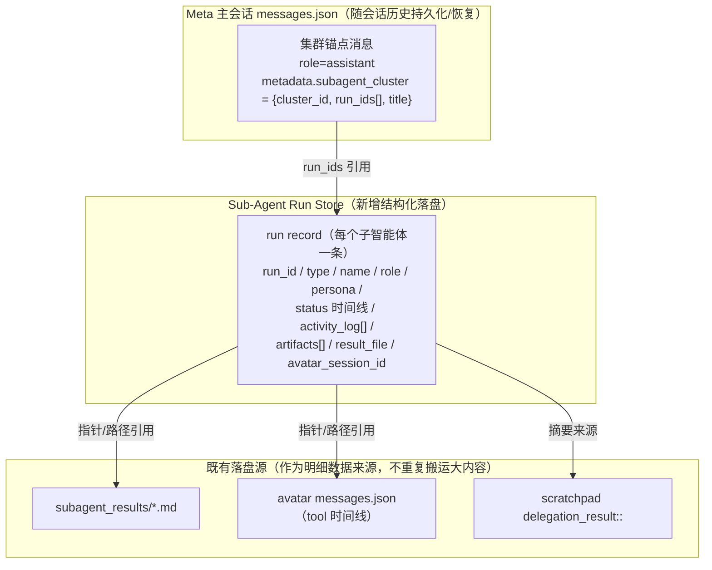
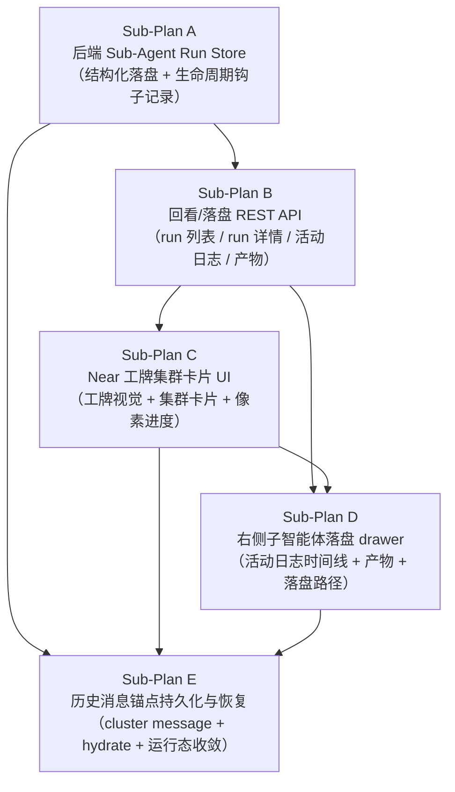

# 子智能体集群卡片：持久化与落盘回看（Sub-Agent Cluster Persistence & Artifact Review）— 主规划

Planned-with: Claude Opus 4.8

> 本文档是**主规划（Index Plan）**，不含可执行 todo，只负责拆解 DAG 与串联 5 个子规划。每个子规划独立包含需求（FR/NFR/AC）、技术方案、验收标准与用例、风险与资源排期，可独立执行、独立验收、独立提交。

## 背景

参考 Kimi Work 的「派生智能体」体验（用户提供的 6 张截图）：

- **图1/图2**：Meta-Agent 收到任务后，在**同一 session 的对话流内**派生出一组子智能体，以「Agent 集群 · N 个并行任务」的**集群卡片**呈现；每个子智能体有**自己的名字**（赫勒/卡尔/唐墨/鲍蒙…）、**角色工牌**（像素大头贴 + 角色名如「股票分析Writer 火炬电子」+ 座右铭 + 模型 logo + 「角色说明」入口）。
- **图4**：执行过程中每个子智能体有**像素方格进度条**（逐格点亮）+ mono 编号（`01`）。
- **图5/图6**：点击集群卡片里的某个子智能体（如「鲍蒙」）→ **右侧面板**打开该子智能体的**活动日志时间线**（读取待办、思考、搜索网页 50 个结果…）+ **最终落盘产物**（`报告文件路径：/mnt/agents/output/report.md`）。
- 关键诉求：这些「子智能体做了什么、中间产物、最终产物、落盘路径」都应**持久化在该 session 内**，用户**关闭重启 / 切换 session / 回看历史**时仍能看到集群卡片、点开钻取。

**AgenticX 现状（已具备的拼图）**：

| 能力 | 现状 | 关键路径 |
|---|---|---|
| 两条派生链路 | `spawn_subagent`（隔离子会话）+ `delegate_to_avatar`（分身真实 session） | `agenticx/runtime/meta_tools.py`、`agenticx/runtime/team_manager.py` |
| 运行态状态查询 | `/api/subagents/status`（含 `_delegation_info` 扫描、`recent_events` 内存态） | `agenticx/studio/server.py` L3563–3653 |
| spawn 最终文本落盘 | `~/.agenticx/sessions/<owner_sid>/subagent_results/<agent_id>.md` | `team_manager.py` L1529–1554 |
| delegate 完整执行过程落盘 | Avatar session 的 `messages.json` + `agent_messages.json`（≈5s 中间 persist） | `meta_tools.py` L1782–1826 |
| 摘要落盘 | meta session scratchpad `subagent_result::` / `delegation_result::`（SQLite `scratchpad` 表） | `session_store.py` |
| 前端运行态卡片 | 全局 Zustand `subAgents[]` + `SubAgentCard` + `SpawnsColumn`（Pro）/ `SubAgentPanel`（Lite），`App.tsx` 每 2s 轮询 | `desktop/src/store.ts`、`SubAgentCard.tsx`、`SpawnsColumn.tsx` |
| 会话消息持久化/恢复 | `messages.json` + `GET /api/session/messages`；pane 状态 localStorage `agx-workspace-state-v1` | `session_manager.py`、`desktop/src/App.tsx` |

**核心缺口（本规划要补齐的四条断层）**：

1. **无统一子智能体 run 索引**：卡片元数据（run_id、类型 spawn/delegate、owner_session、成员名/角色/工牌、状态时间线、产物清单）无结构化落盘，仅散落在内存 `AgentTeamManager._agents` / `_delegation_info` 与几份 md/scratchpad 中。
2. **活动日志不落盘**：`SubAgentContext.recent_events` / 前端 `SubAgent.events` 仅内存，重启即失，无法历史回放工具时间线（图5 的左侧时间线）。
3. **前端卡片非消息、无锚点**：`subAgents[]` 是全局 UI 态，不属于 `messages[]`，不进 `messages.json`、不进 localStorage；切 session 按 `sessionId` 过滤即隐藏，重启后仅当后端仍返回运行态才重建 → **完成/归档的集群卡片一律消失**。
4. **无「点击卡片→右侧落盘 drawer」**：现有 `SpawnsColumn` 只承载运行态卡片，无面向历史回看的「某子智能体执行过程 + 产物 + 落盘路径」钻取面板。

**目标**：让子智能体集群成为 session 内**一等公民的持久化对话锚点**——派生即落盘、回看即重建、点击即钻取；并为 Near 桌面端设计一套**专属高品位工牌卡片 + 集群卡片 + 像素进度 + 右侧落盘 drawer** 的视觉体系（黑白高对比度极客风，对齐 Near 品牌，而非照搬 Kimi）。

## 非目标

- 不改动子智能体的**执行/调度语义**（`spawn_subagent` / `delegate_to_avatar` 的并发、超时、路由回退、暂停检测均保持现状）；本规划只在其生命周期钩子上**旁路记录**，不干预主流程（遵守 `no-scope-creep`）。
- 不做子智能体产物的**跨设备云同步**（仅本机 `~/.agenticx/` 落盘 + 本机 Desktop 回看）。
- 不重构现有运行态轮询链路（`App.tsx` 2s 轮询 `/api/subagents/status` 保留；本规划新增的是**历史回看链路**，与运行态链路并存，运行完成后由前端做「运行态 → 持久态」的平滑收敛）。
- 不改 Lite 模式的 `SubAgentPanel` 主结构（工牌卡片组件抽象后 Lite 可低成本复用，但 Lite 的右侧 drawer 交互列为可选，不阻塞验收）。

## 架构分层：锚点（Anchor）与明细（Run Record）分离

这是整套方案的关键决策，贯穿全部子规划：

- **锚点（Anchor）**：一条轻量的**集群消息**，写进 meta session 的 `messages.json`，随会话历史一起持久化与恢复。它**只存引用**（`cluster_id` + 成员 `run_ids` + 标题），不存活动日志/产物大对象。→ 解决断层 3（前端卡片随消息历史回来）。
- **明细（Run Record）**：每个子智能体一条结构化记录，存进新增的 **Sub-Agent Run Store**（落盘 SQLite/JSON），含状态时间线、活动日志、产物清单与落盘路径指针。→ 解决断层 1、2。
- **明细不重复搬运大内容**：活动日志/产物正文仍以既有落盘源（`subagent_results/*.md`、avatar `messages.json`、scratchpad）为**真相源**，Run Record 只存**指针 + 摘要 + 时间线元数据**，避免数据冗余与一致性问题。→ 与 `team_manager` 归档快照剥离大对象的现有策略一致。

前端因此得到干净的 hydrate 链：`messages.json` 恢复 → 渲染集群锚点消息 → 按 `run_ids` 调 Run Store API → 渲染工牌集群卡片 → 点击某子智能体 → 右侧 drawer 拉该 run 的活动日志 + 产物路径。→ 解决断层 4。

## 子规划与 DAG

**依赖说明**：

- **A 是唯一硬前置**：Run Store 的数据契约（run record schema）必须先冻结，B/E 都消费它。
- **B（API）** 依赖 A；**C（工牌卡片）** 依赖 B 的返回契约（可先按 A 冻结的 schema 并行搭 UI 骨架，联调时接 B）。
- **D（落盘 drawer）** 依赖 B（数据）+ C（卡片点击入口）。
- **E（历史锚点持久化与恢复）** 是收口环节，依赖 A（run_ids 可查）、C（卡片可渲染）、D（点击可钻取），负责把「锚点消息落 messages.json + 恢复时 hydrate + 运行态→持久态收敛」串成端到端闭环。

## 里程碑验收（跨子规划 · 端到端）

对齐用户截图的验收剧本：

1. 用户在 Meta 会话给出「并行分析三只股票」类任务 → Meta 派生 3 个子智能体 → 对话流内出现 **Near 工牌集群卡片**（3 个成员，各有名字/角色工牌/像素进度）。
2. 执行中，每个成员工牌的**进度像素条**随 SSE 实时点亮；完成后收敛为「已完成」态。
3. 点击成员「鲍蒙」→ **右侧 drawer** 打开其**活动日志时间线**（读取待办 / 思考 / 搜索网页 N 个结果 / 编写报告…）+ 拉到底看到**最终产物落盘路径**（可点击 `shellOpenPath` 打开）。
4. **关闭并重启 Near / 切到别的 session 再切回 / 从历史面板重新打开该 session** → 集群卡片**仍在对话流原位**，点击成员仍能在右侧 drawer 看到当时的活动日志与落盘产物路径。
5. `agx serve` 冷重启后（`AgentTeamManager` 内存清空）→ 上述历史回看仍成立（数据来自 Run Store 落盘，而非内存）。

## 建议排期（合计约 9–12 人天，单人顺序估算；并行可压缩至 ~7 人天）

| 子规划 | 预估工作量 | 可并行性 |
|---|---|---|
| A 后端 Run Store | 2.5 人天 | 无（前置） |
| B 回看 API | 1.5 人天 | A 完成后即可 |
| C 工牌集群卡片 UI | 3 人天 | 可与 B 并行（先按 schema 搭骨架） |
| D 落盘 drawer | 2 人天 | 依赖 B+C |
| E 锚点持久化与恢复 | 2 人天 | 收口，依赖 A/C/D |

## 推荐实施模型（高性价比匹配 · 截至 2026-07-05 模型清单）

以「够用且最省」为原则匹配。当时可用清单：Composer 2.5 Fast、Opus 4.8 (1M Medium)、GPT-5.5 (Low)、Fable 5 (1M Max)、Sonnet 5 (1M Medium)、Sonnet 4.6 (1M Low)、Codex 5.3 (Medium)、Opus 4.7 (1M Low)、Kimi K2.7 Code、GLM 5.2 (Max)。

| 阶段 | 任务性质 | 推荐模型 | 理由（性价比） |
|---|---|---|---|
| 规划（本文档，已完成） | 复杂跨栈架构决策 + 视觉方向 | **Opus 4.8** | 架构分层/风险判断值得上顶配，一次做对省下返工 |
| A 后端 Run Store | 纯 Python 实施，旁路接线两条链路，**高回归风险** | **Codex 5.3 (Medium)** | 代码专精中档，精准改动 + 冒烟测试性价比最优；避免弱模型碰易倒退的接线 |
| B 回看 API | 简单 REST 端点 + 分页 + 合并 | **Composer 2.5 Fast** | 样板骨架类，便宜快即可；仅 `artifact-preview` 路径安全一节建议用 GPT-5.5 复核 |
| C 工牌集群卡片 UI | 前端视觉重塑，**需审美/品味** | **Opus 4.8** | 唯一必须上顶配之处——Near 专属工牌视觉品味是核心交付，弱模型易做成低端二次元感 |
| D 落盘 drawer | 中等前端，复用现有右侧列布局 | **Sonnet 5 (Medium)** | 均衡主力，复用范式多、创造性低，性价比最佳 |
| E 锚点持久化与恢复 | 跨栈（后端锚点 + 前端 hydrate）+ **tool 序列一致性高风险** | **GPT-5.5 (Low)** | 强推理跨栈收口，序列合法性/去重一致性敏感，值得强模型兜底 |

> 说明：以上为**建议**，各子规划顶部同步标注 `Suggested-Impl-Model`；最终 commit 的 `Impl-Model` trailer 以实际使用为准并由用户确认。若追求极致省钱，B 可降到 Kimi K2.7 Code / GLM 5.2、D 可降到 Sonnet 4.6 (Low)；但 A（回归风险）、C（审美）、E（一致性风险）不建议再降档。

## 提交策略

每个子规划完成后独立提交，均用 `/commit --spec=<对应子规划路径>` 自动注入 `Plan-Id`/`Plan-File`；`Plan-Model`/`Impl-Model` 按实际使用模型询问用户后填写；每个 commit 必含 `Made-with: Damon Li`。主规划本身随 Sub-Plan A 的首个提交一并入库。后端子规划（A/B）与前端子规划（C/D/E）分别 commit，便于回归定位。

## 子规划文件索引

1. `.cursor/plans/2026-07-05-subagent-run-store-backend.plan.md`（Sub-Plan A）
2. `.cursor/plans/2026-07-05-subagent-run-review-api.plan.md`（Sub-Plan B）
3. `.cursor/plans/2026-07-05-subagent-badge-cluster-card-ui.plan.md`（Sub-Plan C）
4. `.cursor/plans/2026-07-05-subagent-artifact-drawer.plan.md`（Sub-Plan D）
5. `.cursor/plans/2026-07-05-subagent-history-anchor-restore.plan.md`（Sub-Plan E）

## 实施状态（2026-07-05）

| 子规划 | Plan-Id | 状态 | Commit |
|---|---|---|---|
| A 后端 Run Store | `2026-07-05-subagent-run-store-backend` | ✅ 已完成 | `496773c2` |
| B 回看 API | `2026-07-05-subagent-run-review-api` | ✅ 已完成 | `a4c4b12a` |
| C 工牌集群卡片 UI | `2026-07-05-subagent-badge-cluster-card-ui` | ✅ 已完成 | `840521f1` |
| D 落盘 drawer | `2026-07-05-subagent-artifact-drawer` | ✅ 已完成 | `9ab9b108`（`c7a103c3` 对齐修复） |
| E 锚点持久化与恢复 | `2026-07-05-subagent-history-anchor-restore` | ✅ 已完成 | `33c32c05` |

**主规划里程碑**：A→B→C→D→E 全部落地，端到端「派生落盘 → 工牌卡片 → drawer 钻取 → 历史锚点恢复」闭环已具备。
