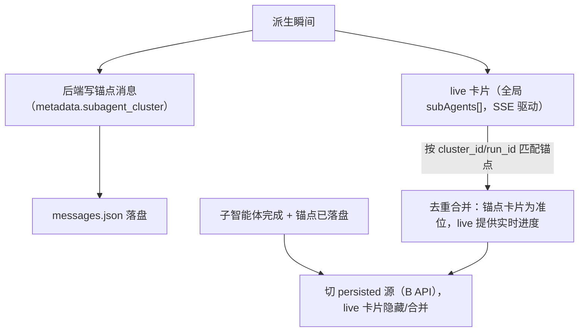

# Sub-Plan E：历史消息锚点持久化与恢复（cluster message + hydrate + 运行态收敛）

Planned-with: Claude Opus 4.8
Plan-Id: 2026-07-05-subagent-history-anchor-restore
Plan-File: .cursor/plans/2026-07-05-subagent-history-anchor-restore.plan.md
父规划: `.cursor/plans/2026-07-05-subagent-cluster-persistence.plan.md`
依赖: Sub-Plan A（run_ids/cluster 可查）+ Sub-Plan C（卡片可渲染）+ Sub-Plan D（点击可钻取）
Suggested-Impl-Model: GPT-5.5 (Low)（跨栈收口，后端锚点 + 前端 hydrate，tool 序列合法性/去重一致性高风险，值得强推理兜底，不宜降档）

## 1. 需求（本子规划是端到端闭环的收口，直接解决「重启/切 session 后卡片消失」）

### FR（功能需求）

- **FR-1**：**后端锚点落盘**——Meta 在一次工具轮派生子智能体集群时，向 meta session 的 `chat_history` / `messages.json` 写入一条**集群锚点消息**：`role=assistant`、`metadata.subagent_cluster = { cluster_id, run_ids: [...], title, created_at }`（轻量，仅引用，不含活动日志/产物大对象）。该消息随会话历史一起持久化与恢复。
- **FR-2**：**锚点在对话流的原位**——锚点消息插入位置对应「Meta 宣布派生」的时点（对齐图1「现在并行启动三只股票分析章节的写作任务」后紧跟集群卡片），使历史回看时集群卡片出现在对话正确位置。
- **FR-3**：**前端 hydrate**——`mapLoadedSessionMessage` / 消息渲染管线识别 `metadata.subagent_cluster` 的消息，渲染为 Sub-Plan C 的 `SubAgentClusterCard`；卡片挂载时按 `run_ids` 调 Sub-Plan B 的 `subagent-clusters` / `run` API hydrate 成员 `BadgeVM`。
- **FR-4**：**运行态 → 持久态收敛**——首次派生时对话流内已有 live 集群卡片（来自 SSE/全局 `subAgents[]`）；当锚点消息落盘且子智能体完成后，同一 `cluster_id` 的卡片从 live 源平滑切到 persisted 源（同 runId 稳定 key，不重复出现两张卡、不闪烁）。
- **FR-5**：**切 session / 重启 / 从历史面板重开**该 session 时：`GET /api/session/messages` 恢复消息 → 锚点消息重建集群卡片 → 点击成员打开 Sub-Plan D 的 drawer 看活动日志与落盘产物，全链路可用（`agx serve` 冷重启后亦然）。
- **FR-6**：锚点消息在 FTS 检索/历史面板中不产生噪音标题（对齐「空会话/占位不预置状态」偏好）；集群消息正文可为空/极简，主要靠 metadata 驱动渲染。

### NFR（非功能需求）

- **NFR-1**：锚点写入旁路容错，失败不打断 Meta 主回复流（对齐 A 的 NFR-1）。
- **NFR-2**：hydrate 失败（run 已被清理/API 错误）时卡片降级为「历史子智能体集群（明细不可用）」占位，不白屏、不崩溃。
- **NFR-3**：不得因引入锚点消息导致 `agent_runtime` 的 tool 调用序列合法性被破坏（锚点是 assistant 普通消息，不是 tool 消息，须确认不干扰 `assistant(tool_calls)/tool` 断链清洗逻辑）。
- **NFR-4**：live/persisted 双源在过渡窗口内不得产生重复卡片或消息重复拼接（对齐「流式禁止整段重复」偏好）。

### AC（验收标准）

- **AC-1**：派生集群后，meta `messages.json` 出现一条带 `metadata.subagent_cluster` 的消息，含正确 `cluster_id` 与 `run_ids`。
- **AC-2**：**切到别的 session 再切回** → 集群卡片在对话流原位重现，成员/状态/产物可点开（drawer）。
- **AC-3**：**完全关闭并重启 Near** → 集群卡片仍在，钻取可用。
- **AC-4**：**`agx serve` 冷重启**（内存清空）后从历史面板重开该 session → 卡片与钻取仍成立（纯落盘来源）。
- **AC-5**：首次派生的 live 卡片与恢复后的 persisted 卡片是**同一张**（不重复、不闪烁），完成状态一致。
- **AC-6**：hydrate 失败时卡片降级占位，不崩溃。

## 2. 技术方案

### 2.1 后端锚点写入

- 位置：Meta `/api/chat` 流程中，`spawn_subagent` / `delegate_to_avatar` 成功创建后（复用 Sub-Plan A 的 cluster 归组结果拿到 `cluster_id` + `run_ids`）。当一轮工具批次的派生封口时，向 `chat_history` append 一条 assistant 锚点消息，并经既有 `session_manager.persist` 落 `messages.json`。
- 复用既有 `summary_sink` / chat_history 写入路径（`server.py` L2699–2716 附近），但写的是结构化 metadata 而非纯文本汇总行；确保经 `_normalize_messages`（L1852–1917）保留 `metadata`。
- 一轮批次可能先有多个 run 创建、后封口：采用「延迟封口」——该 assistant 工具轮结束时统一写一条锚点（含该轮所有 run_ids），避免每 spawn 一条。

### 2.2 收敛与去重（FR-4/NFR-4 关键）

- 前端渲染集群卡片的**唯一位点**是锚点消息；派生初期锚点可能尚未落盘/未随消息返回，此时先用「浮动 live 卡片」（当前 `SpawnsColumn` 行为兜底），锚点出现后合并到对话流原位并撤下浮动卡，按 `cluster_id`/`run_id` 去重。

### 2.3 前端 hydrate 与渲染

- `mapLoadedSessionMessage`（`App.tsx` / IPC `loadSessionMessages`）保留 `metadata.subagent_cluster`。
- `Message` 类型扩展可选字段 `subAgentCluster?: { clusterId; runIds; title; createdAt }`（类比现有 `forwardedHistory`）。
- `MessageRenderer` 识别该字段 → 渲染 `SubAgentClusterCard`；卡片 `useEffect` 拉 B 的 `subagent-clusters`（或按 cluster_id 过滤）hydrate 成员 VM；成员点击 → `openRunDrawer`（Sub-Plan D）。
- 运行态：全局 `subAgents[]` 仍由 SSE/轮询更新；集群卡片优先用 live VM 覆盖同 runId 的 persisted VM（进度实时），完成后以 persisted 为准。

## 3. 验收标准与用例

- **用例 1（原位恢复）**：派生 → 切走再切回 → 断言集群卡片在对话流原位、成员可点开 drawer。
- **用例 2（重启 Near）**：完全退出重启 → 历史会话打开 → 卡片与钻取可用。
- **用例 3（冷重启 agx serve）**：重启后端 → 历史面板重开 session → 卡片与钻取可用（落盘来源）。
- **用例 4（去重）**：观察派生瞬间不出现两张卡（浮动 live + 锚点）——最终收敛为一张。
- **用例 5（降级）**：手动删掉某 run record → 卡片降级占位不崩溃。
- **用例 6（tool 序列合法性）**：派生轮次后继续多轮对话 → 断言无 provider 400（tool 断链清洗未被锚点破坏）。

## 4. 风险与资源排期

| 风险 | 等级 | 缓解 |
|---|---|---|
| 锚点消息破坏 tool 调用序列合法性 → provider 400 | 高 | 锚点为纯 assistant 文本+metadata（非 tool 消息）；实测多轮对话回归 + 对照 `agent_runtime` 清洗逻辑；用例 6 必测 |
| live/persisted 双源重复卡片/闪烁 | 高 | 唯一位点=锚点消息 + cluster_id/run_id 去重 + 稳定 key；派生初期浮动卡在锚点出现后撤下 |
| 锚点插入位置错乱（不在 Meta 宣布处） | 中 | 延迟封口在该 assistant 工具轮结束时写入，位置贴近宣布点 |
| 恢复时 hydrate 风暴（多集群同时拉 API） | 中 | 卡片懒加载（进入视口再 hydrate）+ 复用 B 的 `subagent-clusters` 一次批量拉 |
| 旧会话无锚点（本功能上线前的历史） | 低 | 前端对无 metadata 的旧历史保持原样（不强改），仅新派生享受持久化 |

**排期**：2 人天（0.5 后端锚点写入 + 0.5 Message 扩展与 hydrate + 0.5 live/persisted 收敛去重 + 0.5 端到端四态回归：切换/重启/冷重启/去重）。收口环节，依赖 A/C/D。
