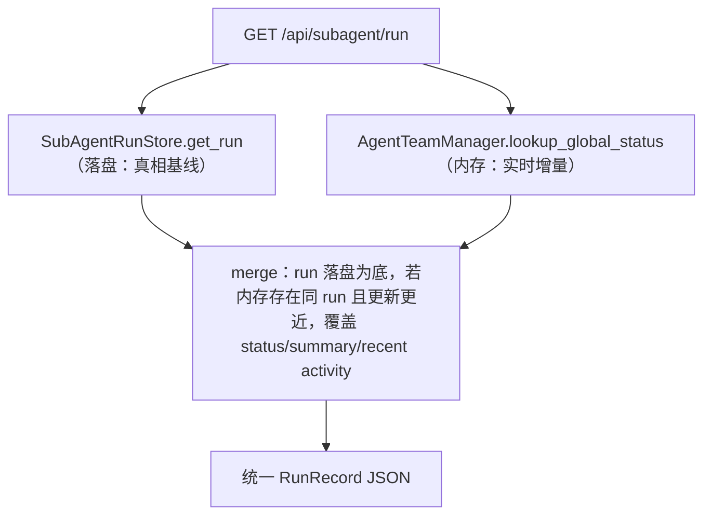

# Sub-Plan B：子智能体回看 / 落盘 REST API

Planned-with: Claude Opus 4.8
Plan-Id: 2026-07-05-subagent-run-review-api
Plan-File: .cursor/plans/2026-07-05-subagent-run-review-api.plan.md
父规划: `.cursor/plans/2026-07-05-subagent-cluster-persistence.plan.md`
依赖: Sub-Plan A（`SubAgentRunStore` 数据契约）
Suggested-Impl-Model: Composer 2.5 Fast（简单 REST 端点 + 分页，样板骨架类；`artifact-preview` 路径安全一节建议用 GPT-5.5 复核，极省可降 Kimi K2.7 Code / GLM 5.2）

## 1. 需求

### FR（功能需求）

- **FR-1**：新增 `GET /api/session/subagent-clusters?session_id=<sid>`：返回该 session 曾派生的**所有集群**（按 `created_at` 升序，与对话流锚点顺序一致），每个集群含 `cluster_id`、`title`、`created_at`、成员摘要列表（`run_id`、`name`、`role`、`badge_seq`、`status`、`provider`、`model`、`avatar_id`）。供前端渲染集群卡片列表（图1/图2）。
- **FR-2**：新增 `GET /api/subagent/run?session_id=<sid>&run_id=<rid>`：返回单个 run 的**完整明细**（RunRecord 全字段，含 `status_history`、`result_summary`、`artifacts`、`output_files`、`result_file`、`detail_refs`、`activity_count`）。
- **FR-3**：新增 `GET /api/subagent/run/activity?session_id=<sid>&run_id=<rid>&offset=&limit=`：**分页**返回活动日志时间线（图5 左侧），从 `<run_id>.activity.jsonl` 读取，默认 `limit=100`，支持从尾部倒序取最近 N 条。
- **FR-4**：新增 `GET /api/subagent/run/artifact-preview?session_id=&run_id=&path=`：安全返回某产物文件的**文本预览**（前若干 KB），仅允许读该 run `artifacts[]`/`output_files`/`result_file` 白名单内的路径（防路径穿越）。二进制/超大文件返回元信息 + 「用系统应用打开」提示（前端走 `shellOpenPath`）。
- **FR-5**：**运行态与持久态统一契约**：上述接口的成员摘要字段结构与 `/api/subagents/status` 的 `_serialize_status` **字段对齐**（同名同义），使前端一套卡片组件可无缝消费两个来源；对**正在运行**的 run，API 应优先合并内存态（`AgentTeamManager` 的实时 `recent_events`/`status`），落盘态作为 fallback（历史/重启后）。
- **FR-6**：所有新接口纳入 Desktop token 鉴权（`x-agx-desktop-token`），与既有 `/api/subagents/status` 一致。

### NFR（非功能需求）

- **NFR-1**：`subagent-clusters` 列表接口响应体可控（成员仅摘要，不含 activity_log 正文），单 session 数十个集群也应 < 1MB。
- **NFR-2**：活动日志与产物预览接口必须**流式/分页/截断**，不得一次性读入超大文件（对齐 `liteparse`/预算体系「避免撑爆」的既有纪律）。
- **NFR-3**：`artifact-preview` 严格路径白名单校验（只允许该 run record 声明过的路径 + 其所在 session 目录内），拒绝 `..` 穿越与越权读任意文件。
- **NFR-4**：任一底层读盘失败返回结构化错误 `{ok:false, error, detail}`，不裸抛 500（对齐既有 API 错误规范）。

### AC（验收标准）

- **AC-1**：`GET /api/session/subagent-clusters` 对有历史派生的 session 返回 ≥1 个集群，成员 badge_seq/status 正确；对无派生 session 返回 `{ok:true, clusters:[]}`。
- **AC-2**：`GET /api/subagent/run` 对已完成 run 返回 `status=completed` + 非空 `activity_count` + 产物路径。
- **AC-3**：`GET /api/subagent/run/activity` 分页正确，`offset+limit` 越界返回空数组而非报错。
- **AC-4**：`artifact-preview` 对白名单内文本文件返回预览；对白名单外路径（含 `../etc/passwd` 类）返回 403/结构化错误。
- **AC-5**：对**正在运行**的 run，接口返回的 `status=running` 且活动日志随时间增长（内存态合并生效）。
- **AC-6**：`agx serve` 冷重启后，全部接口对历史 session 仍返回完整数据（纯落盘来源）。

## 2. 技术方案

### 2.1 接线位置

在 `agenticx/studio/server.py` 现有 subagent 接口区块（L3520–3752 附近）新增 4 个端点，复用现有：
- Desktop token 校验装饰器/依赖（与 `/api/subagents/status` 同款）。
- `manager.get(session_id)` 拿 `ManagedSession`，从中取 `owner_session_id` 与 `AgentTeamManager`（内存态合并用）。
- `SubAgentRunStore`（Sub-Plan A）按 `owner_session_id` 读盘。

### 2.2 运行态 / 持久态合并（FR-5 关键）

- 合并规则：以落盘 record 为基线；若内存态存在同 `run_id` 且 `updated_at` 更新，则用内存的 `status`/`result_summary`/最近事件覆盖（运行中场景）。
- 历史/重启：内存无该 run → 纯落盘返回。

### 2.3 端点签名

| 方法 | 路径 | 参数 | 返回 |
|---|---|---|---|
| GET | `/api/session/subagent-clusters` | `session_id` | `{ok, clusters:[{cluster_id,title,created_at,members:[summary]}]}` |
| GET | `/api/subagent/run` | `session_id, run_id` | `{ok, run: RunRecord}` |
| GET | `/api/subagent/run/activity` | `session_id, run_id, offset?, limit?, order?` | `{ok, entries:[ActivityEntry], total, offset, limit}` |
| GET | `/api/subagent/run/artifact-preview` | `session_id, run_id, path` | `{ok, kind, text?, bytes?, truncated?, open_hint?}` |

### 2.4 路径安全（NFR-3）

`artifact-preview` 校验链：解析 `path` → `os.path.realpath` → 断言在该 run 的白名单集合内（`{result_file} ∪ output_files ∪ artifacts[].path`）**或** 位于 `~/.agenticx/sessions/<owner_or_avatar_sid>/` 前缀下 → 否则拒绝。复用/参考既有 `liteparse`/文件读取工具的路径归一逻辑。

## 3. 验收标准与用例

- **用例 1**：造一个含 1 cluster / 3 run 的 session（Sub-Plan A 冒烟产物）→ 调 `subagent-clusters` 断言结构。
- **用例 2**：对某 run 调 `run` + `run/activity`（分页）→ 断言明细与时间线。
- **用例 3**：`artifact-preview` 读白名单文本产物成功；读 `../` 越权失败。
- **用例 4（运行态合并）**：mock 一个内存中 running 的 run → 断言接口返回 running 且合并了内存 recent activity。
- **用例 5（冷重启）**：重启 `agx serve` 后重放用例 1/2 → 断言仍成立。
- **冒烟测试**：`tests/test_smoke_subagent_review_api.py`（FastAPI TestClient 覆盖用例 1–3、5）。

## 4. 风险与资源排期

| 风险 | 等级 | 缓解 |
|---|---|---|
| 内存态/落盘态字段漂移导致前端两套渲染分叉 | 中 | 以 Sub-Plan A 冻结 schema 为唯一契约，`_serialize_status` 做一次映射适配函数，加断言测试字段对齐 |
| 大产物预览拖慢/占内存 | 中 | 强制 KB 级截断 + `truncated` 标记 + 二进制走 open_hint |
| 路径穿越安全漏洞 | 高 | realpath + 白名单双重校验，安全用例必测；可选跑 security-review |
| 运行中 activity 边写边读一致性 | 低 | JSONL 追加写，读时容忍最后一行不完整（跳过 parse 失败行） |

**排期**：1.5 人天（0.5 端点骨架 + 鉴权 + 0.5 合并逻辑与路径安全 + 0.5 冒烟测试）。A 完成后即可开工，可与 C 的 UI 骨架并行。
