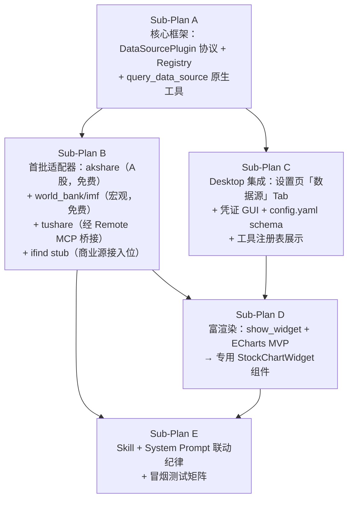

# 统一查数网关（Unified Data Source Gateway）— 主规划

Planned-with: Claude Sonnet 5

> 本文档是**主规划（Index Plan）**，不包含可执行 todo，只负责拆解 DAG 与串联 5 个子规划。每个子规划独立包含需求（FR/NFR/AC）、技术方案、验收标准与用例、风险与资源排期，可独立执行、独立验收、独立提交。

## 背景

参考 Kimi Works 的 `mshtools-get_data_source`：一个**原生工具**（非 CLI、非脚本、非 Skill、非 MCP），Agent 通过 `data_source_name + api_name + params` 三元组统一调用，背后路由到 9 个跨领域插件数据源（ifind/yahoo_finance/imf/world_bank/scholar/arxiv/tianyancha/yuandian_law/sec_edgar），并配合内置渲染组件把结构化数据画成 K 线图等卡片。

AgenticX 现状（已具备的拼图）：

| 能力 | 现状 |
|---|---|
| 原生工具注册与分发 | `STUDIO_TOOLS`（`agenticx/cli/agent_tools.py`）+ `dispatch_tool_async` |
| 外部服务接入 | `MCPHub` / Remote URL MCP（`~/.agenticx/mcp.json`，已支持 Tushare 等） |
| 有 OpenAPI 规范的 REST | `OpenAPIToolset`（`agenticx/tools/openapi_toolset.py`） |
| 聊天内富渲染 | `show_widget`（SVG/HTML，`WidgetBlock.tsx`），已允许 jsdelivr/unpkg 等 CDN（可跑 ECharts） |
| 配置驱动的子系统范式 | `agenticx/studio/kb/`（contracts.py/manager.py/routes.py/runtime.py/jobs.py）+ Desktop `settings/knowledge/` GUI，是本规划要复刻的架构范式 |
| 安全边界 | `~/.agenticx/config.yaml` 禁止 `file_write`/`file_edit` 直接改写，须走专用 API（`ConfigManager` + `/api/*` 端点） |

**目标**：新增一个统一原生工具 `query_data_source`（对齐 Kimi 心智），背后是可插拔的 `DataSourceRegistry` + `DataSourcePlugin` 生态，覆盖金融/宏观经济/学术/企业工商等多领域，取数结果通过 `show_widget`（先 ECharts HTML，后续专用组件）渲染为聊天内可视化卡片，全程走 Desktop GUI 配置凭证，不依赖用户手改 YAML。

## 非目标

- 不承诺接入同花顺 iFinD（商业授权数据库，需客户自备账号/SDK，本规划只把「接入位」留好，见子规划 B 的 `ifind` stub 章节）。
- 不在本轮实现 Enterprise Gateway 侧的数据源代理/配额管控（仅 Desktop/Near 本机场景）。
- 不做数据落库/长期缓存层（仅按需查询 + 短 TTL 内存缓存）。

## 子规划与 DAG

**依赖说明**：
- Sub-Plan A 是唯一的硬前置（协议与注册表必须先定），B 和 C 可在 A 完成后并行开发。
- Sub-Plan D（富渲染）依赖 B（要有真实数据形状）与 C（Desktop 侧展示位置已就绪）。
- Sub-Plan E（Skill + 系统提示 + 冒烟测试）放在最后收口，串联 B/D 的产出验证端到端。

## 里程碑验收（跨子规划）

端到端冒烟场景（对齐用户截图）：用户问「火炬电子最近走势」→ Agent 调用 `query_data_source(data_source_name="akshare", api_name="stock_price_history", params={...})` → 拿到结构化行情 → 调用 `show_widget` 渲染 K 线图 → 聊天气泡内展示，附「数据来源：AkShare」标注。

## 建议排期（合计约 8–10 人天，单人顺序估算；并行可压缩至 6 人天）

| 子规划 | 预估工作量 | 可并行性 |
|---|---|---|
| A 核心框架 | 1.5 人天 | 无（前置） |
| B 首批适配器 | 2 人天 | 与 C 并行 |
| C Desktop 集成 | 2 人天 | 与 B 并行 |
| D 富渲染 | 2 人天 | 依赖 B+C |
| E Skill+提示+测试 | 1.5 人天 | 依赖 B+D |

## 提交策略

每个子规划完成后独立提交，均使用 `/commit --spec=<对应子规划路径>` 自动注入 `Plan-Id`/`Plan-File`；`Plan-Model`/`Impl-Model` 按实际使用模型询问用户后填写。主规划本身随 Sub-Plan A 的首个提交一并加入版本库。

## 子规划文件索引

1. `.cursor/plans/2026-07-05-data-source-gateway-core-framework.plan.md`
2. `.cursor/plans/2026-07-05-data-source-adapters-wave1.plan.md`
3. `.cursor/plans/2026-07-05-data-source-desktop-integration.plan.md`
4. `.cursor/plans/2026-07-05-data-source-rich-visualization.plan.md`
5. `.cursor/plans/2026-07-05-data-source-skill-and-prompt-guidance.plan.md`

## 实施状态（2026-07-05）

| 子规划 | Plan-Id | 状态 | Commit |
|---|---|---|---|
| A 核心框架 | `2026-07-05-data-source-gateway-core-framework` | ✅ | `28ec0a89` |
| B 首批适配器 | `2026-07-05-data-source-adapters-wave1` | ✅ | `d459553f`（与 C 同 commit） |
| C Desktop 集成 | `2026-07-05-data-source-desktop-integration` | ✅ | `d459553f` |
| D 富渲染 | `2026-07-05-data-source-rich-visualization` | ✅ | `c85f8182` |
| E Skill+纪律 | `2026-07-05-data-source-skill-and-prompt-guidance` | ✅ | `2e82625f` |
| 热修 akshare 新浪源 | — | ✅ | `3846ce51`（Clash fake-ip 下 eastmoney 不可用） |

**里程碑 E2E**：重启 `agx serve`/Desktop 后，问「火炬电子最近一周走势」应走 `query_data_source` → `show_widget(stock_chart)` 全链路。
