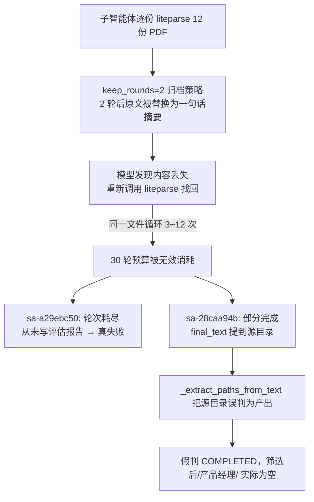

# 子智能体完成判定二次修复：声明路径校验 + 上下文归档致重复解析

Planned-with: claude-4.6-sonnet

> 背景：`.cursor/plans/2026-07-07-subagent-must-complete-fix.plan.md`（v1）已修复「cp/mv 复制产物检测漏洞」并上线。重启 Near 后同一批招聘任务里仍有 2/3 子智能体异常（会话 `05095c43-5ec4-4064-88e2-90c6377503c8`）。本 plan 是**独立的第二轮修复**：诊断显示这是 v1 未覆盖的两类新问题，而非 v1 回归。

---

## 0. 对上一轮诊断（Composer 2.5 输出）的复核结论

Composer 2.5 给出的分析**方向基本正确，但根因链条不完整**。逐条核验：

| Composer 2.5 的结论 | 核验结果 |
|---|---|
| `sa-1b7a2590`（开发）真完成 | ✅ 属实，磁盘 `筛选后/开发/评估报告.md` 存在，12 次工具调用 |
| `sa-28caa94b`（产品经理）"假完成"，`output_files` 指向源目录而非 `筛选后/` | ✅ 属实，已用代码复核（见 1.1） |
| `sa-a29ebc50`（项目经理）真失败，`liteparse` 重复调用 | ✅ 属实，但**未查出重复调用的根因**，误归因为"轮次超限"这一表面症状 |
| 建议方向：任务级产出路径校验 + 动态轮次 + 失败语义检测 | ⚠️ 方向对，但"动态轮次"绕开了真正病灶——即便轮次调到 200，同样的重复解析模式仍会持续发生，只是把浪费从 30 轮推到更晚 |

**结论：Composer 2.5 发现了"是什么"（假完成 + 真失败），但没查到"为什么重复解析"。本 plan 补上这一环，且不采用"简单加大轮次预算"这种治标不治本的方案。**

### 1.1 复核证据：`sa-28caa94b` 假完成的精确机制

用当前代码在会话数据上重放（见 §附录 A 命令）：

- `context.task` 含显式声明：`4. 输出评估报告到 /Users/damon/Desktop/Ai产研管理/招聘/20260706/筛选后/产品经理/评估报告.md`
- `context.final_text` 提到：`您也可以手动查看 /Users/damon/Desktop/Ai产研管理/招聘/20260706/产品经理/ 目录下的简历文件`（**源目录**，非声明的输出目录）
- `_extract_paths_from_text`（v1 新增，`team_manager.py:2040`）对 `final_text` 做通用绝对路径抽取，**不区分"声明的输出路径"与"顺带提到的输入路径"**，只要磁盘存在就收录进 `produced_files`
- 该源目录在磁盘上确实存在（本来就是简历所在目录）→ `produced_files` 非空 → v1 判定逻辑（`team_manager.py:1462-1490`）判定 COMPLETED

**根因 A（假完成）**：`_extract_paths_from_text` 的通用兜底，在"任务已明确声明产出路径"的场景下会被无关的输入路径污染，导致把"提到过的路径"误当"产出的路径"。

### 1.2 复核证据：`sa-a29ebc50` / `sa-28caa94b` 重复解析 3～12 次的真实根因

用 activity.jsonl 统计（§附录 A）：`sa-28caa94b` 48 次 `liteparse` 调用中，12 份简历每份被解析 **3～7 次**；`sa-a29ebc50` 65 次调用中每份 **4～12 次**。

追根源头到 `agenticx/runtime/tool_result_budget.py`：

```16:36:agenticx/runtime/tool_result_budget.py
TOOL_RESULT_CLASS: Dict[str, str] = {
    ...
    "liteparse": "large",
    ...
}
```

```54:61:agenticx/runtime/tool_result_budget.py
@dataclass
class ToolResultBudgetConfig:
    enabled: bool = True
    keep_rounds: int = 2
    large_threshold_tokens: int = 4000
    archive_subdir: str = "tool_archives"
```

```246:257:agenticx/runtime/tool_result_budget.py
        age = current_round - meta.round_idx
        should_archive = meta.result_class in {"large", "blob"} and age > cfg.keep_rounds
        if should_archive and "[tool-result-archived]" not in content:
            replaced = dict(msg)
            replaced["content"] = _build_archived_summary(meta)
            out.append(replaced)
```

`liteparse` 结果被标记为 `"large"`，而 `keep_rounds` 默认只有 **2 轮**：某份简历在第 N 轮被解析后，到第 N+3 轮，其原始解析内容就被 `apply_tool_result_budget`（`agent_runtime.py` 主循环每轮调用，见 `agent_runtime.py:2180-2186`）替换成一句话摘要 `[tool-result-archived] ...`。

**任务模式是"先逐份 liteparse 全部 12 份文档，最后统一写评估报告"**——这意味着第 1 份简历解析后要撑到第 12 份甚至写报告时才被引用，中间早已超过 2 轮存活期被归档。模型发现自己"看不到"原始简历内容了（只剩一句话摘要），于是**重新调用 liteparse 找回内容**，如此往复，30 轮预算被大量消耗在"重复解析已读过的文件"上，而不是推进评估/写报告。

**根因 B（真失败/轮次浪费）**：`tool_result_budget.py` 的 `keep_rounds=2` 对"先批量读取多份文档、最后一次性汇总输出"这类工作模式过短，触发模型反复重新拉取已丢失的原始内容，进而耗尽轮次预算。**这才是 Composer 2.5 说的"工具调用轮次超限"背后的真正机制**——不是文档数量本身导致轮次不够，而是**归档策略导致同一份文档被反复"发现丢失、重新解析"**。

### 失败链路（更新版）



---

## 1. 目标与范围

### In scope
- `agenticx/runtime/team_manager.py`：新增「任务声明产出路径」提取与优先校验逻辑；system prompt 增补"增量记录、勿等到最后再写报告"引导
- `agenticx/runtime/tool_result_budget.py`：`keep_rounds` 默认值调整（含风险说明与回退开关）
- `tests/`：新增冒烟测试

### Out of scope（明确不做，避免过度修复）
- 不做"按任务规模动态调整 `max_tool_rounds`"（治标不治本，且需要任务规模启发式，误判风险高，见 §0 结论）
- 不改 `dispatch_tool_async` 主循环结构、不引入工具调用结果缓存层（改动面过大，且不解决 keep_rounds 归档导致内容不可见的根本问题——即使缓存了原文，模型上下文里依然看不到，还是会认为需要重新调用）
- 不动 v1 已修复的 cp/mv 检测与 `_had_write_or_copy_action`（v1 逻辑本次验证仍然正确，不重复改动）
- 不改 `agent_runtime.py` 主循环调度语义（仅消费 `tool_result_budget.py` 的配置值，不改调用方式）

---

## 2. 需求（FR / NFR / AC）

### 子规划 SP-E：任务声明产出路径优先校验（修「假完成」）
Suggested-Impl-Model: gpt-5.5-codex（正则抽取 + 校验优先级收口，纯后端逻辑）

- **FR-E1**：新增 `_extract_declared_output_paths(task: str) -> List[str]`，从任务文本中识别形如"输出...到 <路径>"/"保存到 <路径>"/"写入 <路径>"的**显式声明产出路径**（中英文均覆盖），返回**任务作者明确要求的目标路径**列表（通常 0～2 个）。
- **FR-E2**：`_run_subagent` finally 块的终态判定改为**分级判定**：
  - 若 `_extract_declared_output_paths(task)` 非空 → 这是**唯一权威判据**：全部声明路径都在磁盘存在才可判 COMPLETED；否则无论 `_extract_paths_from_text` 或其它检测发现了什么其它路径，一律判 FAILED（不受源目录、输入路径等无关路径干扰）。
  - 若声明路径为空（任务未显式指定具体产出路径）→ 保留 v1 既有的通用检测逻辑（`_extract_output_files_from_messages` / `_extract_bash_output_paths` / `_extract_bash_copy_paths` / `_extract_paths_from_text` / `_had_write_or_copy_action`）。
- **FR-E3**：`_extract_paths_from_text` 的通用兜底**仅在声明路径为空时参与判定**；有声明路径时完全不使用该兜底结果（避免源目录污染）。
- **AC-E1**：用 `sa-28caa94b` 的真实 task/final_text 复现，`_extract_declared_output_paths` 能抽出 `/Users/damon/Desktop/Ai产研管理/招聘/20260706/筛选后/产品经理/评估报告.md`；因该路径磁盘不存在，最终判定必须是 FAILED（不是当前的假 COMPLETED）。
- **AC-E2**：用 `sa-1b7a2590`（真完成）的 task/final_text 复现，声明路径 `.../筛选后/开发/评估报告.md` 磁盘存在，判定保持 COMPLETED（不引入新的误杀）。

### 子规划 SP-F：修复"归档导致重复解析"根因（修「真失败/轮次浪费」）
Suggested-Impl-Model: gpt-5.5-codex（配置默认值 + prompt 文案，低风险后端调整）

- **FR-F1**：`ToolResultBudgetConfig.keep_rounds` 默认值从 `2` 提升到 `8`（多文档批量读取+最后汇总的任务模式常见回看跨度在 5～15 轮，8 轮是"显著缓解 + 不过度膨胀上下文"的折中）。保留现有 `AGX_TOOL_RESULT_KEEP_ROUNDS` 环境变量与 `runtime.tool_result_budget.keep_rounds` 配置覆盖，本次只改默认值。
- **FR-F2**：`_build_subagent_system_prompt`（`team_manager.py`）新增一条执行策略引导：批量读取类任务应**每解析完一份就立即记录评分要点**（如 `todo_write` 或直接追加写入草稿），不要等全部读完再一次性回忆总结——降低对"长期持有原始解析内容在上下文中"的依赖，即使后续仍被归档也不影响已记录的结论。
- **AC-F1**：新增单测验证 `ToolResultBudgetConfig()` 默认 `keep_rounds == 8`。
- **AC-F2**：`_build_subagent_system_prompt` 生成的文本包含"每解析完一份就立即记录"关键词（字符串包含性断言）。

### NFR
- **NFR-1**：`keep_rounds` 提升到 8 后，`apply_tool_result_budget` 的会话级 token 累计（`_tool_result_tokens_session`）仍只做统计不做硬性拦截，本次改动不引入新的上下文溢出风险评估项（现有 `context_budget.py` 的强制压缩机制不受影响，各自独立生效）。
- **NFR-2**：SP-E 的声明路径正则必须对**没有声明产出路径的普通任务**（如纯问答、纯检索类子智能体）零误伤——`_extract_declared_output_paths` 返回空列表时完全走 v1 原有逻辑，不改变其行为。
- **NFR-3**：改动后本地跑 `tests/test_smoke_subagent_completion.py` + `tests/test_team_manager.py` + `tests/test_enhanced_spawn.py` 全绿。

---

## 3. 实现细节（Composer 2.5 零上下文可直接照抄）

### 3.1 SP-E｜新增 `_extract_declared_output_paths`

**文件**：`agenticx/runtime/team_manager.py`
**位置**：紧跟 `_extract_paths_from_text`（当前 `team_manager.py:2040-2060`）之后新增静态方法。

```python
@staticmethod
def _extract_declared_output_paths(task: str) -> List[str]:
    """Extract explicitly declared output paths from task text.

    仅匹配"输出/保存/写入 ... 到/至 <绝对路径>"这类**明确声明**的产出路径，
    不做磁盘存在性校验（由调用方决定：声明了但磁盘没有 = 未完成）。
    中英文均覆盖；返回按出现顺序去重的路径列表。
    """
    if not task:
        return []
    out: List[str] = []
    seen: set[str] = set()
    patterns = [
        r"(?:输出|保存|写入|生成)[^\n。]{0,10}?(?:到|至)\s*([~/][^\s，。；、\n]+)",
        r"(?:save|write|output)\s+(?:it\s+)?to\s+([~/][^\s,.;\n]+)",
    ]
    for pat in patterns:
        for m in re.finditer(pat, str(task), flags=re.IGNORECASE):
            raw = m.group(1).rstrip(".,;:)】」』")
            if raw and raw not in seen:
                seen.add(raw)
                out.append(raw)
    return out
```

### 3.2 SP-E｜终态判定分级改写

**文件**：`agenticx/runtime/team_manager.py`，`_run_subagent` finally 块，**当前 `team_manager.py:1452-1490`**（v1 刚改过的版本）。

```python
# ---------- before（当前 L1452-1490） ----------
produced_files = self._merge_output_files(context)
text_paths = self._extract_paths_from_text(context.final_text or "")
if text_paths:
    known = set(produced_files)
    for p in text_paths:
        if p not in known:
            known.add(p)
            produced_files.append(p)
missing_files = self._missing_output_files(produced_files)
did_write_action = self._had_write_or_copy_action(context.agent_messages)
if (
    context.status == SubAgentStatus.COMPLETED
    and self._task_expects_file_output(context.task)
    and not produced_files
    and not did_write_action
):
    context.status = SubAgentStatus.FAILED
    context.error_text = (
        "Task completed without file artifact. Expected an output file "
        "but none was detected from tool results or final text."
    )
    context.result_summary = self._build_result_summary(context)
elif (
    context.status == SubAgentStatus.COMPLETED
    and self._task_expects_file_output(context.task)
    and not produced_files
    and did_write_action
):
    _log.warning(...)
elif missing_files:
    _log.debug(...)
```

```python
# ---------- after ----------
declared_paths = self._extract_declared_output_paths(context.task)

if context.status == SubAgentStatus.COMPLETED and declared_paths:
    # 声明路径存在时，它是唯一权威判据：不受源目录/输入路径等无关兜底干扰。
    missing_declared = [p for p in declared_paths if not Path(p).expanduser().exists()]
    if missing_declared:
        context.status = SubAgentStatus.FAILED
        context.error_text = (
            "Declared output path(s) not found on disk: "
            + ", ".join(missing_declared[:10])
        )
        context.result_summary = self._build_result_summary(context)
    produced_files = self._merge_output_files(context) + [
        p for p in declared_paths if p not in self._merge_output_files(context)
    ]
else:
    # 未声明具体产出路径：沿用 v1 通用检测 + final_text 兜底。
    produced_files = self._merge_output_files(context)
    text_paths = self._extract_paths_from_text(context.final_text or "")
    if text_paths:
        known = set(produced_files)
        for p in text_paths:
            if p not in known:
                known.add(p)
                produced_files.append(p)
    missing_files = self._missing_output_files(produced_files)
    did_write_action = self._had_write_or_copy_action(context.agent_messages)
    if (
        context.status == SubAgentStatus.COMPLETED
        and self._task_expects_file_output(context.task)
        and not produced_files
        and not did_write_action
    ):
        context.status = SubAgentStatus.FAILED
        context.error_text = (
            "Task completed without file artifact. Expected an output file "
            "but none was detected from tool results or final text."
        )
        context.result_summary = self._build_result_summary(context)
    elif (
        context.status == SubAgentStatus.COMPLETED
        and self._task_expects_file_output(context.task)
        and not produced_files
        and did_write_action
    ):
        _log.warning(
            "[team_manager] %s completed with write/copy actions but no detected "
            "output path; keeping COMPLETED to avoid false failure",
            context.agent_id,
        )
    elif missing_files:
        _log.debug(
            "[team_manager] %s missing reported artifacts (not downgrading): %s",
            context.agent_id,
            missing_files[:10],
        )
```

> 注意：`_auto_escalate`（`team_manager.py:1568` 附近，v1 已加的产物早退逻辑）保持不变——它用 `self._merge_output_files(context)` + `_extract_paths_from_text(final_text)` 判断"是否已有产物"，这在声明路径场景下依然安全：若声明路径缺失说明真的没完成，`existing` 也不会因为声明路径而误判有产物（声明路径本身若不存在，不会被加进 `existing`）。**唯一需要确认**：`_auto_escalate` 里判断"有磁盘产物就早退"时，不应把源目录这种无关路径当作产物——这个问题同样存在于 `_auto_escalate`（它调用的是 `_extract_paths_from_text`，与 finally 块同源）。为保持一致性，`_auto_escalate` 的产物早退判断也应优先使用 `declared_paths`（若非空）而非泛化的 `_extract_paths_from_text`：

```python
# agenticx/runtime/team_manager.py，_auto_escalate 开头（当前 L1568-1583 附近）
# ---------- before ----------
existing = self._merge_output_files(context)
existing += self._extract_paths_from_text(context.final_text or "")
existing = [p for p in existing if p and Path(p).expanduser().exists()]
if existing and self._task_expects_file_output(context.task):
    ...
```

```python
# ---------- after ----------
declared_paths = self._extract_declared_output_paths(context.task)
if declared_paths:
    existing = [p for p in declared_paths if Path(p).expanduser().exists()]
else:
    existing = self._merge_output_files(context)
    existing += self._extract_paths_from_text(context.final_text or "")
    existing = [p for p in existing if p and Path(p).expanduser().exists()]
if existing and self._task_expects_file_output(context.task):
    ...
```

同样的 `declared_paths` 判断逻辑也要应用到 circuit-breaker 分支（`_auto_escalate` 内第二处 `if existing and self._task_expects_file_output(context.task):`，紧跟 `if context.failure_count > max_escalation:` 之后）。

### 3.3 SP-F｜`keep_rounds` 默认值调整

**文件**：`agenticx/runtime/tool_result_budget.py`

```python
# before（L54-61）
@dataclass
class ToolResultBudgetConfig:
    """Runtime knobs for tool-result budget governance."""

    enabled: bool = True
    keep_rounds: int = 2
    large_threshold_tokens: int = 4000
    archive_subdir: str = "tool_archives"
```

```python
# after
@dataclass
class ToolResultBudgetConfig:
    """Runtime knobs for tool-result budget governance."""

    enabled: bool = True
    keep_rounds: int = 8  # 批量文档读取+最后汇总的任务模式常见回看跨度 5~15 轮，2 轮过短会
    # 导致模型反复重新调用 liteparse/file_read 找回已归档内容，白白消耗轮次预算。
    large_threshold_tokens: int = 4000
    archive_subdir: str = "tool_archives"
```

### 3.4 SP-F｜system prompt 增量记录引导

**文件**：`agenticx/runtime/team_manager.py`，`_build_subagent_system_prompt` 的 `base` 字符串，紧跟 v1 已改的「## ⚠️ 高效执行（严格遵守）」段（当前 L396-401 一带）之后追加一行。

```python
# after（在"## ⚠️ 高效执行"段末尾追加，"## 工作目录约束"之前）
"- 批量处理多份文档/数据时：每处理完一份就立即记录该份的结论（评分/要点），"
"不要等全部处理完才回忆总结——早期读取的原始内容可能因上下文预算被归档，"
"届时无需也不应重新调用工具找回，直接使用你已记录的结论继续。\n\n"
```

### 3.5 测试（`tests/test_smoke_subagent_completion.py` 追加，不新建文件）

```python
from agenticx.runtime.team_manager import AgentTeamManager


def test_declared_output_path_extracted_zh():
    m = _mgr()
    task = (
        "4. 输出评估报告到 /Users/damon/Desktop/Ai产研管理/招聘/20260706/筛选后/产品经理/评估报告.md"
    )
    paths = m._extract_declared_output_paths(task)
    assert paths == [
        "/Users/damon/Desktop/Ai产研管理/招聘/20260706/筛选后/产品经理/评估报告.md"
    ]


def test_declared_output_path_extracted_en():
    m = _mgr()
    task = "Please save it to /tmp/out/report.md when done."
    paths = m._extract_declared_output_paths(task)
    assert paths == ["/tmp/out/report.md"]


def test_declared_output_path_missing_forces_failed(tmp_path):
    m = _mgr()
    task = f"输出评估报告到 {tmp_path}/missing/评估报告.md"
    paths = m._extract_declared_output_paths(task)
    assert paths and not Path(paths[0]).expanduser().exists()


def test_declared_output_path_present_when_written(tmp_path):
    target = tmp_path / "评估报告.md"
    target.write_text("ok")
    m = _mgr()
    task = f"输出评估报告到 {target}"
    paths = m._extract_declared_output_paths(task)
    assert paths and Path(paths[0]).expanduser().exists()
```

新增独立测试文件 `tests/test_tool_result_budget_defaults.py`：

```python
from agenticx.runtime.tool_result_budget import ToolResultBudgetConfig


def test_keep_rounds_default_is_8():
    cfg = ToolResultBudgetConfig()
    assert cfg.keep_rounds == 8
```

### 3.6 落点清单（Composer 2.5 checklist）
- [ ] `team_manager.py` 新增 `_extract_declared_output_paths`（3.1）
- [ ] `team_manager.py` `_run_subagent` finally 终态判定改为分级判定（3.2）
- [ ] `team_manager.py` `_auto_escalate` 两处产物早退改用 `declared_paths` 优先（3.2 说明段）
- [ ] `tool_result_budget.py` `keep_rounds` 默认值 2→8（3.3）
- [ ] `team_manager.py` `_build_subagent_system_prompt` 追加增量记录引导（3.4）
- [ ] `tests/test_smoke_subagent_completion.py` 追加 4 条声明路径测试（3.5）
- [ ] 新增 `tests/test_tool_result_budget_defaults.py`（3.5）

---

## 4. 验证方案
1. 单测：`pytest tests/test_smoke_subagent_completion.py tests/test_tool_result_budget_defaults.py tests/test_team_manager.py tests/test_enhanced_spawn.py -q` 全绿。
2. 手动回归：重跑本次触发问题的招聘任务（产品经理 12 份 + 项目经理 11 份），确认：
   - 若真完成 → 声明路径存在 → COMPLETED，且不再是"侧栏绿勾但目录为空"。
   - 若因资源限制未完成 → 声明路径不存在 → 明确 FAILED，`error_text` 精确指出缺失哪个声明路径（而不是泛化的"未检测到产出"）。
   - 观察 `liteparse` 重复调用次数应显著下降（理想：每份简历 1～2 次以内）。

## 5. 提交计划（/commit --spec）
- commit1 `fix(subagent): 任务声明产出路径优先于泛化路径检测，避免源目录误判完成`（SP-E）
- commit2 `fix(runtime): 提升 tool_result_budget keep_rounds 默认值，减少批量文档任务的重复解析`（SP-F）

每个 commit 带 `Plan-Id: 2026-07-07-subagent-completion-accuracy-v2` / `Plan-File: .cursor/plans/2026-07-07-subagent-completion-accuracy-v2.plan.md` / `Plan-Model: claude-4.6-sonnet` / `Impl-Model: <待定>` / `Made-with: Damon Li`。

## 6. 风险
- `keep_rounds` 从 2→8 会让更多"large"类工具结果在上下文中多停留数轮，单轮 prompt token 消耗会上升；但 `apply_tool_result_budget` 本身仍是"超过 keep_rounds 才归档"的渐进策略，不会无限增长，且有环境变量可回退。
- 声明路径正则可能漏配一些非标准措辞（如"落盘至""存放在"），初期覆盖"输出/保存/写入/生成 + 到/至"已覆盖本次两个真实案例；后续可按实际漏检 case 迭代补充关键词，不在本轮扩大范围。
- `_extract_declared_output_paths` 若误抽到任务文本里的**输入路径**（如误把"读取...简历.pdf"误判成输出）需靠"到/至/save to/write to"等强绑定词避免；已用真实两个 case 验证不误抽输入路径列表。

## 附录 A：复核用命令（供实施者独立重放验证）

```bash
python3 -c "
import json
d = json.load(open('/Users/damon/.agenticx/sessions/05095c43-5ec4-4064-88e2-90c6377503c8/subagent_runs/sa-28caa94b.json'))
print(d['task'][-300:])
print('---')
print(d['result_summary'][:500])
"
```
