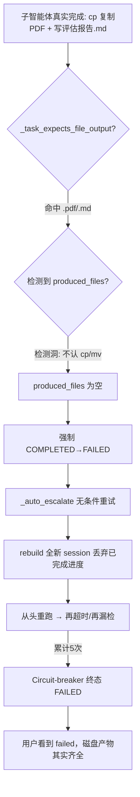

# 子智能体"必须完成任务"可靠性修复

Planned-with: claude-opus-4.8

> 目标：彻底消除"子智能体已完成任务却被框架误判为 failed、并触发破坏性空转重试"的生产级缺陷，保证派生的子智能体 **完成即判完成、未完成则真正续跑到完成**，且不向用户误报失败。

---

## 0. 背景与证据链（Root Cause，磁盘证据锁定）

线上任务：3 个子智能体分别评估/筛选「开发 / 项目经理 / 产品经理」简历，复制 PDF 到 `筛选后/<岗位>/` 并写 `评估报告.md`。用户观感：两个 agent"没完成"。

排查会话 `~/.agenticx/sessions/d31fcbed-9124-4902-8f7a-8ebfffd5ba49/subagent_runs`：

| 子智能体 | 框架状态 | 耗时 | 磁盘真实产物 | 记录 error_text |
|---|---|---|---|---|
| 开发 `sa-0a45e15a` | completed | 120s | 2 PDF + 评估报告.md | — |
| 项目经理 `sa-67409226` | **failed** | 775s | **5 PDF + 评估报告.md（齐全）** | `Circuit-breaker: 5 consecutive failures. Last error: Task completed without file artifact. Expected an output file but none was detected from tool results.` |
| 产品经理 `sa-9b9897b3` | **failed** | 1536s | **3 PDF + 评估报告.md（齐全）** | `Circuit-breaker: 5 consecutive failures. Last error: 子智能体执行超时（>900s）`；`output_files=['/private/tmp/resume_parse']` |

**结论：两个"失败"的 agent 实际都把活干完了（磁盘产物齐全），是框架误报失败并空转重试浪费了 775s / 1536s。**

### 四个根因（按严重度）

- **Bug A｜致命：完成任务被"文件检测启发式"误判为 failed**
  `agenticx/runtime/team_manager.py::_run_subagent` finally 块（约 L1454-1475）：`status==COMPLETED` 且 `_task_expects_file_output(task)` 命中（`.pdf/.md/保存到` 等）但 `produced_files` 检测为空 → **强制 COMPLETED→FAILED**。检测函数有洞：
  - `_extract_output_files_from_messages`（L1787）只认 `file_write`/`file_edit` 工具的精确 `OK: wrote <path>`；
  - `_extract_bash_output_paths`（L1812）只认 `>`/`>>`/`tee`；
  - **`cp`/`mv`/`rsync`/`install` 复制文件完全不被识别**——而本任务核心动作就是 cp 复制 PDF。

- **Bug B｜致命放大器：假失败触发 5 次破坏性重试且丢弃已完成进度**
  `_auto_escalate`（L1545）在 FAILED 时无条件重试至 circuit-breaker(5)。重试对 `mode="run"` 会在 `_run_subagent` 开头 **rebuild 全新 isolated session、丢弃 `agent_messages`**（L1238-1247），等于 12 份简历从头重跑 → 再超时/再漏检 → 5 次全废。重试前不校验磁盘是否已有产物。

- **Bug C｜超时过短**：本次 wall-clock cap 900s，12 份 PDF 逐个 liteparse + 评估 + cp 明显不够；meta 侧亦未按简历数拆分。默认 `SpawnConfig.run_timeout_seconds=600`、floor 600s（`_resolve_subagent_min_run_timeout_seconds`）。

- **Bug D｜子智能体 system prompt 偏 codegen**（`_build_subagent_system_prompt` L345）：硬编码"最多 30 轮""前 1-2 轮 list""第 3 轮起必须 write_file 产出代码""严禁调研超 3 轮""优先产出文件"。与"读 12 份 PDF 筛简历"任务冲突，诱导少读、乱放（产品经理写到 `/tmp` 即此诱因）。

### 失败链路



---

## 1. 目标与范围

### In scope（只改以下核心路径，严格遵守 no-scope-creep）
- `agenticx/runtime/team_manager.py`：文件检测、终态判定、auto_escalate、system prompt
- `agenticx/runtime/meta_tools.py`：spawn_subagent 侧的超时默认与批量拆分引导（仅 prompt/默认值，不重构调度）
- `tests/`：新增冒烟测试

### Out of scope
- 不动 `agent_runtime.py` 的轮次/超时主循环语义
- 不动 `server.py` import 区（敏感）
- 不改 Desktop 前端

---

## 2. 需求（FR / NFR / AC）

### 子规划 SP-A：修复文件检测漏洞 + 停止假失败降级
Suggested-Impl-Model: gpt-5.5-codex（后端逻辑收口、正则与磁盘校验，代码专精中档够用）

- **FR-A1**：`_extract_bash_output_paths` 识别 `cp` / `mv` / `install` / `rsync` 命令的**目标路径**（末位参数或 `-t <dir>`），相对路径按 `workspace_dir` 解析，仅返回磁盘真实存在的路径。
- **FR-A2**：`_run_subagent` finally 块在"改判 FAILED"前，先从 `final_text` 抽取被提及的绝对路径并做磁盘存在性校验（`_extract_paths_from_text` + exists）。只要磁盘上存在 task 相关产物，即**保持 COMPLETED**，不降级。
- **FR-A3**：将"COMPLETED 但零检测产物"从"无条件改判 FAILED"改为：**仅当** final_text 也不含任何有效磁盘路径、且 `agent_messages` 无任何写/复制类工具调用时，才判 FAILED；否则保持 COMPLETED 并记 `logger.warning`（可观测但不误报）。
- **AC-A1**：用 sa-67409226 的复现场景（cp 复制 PDF + 写 md，无 file_write OK 行）跑冒烟测试，终态为 COMPLETED，`output_files` 含 5 份 PDF + 评估报告.md。
- **AC-A2**：真正零产物（任务要求产文件但磁盘空）仍判 FAILED（不放水）。

### 子规划 SP-B：auto_escalate 防呆 + circuit-breaker 幂等
Suggested-Impl-Model: gpt-5.5-codex

- **FR-B1**：`_auto_escalate` 入口先复用 SP-A 的磁盘产物校验；**若磁盘已有 task 相关产物或 final_text 已给出完成结论，则不重试**，直接 return False（终态按 COMPLETED 收口）。
- **FR-B2**：circuit-breaker 触发（failure_count>max）时，若磁盘已有产物，终态置 COMPLETED 而非 FAILED。
- **FR-B3**：重试（非升级换模型那次）保留已完成进度——`mode="run"` 的重试不再丢弃 `agent_messages`；或改用 `resume_input` 续跑（复用现有 session 消息）而非 rebuild。需确认 `_run_subagent` 对重试路径不重置 session（`self._agent_sessions` 保留）。
- **AC-B1**：假失败场景下，重试次数 = 0（不再空转 5 次）。
- **AC-B2**：真失败（如 provider 硬错）仍能重试到 circuit-breaker，行为不回归。

### 子规划 SP-C：超时与批量拆分
Suggested-Impl-Model: gpt-5.5-codex

- **FR-C1**：多步文件任务默认超时下限提升（`_resolve_subagent_min_run_timeout_seconds` 默认 600→ 视评估，如 1200；或按 task 规模动态）。保留 `AGX_SUBAGENT_MIN_RUN_TIMEOUT_SECONDS` 覆盖。
- **FR-C2**：meta 侧 spawn_subagent 工具 description / 系统提示引导：批量条目型任务（>6 项）**按每子 agent ≤6 项拆分**并显式传 `run_timeout_seconds`。
- **AC-C1**：12 份简历任务在拆分/超时提升后不再触发 wall-clock 超时。

### 子规划 SP-D：子智能体 system prompt 自适应
Suggested-Impl-Model: claude-sonnet-5-thinking-medium（涉及提示词表述与任务泛化，需一点语义判断）

- **FR-D1**：`_build_subagent_system_prompt` 去掉硬编码 codegen 偏见（"必须 write_file 产出代码""严禁调研超 3 轮"），改为按任务性质自适应：读多份文档/检索类任务允许充分读取；仍保留"边做边推进、不空转、落盘用绝对路径"通用约束。
- **FR-D2**：强化"文件必须写到 task 指定的绝对路径，禁止写到 /tmp 等临时目录"约束（针对产品经理写错 /tmp）。
- **AC-D1**：prompt 不再出现"你最多只有 30 轮""第 3 轮起必须 write_file 产出代码"等强 codegen 措辞。

### NFR
- **NFR-1**：改 `team_manager.py` 后本地跑现有 `tests/test_smoke_*` 全绿。
- **NFR-2**：不改变 `mode="session"` 语义与跨会话隔离。
- **NFR-3**：所有磁盘校验对不存在/无权限路径静默跳过，不得抛异常中断 finally 收口。

---

## 3. 验证方案
1. 新增 `tests/test_smoke_subagent_completion.py`：
   - 用例1（AC-A1/B1）：mock 一个只用 bash `cp`+`cat >` 完成、无 file_write OK 行的 run，断言终态 COMPLETED、无空转重试。
   - 用例2（AC-A2）：任务要求产文件但磁盘无产物，断言 FAILED。
   - 用例3（AC-B2）：provider 硬错，断言重试链路不回归。
2. `agx serve` 冷启动 smoke（若最终改动触及 server 相关）确认核心 API 200。
3. 手动回归：重跑一个 8+ 份简历筛选任务，确认终态 completed 且产物齐全。

## 4. 提交计划（/commit --spec）
- commit1 `fix(subagent): 修复文件产出误判导致的假失败`（SP-A+SP-B）
- commit2 `fix(subagent): 提升多步任务超时与批量拆分引导`（SP-C）
- commit3 `refactor(subagent): system prompt 任务自适应去 codegen 偏见`（SP-D）

每个 commit 带 `Plan-Id: 2026-07-07-subagent-must-complete-fix` / `Plan-File` / `Plan-Model: claude-opus-4.8` / `Impl-Model: <待定>` / `Made-with: Damon Li`。

## 5. 风险
- 放宽"假失败"判定可能让**真失败**被判成 completed → 用 SP-A 的磁盘存在性校验 + 保留 warning 兜底，并保留"零路径零写工具"才判 FAILED 的下限。
- 重试保留进度需确认不会污染 session 消息序列合法性（`agent_runtime` 已做 tool 链清洗，风险低）。

---

## 6. 实现细节（Composer 2.5 零上下文可直接照抄）

> 本节把每处改动写到「文件 + 函数 + before/after + 完整正则/签名」粒度。所有新增方法均为 `AgentTeamManager` 的实例方法（`team_manager.py` 内），缩进 4 空格。行号以当前仓库为准，若漂移以**函数名 + 锚点代码**定位。

### 6.1 SP-A｜新增 `cp/mv/rsync/install` 目标路径识别

**文件**：`agenticx/runtime/team_manager.py`
**位置**：紧跟现有 `_extract_bash_mkdir_paths`（约 L1867-1913）之后，新增一个方法。

**背景锚点**：现有 `_extract_bash_output_paths`（L1812）用 `redirect_re` 抓 `>`/`>>`/`tee`；本方法照它的遍历骨架（遍历 assistant 消息的 `tool_calls` → 取 `bash_exec` 的 `command`），只把正则和"目标路径"解析换掉。

**新增方法（完整实现）**：

```python
def _extract_bash_copy_paths(
    self, messages: List[Dict[str, Any]], workspace_dir: str
) -> List[str]:
    """Extract destination paths from cp/mv/rsync/install in bash_exec.

    Handles: ``cp a b dest/``、``cp -r src dst``、``mv a b``、
    ``install -m755 a bin/``、``cp -t <dir> a b``、``rsync src dst/``。
    仅返回磁盘真实存在的路径；相对路径按 workspace_dir 解析。
    命令的**最后一个非 flag token** 视为目标（`-t <dir>` 例外，dir 即目标）。
    """
    base = Path(workspace_dir).expanduser() if str(workspace_dir or "").strip() else None
    paths: List[str] = []
    seen: set[str] = set()
    # 匹配一条 cp/mv/rsync/install 命令（截到 ; | & 或行尾）
    cmd_re = re.compile(r"\b(?:cp|mv|rsync|install)\b([^\n;|&]*)")
    tflag_re = re.compile(r"-t\s+(['\"]?)([^\s'\"]+)\1")
    for msg in messages:
        if str(msg.get("role", "")) != "assistant":
            continue
        for call in msg.get("tool_calls") or []:
            if not isinstance(call, dict):
                continue
            fn = call.get("function") or {}
            if str(fn.get("name", "") or "").strip() != "bash_exec":
                continue
            raw_args = fn.get("arguments")
            if isinstance(raw_args, str):
                try:
                    args = json.loads(raw_args)
                except Exception:
                    continue
            elif isinstance(raw_args, dict):
                args = raw_args
            else:
                continue
            command = str(args.get("command", "") or "")
            if not command:
                continue
            for m in cmd_re.finditer(command):
                tail = m.group(1) or ""
                targets: List[str] = []
                tflag = tflag_re.search(tail)
                if tflag:
                    targets.append(tflag.group(2))
                else:
                    # 拆 token，去掉 flag（以 - 开头）与引号，取最后一个作为目标
                    toks = [t.strip("'\"") for t in tail.split() if t and not t.startswith("-")]
                    if len(toks) >= 2:  # 至少 src + dst
                        targets.append(toks[-1])
                for raw in targets:
                    raw = raw.strip()
                    if not raw:
                        continue
                    candidate = Path(raw).expanduser()
                    if not candidate.is_absolute() and base is not None:
                        candidate = base / candidate
                    try:
                        if not candidate.exists():
                            continue
                    except Exception:
                        continue
                    resolved = str(candidate.resolve())
                    if resolved not in seen:
                        seen.add(resolved)
                        paths.append(resolved)
    return paths
```

**接线**：在 `_finalize_output_files`（L1724）把新方法并入。

```python
# before（L1726-1729）
tool_paths = self._extract_output_files_from_messages(context.agent_messages)
bash_paths = self._extract_bash_output_paths(context.agent_messages, context.workspace_dir)
mkdir_paths = self._extract_bash_mkdir_paths(context.agent_messages, context.workspace_dir)
artifact_paths = [str(path) for path in context.artifacts.keys()]
# ...
return self._filter_task_produced_paths(
    tool_paths + bash_paths + mkdir_paths + artifact_paths,
    task_started_at=context.created_at,
    trusted_paths=trusted,
)
```

```python
# after
tool_paths = self._extract_output_files_from_messages(context.agent_messages)
bash_paths = self._extract_bash_output_paths(context.agent_messages, context.workspace_dir)
copy_paths = self._extract_bash_copy_paths(context.agent_messages, context.workspace_dir)
mkdir_paths = self._extract_bash_mkdir_paths(context.agent_messages, context.workspace_dir)
artifact_paths = [str(path) for path in context.artifacts.keys()]
# ... 把 copy_paths 也加入 trusted（cp 目标已 exists 校验过）
for raw in copy_paths:
    if raw:
        trusted.add(raw)
return self._filter_task_produced_paths(
    tool_paths + bash_paths + copy_paths + mkdir_paths + artifact_paths,
    task_started_at=context.created_at,
    trusted_paths=trusted,
)
```

### 6.2 SP-A｜新增 `_extract_paths_from_text`（从 final_text 抽磁盘路径）

**文件**：同上，新增实例方法（放在 `_missing_output_files` 附近）。
**目的**：agent 在 `final_text` 里常引用绝对路径（本任务提示词明确要求"引用工具返回的绝对路径"）。据此做磁盘存在性兜底校验，避免 tool 检测漏项导致假失败。

```python
@staticmethod
def _extract_paths_from_text(text: str) -> List[str]:
    """Extract existing absolute file/dir paths mentioned in free text.

    仅抽取以 / 或 ~ 开头的绝对路径 token，并做磁盘 exists 校验；
    去掉常见 Markdown 包裹符（反引号、括号、逗号、句号）。
    """
    if not text:
        return []
    out: List[str] = []
    seen: set[str] = set()
    # 绝对路径：/ 或 ~ 开头，允许中文、空格以外的常规路径字符
    path_re = re.compile(r"(?<![\w])([~/][^\s`'\"()<>，。；、]+)")
    for m in path_re.finditer(str(text)):
        raw = m.group(1).rstrip(".,;:)】」』")
        try:
            candidate = Path(raw).expanduser()
            if not candidate.exists():
                continue
            resolved = str(candidate.resolve())
        except Exception:
            continue
        if resolved not in seen:
            seen.add(resolved)
            out.append(resolved)
    return out
```

> 说明：路径含空格时无法可靠从自由文本切分，属已知限制；本任务产物路径无空格，可覆盖。

### 6.3 SP-A + SP-B｜终态判定 before/after（核心止血）

**文件**：`agenticx/runtime/team_manager.py`，`_run_subagent` 的 finally 块，**当前 L1452-1475**。

```python
# ---------- before（L1452-1475）----------
produced_files = self._merge_output_files(context)
missing_files = self._missing_output_files(produced_files)
if (
    context.status == SubAgentStatus.COMPLETED
    and self._task_expects_file_output(context.task)
    and not produced_files
):
    context.status = SubAgentStatus.FAILED
    context.error_text = (
        "Task completed without file artifact. Expected an output file "
        "but none was detected from tool results."
    )
    context.result_summary = self._build_result_summary(context)
elif (
    context.status == SubAgentStatus.COMPLETED
    and self._task_expects_file_output(context.task)
    and missing_files
):
    context.status = SubAgentStatus.FAILED
    context.error_text = (
        "Task completed with missing file artifact(s): "
        + ", ".join(missing_files[:10])
    )
    context.result_summary = self._build_result_summary(context)
```

```python
# ---------- after ----------
produced_files = self._merge_output_files(context)
# SP-A: final_text 里被引用且磁盘真实存在的路径，作为兜底产物证据
text_paths = self._extract_paths_from_text(context.final_text or "")
if text_paths:
    known = set(produced_files)
    for p in text_paths:
        if p not in known:
            known.add(p)
            produced_files.append(p)
missing_files = self._missing_output_files(produced_files)
# 是否发生过写/复制类工具动作（用于区分"真没干活" vs "干了但检测漏")
did_write_action = self._had_write_or_copy_action(context.agent_messages)
if (
    context.status == SubAgentStatus.COMPLETED
    and self._task_expects_file_output(context.task)
    and not produced_files
    and not did_write_action
):
    # 仅当：期望产文件 + 磁盘零产物 + 全程无任何写/复制动作 → 才判真失败
    context.status = SubAgentStatus.FAILED
    context.error_text = (
        "Task completed without file artifact. Expected an output file "
        "but none was detected from tool results or final text."
    )
    context.result_summary = self._build_result_summary(context)
elif (
    context.status == SubAgentStatus.COMPLETED
    and self._task_expects_file_output(context.task)
    and not produced_files
    and did_write_action
):
    # 有写动作但没检测到路径：保持 COMPLETED，仅记 warning（不再误报失败）
    _log.warning(
        "[team_manager] %s completed with write/copy actions but no detected "
        "output path; keeping COMPLETED to avoid false failure",
        context.agent_id,
    )
# 注意：删除原 missing_files 无条件改判 FAILED 的 elif 分支。
# missing_files 仅用于 result_summary/日志展示，不再作为降级依据（曾因相对路径解析误报）。
```

**配套新增 helper**（判定是否有写/复制动作）：

```python
@staticmethod
def _had_write_or_copy_action(messages: List[Dict[str, Any]]) -> bool:
    """True if the run invoked any file-producing tool (file_write/file_edit)
    or a bash cp/mv/tee/redirect/install command."""
    write_tools = {"file_write", "file_edit"}
    bash_write_re = re.compile(r"(?:>>?|\btee\b|\bcp\b|\bmv\b|\brsync\b|\binstall\b)")
    for msg in messages:
        role = str(msg.get("role", ""))
        if role == "tool" and str(msg.get("name", "") or "").strip() in write_tools:
            return True
        if role == "assistant":
            for call in msg.get("tool_calls") or []:
                if not isinstance(call, dict):
                    continue
                fn = call.get("function") or {}
                if str(fn.get("name", "") or "").strip() != "bash_exec":
                    continue
                raw = fn.get("arguments")
                cmd = ""
                if isinstance(raw, str):
                    try:
                        cmd = str(json.loads(raw).get("command", ""))
                    except Exception:
                        cmd = raw
                elif isinstance(raw, dict):
                    cmd = str(raw.get("command", ""))
                if cmd and bash_write_re.search(cmd):
                    return True
    return False
```

### 6.4 SP-B｜`_auto_escalate` 入口防呆 before/after

**文件**：`agenticx/runtime/team_manager.py`，`_auto_escalate`（当前 L1545-1568 开头段）。

```python
# ---------- before（L1556-1568）----------
max_escalation = _resolve_max_escalation()
context.failure_count += 1

if context.failure_count > max_escalation:
    _log.warning(...)
    context.error_text = (
        f"Circuit-breaker: {context.failure_count} consecutive failures. "
        f"Last error: {context.error_text}"
    )
    return False
```

```python
# ---------- after（在方法最前面插入产物校验，早退不重试）----------
# SP-B: 若磁盘已有 task 相关产物，说明工作实际已完成，禁止破坏性重试
existing = self._merge_output_files(context)
existing += self._extract_paths_from_text(context.final_text or "")
existing = [p for p in existing if p and Path(p).expanduser().exists()]
if existing and self._task_expects_file_output(context.task):
    context.status = SubAgentStatus.COMPLETED
    context.error_text = ""
    context.output_files = list(dict.fromkeys(existing))
    context.result_summary = self._build_result_summary(context)
    _log.info(
        "[team_manager] %s: disk artifacts present (%d); marking COMPLETED, skip escalation",
        context.agent_id, len(existing),
    )
    return False

max_escalation = _resolve_max_escalation()
context.failure_count += 1
# ...（其余保持不变）
```

> 说明：SP-A 修好后，假失败在 finally 已不再进入 `_auto_escalate`；此处是**第二道防线**，兜住任何遗漏路径的假失败与 circuit-breaker 幂等。SP-B 的 FR-B3（重试保留进度）本轮**降级为可选**——因 A+B 已止血，重试全量重启的性价比问题留待后续单独评估，避免动 `_run_subagent` session rebuild 逻辑引入回归。

### 6.5 SP-C｜超时下限提升

**文件**：`agenticx/runtime/team_manager.py`，`_resolve_subagent_min_run_timeout_seconds`（L64-81）。

```python
# before（L81）
    return 600
# after
    return 1200  # 多步 PDF/文档解析类任务 600s 偏短，抬到 20min（env 可覆盖）
```

同时 **SP-C 的 meta 侧拆分引导（FR-C2）**改 `agenticx/runtime/meta_tools.py` 的 `spawn_subagent` 工具 `description`（L217）与 task 字段说明：追加一句 `"批量条目型任务（如 >6 份文档/简历）应拆成多个子智能体（每个 ≤6 项）并显式传 run_timeout_seconds=1200~1800。"`。仅改文案，不改调度逻辑。

### 6.6 SP-D｜子智能体 system prompt 去 codegen 偏见 before/after

**文件**：`agenticx/runtime/team_manager.py`，`_build_subagent_system_prompt`（L383-422 的 `base` 字符串）。

- **删除**「## ⚠️ 轮次预算（严格遵守）」整段里"第 3 轮起必须 write_file 产出代码""严禁在探索/分析上消耗超过 3 轮""写完一个文件立即写下一个"这类 codegen 硬约束（L396-401）。
- **改为**任务自适应表述：

```python
# after（替换 L396-401 那段）
"## ⚠️ 高效执行（严格遵守）\n"
"- 你有有限的工具调用轮次预算，务必高效利用，不做无意义重复调用。\n"
"- 按任务性质行事：读多份文档/检索类任务，允许充分读取所需材料后再产出；"
"代码类任务则尽早开始写文件、边写边推进。\n"
"- 不在探索上无限打转；确认目标路径后即进入实质产出。\n\n"
```

- **强化落盘路径约束**（针对产品经理写到 /tmp 的问题）：在「## 工作目录约束」段（L402-405）追加一行：

```python
"- 产出文件必须写到任务指定的目标目录（绝对路径），严禁写到 /tmp、/private/tmp 等临时目录。\n"
```

### 6.7 测试（可直接照抄，`tests/test_smoke_subagent_completion.py`）

```python
import time
from pathlib import Path

from agenticx.runtime.team_manager import (
    AgentTeamManager, SubAgentContext, SubAgentStatus,
)


def _mgr() -> AgentTeamManager:
    # 仅测纯函数式 helper，不需要真实 LLM/session；用 __new__ 绕过 __init__
    return AgentTeamManager.__new__(AgentTeamManager)


def _cp_messages(dst_dir: str) -> list:
    return [
        {"role": "assistant", "tool_calls": [
            {"function": {"name": "bash_exec",
                          "arguments": f'{{"command": "cp /src/a.pdf {dst_dir}/a.pdf"}}'}}
        ]},
    ]


def test_cp_target_detected(tmp_path):
    # AC-A1：cp 目标存在 → 被识别为产物
    dst = tmp_path / "out"; dst.mkdir()
    (dst / "a.pdf").write_text("x")
    m = _mgr()
    paths = m._extract_bash_copy_paths(_cp_messages(str(dst)), str(tmp_path))
    assert any(str(dst / "a.pdf") in p or p.endswith("a.pdf") for p in paths)


def test_paths_from_text(tmp_path):
    f = tmp_path / "评估报告.md"; f.write_text("ok")
    m = _mgr()
    text = f"评估已保存到 {f} 完成。"
    got = m._extract_paths_from_text(text)
    assert str(f) in got


def test_write_action_keeps_completed(tmp_path):
    # AC-A1/B1：有 cp 动作 + 磁盘有产物 → 不降级、不空转
    m = _mgr()
    msgs = _cp_messages(str(tmp_path))
    (tmp_path / "a.pdf").write_text("x")
    assert m._had_write_or_copy_action(msgs) is True


def test_true_empty_still_fails():
    # AC-A2：无任何写动作 → 判定应为"未产出"
    m = _mgr()
    assert m._had_write_or_copy_action([{"role": "assistant", "content": "done"}]) is False
```

> `_run_subagent` finally 的整体判定较难单测（需 mock runtime），以上覆盖 4 个新 helper 的关键分支即为 AC 的最小充分集；集成回归走"重跑 8 份简历筛选"手动验证。

### 6.8 落点清单（Composer 2.5 checklist）
- [ ] `team_manager.py` 新增 `_extract_bash_copy_paths`（6.1）
- [ ] `team_manager.py` `_finalize_output_files` 接线 copy_paths（6.1）
- [ ] `team_manager.py` 新增 `_extract_paths_from_text`（6.2）
- [ ] `team_manager.py` 新增 `_had_write_or_copy_action`（6.3）
- [ ] `team_manager.py` `_run_subagent` finally 终态判定改写（6.3）
- [ ] `team_manager.py` `_auto_escalate` 入口产物校验早退（6.4）
- [ ] `team_manager.py` `_resolve_subagent_min_run_timeout_seconds` 600→1200（6.5）
- [ ] `meta_tools.py` `spawn_subagent` description 追加拆分引导（6.5）
- [ ] `team_manager.py` `_build_subagent_system_prompt` 去 codegen 偏见 + 禁 /tmp（6.6）
- [ ] `tests/test_smoke_subagent_completion.py` 新增（6.7）
