# Near 交互式/长驻命令支持（后台 bash 任务）— 主规划

Planned-with: claude-opus-4.8

> 目标：让 Near/Machi 在会话中执行**交互式或长驻**命令（如 `lark-cli config init --new` 扫码、`gh auth login`、`docker login`、任何会打印二维码/授权链接/等待输入的命令）时，不再因固定超时被误杀，而是能：(1) 把命令丢到后台运行、(2) 把首屏输出（含二维码/授权链接）回传给模型并转述给用户、(3) 保持进程存活等用户扫码/授权、(4) 之后读取最终结果。同时为用户提供"在工作区终端手动接管"的入口。

---

## 背景与根因（证据链，写入正文供实施者独立判断）

用户实测：在 Near 里执行任务「安装飞书 CLI」，README 第一步是 `lark-cli config init --new`。该命令在真实终端里会**打印一个二维码 + 授权链接并阻塞等待用户扫码**，扫码授权后才返回。但 Near 的 `bash_exec` 直接报「command timeout after 30s / 60s」，二维码从未展示给用户。

根因（已核验，`agenticx/cli/agent_tools.py`）：

- Near/Machi 后端唯一的 shell 执行入口是 `_tool_bash_exec`（`agenticx/cli/agent_tools.py:2696`），dispatch 于 `dispatch_tool_async`（`agent_tools.py:6651-6652`）。
- 它是**一次性阻塞等待 + 超时即杀**的模型：

```2902:2917:agenticx/cli/agent_tools.py
    try:
        await asyncio.wait_for(
            asyncio.gather(
                _read_pipe(proc.stdout, stdout_lines, "stdout"),
                _read_pipe(proc.stderr, stderr_lines, "stderr"),
            ),
            timeout=max(1, timeout_sec),
        )
        await proc.wait()
    except asyncio.TimeoutError:
        try:
            proc.kill()
            await proc.wait()
        except Exception:
            pass
        return f"ERROR: command timeout after {timeout_sec}s"
```

- 默认 `timeout_sec=30`（`_bash_exec_default_timeout_sec()`，`agent_tools.py:2617-2629`）。命令一旦超过该时长，**进程被 `proc.kill()` 杀掉、已捕获的 stdout 缓冲被整体丢弃**——所以二维码/授权链接即使已打印也永远拿不到；模型只看到 `ERROR: command timeout after 30s`，无法区分"真卡死"与"良性等待扫码"。
- 前端**未消费** `tool_output` 流式事件（grep `desktop/src` 无 `tool_output` 命中），因此现有的 `emit_event("tool_output", ...)` 流不会渲染成 UI；交互内容只能通过工具**返回值文本**回传给模型再转述。

结论：需要新增一条「后台运行 + 首屏捕获 + 轮询读取 + 可选写 stdin + 终止」的执行通道，且**复用 `bash_exec` 既有的全部安全闸门**，不动现有同步 `bash_exec` 的成功路径。

---

## 现成可复用范式（不要另造轮子）

- **cc_bridge 工具族**：`_tool_cc_bridge_start / _tool_cc_bridge_send / _tool_cc_bridge_list / _tool_cc_bridge_stop`（`agent_tools.py:3774 / 3909 / 4000 / 4005`）是"后台交互进程 + 轮询 + 强 prompt 禁止刷屏轮询"的现成范式，本方案的工具族按同样结构组织。
- **automation 日志范式**：`get_automation_task_logs`（`agenticx/runtime/meta_tools.py:3128`）从 `~/.agenticx/logs/automation/<task_id>.log` 读日志，是"后台任务落盘日志 + 只读工具读取"的先例；本方案后台任务输出落盘到 `~/.agenticx/logs/bash_bg/<job_id>.log`。
- **安全闸门**：`SAFE_COMMANDS`（`agent_tools.py:77-93`）、非白名单/高危二次确认、`_command_touches_protected_config`、`PATH_GUARDED_READ_COMMANDS` 路径校验、`_bash_exec_shell_argv`（`agent_tools.py:2606`）——后台版本**必须复用同一套**，通过抽取共享的准备/校验函数实现，禁止复制粘贴导致安全逻辑漂移。
- **必填参数自动派生**：`_TOOL_REQUIRED_PARAMS` 由遍历 `STUDIO_TOOLS`（`agent_tools.py` 中 `for _td in STUDIO_TOOLS` 循环）自动生成，新增工具只要 schema 写好 `required` 即自动生效。
- **只读并发白名单**：`_CONCURRENCY_SAFE_STUDIO_TOOLS`（`agent_tools.py:123-150`）——只读的轮询工具应加入，写/终止类不加入。
- **prompt 注入点**：`agenticx/runtime/prompts/meta_agent.py` 的 cc_bridge 规则块（~862 行）与执行纪律段（~854-868）是交互命令规则的自然落位。

---

## 设计取舍（为何这样做，供实施者与用户理解）

1. **为何不直接 shell out 到 macOS `open -a Terminal` / 弹一个真终端？**
   - 平台特异（Windows / 远程 / headless / IM 渠道均不可用），违背 Near 跨平台与远程后端方向。
   - 一旦交给外部真终端，**Agent 就读不到二维码/最终结果**，无法闭环汇报，退化成"人肉全程接管"。
   - 因此主链路走**后台任务 + 首屏捕获 + 轮询**（跨平台、输出可观测）；"打开真终端手动接管"作为 **P1 的用户可选补充**，复用工作区面板已有的内嵌终端（`WorkspacePanel.tsx:647 openTerminalForPath()` + `TerminalEmbed`），而非新起系统终端。

2. **为何新增独立工具族而非给 `bash_exec` 加 `background` 参数？**
   - 现有 `_tool_bash_exec` 是高频热路径，改其控制流风险高（`no-scope-creep.mdc` + `agent_tools.py` 敏感度）。
   - 独立工具族让同步 `bash_exec` 成功路径**完全不变**，仅通过抽取共享校验函数复用安全逻辑，回归面最小。

3. **为何首屏要"有界等待"再返回？** 二维码/授权链接类命令通常在启动后 1–5s 内就打印首屏；`bash_bg_start` 启动后有界等待（默认 4s）收集首屏输出，使二维码/URL 能在**同一次工具调用的返回值**里带回，模型无需先盲等再轮询。

---

## 总体链路

```mermaid
flowchart LR
    U["用户: 执行交互式命令<br/>(lark-cli config init --new)"] --> M["模型识别为交互式 -> bash_bg_start"]
    M --> S["_tool_bash_bg_start (agent_tools.py)"]
    S --> PREP["_bash_exec_prepare(): 复用 bash_exec 全部安全闸门<br/>SAFE_COMMANDS/高危确认/protected config/路径校验/argv"]
    PREP --> SPAWN["create_subprocess_exec 后台运行<br/>drain 任务持续写入 buffer + ~/.agenticx/logs/bash_bg/<job_id>.log"]
    SPAWN --> FIRST["有界等待 first_wait_sec 收首屏输出"]
    FIRST --> RET["返回: job_id + status + 首屏输出 + 抽取的 auth_urls + 使用说明"]
    RET --> REL["模型把 auth_urls 转述给用户, 请其扫码/授权 (P1: Desktop 出可点击卡+打开终端按钮)"]
    REL --> WAIT["用户扫码/授权 (out-of-band)"]
    WAIT --> POLL["用户确认后 -> bash_bg_poll 读增量+status/exit_code"]
    POLL --> DONE["据 exit_code/输出汇报最终结果"]
    REL -. 需键入应答(y/n/选项) .-> INPUT["bash_bg_input 写 stdin"]
```



---

## 子规划与推荐实施模型（子规划 → 推荐模型 + 理由）

| 顺序 | 子规划文件 | 内容 | Suggested-Impl-Model | 理由 |
|---|---|---|---|---|
| P0（必做，独立可交付） | `.cursor/plans/2026-07-08-interactive-bash-background-p0-tools.plan.md` | 抽取 `_bash_exec_prepare` 共享校验 + 新增后台任务注册表 + `bash_bg_start / bash_bg_poll / bash_bg_input / bash_bg_stop` 四工具 + auth URL 抽取 + config 节 + meta_agent prompt 交互命令规则 + 冒烟测试 | `gpt-5.3-codex` | 纯后端接线 + 子进程/异步 drain 编排 + 安全逻辑抽取一致性敏感，代码专精中档够用且最省，不上顶配 |
| P1（体验增强，可后置） | `.cursor/plans/2026-07-08-interactive-bash-background-p1-desktop-ux.plan.md` | Desktop 识别 `bash_bg_start` 结果中的 auth_urls，渲染显眼「授权/扫码」卡（复制链接 + 「在工作区终端打开」按钮，复用 `openTerminalForPath`）；轮询进行中给可感知状态 | `gpt-5.3-codex` | 前端接线为主、复用既有 TerminalEmbed / 卡片语义，视觉改动小，无需前端顶配审美档 |

> `Impl-Model` trailer 最终以实际使用为准、由用户确认；上表仅为高性价比建议。

---

## 实施顺序与硬门槛（强约束）

1. **必须 P0 → P1 顺序**。P0 完成即已端到端解决"交互式命令超时 + 二维码不可见"（二维码/URL 通过工具返回值文本回传，模型转述给用户即可闭环）；P1 仅为可点击 UI 与手动接管入口的体验增强。
2. **P0 改了 `agent_tools.py`**（`create_studio_app()` 间接依赖其导出的 `STUDIO_TOOLS`/`dispatch_tool_async`）：提交前必须 `agx serve --host 127.0.0.1 --port <临时端口>` 冷启动不崩溃，且 `/api/session`、`/api/avatars`、`/api/sessions` 返回 200（AGENTS.md 对后端入口相关改动的强制门槛延伸）。
3. **触碰 `agent_tools.py` 的 import 区、`STUDIO_TOOLS` 列表与既有工具 dispatch 分支时，只能精确增删目标行，禁止整段替换覆盖相邻无关行**（同 `server.py` 事故教训 / `no-scope-creep.mdc`）；尤其抽取 `_bash_exec_prepare` 时须保证同步 `bash_exec` 行为逐行等价。
4. 每个子规划必须自带 `tests/` 冒烟测试并本地跑绿（见各子规划 AC）；P0 须保证既有 `tests/test_smoke_bash_exec_redirect.py`、`tests/test_smoke_bash_exec_output_hint.py`、`tests/test_agent_tools.py` 仍全绿（证明抽取无回归）。

---

## In scope / Out of scope（防 scope creep）

**In scope**
- 新增后台 bash 任务的工具族、任务注册表、日志落盘、auth URL 抽取、config 节、meta_agent prompt 规则、冒烟测试（P0）。
- Desktop 识别后台任务结果并渲染可点击卡 + 复用工作区内嵌终端做手动接管入口（P1）。
- 抽取（不改行为）`_tool_bash_exec` 的校验/argv 构造为共享函数，供同步与后台两条路径复用。

**Out of scope（禁止顺手改）**
- 不改同步 `bash_exec` 的成功语义、超时默认值、返回格式（仅做等价抽取）。
- 不改 cc_bridge 工具族、不改 automation 日志机制（仅参照其范式）。
- 不引入新的进程管理框架/常驻守护进程；后台任务生命周期随 `agx serve` 进程，进程退出即结束（不做持久化恢复）。
- 不 shell out 到系统终端（`open -a Terminal` 等）作为主链路。
- 不改 `enterprise/`、不改 `server.py` 的 import 区（除非子规划显式要求且逐行确认）。
- P1 不新增系统级终端窗口，仅复用工作区内嵌 `TerminalEmbed`。

---

## 全局验收（P0+P1 合入后）

- AC-M1：本机装了飞书 CLI，用户在 Near 说「帮我安装飞书 CLI」，模型对 `lark-cli config init --new` 走 `bash_bg_start`，**不再报超时**；工具返回值含二维码文本与授权链接（auth_urls），模型把链接转述给用户；用户扫码后 `bash_bg_poll` 读到 `exit_code=0` 并汇报配置成功。
- AC-M2：一个立即结束的普通命令（如 `echo hi`）经 `bash_bg_start` 也能在首屏窗口内拿到完整输出并 `status=exited / exit_code=0`（后台通道对短命令同样正确）。
- AC-M3：需要键入应答的交互命令（如 `read -p` 式）可用 `bash_bg_input` 写入 stdin 并被进程接收。
- AC-M4：后台工具复用全部安全闸门——非白名单命令仍触发二次确认、`~/.agenticx/config.yaml` 直接访问仍被阻断、高危 `rm -rf` 等仍需确认。
- AC-M5：既有 bash 冒烟测试与 `agx serve` 冷启动核心 API 200 全部通过。
- AC-M6（P1）：Desktop 下 `bash_bg_start` 返回 auth_urls 时，聊天区出现可点击「授权/扫码」卡（复制链接 + 「在工作区终端打开」按钮，点击在该 cwd 打开内嵌终端）。

---

## Traceability

- Plan-Id: `2026-07-08-interactive-bash-background-main`
- 各子规划 commit 使用各自 `Plan-Id`/`Plan-File` trailer；主规划作为总纲随第一批代码一同提交。
- 提交须含 `Plan-Model` / `Impl-Model`（由用户提供，未提供须询问）与 `Made-with: Damon Li`。
