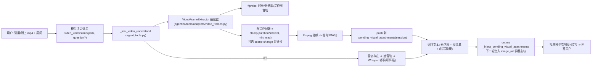

# Near 视频理解能力（video_understand）— 主规划

Planned-with: claude-opus-4.8

> 目标：让 Near/Machi 具备「一等的」本地视频（mp4 等）理解能力，效果优于 WorkBuddy 的临时 `bash+ffmpeg` 拼凑链路。核心差距不在"能不能处理视频"，而在"抽帧策略是否智能、是否融合语音、是否把多轮探索收敛成一次原子工具调用、过程是否干净不刷屏"。

---

## 背景与竞品分析（证据链，写入正文以便实施者独立判断）

竞品 WorkBuddy 处理一个 12.7s mp4 的实际工具调用链（用户提供的截图）：

1. `ls -lh <video>` —— 看文件大小
2. `ffprobe -v error -show_format -show_streams <video>` —— 探测元信息
3. `ffmpeg -vf fps=1/3 -frames:v 5 frame_%02d.png` —— **固定 1/3fps、固定抽 5 帧**存 PNG 到临时目录
4. 再读这几张 PNG 喂给视觉模型

其本质缺陷：
- 抽帧参数写死（固定 5 帧、固定 1/3fps），不随视频时长/场景密度自适应：长视频严重欠采样，短视频可能过采样。
- 纯视觉，丢失音轨（有人说话/旁白的视频信息全丢）。
- 3-4 轮工具调用（ls→ffprobe→ffmpeg→读图）过程噪音大，用户能看到一堆 shell 命令。
- 完全依赖模型当次"临场想到"要这么做，不是稳定能力。

Near 现状（已核验）：
- `agenticx/cli/agent_tools.py` 已内置 `bash_exec`（`STUDIO_TOOLS` 中，dispatch 于 `dispatch_tool_async`），本机装了 ffmpeg 时模型今天就能写出与 WorkBuddy 一样的命令 —— **下限打平，但同样啰嗦、同样依赖临场发挥、同样丢音频**。
- 已有可复用的帧→模型注入链路：`_tool_view_image`（`agent_tools.py:4681`）读取图片字节 → 追加到 `_pending_visual_attachments(session)`（`agent_tools.py:4606`，存于 `session.scratchpad[PENDING_VISUAL_ATTACHMENTS_KEY]`）→ runtime `_inject_pending_visual_attachments`（`agenticx/runtime/agent_runtime.py:804`）在下一轮把每帧作为 `{"type":"image_url","image_url":{"url":data_url}}` 注入 user 消息。**注入函数不限制帧数，帧数上限只在 `_tool_view_image` 里（`_VIEW_IMAGE_MAX_PENDING=4`，`agent_tools.py:4513`）**，因此视频工具可绕开该 4 帧上限、按自己的策略直接 push 多帧。
- 子进程工具适配器范式：`agenticx/tools/adapters/liteparse.py`（`LiteParseAdapter`，含 `is_available()` / `_find_cli()` / `asyncio.create_subprocess_exec` + `wait_for(timeout)`）。
- 视觉能力判定：`is_vision_capable(provider, model)`（`agenticx/llms/vision.py:51`）；会话侧封装 `_session_vision_capable(session)`（`agent_tools.py:4620`）。
- 工具必填参数自动从 schema 派生：`_TOOL_REQUIRED_PARAMS`（`agent_tools.py:6119` 循环遍历 `STUDIO_TOOLS`），新增工具只要在 schema 写 `required` 即可自动生效。

结论：**做一个专门的 `video_understand` 工具，把探测+自适应抽帧+（可选）语音转写+多模态组装收敛为一次原子调用，即可稳定超越 WorkBuddy。**

---

## 总体方案（一张链路图）

---

## 子规划与推荐实施模型（子规划 → 推荐模型 + 理由）

| 顺序 | 子规划文件 | 内容 | Suggested-Impl-Model | 理由 |
|---|---|---|---|---|
| P0（必做，独立可交付） | `.cursor/plans/2026-07-08-video-understanding-p0-frame-tool.plan.md` | 新增 `VideoFrameExtractor` 适配器 + `video_understand` 工具（ffprobe 探测 + 自适应抽帧 + 复用 pending 注入链路 + 视觉能力兜底 + config 节 + 冒烟测试） | `gpt-5.3-codex` | 纯后端接线 + 子进程编排 + 序列/注入一致性敏感，代码专精中档够用且最省，不需顶配 |
| P1（增强） | `.cursor/plans/2026-07-08-video-understanding-p1-audio-transcribe.plan.md` | 视频含音轨时抽音轨转写并融合进工具返回文本；无可用转写后端时优雅降级（不阻断视觉链路） | `gpt-5.3-codex` | 依赖探测/可选后端/降级路径的后端逻辑，代码专精中档合适 |
| P2（体验） | `.cursor/plans/2026-07-08-video-understanding-p2-desktop-ux.plan.md` | Desktop 允许 mp4 附件/@引用并透传 `sourcePath`；工具过程聚合为单张可折叠卡；非视觉模型附视频时 Cherry 式提示 | `gpt-5.3-codex` | 前端接线为主、视觉改动小（复用既有 ToolCallCard/toast 语义），无需前端顶配审美档 |

> 三个子规划中的 `Impl-Model` trailer 最终以实际使用为准、由用户确认；上表仅为高性价比建议。

---

## 实施顺序与硬门槛（强约束）

1. **必须按 P0 → P1 → P2 顺序推进**。P0 完成即已能"打平并超越"WorkBuddy 的视觉理解；P1、P2 为增强，可分批合入。
2. **每个子规划完成后必须本地冷启动验证 `agx serve`**（AGENTS.md 对 `server.py` 相关改动的强制门槛的延伸）：
   - P0/P1 改了 `agent_tools.py`（`create_studio_app()` 间接依赖它导出的 `STUDIO_TOOLS`/`PENDING_*` 常量），提交前须 `agx serve --host 127.0.0.1 --port <临时端口>` 冷启动不崩溃，且 `/api/session`、`/api/avatars`、`/api/sessions` 返回 200。
   - **触碰 `agent_tools.py` 的 import 区与既有工具分支时，只能精确增删目标行，禁止整段替换覆盖相邻无关行**（同 `server.py` 事故教训 / `no-scope-creep.mdc`）。
3. 每个子规划都必须自带 `tests/` 冒烟测试并本地跑绿（见各子规划 AC）。
4. 若本机未安装 ffmpeg/ffprobe，工具须返回明确、可读的安装指引错误（`brew install ffmpeg`），不得裸抛 `Errno 2` 或空结果。

---

## In scope / Out of scope（防 scope creep）

**In scope**
- 新增视频理解工具及其后端适配器、配置节、Desktop 接线、冒烟测试。
- 复用现有 `_pending_visual_attachments` 注入链路、`is_vision_capable` 判定、`_resolve_workspace_path` 路径解析。

**Out of scope（禁止顺手改）**
- 不改 `_tool_view_image` 现有行为与其 4 帧上限（视频工具走自己的常量与 push 逻辑，不动 view_image）。
- 不重构 `_inject_pending_visual_attachments`（只复用，不改签名/语义）。
- 不引入重型视频理解模型/云服务、不改 provider 路由层。
- 不改 `enterprise/`、不改 `server.py` 的 import 区（除非某子规划显式要求且逐行确认）。
- P1 的音频转写默认关闭或按可用性自动降级，不得因转写后端不可用而破坏 P0 视觉链路。

---

## 全局验收（三段合入后）

- AC-M1：本机装 ffmpeg，用户引用一个含语音的 mp4 问"这个视频讲了什么"，Near **一次** `video_understand` 调用即返回元信息+帧+（P1 后）转写，模型据此正确作答；对话区只出现**一张可折叠工具卡**，无 ls/ffprobe/ffmpeg 三段式 shell 噪音。
- AC-M2：长视频（如 5 分钟）抽帧数随时长自适应上调（不再固定 5 帧），短视频不过采样；帧数受配置上限约束。
- AC-M3：当前模型为非视觉模型时，工具返回明确提示要求切换视觉模型（不静默失败），Desktop 侧附 mp4 时给出 Cherry 式"模型不支持"提示。
- AC-M4：未装 ffmpeg 时返回 `brew install ffmpeg` 指引错误。
- AC-M5：全部子规划的 `tests/` 冒烟测试通过；`agx serve` 冷启动核心 API 200。

---

## Traceability

- Plan-Id: `2026-07-08-video-understanding-main`
- 各子规划 commit 使用各自 `Plan-Id`/`Plan-File` trailer；主规划作为总纲随第一批代码一同提交。
