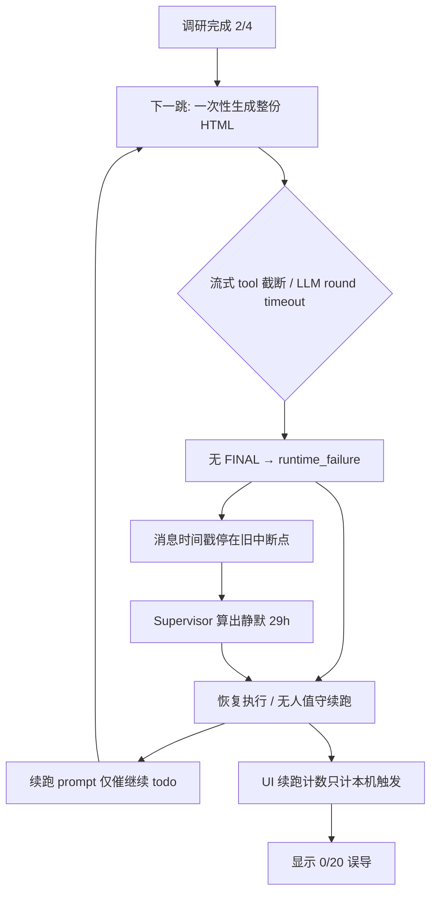

# 无效续跑熔断与大产物分片（避免「恢复执行」空转）

Planned-with: Cursor Grok 4.5

Suggested-Impl-Model: gpt-5.5-low（跨栈：runtime 续跑策略 + supervisor 静默判定 + Desktop 计数对齐；性价比优先，非纯视觉重塑）

Plan-Id: 2026-07-09-futile-resume-circuit-breaker
Plan-File: .cursor/plans/2026-07-09-futile-resume-circuit-breaker.plan.md

## 子规划 → 推荐实施模型

| 子任务 | Suggested-Impl-Model | 理由 |
|--------|----------------------|------|
| FR-1 失败细节落盘 + 中断文案透出 | composer-2.5 / kimi-k2.7-code | 纯后端 helper + 既有 `turn_interruption` 模式，样板清晰 |
| FR-2 续跑 prompt 注入失败原因与分片策略 | composer-2.5 | 改 `continuation.py` 文案与 scratchpad 读取，低风险 |
| FR-3 无进展熔断（后端） | gpt-5.5-low | 涉及 fingerprint / prepare_continue / supervisor 协同，需仔细对齐状态机 |
| FR-4 Supervisor 陈旧 interrupted 静默修正 | gpt-5.5-low | 静默秒数与 auto-continue 判定易回归，需强推理 |
| FR-5 Desktop 续跑计数对齐后端 | composer-2.5 | 前端读 metadata / SSE `continuation_round`，改动面小 |
| FR-6 Meta 大产物分片提示（daily_office） | composer-2.5 | 仅增 prompt 段落，不改调度逻辑 |

> 最终 `Impl-Model` trailer 以实际使用为准，由用户确认。

## 背景 / 问题（根因证据链）

复现会话：`9f2b5f09-24c1-4863-a7dd-e9946d8557a9`（模型：彩讯-外网 / `kimi-k2.6`）。

用户现象：任务进度卡在 **2/4**（「设计并生成图文并茂的 HTML 调研报告」），多次点「恢复执行」+ 开启无人值守，仍反复出现：

- 「上一步工具执行后未收到模型响应」/「运行出错，本轮未收到模型最终响应」
- StallRecoveryCard「上一轮未产出回答」
- 健康度「卡住」；UI「无人值守 · 续跑 **0**/20」与后端实际续跑不同步

### 磁盘证据（实施者可自行打开核对）

路径：`~/.agenticx/sessions/9f2b5f09-24c1-4863-a7dd-e9946d8557a9/`

| 文件 | 关键事实 |
|------|----------|
| `messages.json` | 仅 **14** 条；末条 `metadata.kind=turn_interrupted`，`cause=runtime_failure`；**无** `file_write` 产物 |
| `agent_messages.json` | 工具链：`todo_write` → `web_search`×3 → `web_fetch`×3 → `todo_write`(2/4)；另有一条「流式输出被截断导致参数为空」系统通知（`todo_write`） |
| `context_stats.jsonl` | 多轮 prompt ≈ 18k–23k；续跑后 round 计数重置，但 **chat 消息数不增长** |
| scratchpad（SQLite） | `_llm_round_timeout_count=1`；`_llm_fallback_applied=DeepSeek/deepseek-chat`；`unattended_enabled=1`；`execution_state=interrupted` |
| `logs/supervisor/<sid>.log` | 今日仍 `action=continue reason=stall`，`silent_seconds≈104248`（约 **29h**）——因最后消息时间戳停在 07-08 08:53 |

### 根因分层（不是「恢复按钮坏了」）



1. **任务悬崖**：第 3 步要求「图文并茂完整 HTML」→ 超长 `file_write` / 超长 completion；代理 Kimi 流式 tool 参数易截断（已有 FR-C 丢弃空参），round timeout 默认 ~180s。
2. **失败被泛化**：`turn_interruption.py` 对 `runtime_failure` 只写「运行出错，本轮未收到模型最终响应」，不透出 `detector`（如 `llm_round_timeout` / `streamed_tool_call_truncated`）。
3. **续跑无换打法**：`resolve_continuation_prompt("interrupted")`（`continuation.py:110-113`）只说「从未完成 todo 继续」，模型再次冲同一悬崖。
4. **无人值守空转**：`supervisor.py:_last_progress_ts` 用消息 `timestamp`；interrupted 且无新消息时静默被算成数十小时，反复 `continue`。
5. **UI 计数漂移**：`ChatPane.tsx:5368-5375` 用本机会话内「无人值守续跑/自动续跑提醒」文案条数估算；后端 `prepare_continue` 的 `__continuation_round__` 与 supervisor 日志不同步到该 chip → 显示 `0/20`。

## 目标行为

1. 中断时落盘**可诊断的失败细节**（detector / 简短 reason），UI 与续跑 prompt 都能读到。
2. 续跑时若上次失败与「大文件/长生成」相关，prompt **强制分片**（先骨架 ≤100 行，再分章 `file_write`），禁止整页重写。
3. 同一未完成 todo 连续 N 次续跑（默认 3）**无新工具进展**（无新非 notice 的 tool 行 / 无新 `file_write`）→ **熔断**：拒绝 auto-continue，手动恢复给出明确文案并建议换模型。
4. Supervisor 对 `interrupted` + 无进展会话，**不得**用陈旧 timestamp 算出超长静默后无限续跑。
5. Desktop「无人值守 · 续跑 x/y」与后端 `continuation_round`（及历史 `continuation_notice`）对齐。

## 范围（In / Out of scope）

**In scope：**

- `agenticx/studio/turn_interruption.py`：扩展 notice metadata + 文案可选透出 detector。
- `agenticx/studio/server.py`：`_finalize_chat_runtime` / ERROR 路径把 `detector` 写入 scratchpad + notice。
- `agenticx/studio/continuation.py`：失败感知 prompt、无进展 fingerprint、熔断拒绝。
- `agenticx/studio/supervisor.py`：静默/auto-continue 守卫。
- `agenticx/runtime/prompts/meta_agent.py`：daily_office / 通用「大 HTML/报告落盘」分片纪律（短段落）。
- `desktop/src/components/ChatPane.tsx` + 必要时 `StallRecoveryCard.tsx`：续跑计数与熔断文案展示。
- 测试：`tests/test_studio_continuation.py`、`tests/test_chat_turn_interruption_notice.py`，新增 `tests/test_smoke_futile_resume_circuit.py`（或并入现有文件）。

**Out of scope（严禁顺手改）：**

- 不改压缩 / `compactor.py` / token budget 算法。
- 不改 Kimi provider 默认 HTTP timeout 数值（可另开 plan）；本 plan 只消费已有 `detector`。
- 不改 `todo_write` schema / FR-C 截断丢弃逻辑本体（已存在）。
- 不重写 Stall 三通道检测；只加「无进展熔断」与 supervisor 守卫。
- 不改群聊路由 / 分身委派。
- **不**为该历史会话手工补 HTML 报告（用户任务，非本 plan）。

> no-scope-creep：每处改动必须能追溯到下方某条 FR。

## 关键事实（供实施者独立判断）

- 中断落盘：`append_turn_interruption_notice`（`turn_interruption.py:85-117`）→ `metadata.kind=turn_interrupted` + `cause`。
- cause 解析：`resolve_turn_interruption_cause`（同文件 `:120-139`）；`had_runtime_failure` 来自 `server.py:_runtime_error_counts_as_failure`（`:233-247`），已识别 `detector` 字段但**未写入** notice。
- 超时 ERROR 已带 `detector: llm_round_timeout`（`agent_runtime.py` ~2813）。
- 流式截断：`force_retry_next_round` + 系统通知（`agent_runtime.py` ~2464-2480）；若最终仍无 FINAL，外层仍可能记 `runtime_failure`。
- 续跑入口：`POST /api/sessions/{id}/continue`（`server.py:3288`）→ `prepare_continue` → 内部再 `chat(..., skip_user_history=True)`。
- 续跑 round：`scratchpad["__continuation_round__"]`（`continuation.py:SCRATCH_ROUND_KEY`），经 `session_manager` scratchpad 表持久化。
- Supervisor 静默：`supervisor.py:281-299`；`interrupted` 时 **跳过** `silent < stall_after` 检查（`:298`），故陈旧 interrupted 会立刻反复 continue。
- 前端计数：`ChatPane.tsx:5368-5375` / `:5816-5817`；SSE `continuation_notice` 带 `continuation_round`（`:7641`）但**未**用来更新 `unattendedContinueCount`。
- 已有「任务已完成」类 futile guard：`task-stall-policy.ts` / `ChatPane.resumeCurrentTask`；本 plan 新增的是 **「未完成但无进展」** 熔断，语义不同。

---

## FR / AC

### FR-1：中断 notice 透出失败 detector

**落点：**

- `agenticx/studio/turn_interruption.py`
- `agenticx/studio/server.py`：`_finalize_chat_runtime`、ERROR 跟踪处（约 `_track_runtime_event` / `_runtime_error_counts_as_failure` 调用链）

**Before：** `cause=runtime_failure` → 固定文案「运行出错，本轮未收到模型最终响应…」，无 detector。

**After：**

1. 当 ERROR 事件带 `detector`（如 `llm_round_timeout`）时，写入：
   - `session.scratchpad["__last_turn_failure__"] = {"detector": "...", "text": "<截断≤200字>", "ts": <unix>}`
2. `append_turn_interruption_notice` 的 metadata 增加可选 `detector`；文案在 `runtime_failure` 时附加一句可读原因，例如：
   - `llm_round_timeout` → 「（原因：模型响应超时）」
   - `streamed_tool_call_truncated` → 「（原因：工具参数流式截断）」
   - 未知 detector → 不追加括号，保持旧文案兼容

**AC-1：**

- `tests/test_chat_turn_interruption_notice.py` 新增：带 `detector=llm_round_timeout` 时 content 含「超时」或约定关键字，metadata 含 `detector`。
- 无 detector 时文案与现网完全一致（回归）。

### FR-2：续跑 prompt 注入失败原因 + 大产物分片

**落点：** `agenticx/studio/continuation.py` → `resolve_continuation_prompt`（或新增 `resolve_continuation_prompt_for_session(session, reason, ...)`，由 `prepare_continue` 调用）。

**Before：** interrupted 固定「请从未完成的 todo 项继续，并更新 todo_write 状态。」

**After：** 若 scratchpad `__last_turn_failure__` 存在，或最近 `turn_interrupted.cause in {runtime_failure, no_final}`，在 prompt 末尾追加（中文，固定模板）：

```text
【续跑约束】上次中断原因：{detector或cause}。
若当前 todo 是生成 HTML/长文档/完整报告：
1) 禁止一次性 file_write 整页超长内容；
2) 先 file_write 骨架（标题+目录+占位，≤100 行）；
3) 再按章节多次 file_write/file_edit 追加；
4) 每完成一章立即 todo_write 更新进度。
```

`is_continuation_user_prompt` 须识别新模板（可用前缀 `【续跑约束】` 或把完整字符串纳入 known 集合的动态前缀检测）。

**AC-2：**

- `test_resolve_continuation_prompt_*`：有/无 `__last_turn_failure__` 两分支断言。
- `is_continuation_user_prompt` 对新 prompt 返回 True，对真实用户句仍 False。

### FR-3：无进展续跑熔断（后端）

**落点：** 新建小模块或放在 `continuation.py`：

- `SCRATCH_NO_PROGRESS_KEY = "__continuation_no_progress__"`
- fingerprint：当前未完成 todo 的 `(completed, total, in_progress_content)` + `len(chat_history 中非 notice 的 tool 行)`（或最后一条真实 tool 的 id/content hash）

**逻辑（伪代码）：**

```python
def record_continue_progress_guard(session, *, advanced: bool) -> None:
    # advanced=True：本轮 chat 结束后若出现新的非 notice tool / file_write → 清零
    ...

def should_reject_futile_continue(session, *, source: str) -> tuple[bool, str]:
    # 连续无进展次数 >= N（默认 3，可读 config runtime.unattended.max_no_progress_continues）
    # → (True, "连续 N 次续跑无新进展，已停止自动恢复。请换模型或改为分章写文件后手动恢复。")
```

接线：

1. `prepare_continue`：若 `should_reject_futile_continue` → `return False, "", round_n, {}`；`server.py` continue 端点对 `not ok` 已发 `continuation_rejected`——**扩展 reject 文案**（今日硬编码「续跑请求已去重」不够用）。
   - **精确改法**：`prepare_continue` 改为返回 `(ok, prompt, round_n, notice, reject_reason)` 或让 `ok=False` 时 `notice={"reject_text": "..."}`；`server.py:3330-3336` 使用该文案。
2. `_finalize_chat_runtime`（或 continue 包装的 chat finally）：若本轮相对 continue 前 fingerprint **有进展** → 清零计数；**无进展**且 `cause` 再次 interrupted → `count += 1`。
3. Supervisor：`should_reject` 为真时 **跳过** `_continue_fn`，并 `_fail_session` 或 append `unattended_failed`（`limit_code=no_progress`），关闭该会话无人值守。

**AC-3：**

- 单元测试：模拟 3 次 continue 后 fingerprint 不变 → `prepare_continue`/`should_reject` 拒绝；第 2 次中间插入 `file_write` tool 行 → 计数清零。
- Supervisor 单测或 smoke：reject 后不再调用 continue_fn。

### FR-4：Supervisor 陈旧 interrupted 静默守卫

**落点：** `agenticx/studio/supervisor.py` `_tick` 约 `:281-305`。

**Before：** `execution_state == "interrupted"` 时忽略 `silent < stall_after`，且 `silent` 可来自 29h 前的消息 timestamp。

**After：**

1. 计算静默时：若最后一条是 `turn_interrupted` / `continuation_notice`，静默锚点改为 `max(last_msg_ts, managed.updated_at, scratchpad.__continuation_last__.ts)`，避免「只有旧业务消息」时虚高。
2. 对 `interrupted`：**仍要求**距上次 continue 尝试（`__continuation_last__.ts`）至少 `stall_continue_after_seconds`，防止 30s 一轮空转。
3. 若 FR-3 熔断已触发，直接 skip（见上）。

**AC-4：**

- 构造 messages 末条为 29h 前的 `turn_interrupted`，`__continuation_last__.ts=now` → 本 tick **不** continue。
- `__continuation_last__.ts` 早于 stall_after 且未熔断 → 允许一次 continue（与现配置一致）。

### FR-5：Desktop 续跑计数对齐

**落点：**

- `desktop/src/components/ChatPane.tsx`：`continuation_notice` SSE 分支（~7625）与 session 进入时的 prior 计数（~5368）
- 可选：加载 session 时若 API 能返回 scratchpad round——若现有 `listSessions`/`getSession` **无**该字段，则 **仅用** 历史消息里 `metadata.continuation_round` 的最大值 + SSE 更新（避免扩 API 也可验收）。

**Before：** 只数本机文案匹配条数；supervisor 后端续跑若未进当前内存列表则显示 0。

**After：**

```ts
// on continuation_notice SSE:
const round = Number(payload.data?.continuation_round ?? 0);
if (round > 0) {
  unattendedContinueTriggeredRef.current[sid] = Math.max(
    unattendedContinueTriggeredRef.current[sid] ?? 0,
    round,
  );
  setUnattendedContinueCount(unattendedContinueTriggeredRef.current[sid]);
}
```

进入会话时：从 `pane.messages` 扫 `metadata.kind===continuation_notice` 的 `continuation_round` 取 max（兼容无 metadata 的旧文案「第 N 轮」正则）。

**AC-5：**

- 前端单测或手工：注入带 `continuation_round: 3` 的 notice → chip 显示 `3/20`。
- 熔断 `continuation_rejected` 文案出现在 StallRecoveryCard / toast（已有 `setStallRejectReason` 路径）。

### FR-6：Meta 系统提示 — 大 HTML/报告分片纪律

**落点：** `agenticx/runtime/prompts/meta_agent.py`「输出要求」或「调度策略」附近（约 `:830` 后），新增短段落（**全体模式**，不仅 code_dev）：

```text
## 大文件 / HTML 报告落盘纪律
用户要求生成完整 HTML/长报告并保存文件时：
- 禁止单次 file_write 输出整页超长正文；
- 先写骨架（标题、目录、CSS 占位，≤100 行），再分章追加；
- 每章完成后更新 todo_write。
```

**AC-6：** 单测或字符串断言：`build_meta_agent_system_prompt(...)` 含「大文件」或「骨架」关键字；不改变既有 todo_write「何时不该调用」段落语义。

---

## 实施任务拆分（建议顺序）

### Task 1: FR-1 失败 detector 落盘与文案

**Files:** `turn_interruption.py`, `server.py`, `tests/test_chat_turn_interruption_notice.py`

TDD：先写带 detector 的 assert → 改 append/resolve → 在 finalize 前把 last ERROR detector 写入 scratchpad 并传入 append。

### Task 2: FR-2 续跑 prompt

**Files:** `continuation.py`, `tests/test_studio_continuation.py`

### Task 3: FR-3 无进展熔断 + continue reject 文案

**Files:** `continuation.py`, `server.py` continue 端点, `supervisor.py`, `tests/test_smoke_futile_resume_circuit.py`

### Task 4: FR-4 Supervisor 静默锚点

**Files:** `supervisor.py` + 同 smoke 测试扩展

### Task 5: FR-5 Desktop 计数

**Files:** `ChatPane.tsx`；若有 `continuation-notice.ts` 可抽 `maxContinuationRound(messages)` helper + 单测

### Task 6: FR-6 Meta prompt 段落

**Files:** `meta_agent.py` + 现有 prompt 冒烟测试（若无则加最小 assert）

---

## 验证清单（实施者自测）

```bash
# 后端
pytest tests/test_chat_turn_interruption_notice.py tests/test_studio_continuation.py tests/test_smoke_futile_resume_circuit.py -v

# 若改了 server.py import 区：禁止整段替换；冷启动 smoke
agx serve --host 127.0.0.1 --port 18765
# curl --noproxy '*' http://127.0.0.1:18765/api/session 等核心 API 200
```

手工（可选）：用短会话模拟「interrupted → continue×3 无新 tool」→ 第 3 次后出现 reject / 无人值守停止；chip 显示非 0。

---

## Commit 建议（实施时）

按 FR 拆 2–3 个 commit，均带：

```
Plan-Id: 2026-07-09-futile-resume-circuit-breaker
Plan-File: .cursor/plans/2026-07-09-futile-resume-circuit-breaker.plan.md
Plan-Model: <规划模型>
Impl-Model: <实施模型>
Made-with: Damon Li
```
