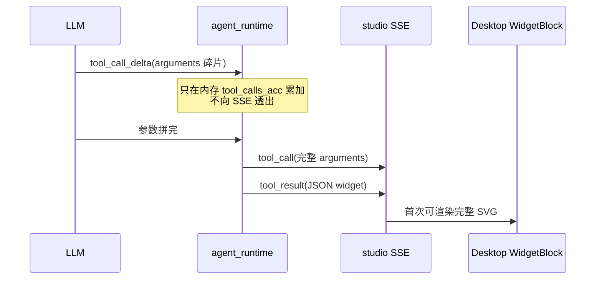
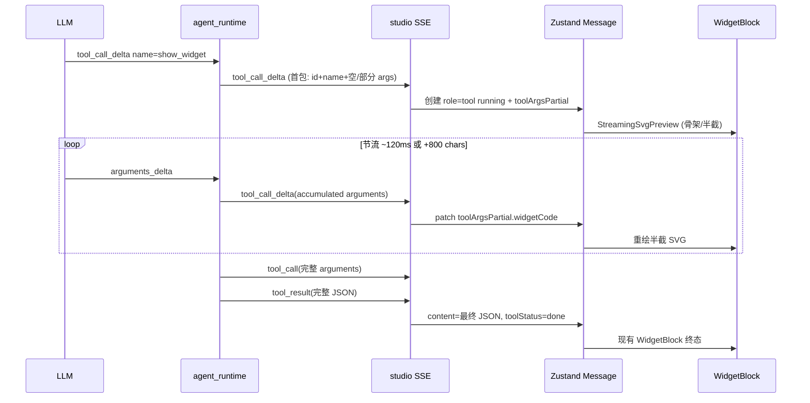

# show_widget SVG 渐进渲染（边生成边画）

Planned-with: grok-4.5
Suggested-Impl-Model: gpt-5.3-codex（跨栈 SSE 时序 + 部分 JSON 抽取，序列敏感；前端纯展示子任务可降级 Composer 2.5）

> **For implementer:** 本 plan 按「Composer 2.5 可独立高质量实施」标准写清落点 / before-after / AC。用户已确认只做方案 A（渐进 SVG），**未确认前禁止实施**。

---

## 背景与根因（证据链）

用户截图：助手在复盘报告里调用 `show_widget` 画大 SVG，界面长时间只有三点 loading，体感「画了很久」。对比 WorkBuddy 的「图一点点长出来」。

**现状链路（已落地，见 `.cursor/plans/2026-06-26-show-widget-inline-renderer.plan.md`）：**



关键代码证据：

| 环节 | 文件 | 行为 |
|------|------|------|
| Provider 已产出 delta | `agenticx/llms/base.py` L9-14；`litellm_provider.py` / `bailian` / `ark` / `kimi` 的 `tool_call_delta` | 有 `arguments_delta` |
| Runtime 只累加不透出 | `agenticx/runtime/agent_runtime.py` ~L2407-2425 | `acc["arguments"] += args_delta`，**无** `yield RuntimeEvent` |
| 完整后才发 tool_call | 同文件 ~L3422-3425 / 正常 dispatch 路径 | `EventType.TOOL_CALL` 在参数齐后才发 |
| EventType 无 delta | `agenticx/runtime/events.py` L27-51 | 只有 `tool_call` / `tool_progress` / `tool_result` |
| 前端等完整 payload | `desktop/src/components/messages/ToolCallCard.tsx` L217-243 | `parseWidgetPayload(message.content)` 成功才渲染 `WidgetBlock` |
| SVG 解析不容错半截 | `WidgetBlock.tsx` `buildSanitizedSvgHtml` L23-26 | `parsererror` → `null`，半截 SVG 画不出来 |

**根因一句话：** 慢的是「模型吐巨型 `widget_code` 参数」这段时间；Near 已有 delta，但**没接到 SSE → UI 渐进预览**。

---

## 目标

`show_widget` 且 `widget_code` 为 **SVG** 时：模型还在流式生成参数的过程中，聊天气泡里就出现可增长的矢量预览（边生成边画）；参数齐、`tool_result` 到达后无缝切到最终图（与现网一致）。

## 非目标（Out of scope / no-scope-creep）

- **不做** HTML widget / `stock_chart` 的渐进渲染（仍等完整结果；HTML 继续用现有 loading）。
- **不做** Mermaid 优先引导、改 prompt 少写 SVG（那是方案 B）。
- **不改** `show_widget` 工具 schema / `_tool_show_widget` 返回格式。
- **不把** 半截预览写入 `messages.json` 持久化（仅内存 UI；刷新后只见最终 `tool_result`）。
- **不改** `agenticx/studio/server.py` 顶部 import 区；若必须动该文件，只允许在 `_runtime_event_to_sse_lines` 的 event type 白名单式分支上**精确增行**（见 AGENTS.md 对该文件的红线）。
- **不改** 其它工具的 `tool_call` 时序；delta 事件**仅**对 `show_widget` 发射（防 SSE 洪水）。

---

## 架构



**设计要点：**

1. 新 SSE 类型 `tool_call_delta`（与 provider 内部 chunk 同名，但对 Desktop 是**新**事件；现网前端不处理则无害忽略）。
2. Runtime 在流式累加时，**仅当** `acc["name"] == "show_widget"` 才 yield；节流避免每个 token 打爆 UI。
3. 前端用纯函数从**可能不完整**的 arguments JSON 字符串抽出 `title` / `widget_code` 前缀。
4. SVG 预览路径：缺 `</svg>` 时自动补闭合 + 去掉未闭合标签尾部噪声，再走现有 sanitize（或 streaming 专用宽松 sanitize）。

---

## 子规划 → 推荐实施模型

| 子任务 | 推荐模型 | 理由 |
|--------|----------|------|
| T1 后端 EventType + 节流 emit | gpt-5.3-codex | 时序/节流/仅 show_widget 边界，回归敏感 |
| T2 部分 JSON / 半截 SVG 纯函数 + 单测 | composer-2.5 | 纯函数样板，够用且省 |
| T3 Desktop SSE 接线 + WidgetBlock streaming | gpt-5.3-codex | ChatPane/ChatView 双路径一致，易漏 |
| T4 冒烟 AC | composer-2.5 | 按 AC 跑测即可 |

---

## FR / NFR / AC

### FR-1 后端透出 show_widget 参数增量

- **FR-1.1** `EventType` 新增 `TOOL_CALL_DELTA = "tool_call_delta"`。
- **FR-1.2** 在 `agent_runtime.py` 流式 `tool_call_delta` 累加循环内：当 `acc["name"] == "show_widget"` 时，按节流 yield `RuntimeEvent`。
- **FR-1.3** payload 形状（经 `normalize_tool_sse_payload`）：

```json
{
  "name": "show_widget",
  "tool_call_id": "call_xxx",
  "id": "call_xxx",
  "arguments_raw": "{\"title\":\"故障时间线\",\"widget_code\":\"<svg ...",
  "partial": true
}
```

- `arguments_raw`：当前累加的**原始 arguments 字符串**（未 `json.loads`），前端负责部分解析。
- 首包：一旦 `name` 变为 `show_widget` 且已有非空 `id`（或生成占位 id），立即发一帧（即使 `arguments` 仍空），让 UI 先出骨架。
- 节流常量（模块级，英文注释）：
  - `SHOW_WIDGET_DELTA_MIN_INTERVAL_MS = 120`
  - `SHOW_WIDGET_DELTA_MIN_CHARS = 800`
  - 满足「距上次 emit ≥ 120ms **或** arguments 增长 ≥ 800」之一即发；流结束前若有未发增量，在拼完 `tool_calls` 列表后**再补发最后一帧**（保证终态预览追上完整参数，再等正式 `tool_call`/`tool_result`）。

**落点：**

- Modify: `agenticx/runtime/events.py` — `EventType` 枚举，在 `TOOL_CALL` 后插入一行 `TOOL_CALL_DELTA = "tool_call_delta"`。
- Modify: `agenticx/runtime/agent_runtime.py` ~L2407-2425 累加分支：

**Before（意图）：**

```python
elif chunk_type == "tool_call_delta":
    ...
    if args_delta:
        acc["arguments"] += args_delta
    # 无 yield
```

**After（意图）：**

```python
elif chunk_type == "tool_call_delta":
    ...
    if args_delta:
        acc["arguments"] += args_delta
    # NEW: progressive preview for show_widget only
    if (acc.get("name") or "").strip() == "show_widget":
        should_emit = _should_emit_show_widget_delta(acc, state_for_idx)
        if should_emit:
            yield RuntimeEvent(
                type=EventType.TOOL_CALL_DELTA.value,
                data={
                    "name": "show_widget",
                    "tool_call_id": acc.get("id") or f"stream-pending-{idx}",
                    "arguments_raw": acc.get("arguments") or "",
                    "partial": True,
                },
                agent_id=agent_id,
            )
```

- 新增模块级纯函数（同文件顶部 helpers 区，靠近 `_repair_streamed_tool_arguments` ~L719）：
  - `_should_emit_show_widget_delta(acc, emit_state) -> bool`
  - emit_state 用 `tool_calls_acc` 旁路 dict：`{idx: {"last_emit_mono": float, "last_len": int}}`

- Modify: `agenticx/studio/server.py` `_runtime_event_to_sse_lines` ~L295-300：把 `EventType.TOOL_CALL_DELTA.value` 加入与 `TOOL_CALL`/`TOOL_RESULT`/`TOOL_PROGRESS` 相同的 `normalize_tool_sse_payload` 分支（**只加枚举成员到 if 元组，禁止整段替换 import**）。

### FR-2 部分 arguments → title / widget_code

- Create: `desktop/src/components/messages/show-widget-partial.ts`
- 导出：

```ts
export type PartialShowWidget = {
  title: string;
  widgetCode: string; // may be incomplete SVG
  readyForPreview: boolean; // true when widgetCode contains "<svg" (case-insensitive)
};

/** Extract title + widget_code prefix from possibly-truncated tool arguments JSON. */
export function extractPartialShowWidgetArgs(argumentsRaw: string): PartialShowWidget | null;
```

**抽取算法（写死，禁止「按需推断」）：**

1. 若 `argumentsRaw` 为空 → `null`。
2. 用正则（非贪婪到合理边界）尝试：
   - `"title"\s*:\s*"((?:\\.|[^"\\])*)"` → unescape 常见 `\"` `\\n` `\\t`。
   - `"widget_code"\s*:\s*"` 之后：从该引号后扫描到字符串结束或未闭合；处理 `\"` 转义；得到 `widgetCode` 前缀（可无结尾引号）。
3. 若尚未出现 `"widget_code"` 键 → `readyForPreview: false`，`widgetCode: ""`，但仍可返回 title（骨架标题）。
4. `readyForPreview = /<svg\b/i.test(widgetCode)`。

- Create: `desktop/src/components/messages/show-widget-partial.test.ts`（vitest，与仓库其它 `*.test.ts` 一致）
  - 完整 JSON → 抽出 title + 完整 svg
  - 截断在 `widget_code` 中间 → 仍抽出前缀且 `readyForPreview===true`
  - 只有 `{"title":"x"` → title 有、preview false
  - 含转义引号的 title

### FR-3 半截 SVG 可渲染

- Create 或同文件导出：`finalizePartialSvg(code: string): string | null`
  - trim；若无 `<svg` → `null`
  - 若无 `</svg>`（忽略大小写）：去掉尾部不完整的 `<` 半截 tag（`/<[^>]*$/`），再追加 `\n</svg>`
  - 不执行 script；调用方可再走 `buildSanitizedSvgHtml` 逻辑——**推荐**把 sanitize 抽成 `widget-svg-sanitize.ts` 供 `WidgetBlock` 与 streaming 共用；若嫌 scope 大，允许在 `WidgetBlock.tsx` 内导出 `buildSanitizedSvgHtml` / 复制 streaming 专用函数但必须单测覆盖「无闭合标签仍返回非 null」。

- AC：输入 `"<svg viewBox='0 0 10 10'><rect x='0' y='0' width='5' height='5'"` → 输出可被 `DOMParser` 解析且无 `parsererror`。

### FR-4 Desktop 接线（ChatPane + ChatView）

- Modify: `desktop/src/store.ts` `Message` 类型（~L192-202）新增可选字段：

```ts
/** In-memory progressive preview for show_widget (not persisted). */
toolArgsPartial?: {
  title?: string;
  widgetCode?: string;
  argumentsRaw?: string;
};
```

- 将该字段加入 `MessageToolExtras` Pick 列表（~L233-251）。
- **持久化：** 确认 `session_manager` / 保存 messages 路径**不会**把 `toolArgsPartial` 写入磁盘；若序列化是「整 Message dump」，在 save 前 omit 该键（落点：搜 `tool_args` / `toolArgs` 写入处；优先在前端 save 映射 omit，避免改 Python 会话格式）。若当前只持久化后端 `chat_history`、前端字段本就不落盘，则在 plan 实施时用注释标明「已核实无需 omit」即可。

- Modify: `desktop/src/components/ChatPane.tsx` SSE 循环（`payload.type === "tool_call"` 附近 ~L7985）：
  - 新增分支 `payload.type === "tool_call_delta"`：
    - 仅处理 `name === "show_widget"`。
    - `toolCallId` 缺失则 ignore。
    - 若尚无对应 `toolCallId` 的 tool 消息：`addPaneMessageIfSessionActive(..., { toolCallId, toolName: "show_widget", toolStatus: "running", toolArgsPartial: extracted, toolGroupId })`，`content` 可用 `""` 或 `"rendering…"`。
    - 若已有：`updatePaneMessageByToolCallId` 只 patch `toolArgsPartial`（及可选 `toolArgs.title`）。
    - **节流（前端二次）：** 同一 `toolCallId` 用 `requestAnimationFrame` 或 100ms coalesce，避免每个 SSE 都 setState（后端已节流，前端再防抖一层）。

- Modify: `desktop/src/components/ChatView.tsx` 对称分支（~L1343 `tool_call` 附近）——**必须双端一致**，禁止只改 ChatPane。

- Modify: `desktop/src/components/messages/ToolCallCard.tsx` ~L237：

**Before：** 仅 `widgetPayload`（完整 parse）时渲染 `WidgetBlock`。

**After：**

```tsx
if (toolName === "show_widget" && widgetPayload) {
  return <WidgetBlock payload={widgetPayload} />;
}
if (toolName === "show_widget" && message.toolStatus === "running" && message.toolArgsPartial?.widgetCode) {
  const partial = extractPartialShowWidgetArgs(/* from toolArgsPartial.argumentsRaw or rebuild */);
  if (partial?.readyForPreview) {
    return (
      <div className="w-full min-w-0 px-4">
        <WidgetBlock
          payload={{
            title: partial.title || "可视化图表",
            widgetCode: finalizePartialSvg(partial.widgetCode) ?? partial.widgetCode,
            loadingMessages: [],
            kind: "svg",
          }}
          streaming
        />
      </div>
    );
  }
  // skeleton: title + muted "正在绘制…"
}
```

- Modify: `WidgetBlock` Props 增加可选 `streaming?: boolean`：
  - `streaming===true`：隐藏放大/导出菜单或禁用导出（半截图导出无意义）；容器加细进度条或右上角「绘制中」小字（`text-[11px] text-text-muted`），**不要**再套三点大 loading 挡住图。
  - `streaming===false`（默认）：行为与现网完全一致。

- `tool_result` 到达后：现有逻辑把 `content` 换成完整 JSON 并 `toolStatus: "done"`；渲染走完整 `widgetPayload` 分支；`toolArgsPartial` 可 clear（patch `undefined`）防残留。

### FR-5 与 tool_call 正式事件的衔接

- 正式 `tool_call`（完整 args）到达时：若已有同 `toolCallId` 的 running 行，**update** 而非再 add 一条（对照现网 `addPaneMessage` 是否已按 id 去重——若会重复，必须先 `updatePaneMessageByToolCallId`）。
- 实施时在 ChatPane `tool_call` 分支开头加：若 `toolNameStr==="show_widget" && toolCallId` 且已存在该 id 消息 → update `toolArgs` + 保持 running，不要第二张卡。

---

## 测试与验收

| ID | 验收 |
|----|------|
| AC-1 | 单测 `show-widget-partial.test.ts`：截断 JSON 能抽出 `<svg` 前缀 |
| AC-2 | 单测 `finalizePartialSvg`：无 `</svg>` 仍可 DOMParser 成功 |
| AC-3 | 后端单测（新建 `tests/test_show_widget_delta_emit.py`）：mock 累加状态，验证 `_should_emit_show_widget_delta` 在 800 chars / 120ms 规则下的 True/False；非 `show_widget` 名称永不 emit（可用纯函数单测，不必起 SSE） |
| AC-4 | 手工：让模型 `show_widget` 画一张 ≥ 中等复杂度 SVG；在三点 loading 阶段应出现**逐渐变完整**的矢量预览，而不是空白等到结束 |
| AC-5 | 终态：预览与最终 `WidgetBlock` 视觉一致（允许 streaming 时缺菜单）；刷新会话后只见最终图，无半截残留 |
| AC-6 | 回归：`stock_chart` / HTML widget / 普通 `bash_exec` 行为与改前一致（无多余 SSE 卡顿） |
| AC-7 | 若改了 `server.py`：临时端口冷启动 `agx serve`，`/api/session` 等核心 API 200（AGENTS.md 红线） |

---

## 实施顺序（建议 commit 粒度）

1. **commit1** T1+AC-3：EventType + emit 节流纯函数 + 单测（可先不接前端）。
2. **commit2** T2+AC-1/2：`show-widget-partial.ts` + SVG finalize + 单测。
3. **commit3** T3+AC-4/5/6：store + ChatPane/ChatView + ToolCallCard/WidgetBlock streaming UI。

每个 commit 须带 trailers：`Plan-Id` / `Plan-File` / `Plan-Model` / `Impl-Model` / `Made-with: Damon Li`（值由用户确认，禁止编造）。

---

## 风险与缓解

| 风险 | 缓解 |
|------|------|
| 半截 JSON 误解析导致乱码预览 | 仅当 `readyForPreview`（含 `<svg`）才画图；否则骨架 |
| SSE 过密卡 UI | 后端 120ms/800chars + 前端 rAF coalesce |
| 双开 tool 卡 | `tool_call` 与 `tool_call_delta` 共用 `toolCallId` update |
| 非流式 invoke 回退路径无 delta | 可接受：无 delta 时行为与现网相同（等完整 tool_result） |
| `server.py` 误伤 import | 只改 `_runtime_event_to_sse_lines` 一处 if 条件 |

---

## 明确不写进本 plan 的后续（需另开 plan）

- 方案 B：引导 Mermaid / 结构化图减少巨型手写 SVG。
- widget 导出 PNG 在 streaming 中可用。
- 服务端渲染 SVG。
