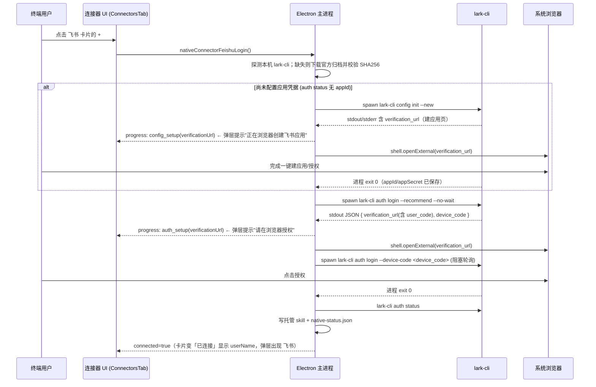

# Near 内置飞书连接器（基于飞书/Lark CLI `lark-cli`）

Planned-with: claude-opus-4.8

> 目标：Near 安装到**任意终端用户**机器后，用户在「连接器」里点飞书的加号（`+`），
> 通过一次「建应用（浏览器）+ 授权（浏览器）」即可让 Agent 通过官方飞书 CLI（`lark-cli`）
> 操作 消息 / 文档 / 多维表格 / 日历 / 任务 / 邮件 等。
> 复用现有 GitHub / 腾讯会议 native connector 范式，**不需要自建飞书 OAuth 服务**——
> 授权借 `lark-cli` 内置的 Device Flow，应用凭据由 `config init --new` 浏览器一键创建、`lark-cli` 本机保存。

---

## 背景与根因（写进正文，不依赖对话记忆）

### 现有 native connector 范式（GitHub 为最新样板，腾讯会议为初版样板）

端到端链路（证据文件 + 行号，均已核实于当前代码）：

1. **可用性白名单**：`desktop/electron/native-connectors-core.ts:22`
   ```ts
   const AVAILABLE_CONNECTOR_IDS = new Set(["tencent-meeting", "tapd", "github"]);
   ```
   `nativeConnectorAvailability(id)` 据此返回 `available` / `unavailable`；飞书当前不在集合，所以卡片无 `+`。

2. **二进制安装（本机优先 → 缺失则下载校验）**：`desktop/electron/main.ts`
   - `resolveGhBinaryPath()`（`main.ts:3515`）：先探测本机 `gh`（`which/where` + 常见路径 fallback），再查安装目录
   - `ensureGhBinaryInstalled()`（`main.ts:3623`）：`proxyAwareFetch` 下载固定版本归档 → 大小上限 → SHA256 校验 → 解包平台二进制到 `~/.agenticx/connectors/github/<ver>/`
   - 参考更早的腾讯会议：`resolveTmeetBinaryPath()`（`main.ts:2976`）、`installTmeetBinary()`（`main.ts:3008`）

3. **授权（一键开浏览器 + 进度事件）**：`startGithubLogin()`（`main.ts:3789`）
   - `spawn(binary, [...])` → `consume(chunk)` 持续读 stdout/stderr → 抓 URL/code → `shell.openExternal` → 推 `native-connector-github-progress`
   - `sendGithubProgress(phase, extra?)`（`main.ts:3778`）；超时 + 取消（`cancelActiveGithubLogin`）

4. **状态查询**：`getGithubStatus()`（`main.ts:3722`）→ `runGhCommand(["auth","status",...])` → `parseGithubAuthStatus()`（`native-connectors-core.ts:54`）

5. **能力暴露（关键）**：`ensureGithubSkill(binaryPath)`（`main.ts:3665`）
   - 连接成功后写 **Near 托管 skill** 到 `~/.agenticx/skills/near-connectors/github/SKILL.md`，`.near-managed` 标记
   - SKILL.md 用自然语言指导模型「用 `bash_exec` 调用该 CLI」；断开时删除
   - Agent 拿到能力靠 **CLI + 托管 skill**，不是自研 API

6. **状态落盘**：`persistGithubConnectorStatus()`（`main.ts:3336`）写 `~/.agenticx/connectors/native-status.json`

7. **IPC**：`main.ts:5198`（`native-connector-status`）、`5246`（`github-login`）、`5260`（`github-cancel`）、`5278`（`github-logout`）；`preload.ts` 与 `global.d.ts` 有对应声明与进度订阅 `onNativeConnectorGithubProgress`

8. **前端**：
   - 弹层 `desktop/src/components/connectors/ConnectorsMenuButton.tsx`（`githubConnected` / `refreshGithub` / `handleConnectClick` github 分支 `goToSettings()`）
   - 设置页 `desktop/src/components/settings/connectors/ConnectorsTab.tsx`（`selected?.id === "github"` 的 Modal + `onNativeConnectorGithubProgress` 订阅 + 取消按钮常开）
   - 目录 `desktop/src/components/settings/connectors/connector-catalog.ts`（**当前无 feishu 条目**，需新增）

### 飞书 CLI 关键事实（来源：官方 README + larksuite/cli 源码，已核实）

- **可执行名**：`lark-cli`（Windows 为 `lark-cli.exe`）。
- **发行物（可直下，无需 npm）**：goreleaser 产出 GitHub Releases 归档，命名
  `lark-cli-{version}-{os}-{arch}.tar.gz`（Windows 为 `.zip`），随附 `checksums.txt`（SHA256）。
  - `os ∈ {darwin, linux, windows}`，`arch ∈ {amd64, arm64}`。
  - `npm install -g @larksuite/cli` 的 postinstall 也是从同一处下同名归档——所以 Near 直下归档等价、且更稳（不依赖用户 npm）。
- **两段式授权（与 GitHub 单段最大差异）**：
  - **第一段 应用凭据**：`lark-cli config init --new`
    - 走浏览器一键创建/绑定飞书应用；**阻塞轮询**直至用户在浏览器完成，随后保存 `appId/appSecret` 并退出。
    - stdout 输出 JSON（成功后含 `{"appId":"cli_xxx","appSecret":"****","brand":"feishu"}`）；过程含 `verification_url`（引导用户打开的授权/建应用页）。
  - **第二段 用户 OAuth**：`lark-cli auth login --recommend --no-wait`
    - 立即打印 JSON 到 stdout：`{ "verification_url": "https://.../verify?user_code=XXXX-XXXX", "device_code": "...", "expires_in": 1800, "hint": "..." }` 后退出（不阻塞）。
    - `verification_url` **已内嵌 user_code**，用户点开即可授权，**无需手动粘贴一次性码**（比 GitHub 顺）。
    - 续轮询：`lark-cli auth login --device-code <DEVICE_CODE>`，阻塞直到授权完成/超时。
    - `--recommend` 只申请推荐（可自动通过）scope。
- **状态**：`lark-cli auth status` → JSON。
  - 已登录：`{ "identity":"user", "userName":"...", "tokenStatus":"valid", "appId":"cli_xxx", ... }`
  - 未登录（已配置应用）：`{ "identity":"bot", "appId":"cli_xxx", "note":"No user logged in..." }`
  - 未配置应用：无 `appId`（或命令报错 / 提示先 `config init`）。
- **登出**：`lark-cli auth logout`（清 keychain 凭据，成功打印 `Logged out` 到 stderr）。

> **对用户问题的直接回答**：是的，飞书 CLI 完全可以像 GitHub CLI 一样包装成 native connector（和 `github`、`tencent-meeting` 同级）。
> 但有一处**不可回避的额外步骤**：因为飞书应用按租户/企业隔离，Near 无法像 gh 那样内置一个通用 OAuth App，
> 所以每个用户首次连接要多走一次「浏览器建应用（`config init --new`）」。好在这是官方支持的一键流程，Near 只需
> 「探测/下载 `lark-cli` → 顺序驱动两段 Device Flow → 各自开浏览器 → 写托管 skill」。

---

## 终端用户视角：点 `+` 之后发生什么（目标行为）



失败 / 未装 lark-cli / 超时 / 取消 → 明确 toast 或弹层内错误文案，卡片回到未连接；`config init` 与 `auth login` 任一段失败都要能取消并终止子进程。

---

## Suggested-Impl-Model（子规划 → 推荐模型）

| 子任务 | 推荐模型 | 理由 |
|---|---|---|
| S1 core 纯函数 + 单测（JSON 解析 / 白名单 / URL 校验 / 连接 ID） | `kimi-k2.7-code` 或 `glm-5.2-max` | 纯逻辑 + TDD，便宜够用 |
| S2 主进程 lark-cli 安装 / 两段 Device Flow / 状态 / skill / IPC | `gpt-5.3-codex` | 后端接线、子进程状态机（两段串联）、文件系统，跨栈风险中高 |
| S3 preload + global.d.ts 类型 | `kimi-k2.7-code` | 样板声明 |
| S4 前端 ConnectorsTab / MenuButton 两段进度 Modal + 目录/图标 | `gpt-5.6-terra-medium` 或 `claude-4.6-sonnet` | 需交互状态机与视觉一致性 |

整体若单模型实施，建议 `gpt-5.3-codex`（S2 的两段状态机是主要风险面）。

---

## In scope

- 新增 `feishu` native connector（与 `github`、`tencent-meeting` 同级）。
- 安装：复用 gh 范式——本机优先（`which/where lark-cli` + 常见路径），缺失则从 GitHub Releases 下固定版本归档并 SHA256 校验。
- 授权：主进程串联两段 Device Flow（`config init --new` 仅在未配置应用时执行；随后 `auth login --recommend --no-wait` → `auth login --device-code`）。
- 状态：`auth status` JSON 解析（区分 未配置 / 已配置未登录 / 已登录）。
- 能力暴露：连接成功后写 `~/.agenticx/skills/near-connectors/feishu/SKILL.md` 托管 skill，指导 Agent 用 `lark-cli`（三层：`+shortcuts` / api commands / `api` raw + `schema` 自省）。
- 断开：`lark-cli auth logout` + 删除托管 skill + 状态回写 false。
- 取消：连接过程中可取消并终止当前 `lark-cli` 子进程（复用 github `cancelActive*Login` 范式）。

## Out of scope（no-scope-creep）

- **不**改 GitHub / 腾讯会议 / TAPD 现有逻辑（仅在白名单、IPC 注册、前端 switch/目录处**新增** feishu 分支/条目，禁止重构相邻代码）。
- **不**自研飞书 OAuth 服务、**不**内置 Near 自己的飞书 appId/appSecret（应用按租户隔离，无法通用）。
- **不**安装官方 26 个 `lark-*` skills（它们落在 `~/.agents/skills`，而 Near 默认关闭该扫描根；本期用单一 Near 托管 umbrella skill 覆盖，官方 skills 作为未来增强）。
- **不**接飞书 MCP / gateway 长连接（那是既有 `agenticx/gateway/feishu_longconn.py` 的独立能力，与本连接器无关，不得触碰）。
- **不**改 enterprise/ 任何代码、**不**触碰 `agenticx/studio/server.py`。
- **不**做 Lark 国际版 UI 分叉（`brand` 由 `config init` 自动判定，单连接器覆盖 feishu/lark）。

---

## 功能需求与验收

### FR-1：core 纯函数（可用性 + lark-cli JSON 输出解析）

**落点**：`desktop/electron/native-connectors-core.ts`

- 修改 `AVAILABLE_CONNECTOR_IDS`（`:22`）→ 增加 `"feishu"`：
  ```ts
  const AVAILABLE_CONNECTOR_IDS = new Set(["tencent-meeting", "tapd", "github", "feishu"]);
  ```
- 新增类型与导出函数（供主进程与单测复用）：
  ```ts
  export type FeishuAuthStatus = {
    configured: boolean; // 是否已配置应用凭据（存在 appId）
    connected: boolean;  // 是否已完成用户 OAuth（identity === "user"）
    account?: string;    // userName
    label: string;
    error?: string;
  };

  // 从混合输出（stderr 日志 + stdout JSON 交织）里抓最后一个平衡花括号 JSON 对象
  export function extractLastJsonObject(output: string): Record<string, unknown> | null {
    // 从末尾向前找 '}'，再用括号计数向前配平 '{'，逐个尝试 JSON.parse，成功即返回
    // 需忽略字符串内的花括号（遇到未转义的引号切换 inString 状态）
    // 实施：从右向左扫描，维护 depth；depth 归零处得到候选子串，JSON.parse 成功则返回，否则继续更靠前的 '}'
    ...
  }

  // lark-cli auth status（JSON）解析
  export function parseFeishuAuthStatus(output: string): FeishuAuthStatus {
    const json = extractLastJsonObject(output);
    if (!json) return { configured: false, connected: false, label: "可用" };
    const appId = typeof json.appId === "string" ? json.appId : undefined;
    const configured = Boolean(appId);
    if (json.identity === "user" && typeof json.userName === "string") {
      return { configured, connected: true, account: json.userName as string, label: "已连接" };
    }
    return { configured, connected: false, label: configured ? "待登录" : "可用" };
  }

  // 校验飞书/Lark 授权域名白名单（config init / auth login 的 verification_url）
  const FEISHU_VERIFY_HOST_SUFFIXES = [
    ".feishu.cn", ".feishu.com", ".larksuite.com", ".larkoffice.com",
  ];
  function isFeishuVerifyUrl(raw: string): boolean {
    try {
      const url = new URL(raw);
      if (url.protocol !== "https:") return false;
      const host = url.hostname.toLowerCase();
      return FEISHU_VERIFY_HOST_SUFFIXES.some((s) => host === s.slice(1) || host.endsWith(s));
    } catch {
      return false;
    }
  }

  // 从 config init --new / auth login --no-wait 的 JSON 抓 Device Flow 信息
  export function extractFeishuDeviceFlow(
    output: string,
  ): { verificationUrl: string; deviceCode?: string } | null {
    const json = extractLastJsonObject(output);
    if (!json) return null;
    const url = typeof json.verification_url === "string" ? json.verification_url : undefined;
    if (!url || !isFeishuVerifyUrl(url)) return null;
    const deviceCode = typeof json.device_code === "string" ? json.device_code : undefined;
    return { verificationUrl: url, deviceCode };
  }
  ```
- `resolveConnectedConnectorIds`（`native-connectors-core.ts:164`）扩展签名，追加 feishu（保持既有参数与默认值，**不破坏 github 调用点**）：
  ```ts
  export function resolveConnectedConnectorIds(
    tmeetConnected: boolean,
    mcpServers: Array<{ name: string; connected: boolean }>,
    githubConnected = false,
    feishuConnected = false,
  ): Array<"tencent-meeting" | "tapd" | "github" | "feishu"> {
    const ids: Array<"tencent-meeting" | "tapd" | "github" | "feishu"> = [];
    if (tmeetConnected) ids.push("tencent-meeting");
    if (mcpServers.some((s) => s.name === "tapd" && s.connected)) ids.push("tapd");
    if (githubConnected) ids.push("github");
    if (feishuConnected) ids.push("feishu");
    return ids;
  }
  ```
  > 第四参带默认值 `false`，保证既有调用点（`ConnectorsMenuButton.tsx` 的 `resolveConnectedConnectorIds(tmeet, mcp, github)`）不破坏。

**AC-1**：`desktop/tests/native-connectors-core.test.ts` 新增用例并 `cd desktop && npx vitest run tests/native-connectors-core.test.ts` 全绿：
- `nativeConnectorAvailability("feishu")` → `"available"`
- `parseFeishuAuthStatus('{"identity":"user","userName":"张三","appId":"cli_x","tokenStatus":"valid"}')` → `{configured:true, connected:true, account:"张三", label:"已连接"}`
- `parseFeishuAuthStatus('{"identity":"bot","appId":"cli_x","note":"No user logged in..."}')` → `{configured:true, connected:false, label:"待登录"}`
- `parseFeishuAuthStatus("garbage no json")` → `{configured:false, connected:false, label:"可用"}`
- `parseFeishuAuthStatus('INFO booting\n{"identity":"user","userName":"李四","appId":"cli_y"}')`（前缀日志）→ `connected:true, account:"李四"`（验证 `extractLastJsonObject` 能跳过前缀日志）
- `extractFeishuDeviceFlow('{"verification_url":"https://accounts.feishu.cn/verify?user_code=ABCD-1234","device_code":"dc_1","expires_in":1800}')` → `{verificationUrl:"https://accounts.feishu.cn/verify?user_code=ABCD-1234", deviceCode:"dc_1"}`
- `extractFeishuDeviceFlow('{"verification_url":"https://evil.com/verify?user_code=x"}')` → `null`（域名白名单）
- `extractFeishuDeviceFlow('{"appId":"cli_x","brand":"feishu"}')` → `null`（config init 成功态无 verification_url）
- `resolveConnectedConnectorIds(false, [], false, true)` → `["feishu"]`
- `resolveConnectedConnectorIds(false, [], true, true)` → `["github","feishu"]`

---

### FR-2：主进程 lark-cli 安装（优先复用本机，缺失则下载校验）

**落点**：`desktop/electron/main.ts`（新增独立段落，紧邻 GitHub 函数之后；**不得改动 gh / tmeet 函数体**）

- 常量（固定一个 `lark-cli` 版本，便于 checksum 校验；实施时取当时稳定版并同步 checksums）：
  ```ts
  const LARK_CLI_VERSION = "1.0.68"; // 实施时取 https://github.com/larksuite/cli/releases 当时稳定版
  const LARK_CLI_RELEASE_BASE = `https://github.com/larksuite/cli/releases/download/v${LARK_CLI_VERSION}`;
  const LARK_CLI_ARCHIVE_MAX_BYTES = 60 * 1024 * 1024; // lark-cli 归档较 gh 大，留足余量
  ```
- `resolveSystemLarkCliPath(): string | null`：**先探测本机 lark-cli**（对齐仓库「stdio 子进程健壮解析可执行路径」既有记忆，参考 `resolveGhBinaryPath` `main.ts:3515` 的 which/where + fallback 写法）：
  - `which lark-cli`（POSIX）/ `where lark-cli`（Windows）；再拆 `process.env.PATH` 兜底
  - 常见位置 fallback：`/opt/homebrew/bin/lark-cli`、`/usr/local/bin/lark-cli`、`/usr/bin/lark-cli`、
    npm 全局 bin（`~/.npm-global/bin/lark-cli`、`/usr/local/lib/node_modules/@larksuite/cli/...` 的 run.js 场景可忽略，直接认 PATH 里的 `lark-cli`）、
    Windows：`%APPDATA%\\npm\\lark-cli.cmd` / `lark-cli.exe`
  - 命中即返回（本机安装视为受信，不做 SHA 校验）。
  > 注意：本机 npm 装的 `lark-cli` 可能是 `run.js` 包装脚本（package.json 的 bin 指向 `scripts/run.js`），直接以 PATH 中的 `lark-cli` 名调用即可，无需定位内部真实二进制。
- `larkCliArchiveInfo()`：按 `process.platform`/`arch` 给出归档文件名与解包内可执行相对路径：
  | 平台 | 归档 | 可执行成员（实施时以归档实际结构为准） |
  |---|---|---|
  | darwin-arm64 | `lark-cli-${ver}-darwin-arm64.tar.gz` | `lark-cli`（或归档内子目录/lark-cli） |
  | darwin-x64 | `lark-cli-${ver}-darwin-amd64.tar.gz` | `lark-cli` |
  | linux-x64 | `lark-cli-${ver}-linux-amd64.tar.gz` | `lark-cli` |
  | linux-arm64 | `lark-cli-${ver}-linux-arm64.tar.gz` | `lark-cli` |
  | win32-x64 | `lark-cli-${ver}-windows-amd64.zip` | `lark-cli.exe` |
  | win32-arm64 | `lark-cli-${ver}-windows-arm64.zip` | `lark-cli.exe` |
  未命中平台抛「当前平台暂不支持飞书连接器」。
  > goreleaser 归档内是否含子目录需实施时下载一个归档核对（gh 归档含 `bin/gh`，lark-cli 可能是顶层 `lark-cli`）；解包函数须按实际成员路径提取，不得臆测。
- `larkCliArchiveSha256()`：内置各归档 SHA256（实施时从 release 的 `checksums.txt` 拷入，仿 `ghArchiveSha256`）。
- `installLarkCliBinary()` / `ensureLarkCliBinaryInstalled()`：仿 `installGhBinary` / `ensureGhBinaryInstalled`（`main.ts:3623`）：
  - 安装目录 `~/.agenticx/connectors/feishu/<ver>/`
  - `proxyAwareFetch` 下载 → 大小上限 → SHA256 校验归档 → 解包（`.zip` / `.tar.gz` 复用现有 `extractGithubArchive`/`extractTar` 能力）→ 提取可执行 → chmod 0755（非 win）
  - `resolveLarkCliBinaryPath()`：先 `resolveSystemLarkCliPath()`，再查安装目录并校验。

> 版本与 checksum 是硬编码事实，实施者必须以 `LARK_CLI_VERSION` 对应的官方 `checksums.txt` 为准填写，禁止编造。

**AC-2**：本机装有 `lark-cli` 时冷启动 Near 后 `resolveLarkCliBinaryPath()` 返回本机路径（可加临时日志验证）；本机无 `lark-cli` 时点连接触发下载且 SHA256 校验通过、解包出可执行并 `--version` 可运行。

---

### FR-3：主进程两段 Device Flow 授权 + 状态 + 托管 skill

**落点**：`desktop/electron/main.ts`

- 进度事件通道 `native-connector-feishu-progress`，phase 枚举：
  `"installing" | "config_setup" | "config_done" | "auth_setup" | "waiting" | "success" | "disconnected" | "error"`；
  `config_setup` / `auth_setup` 额外携带 `verificationUrl: string`。新增 `sendFeishuProgress(phase, extra?)`（仿 `sendGithubProgress` `main.ts:3778`）。
- 新增模块级状态（仿 github 的 `githubAuthProcess/githubAuthBusy/cancelActiveGithubLogin`）：
  `feishuAuthProcess`、`feishuAuthBusy`、`feishuInstallPromise`、`cancelActiveFeishuLogin`。
- `startFeishuLogin(): Promise<NativeConnectorStatusResult>`（两段状态机，仿 `startGithubLogin` `main.ts:3789`）：
  1. `sendFeishuProgress("installing")` → `ensureLarkCliBinaryInstalled()` 得 `binary`。
  2. 读一次 `getFeishuStatus()`：
     - 若 `configured === false` → **第一段**：`spawnFeishuPhase(binary, ["config","init","--new"], "config_setup")`
       - `consume`：`extractFeishuDeviceFlow(chunk)` 抓到 `verificationUrl` 且未开过 → `shell.openExternal(url)` + `sendFeishuProgress("config_setup",{verificationUrl})`
       - 该命令阻塞至用户完成；`exit 0` → `sendFeishuProgress("config_done")`；非 0 → 抛错进入 error 收敛。
     - 若已 `configured` → 跳过第一段。
  3. **第二段（用户 OAuth）**：
     - `runLarkCliCollect(binary, ["auth","login","--recommend","--no-wait"])` 抓一次性 JSON → `extractFeishuDeviceFlow` 得 `{verificationUrl, deviceCode}`。
     - `shell.openExternal(verificationUrl)` + `sendFeishuProgress("auth_setup",{verificationUrl})`。
     - `spawnFeishuPhase(binary, ["auth","login","--device-code", deviceCode], "waiting")` 阻塞轮询直至授权/超时；`exit 0` → 进入成功收敛。
  4. 成功收敛：`getFeishuStatus()` 回读 → `connected` → `ensureFeishuSkill(binary)` + `persistFeishuConnectorStatus(true)` → `sendFeishuProgress("success")`。
  - 全流程超时（建议每段各 5 分钟）、`cancelActiveFeishuLogin(reason)` 可在任一段终止当前子进程并以「已取消」收敛。
  - `spawn` 环境：`env:{ ...process.env, NO_COLOR:"1" }`；stdin 保持 pipe（若某段提示按 Enter 打开浏览器，写 `"\n"` 放行——以实测输出为准，AC-3 要求贴真实 stdout）。为让 Near 掌控开浏览器，可尝试设不可执行的 `BROWSER` 占位；若该版本 lark-cli 仍自动开浏览器，则退化为「lark-cli 自己开 + Near 仍展示 verificationUrl」，体验可接受。
- `getFeishuStatus(): Promise<NativeConnectorStatusResult>`（仿 `getGithubStatus` `main.ts:3722`）：
  - `resolveLarkCliBinaryPath()`；无则 `{ok:true,available:true,connected:false,label:"可用"}`
  - `runLarkCliCommand(["auth","status"])` → `parseFeishuAuthStatus`
  - 已连接 → `ensureFeishuSkill(binaryPath)` 且 `persistFeishuConnectorStatus(true)`；未连接 → `removeFeishuSkill()` 且 `persistFeishuConnectorStatus(false)`
  - 结果附 `account`（userName）供前端展示；`NativeConnectorStatusResult` 已有可选 `account` 字段（github 已扩展，复用不改类型）。
- `runLarkCliCommand(args, timeoutMs=15000)` / `runLarkCliCollect(...)`（仿 `runGhCommand`：`execFile`，注入 `NO_COLOR:"1"`；`auth status` 未登录/未配置可能非 0 退出码，须像 gh 一样即使非 0 也返回 stdout 供解析）。
- `ensureFeishuSkill(binaryPath)` / `removeFeishuSkill()`（仿 `ensureGithubSkill` `main.ts:3665`）：
  - skill 目录 `~/.agenticx/skills/near-connectors/feishu/`，`.near-managed` 标记，复用 `assertManagedSkillDirectory`
  - SKILL.md 内容（Near 托管 umbrella skill）：
    ```markdown
    ---
    name: feishu
    description: 使用飞书官方 CLI (lark-cli) 操作消息、文档、多维表格、日历、任务、邮件等飞书能力。
    ---

    # 飞书 (Lark)

    仅在用户要求操作飞书/Lark 时使用。通过 bash_exec 调用官方 CLI（本机已登录）：

    ```bash
    "<larkBinary>" <service> --help          # 发现某业务域的快捷命令，如 im/docs/base/calendar/task/mail
    "<larkBinary>" <service> +<shortcut> ...  # 人/AI 友好的快捷命令（带智能默认与表格输出）
    "<larkBinary>" schema <method>            # 自省某 API 的参数/请求体/返回结构/所需 scope
    "<larkBinary>" api GET|POST <endpoint>    # 需要原始 OpenAPI 时
    ```

    读取类命令（+agenda、+messages 查询、list/view/status/search、auth status）可直接执行；
    写操作（发消息、建/改文档、建/删记录、发邮件、任务创建/完成、审批处理等）必须先向用户展示参数、
    优先用 `--dry-run` 预览并确认后再执行。默认输出 `--format json`，判断成功以返回体 `ok === true`（或退出码）为准。
    不得输出或读取 lark-cli 本地凭证。若提示未登录/未配置，引导用户前往「设置 → 连接器 → 飞书」重新连接。
    ```
    （`<larkBinary>` 用与 gh/tmeet 相同的转义方式写入实际路径。）
- 登出 handler：`lark-cli auth logout`（若询问确认需传 stdin `"\n"` 或加 `-y`，以实测为准）+ `removeFeishuSkill()` + `persistFeishuConnectorStatus(false)` + progress `disconnected`。
- 状态落盘：`persistFeishuConnectorStatus(connected)`（仿 `persistGithubConnectorStatus` `main.ts:3336`）——`native-status.json` 的 `connectors.feishu = { connected, capability:"skill", skill_name:"feishu", updated_at }`；**仅新增 feishu 键，不动其他连接器键**。

**AC-3**：实施者本机执行一次真实连接：
1. 未配置状态下点 `+` → 弹层依次经「安装（如需）→ 建应用（浏览器打开建应用页）→ 授权（浏览器打开授权页）→ 已连接」；
2. 完成后弹层变「已连接」并显示 userName，`~/.agenticx/skills/near-connectors/feishu/SKILL.md` 生成，`native-status.json` 的 `connectors.feishu.connected=true` 且其他连接器键不受影响；
3. 断开后 skill 删除、状态回 false；
4. 已配置过应用的用户再次连接时**跳过第一段**，直接进入用户授权段。
（因 lark-cli 输出随版本波动，AC-3 要求贴出本地真实 stdout JSON 片段佐证 `extractFeishuDeviceFlow` / `parseFeishuAuthStatus` 命中。）

---

### FR-4：IPC + preload + 类型

**落点**：`main.ts`（`5198` 起 IPC 区）、`preload.ts`（github IPC 附近）、`global.d.ts`（github 声明附近）

- `main.ts`：
  - `native-connector-status` handler（`main.ts:5198`）：新增 `if (id === "feishu") return await getFeishuStatus();`（在现有 tencent-meeting/tapd/github 分支旁**新增**，不改旧分支）
  - 新增 `ipcMain.handle("native-connector-feishu-login", …)`（try/catch 包 `startFeishuLogin`，仿 `5246`）
  - 新增 `ipcMain.handle("native-connector-feishu-cancel", …)`（仿 `5260`：优先 `cancelActiveFeishuLogin("已取消")`，否则 kill `feishuAuthProcess` 并推 `disconnected`）
  - 新增 `ipcMain.handle("native-connector-feishu-logout", …)`（仿 `5278`）
- `preload.ts`（github 段之后追加，勿整段替换相邻行）：
  ```ts
  nativeConnectorFeishuLogin: async () => ipcRenderer.invoke("native-connector-feishu-login"),
  nativeConnectorFeishuLogout: async () => ipcRenderer.invoke("native-connector-feishu-logout"),
  nativeConnectorFeishuCancel: async () => ipcRenderer.invoke("native-connector-feishu-cancel"),
  onNativeConnectorFeishuProgress: (
    callback: (payload: { phase: string; verificationUrl?: string }) => void,
  ) => {
    const handler = (_e: unknown, payload: { phase: string; verificationUrl?: string }) =>
      callback(payload);
    ipcRenderer.on("native-connector-feishu-progress", handler);
    return () => ipcRenderer.removeListener("native-connector-feishu-progress", handler);
  },
  ```
- `global.d.ts`（github 声明附近追加）：
  ```ts
  nativeConnectorFeishuLogin: () => Promise<{ ok: boolean; available: boolean; connected: boolean; label: string; error?: string; account?: string }>;
  nativeConnectorFeishuLogout: () => Promise<{ ok: boolean; available: boolean; connected: boolean; label: string; error?: string; account?: string }>;
  nativeConnectorFeishuCancel: () => Promise<{ ok: boolean; available: boolean; connected: boolean; label: string; error?: string }>;
  onNativeConnectorFeishuProgress: (
    callback: (payload: {
      phase: "installing" | "config_setup" | "config_done" | "auth_setup" | "waiting" | "success" | "disconnected" | "error";
      verificationUrl?: string;
    }) => void,
  ) => () => void;
  ```

**AC-4**：`cd desktop && npm run typecheck`（或 `npx tsc --noEmit`）绿；主进程重编译进 `dist-electron/` 后**完全重启** `npm run dev`（渲染热更新不加载新 IPC handler，此为既有工程约束）。

---

### FR-5：前端（目录 + 图标 + 设置页两段 Modal + 弹层）

**落点 A**：`desktop/src/components/settings/connectors/connector-catalog.ts`
- `ConnectorId` union（`:12`）增加 `"feishu"`。
- 新增图标资源 `desktop/src/assets/connectors/feishu.svg`（飞书官方 logo，风格与既有 svg 一致），并 `import feishuIcon from "../../../assets/connectors/feishu.svg";`
- `CONNECTORS` 数组（`:41`）在 github 之后新增：
  ```ts
  { id: "feishu", name: "飞书", description: "消息、文档、多维表格、日历与任务", iconSrc: feishuIcon },
  ```

**落点 B**：`desktop/src/components/settings/connectors/ConnectorsTab.tsx`（仿 github 分支）
- 新增 state：`feishuStatus`（`{available:true,connected:false,label:"可用",account?,configured?}`）、`feishuBusy`、`feishuPhase`（进度文案）、`feishuVerifyUrl`。
- `connectorState(item)` 为 feishu 增加分支（`connected`/`busy` 取自 `feishuStatus.connected`/`feishuBusy`；`available` = `nativeConnectorAvailability("feishu")==="available"`）。
- `refreshFeishuStatus()` 调 `nativeConnectorStatus("feishu")` 初始化；`useEffect` 订阅 `onNativeConnectorFeishuProgress`，phase → 中文文案映射：
  ```ts
  installing: "首次使用，正在下载飞书 CLI…",
  config_setup: "正在浏览器创建飞书应用，请在打开的页面完成…",
  config_done: "应用已就绪，正在发起用户授权…",
  auth_setup: "已打开授权页面，请在浏览器中确认授权…",
  waiting: "等待你在浏览器中完成授权…",
  success: "授权成功",
  disconnected: "已断开连接",
  error: "连接未完成",
  ```
  `verificationUrl` 存入 `feishuVerifyUrl`；`success/disconnected/error` 时 `refreshFeishuStatus()`。
- `openConnector(item)`：feishu 重置 `feishuPhase`/`feishuVerifyUrl` 后 `setSelectedId("feishu")`。
- `handleFeishuConnect` / `handleFeishuLogout` / `handleFeishuCancel`（仿 github 三个 handler）。
- 新增 Feishu Modal（`selected?.id === "feishu"`，仿 github Modal）：
  - 未连接：主按钮「连接飞书」→ `nativeConnectorFeishuLogin()`；进度期展示 `feishuPhase` 文案 + 转圈；若有 `feishuVerifyUrl` 提供「打开授权页」按钮 + 复制链接（作为浏览器未自动打开的兜底）；首次连接文案额外提示「首次使用需在浏览器创建一个飞书应用（一次性）」。
  - 已连接：显示 `feishuStatus.account`（userName）+「断开连接」→ `nativeConnectorFeishuLogout()`。
  - 「取消」按钮**始终可点**（`onClick={() => void handleFeishuCancel()}`，`onClose` 亦走取消），修复过 github「连接中无法取消」的同类问题必须在 feishu 一并保证。
- 卡片状态点/图标沿用既有规则（绿点=已连接、`>`=管理、`+`=连接）。

**落点 C**：`desktop/src/components/connectors/ConnectorsMenuButton.tsx`（仿 github）
- `NativeId` union 增加 `"feishu"`；新增 `feishuConnected` state + `refreshFeishu()`（调 `nativeConnectorStatus("feishu")`）。
- `connectedIds` `useMemo`：把 `feishuConnected` 作为第四参传入 `resolveConnectedConnectorIds(tmeet, mcp, github, feishu)`（依赖数组补 `feishuConnected`）。
- `isConnectorConnected`：新增 `if (id === "feishu") return feishuConnected;`
- `handleConnectClick`：feishu 分支 `goToSettings()`（两段 Device Flow 需在设置页 Modal 完成，弹层保持轻量，与 github 一致）。
- `handleToggle`：feishu 断开走 `nativeConnectorFeishuLogout()`（不在弹层内联登录）。

**AC-5**：设置页出现「飞书」卡片可点 `+`；点击后 Modal 依次显示「下载(如需)→建应用→授权」进度并自动开浏览器（浏览器未开时可用 Modal 内按钮兜底打开）；授权后卡片变「已连接」并显示 userName；弹层（ConnectorsMenuButton）在已连接后出现「飞书」项且可断开；连接过程中「取消」可中止。

---

## 测试与验收命令

```bash
# S1 纯函数
cd desktop && npx vitest run tests/native-connectors-core.test.ts
# 类型
cd desktop && npm run typecheck   # 或 npx tsc --noEmit
# 主进程改动后必须完全重启
# Ctrl+C 后重新 npm run dev（不可只刷新渲染进程，新 IPC handler 才会加载）
```

人工验收：FR-3 AC-3 的真实两段连接 + FR-5 AC-5 的 UI 流程截图/日志（贴 lark-cli 真实 stdout JSON 佐证解析命中）。

---

## 风险与备注

- **两段式首次连接**：`config init --new` 是一次性建应用，用户需在浏览器多点一步；文案必须说清「首次一次性、后续直接授权」，否则用户会困惑「为何又要建应用」。已配置用户须跳过第一段（靠 `parseFeishuAuthStatus.configured` 判定）。
- **lark-cli 输出格式随版本变化**：解析走 JSON（`extractLastJsonObject` 容忍 stderr 日志前缀），比 gh 正则稳；但仍须以固定 `LARK_CLI_VERSION` 实测输出校准并写进单测。
- **归档内成员路径**：goreleaser 归档结构（是否含子目录、可执行是否在顶层）须实施时下载一个归档核对，解包按实际成员提取，禁止臆测。
- **自动开浏览器抢占**：不同 lark-cli 版本可能自动开浏览器；若无法抑制则退化为「lark-cli 自己开 + Near 仍展示 verificationUrl」，plan 不强依赖抑制成功。
- **企业网络/代理**：下载 lark-cli 走 `proxyAwareFetch`（已支持代理）；本机已装 lark-cli 时无需下载，最稳。
- **Windows**：`lark-cli.exe` / `where lark-cli` / npm 全局 `.cmd` 包装须覆盖（对齐仓库 `bash_exec` WinError 2 教训，健壮解析可执行路径）。
- **与飞书网关能力互不干扰**：本连接器只写托管 skill + 本机 `lark-cli` 凭据，**不**触碰 `agenticx/gateway/feishu_longconn.py`、`~/.agenticx/feishu_binding.json` 等既有飞书长连接/绑定链路。
- **no-scope-creep**：所有改动仅以「新增 feishu 分支/函数/条目」形式加入，禁止重构 github/腾讯会议/TAPD 既有代码；`native-status.json` 只增 `feishu` 键。

---

## Traceability

- Plan-Id: `2026-07-13-near-feishu-cli-connector`
- 关联既有 plan：`.cursor/plans/2026-07-13-near-github-cli-connector.plan.md`（GitHub CLI 范式，本 plan 直接对齐其结构）、`.cursor/plans/2026-07-11-near-native-connectors-mvp.plan.md`（腾讯会议/TAPD 初版范式）
- 参考：飞书/Lark CLI 官方仓库 https://github.com/larksuite/cli （README + goreleaser 发行 + Device Flow 授权）
