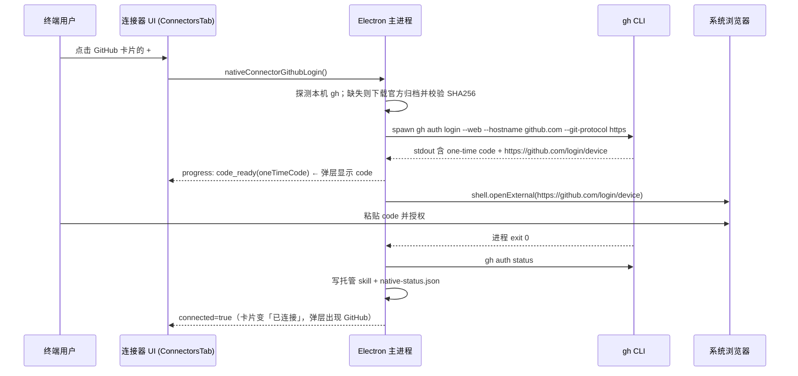

# Near 内置 GitHub 连接器（基于 GitHub CLI `gh`）

Planned-with: claude-opus-4.8

> 目标：Near 安装到**任意终端用户**机器后，用户在「连接器」里点 GitHub 的加号（`+`），
> 只需在浏览器完成一次 GitHub 授权，即可让 Agent 通过官方 GitHub CLic (`gh`) 操作仓库 / Issue / PR。
> 复用现有腾讯会议 native connector 范式，**不需要自建 GitHub OAuth App**（借用 `gh` 内置的 OAuth 应用做 Device Flow）。

---

## 背景与根因（写进正文，不依赖对话记忆）

### 现有 native connector 范式（腾讯会议为样板）

腾讯会议连接器的端到端链路（证据文件 + 行号）：

1. **可用性白名单**：`desktop/electron/native-connectors-core.ts:15`
   ```ts
   const AVAILABLE_CONNECTOR_IDS = new Set(["tencent-meeting", "tapd"]);
   ```
   `nativeConnectorAvailability(id)` 据此返回 `available` / `unavailable`；GitHub 当前是 `unavailable`，所以 `ConnectorsTab` 卡片没有 `+` 按钮。

2. **二进制安装**：`desktop/electron/main.ts`
   - `resolveTmeetBinaryPath()`（`main.ts:2961`）：定位并 SHA256 校验本机已装二进制
   - `installTmeetBinary()`（`main.ts:2993`）：`proxyAwareFetch` 下载固定版本 tarball → SHA512 校验 → 解包单个平台二进制到 `~/.agenticx/connectors/tencent-meeting/<ver>/`
   - `ensureTmeetBinaryInstalled()`（`main.ts:3040`）：去重的安装入口

3. **授权（一键开浏览器）**：`startTmeetLogin()`（`main.ts:3204`）
   - `spawn(binary, ["auth","login","--no-browser"])`
   - `consume()`（`main.ts:3242`）持续读 stdout/stderr，用 `extractAuthorizationUrl()`（`native-connectors-core.ts:35`）抓授权 URL
   - 抓到就 `shell.openExternal(url)` 并推 `native-connector-tmeet-progress` 进度（`installing→opening_browser→waiting→success/error`）
   - 5 分钟超时；`proc.on("exit")` 后回读 `getTmeetStatus()`

4. **状态查询**：`getTmeetStatus()`（`main.ts:3144`）→ `runTmeetCommand(["auth","status"])` → `parseTmeetAuthStatus()`（`native-connectors-core.ts:21`）

5. **能力暴露（关键）**：`ensureTmeetSkill(binaryPath)`（`main.ts:3088`）
   - 连接成功后写一个 **Near 托管 skill** 到 `~/.agenticx/skills/near-connectors/tencent-meeting/SKILL.md`，`.near-managed` 标记
   - SKILL.md 用自然语言指导模型「用 bash_exec 调用该 CLI」；断开时 `removeTmeetSkill()` 删除
   - 因此 Agent 拿到能力靠的是 **CLI + 托管 skill**，不是自研 API

6. **状态落盘**：`persistTmeetConnectorStatus()`（`main.ts:2873`）写 `~/.agenticx/connectors/native-status.json`

7. **IPC**：`main.ts:4562`（`native-connector-status`）、`4571`（`tmeet-login`）、`4585`（`tmeet-logout`）；
   `preload.ts:508-528`；类型在 `global.d.ts:958-987`

8. **前端**：
   - 弹层 `desktop/src/components/connectors/ConnectorsMenuButton.tsx`（`handleConnectClick`、`connectTencentMeeting`）
   - 设置页 `desktop/src/components/settings/connectors/ConnectorsTab.tsx`（`openConnector`、腾讯会议 Modal `selected?.id === "tencent-meeting"`）
   - 目录 `desktop/src/components/settings/connectors/connector-catalog.ts`（`github` 已有图标与文案，`id: "github"`）

### GitHub CLI 授权关键事实（来源：https://cli.github.com/manual/ ）

- `gh auth login` 默认是交互式 TUI，**不可直接 spawn 抓 URL**。
- **Device Flow（本 plan 主路线）**：`gh auth login --hostname github.com --git-protocol https --web` 走 OAuth Device Flow：
  - 终端输出一次性 **one-time code**（形如 `6C41-A1BC`）与设备验证页 `https://github.com/login/device`
  - 复用 `gh` 内置 OAuth App，**Near 无需注册 GitHub App / 无需 client secret**
  - 用户需：打开 device 页 → 粘贴 one-time code → 授权（比腾讯会议扫码多「粘贴 code」一步，仍是「一点开浏览器」）
- **PAT（兜底路线）**：`gh auth login --with-token`（从 stdin 读 token），等价 TAPD 的粘贴 Token 体验。
- 状态：`gh auth status`；登出：`gh auth logout --hostname github.com`。
- `gh` 官方发行（GitHub Releases，`cli/cli`）提供各平台归档 + `checksums.txt`（SHA256）。

> **对用户问题的直接回答**：是的，这属于「在 Near 里**自建一个内置连接器适配层**」（和 `tencent-meeting` 同级），
> 但**不需要自建 GitHub OAuth 服务/App**——授权借 `gh` 内置 OAuth（Device Flow）。用户机器上要「安装」的只有 `gh`
> 二进制（本机已装则复用，未装则 Near 自动下载校验）；要「配置」的只有一次浏览器授权，凭据由 `gh` 本机保存。

---

## 终端用户视角：点 `+` 之后发生什么（目标行为）



失败 / 未装 gh / 超时 / 取消 → 明确 toast 或弹层内错误文案，卡片回到未连接。

---

## Suggested-Impl-Model（子规划 → 推荐模型）

| 子任务 | 推荐模型 | 理由 |
|---|---|---|
| S1 core 纯函数 + 单测（正则/解析/白名单） | `kimi-k2.7-code` 或 `glm-5.2-max` | 纯逻辑 + TDD，便宜够用 |
| S2 主进程 gh 安装 / 授权 / 状态 / skill / IPC | `gpt-5.3-codex` | 后端接线、子进程与文件系统、跨栈风险中高 |
| S3 preload + global.d.ts 类型 | `kimi-k2.7-code` | 样板声明 |
| S4 前端 ConnectorsTab / MenuButton Device Flow Modal | `gpt-5.6-terra-medium` 或 `claude-4.6-sonnet` | 需交互状态机与视觉一致性 |

整体若单模型实施，建议 `gpt-5.3-codex`（S2 是主要风险面）。

---

## In scope

- 仅 `github.com`（公有云）Device Flow 为主、PAT 为兜底。
- 复用腾讯会议范式：core 纯函数、主进程安装/授权/状态/skill、IPC、preload、前端卡片与 Modal。
- 连接成功后写 `~/.agenticx/skills/near-connectors/github/SKILL.md` 托管 skill，指导 Agent 用 `gh`。
- 断开：`gh auth logout` + 删除托管 skill + 状态回写 false。

## Out of scope（no-scope-creep）

- **不**改腾讯会议 / TAPD 现有逻辑（仅在白名单、IPC 注册、前端 switch 分支处**新增** github 分支，禁止重构相邻代码）。
- **不**做 GitHub Enterprise Server（`--hostname` 自定义）——仅预留常量，不接 UI。
- **不**接 GitHub MCP（Docker 路线）；本期只走 `gh` CLI + 托管 skill。
- **不**改 enterprise/ 任何代码。
- **不**触碰 `agenticx/studio/server.py`。

---

## 功能需求与验收

### FR-1：core 纯函数（可用性 + gh 输出解析）

**落点**：`desktop/electron/native-connectors-core.ts`

- 修改 `AVAILABLE_CONNECTOR_IDS`（`:15`）→ 增加 `"github"`：
  ```ts
  const AVAILABLE_CONNECTOR_IDS = new Set(["tencent-meeting", "tapd", "github"]);
  ```
- 新增导出函数（供主进程与单测复用）：
  ```ts
  export type GithubAuthStatus = { connected: boolean; account?: string; label: string; error?: string };

  // gh auth status 解析
  //   已登录: "✓ Logged in to github.com account DemonDamon (keyring)"
  //   未登录: "You are not logged into any GitHub hosts."
  export function parseGithubAuthStatus(output: string): GithubAuthStatus {
    const loggedIn = output.match(/Logged in to [\w.-]+ account\s+([\w-]+)/i);
    if (loggedIn) return { connected: true, account: loggedIn[1], label: "已连接" };
    if (/not logged in(to| into)? any GitHub|not logged into/i.test(output)) {
      return { connected: false, label: "可用" };
    }
    return { connected: false, label: "状态异常", error: "无法识别 GitHub 登录状态" };
  }

  // 从 gh auth login --web 输出抓 Device Flow 一次性码，形如 6C41-A1BC / 1234-ABCD
  export function extractGithubDeviceCode(output: string): string | null {
    const m = output.match(/one-time code:\s*([A-Z0-9]{4}-[A-Z0-9]{4})/i);
    return m ? m[1].toUpperCase() : null;
  }

  // 抓设备验证 URL（固定 https://github.com/login/device，允许尾随 query）
  export function extractGithubDeviceUrl(output: string): string | null {
    const m = output.match(/https:\/\/github\.com\/login\/device[^\s"'<>]*/i);
    if (!m) return null;
    try {
      const url = new URL(m[0]);
      if (url.protocol !== "https:" || url.hostname !== "github.com") return null;
      if (!url.pathname.startsWith("/login/device")) return null;
      return url.toString();
    } catch {
      return null;
    }
  }
  ```
- `resolveConnectedConnectorIds`（`native-connectors-core.ts:124` 附近）扩展签名，追加 github：
  ```ts
  export function resolveConnectedConnectorIds(
    tmeetConnected: boolean,
    mcpServers: Array<{ name: string; connected: boolean }>,
    githubConnected = false,
  ): Array<"tencent-meeting" | "tapd" | "github"> {
    const ids: Array<"tencent-meeting" | "tapd" | "github"> = [];
    if (tmeetConnected) ids.push("tencent-meeting");
    if (mcpServers.some((s) => s.name === "tapd" && s.connected)) ids.push("tapd");
    if (githubConnected) ids.push("github");
    return ids;
  }
  ```
  > 新增参数带默认值 `false`，保证既有调用点（`ConnectorsMenuButton.tsx:112`）不破坏。

**AC-1**：`desktop/tests/native-connectors-core.test.ts` 新增用例并 `npx vitest run tests/native-connectors-core.test.ts` 全绿：
- `parseGithubAuthStatus("✓ Logged in to github.com account DemonDamon (keyring)")` → `{connected:true, account:"DemonDamon", label:"已连接"}`
- `parseGithubAuthStatus("You are not logged into any GitHub hosts.")` → `{connected:false, label:"可用"}`
- `parseGithubAuthStatus("garbage")` → `error` 非空
- `extractGithubDeviceCode("! First copy your one-time code: 6C41-A1BC")` → `"6C41-A1BC"`
- `extractGithubDeviceUrl("Open https://github.com/login/device in your browser")` → `"https://github.com/login/device"`
- `extractGithubDeviceUrl("https://evil.com/login/device")` → `null`
- `nativeConnectorAvailability("github")` → `"available"`
- `resolveConnectedConnectorIds(false, [], true)` → `["github"]`

---

### FR-2：主进程 gh 安装（优先复用本机，缺失则下载校验）

**落点**：`desktop/electron/main.ts`（新增独立段落，紧邻腾讯会议函数之后，如 `main.ts:3316` 之前；**不得改动腾讯会议函数体**）

- 常量（固定一个 `gh` 版本，便于 checksum 校验）：
  ```ts
  const GH_CLI_VERSION = "2.63.2"; // 实施时取当时稳定版，并同步下方 checksums
  const GH_RELEASE_BASE = `https://github.com/cli/cli/releases/download/v${GH_CLI_VERSION}`;
  const GH_ARCHIVE_MAX_BYTES = 40 * 1024 * 1024;
  ```
- `resolveSystemGhPath(): string | null`：**先探测本机 gh**（符合仓库对「stdio 子进程健壮解析可执行路径」的既有记忆）：
  - `which gh` / `where gh`（子进程或 `process.env.PATH` 拆分）
  - 常见位置 fallback：`/opt/homebrew/bin/gh`、`/usr/local/bin/gh`、`/usr/bin/gh`、
    `C:\\Program Files\\GitHub CLI\\gh.exe`
  - 命中即返回（本机 gh 不做 SHA 校验，视为受信）。
- `ghArchiveInfo()`：按 `process.platform`/`arch` 给出归档文件名与解包内 `gh` 相对路径：
  | 平台 | 归档 | 二进制成员 |
  |---|---|---|
  | darwin-arm64 | `gh_${ver}_macOS_arm64.zip` | `gh_${ver}_macOS_arm64/bin/gh` |
  | darwin-x64 | `gh_${ver}_macOS_amd64.zip` | `.../bin/gh` |
  | linux-x64 | `gh_${ver}_linux_amd64.tar.gz` | `gh_${ver}_linux_amd64/bin/gh` |
  | linux-arm64 | `gh_${ver}_linux_arm64.tar.gz` | `.../bin/gh` |
  | win32-x64 | `gh_${ver}_windows_amd64.zip` | `bin/gh.exe` |
  未命中平台抛「当前平台暂不支持 GitHub 连接器」。
- `ghBinarySha256()`：内置各归档 SHA256（实施时从 release 的 `gh_${ver}_checksums.txt` 拷入，仿 `tmeetBinarySha256`）。
- `installGhBinary()` / `ensureGhBinaryInstalled()`：仿 `installTmeetBinary`（`main.ts:2993`）：
  - 安装目录 `~/.agenticx/connectors/github/<ver>/`
  - `proxyAwareFetch` 下载 → 大小上限 → SHA256 校验归档 → 解包（`.zip` 用现有 zip 解包能力 / `.tar.gz` 用 `extractTar`，与 tmeet 一致）→ 提取 `bin/gh(.exe)` → chmod 0755（非 win）
  - `resolveGhBinaryPath()`：先 `resolveSystemGhPath()`，再查安装目录并校验。

> 版本与 checksum 是硬编码事实，实施者必须以 `GH_CLI_VERSION` 对应的官方 `checksums.txt` 为准填写，禁止编造。

**AC-2**：本机装有 `gh` 时，冷启动 Near 后 `resolveGhBinaryPath()` 返回本机路径（可加临时日志验证）；本机无 `gh` 时点连接触发下载且校验通过。

---

### FR-3：主进程 Device Flow 授权 + 状态 + 托管 skill

**落点**：`desktop/electron/main.ts`

- 进度事件通道 `native-connector-github-progress`，phase 枚举：
  `"installing" | "code_ready" | "opening_browser" | "waiting" | "success" | "disconnected" | "error"`；
  `code_ready` 额外携带 `oneTimeCode: string`。新增 `sendGithubProgress(phase, extra?)`（仿 `sendTmeetProgress` `main.ts:3197`）。
- `startGithubLogin(): Promise<NativeConnectorStatusResult>`（仿 `startTmeetLogin` `main.ts:3204`）：
  - busy 锁（新增 `githubAuthBusy` / `githubAuthProcess`，仿 `main.ts:1774-1776`）
  - `spawn(ghBinary, ["auth","login","--hostname","github.com","--git-protocol","https","--web"], { stdio:["pipe","pipe","pipe"], env:{ ...process.env, GH_PROMPT: "disabled", NO_COLOR: "1" } })`
    - stdin 保持 pipe：若 gh 打印「Press Enter to open…」，写入 `"\n"` 放行；
    - 为让 Near 掌控开浏览器（不被 gh 自动抢开），实施时优先尝试让 gh 不自动开浏览器（如设 `BROWSER` 为不可执行占位）并由 Near `openExternal`；**若该版本 gh 行为不同，以实测输出为准**（AC-3 要求本地验证输出）。
  - `consume(chunk)`：
    - `extractGithubDeviceCode` 抓到 code → `sendGithubProgress("code_ready", { oneTimeCode })`
    - `extractGithubDeviceUrl` 抓到 URL 且未开过 → `shell.openExternal(url)` → `sendGithubProgress("opening_browser")` → 成功 `waiting`
  - 5 分钟超时终止；`proc.on("exit", code=>...)`：exit 0 → 回读 `getGithubStatus()`；非 0 → 错误结果。
- `getGithubStatus(): Promise<NativeConnectorStatusResult>`（仿 `getTmeetStatus` `main.ts:3144`）：
  - `resolveGhBinaryPath()`；无则 `{ok:true,available:true,connected:false,label:"可用"}`
  - `runGhCommand(["auth","status","--hostname","github.com"])` → `parseGithubAuthStatus`
  - 已连接 → `ensureGithubSkill(binaryPath)`；未连接 → `removeGithubSkill()`
  - `persistGithubConnectorStatus(connected)` 写 `native-status.json`（复用 `NATIVE_CONNECTOR_STATUS_PATH` `main.ts:2866`，`connectors.github = { connected, capability:"skill", skill_name:"github", updated_at }`；**注意仅新增 github 键，不动 tencent-meeting 键**）
- `runGhCommand(args, timeoutMs=15000)`（仿 `runTmeetCommand` `main.ts:3050`，`execFile`，`env` 注入 `NO_COLOR:"1"`）。
- `ensureGithubSkill(binaryPath)` / `removeGithubSkill()`（仿 `main.ts:3088` / `3137`）：
  - skill 目录 `~/.agenticx/skills/near-connectors/github/`，`.near-managed` 标记，`assertManagedSkillDirectory` 复用
  - SKILL.md 内容（Near 托管）：
    ```markdown
    ---
    name: github
    description: 使用 GitHub 官方 CLI (gh) 查询与管理仓库、Issue、Pull Request 与 Actions。
    ---

    # GitHub

    仅在用户要求操作 GitHub 时使用。通过 bash_exec 调用官方 CLI（已在本机登录）：

    ```bash
    "<ghBinary>" <command> [flags]        # 例：gh issue list、gh pr view、gh repo view
    "<ghBinary>" api <endpoint>           # 需要原始 API 时
    ```

    读取类命令（list/view/status/search）可直接执行；创建/编辑/合并/删除等写操作（pr create/merge、issue close、release create、repo delete 等）必须先向用户展示参数并确认。不得输出或读取 gh 本地凭证。若提示未登录，引导用户前往「设置 → 连接器 → GitHub」重新连接。
    ```
    （`<ghBinary>` 用与 tmeet 相同的转义方式写入实际路径。）
- 登出 handler：`gh auth logout --hostname github.com`（gh 若询问确认需传 stdin 或加 `--yes`/`-y`，以实测为准）+ `removeGithubSkill()` + progress `disconnected`。

**AC-3**：实施者本机执行一次真实连接：
1. 断开状态下点 `+` → 弹层出现 one-time code + 浏览器自动打开 device 页；
2. 浏览器授权后弹层变「已连接」，`~/.agenticx/skills/near-connectors/github/SKILL.md` 生成，`native-status.json` 的 `connectors.github.connected=true` 且 `connectors["tencent-meeting"]`（若存在）不受影响；
3. 断开后 skill 删除、状态回 false。
（因 gh 输出随版本波动，AC-3 要求贴出本地真实 stdout 片段佐证正则命中。）

---

### FR-4：IPC + preload + 类型

**落点**：`main.ts`（`4562` 起 IPC 区）、`preload.ts`（`508` 区）、`global.d.ts`（`958` 区）

- `main.ts`：
  - `native-connector-status` handler（`main.ts:4562`）：`if (id === "github") return await getGithubStatus();`（在现有 tencent-meeting/tapd 分支旁新增，不改旧分支）
  - 新增 `ipcMain.handle("native-connector-github-login", …)`（try/catch 包 `startGithubLogin`，仿 `4571`）
  - 新增 `ipcMain.handle("native-connector-github-logout", …)`（仿 `4585`）
- `preload.ts`（`508-528` 之后追加，勿整段替换相邻行）：
  ```ts
  nativeConnectorGithubLogin: async () => ipcRenderer.invoke("native-connector-github-login"),
  nativeConnectorGithubLogout: async () => ipcRenderer.invoke("native-connector-github-logout"),
  onNativeConnectorGithubProgress: (
    callback: (payload: { phase: string; oneTimeCode?: string }) => void,
  ) => {
    const handler = (_e: unknown, payload: { phase: string; oneTimeCode?: string }) => callback(payload);
    ipcRenderer.on("native-connector-github-progress", handler);
    return () => ipcRenderer.removeListener("native-connector-github-progress", handler);
  },
  ```
- `global.d.ts`（`983-987` 附近追加对应声明）：
  ```ts
  nativeConnectorGithubLogin: () => Promise<{ ok: boolean; available: boolean; connected: boolean; label: string; error?: string }>;
  nativeConnectorGithubLogout: () => Promise<{ ok: boolean; available: boolean; connected: boolean; label: string; error?: string }>;
  onNativeConnectorGithubProgress: (
    callback: (payload: {
      phase: "installing" | "code_ready" | "opening_browser" | "waiting" | "success" | "disconnected" | "error";
      oneTimeCode?: string;
    }) => void,
  ) => () => void;
  ```

**AC-4**：`npm run -C desktop typecheck`（或等效 `tsc --noEmit`）绿；主进程重编译进 `dist-electron/` 后**完全重启** `npm run dev`（渲染热更新不加载新 IPC handler，此为既有工程约束）。

---

### FR-5：前端（设置页卡片 + Device Flow Modal + 弹层）

**落点**：`desktop/src/components/settings/connectors/ConnectorsTab.tsx`

- `connectorState(item)`（本仓库已有，本次连接器过滤改动后新增于 `:84` 附近）为 github 增加分支：
  - `connected`：新增本地 state `githubStatus`（`useState`，初始 `{available:true,connected:false,label:"可用"}`），`useEffect` 调 `nativeConnectorStatus("github")` 初始化；
  - `available`：`nativeConnectorAvailability("github") === "available"`（现在为 true）。
- `openConnector(item)`：github 走 `setSelectedId("github")`。
- 新增 GitHub Modal（`selected?.id === "github"`，仿腾讯会议 Modal `ConnectorsTab.tsx:284`）：
  - 未连接：主按钮「连接 GitHub」→ `nativeConnectorGithubLogin()`；
  - `onNativeConnectorGithubProgress` 订阅：`code_ready` → 在 Modal 内显著展示 one-time code（大字 + 复制按钮）与提示「浏览器已打开 github.com/login/device，请粘贴此码并授权」；`waiting`→转圈；`success`→关闭并 toast「GitHub 已连接」；`error`→红框错误。
  - 已连接：显示账号名（来自 status）+「断开连接」→ `nativeConnectorGithubLogout()`。
- 卡片状态点/图标沿用本仓库已落地规则（绿点=已连接、`>`=管理、`+`=连接）。

**落点**：`desktop/src/components/connectors/ConnectorsMenuButton.tsx`
- 新增 `githubConnected` state + `refreshGithub()`（调 `nativeConnectorStatus("github")`），并入 `isConnectorConnected`（`:125`）与 `connectedIds`（`:112`，把第三参传入 `resolveConnectedConnectorIds`）。
- `handleConnectClick`（`:225`）github 分支：不在弹层内联做 Device Flow（需展示 code），而是 `goToSettings()` 跳到设置页 GitHub Modal 完成（保持弹层轻量，与 TAPD 弹窗策略一致或直接跳设置页，二选一，推荐跳设置页）。

**AC-5**：设置页 GitHub 卡片可点 `+`；点击后弹出 Modal 显示 code 并打开浏览器；授权后卡片变「已连接」并显示账号；弹层（ConnectorsMenuButton）在已连接后出现 GitHub 项且可断开。

---

## 测试与验收命令

```bash
# S1 纯函数
cd desktop && npx vitest run tests/native-connectors-core.test.ts
# 类型
cd desktop && npm run typecheck   # 或 npx tsc --noEmit
# 主进程改动后必须完全重启
# Ctrl+C 后重新 npm run dev（不可只刷新渲染进程）
```

人工验收：FR-3 AC-3 的真实连接三步 + FR-5 AC-5 的 UI 流程截图/日志。

---

## 风险与备注

- **gh 输出格式随版本变化**：正则针对 `one-time code:` 与 `Logged in to <host> account <name>`；实施时以固定 `GH_CLI_VERSION` 实测输出校准，写进单测。
- **自动开浏览器抢占**：不同 gh 版本 `--web` 可能自动开浏览器。若无法抑制，则退化为「gh 自己开浏览器 + Near 仍展示 code」，体验仍可接受；plan 不强依赖抑制成功。
- **企业网络/代理**：下载 gh 走 `proxyAwareFetch`（已支持代理）；本机已装 gh 时无需下载，最稳。
- **Windows**：`gh.exe` 路径与 `where gh` 分支必须覆盖（参考仓库既有 `bash_exec` WinError 2 教训，健壮解析可执行路径）。
- **no-scope-creep**：所有改动仅以「新增 github 分支/函数」形式加入，禁止重构腾讯会议/TAPD 既有代码；`native-status.json` 只增 `github` 键。

---

## Traceability

- Plan-Id: `2026-07-13-near-github-cli-connector`
- 关联既有 plan：`.cursor/plans/2026-07-11-near-native-connectors-mvp.plan.md`（腾讯会议/TAPD 范式来源）
- 参考：GitHub CLI 手册 https://cli.github.com/manual/
