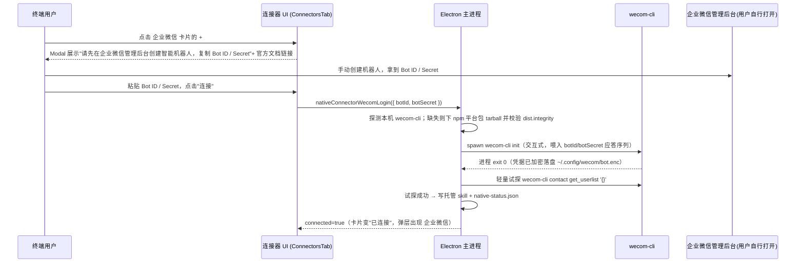

# Near 内置企业微信连接器（基于官方 `wecom-cli`）

Planned-with: claude-opus-4.8
Suggested-Impl-Model: gpt-5.3-codex

> 目标：Near 安装到**任意终端用户**机器后，用户在「连接器」里点企业微信的加号（`+`），
> 通过一次「填 Bot ID / Secret」（本期唯一路线）即可让 Agent 通过官方企业微信 CLI（`wecom-cli`）
> 操作 消息 / 文档 / 智能表格 / 通讯录 / 待办 / 会议 / 日程。
> 复用现有 GitHub / 飞书 native connector 范式，**不下载/依赖用户机器的 Node.js 或 npm**——
> 直接从 npm registry 拉取该 CLI 对应平台的预编译二进制 tarball，解包后按普通本地二进制调用。

---

## 背景与根因（写进正文，不依赖对话记忆）

### 现有 native connector 范式（飞书为最新样板）

端到端链路（证据文件 + 行号，均已核实于当前代码）：

1. **可用性白名单**：`desktop/electron/native-connectors-core.ts:30`
   ```ts
   const AVAILABLE_CONNECTOR_IDS = new Set(["tencent-meeting", "tapd", "github", "feishu"]);
   ```
   `nativeConnectorAvailability(id)` 据此返回 `available` / `unavailable`；企业微信当前不在集合，卡片无 `+`。

2. **二进制安装（本机优先 → 缺失则下载）**：飞书范式在 `desktop/electron/main.ts`：
   - `resolveSystemLarkCliPath()`（`main.ts:4023`）：先探测本机已装 CLI（`which/where` + 常见路径）
   - `larkCliArchiveInfo()`（`main.ts:4064`）+ `ensureLarkCliBinaryInstalled()`（`main.ts:4279`）：`proxyAwareFetch` 下载官方归档 → SHA256 校验 → 解包到 `~/.agenticx/connectors/feishu/<ver>/`
   - `extractGithubArchive()`（`main.ts:3534`，命名历史遗留但是通用的 zip/tar.gz 解包函数，github/feishu 都在复用）
3. **能力暴露**：`ensureFeishuSkill(binaryPath)`（`main.ts:4325`）连接成功后写 Near 托管 skill 到 `~/.agenticx/skills/near-connectors/feishu/SKILL.md`，`removeFeishuSkill()`（`main.ts:4380`）断开时删除。
4. **状态查询**：`getFeishuStatus()`（`main.ts:4387`）。
5. **IPC**：`native-connector-status` 分支（`main.ts:5918`）、`native-connector-feishu-login`（`main.ts:6044`）、`-cancel`（`6058`）、`-logout`（`6076`）；`preload.ts:520-602`；类型在 `desktop/src/global.d.ts:1003, 1048`。
6. **前端**：目录 `desktop/src/components/settings/connectors/connector-catalog.ts:13-71`（`ConnectorId` union + `CONNECTORS` 数组）；设置页 Modal 与弹层分支见 `ConnectorsTab.tsx` / `ConnectorsMenuButton.tsx` 中 `feishu` 相关代码（对应 `onNativeConnectorFeishuProgress` 等）。

### `wecom-cli` 关键事实（来源：官方仓库 README + npm registry，已核实）

- 仓库：`https://github.com/WecomTeam/wecom-cli`（2026-07-13 核实，2467 星）；官方安装方式 `npm install -g @wecom/cli`，README 前置条件写 "Node.js >= 18"。
- **但实际二进制分发方式和 gh/lark-cli 本质相同**——`@wecom/cli`（当前 0.1.9）的 `package.json` 通过 `optionalDependencies` 按平台分发真正的原生二进制包：

  | npm 平台包 | 覆盖平台 |
  |---|---|
  | `@wecom/cli-darwin-arm64` | macOS Apple Silicon |
  | `@wecom/cli-darwin-x64` | macOS Intel |
  | `@wecom/cli-linux-arm64` | Linux arm64 |
  | `@wecom/cli-linux-x64` | Linux x64 |
  | `@wecom/cli-win32-x64` | Windows x64 |

  实测 `@wecom/cli-darwin-arm64` 的 tarball 内容为：
  ```
  bin/wecom-cli   (9.3MB, 原生二进制, 0 依赖)
  LICENSE
  package.json
  README.md
  ```
  即真正干活的是 `bin/wecom-cli` 原生二进制；`@wecom/cli` 主包的 `bin/wecom.js`（1.9KB）只是一个转发到该二进制的瘦 Node 壳。**Near 无需 Node/npm，也无需走 `npm install -g`**——直接从 npm registry 下平台包 tarball、解包出 `bin/wecom-cli`，与 gh/lark-cli 的"下归档→解包→chmod"完全同构。
  > `win32-x64` 包内应为 `bin/wecom-cli.exe`（实施时下载核实一次，不得臆测）；**当前无 `win32-arm64` 包**，即 Windows ARM 暂不支持，与 GitHub Releases 走法不同，需要在平台矩阵里显式排除并给出「当前平台不支持」错误。
- **版本获取与校验**：npm 不像 GitHub Releases 有 `checksums.txt`；改用 npm registry 官方给的 per-version `dist.shasum`（SHA1）与 `dist.integrity`（SRI, sha512）——从 `https://registry.npmjs.org/@wecom/cli-<platform>/<version>` 的 JSON 里取 `versions[<ver>].dist.tarball` + `dist.integrity`，下载后校验 tarball 的 SHA512 与 `dist.integrity` 一致（比手填 SHA256 更权威、且无需手工誊抄 checksums 文件）。
- **授权/初始化**：`wecom-cli init` 是**交互式 TUI**，README 明确两种模式：
  1. **手动填 Bot ID + Secret**（企业微信管理后台获取，参考官方文档 `open.work.weixin.qq.com/help2/pc/cat?doc_id=21677`）——纯文本问答，**本 plan 唯一支持路线**。
  2. **扫码接入**——在终端内渲染二维码图案，与 gh/lark-cli 的"浏览器 URL"模式完全不同，无法复用现成的 `shell.openExternal` 抓 URL 逻辑，**本期不做**（见 Out of scope）。
  - **`init` 的真实 stdin/stdout 交互序列未经实测**，本 plan 按"最可能的问答顺序"给出脚手架，**要求实施者第一步先手动跑一次 `wecom-cli init` 记录真实 prompt 文本，再据此写 `consume()` 里的正则匹配与 stdin 应答**（见 FR-3 风险说明，禁止凭空猜测直接写死）。
  - 凭据落盘位置官方文档已给出：`~/.config/wecom/bot.enc`（配置目录可由 `WECOM_CLI_CONFIG_DIR` 覆盖），加密存储、Near 不需要也不应该读取。
- **状态判断**：`wecom-cli` 没有类似 `gh auth status` / `lark-cli auth status` 的显式状态子命令（README/CLI reference 未列出）。**本 plan 用"配置文件是否存在"作为已配置的判定**（`fs.existsSync(path.join(configDir, "bot.enc"))`），配合一次轻量试探调用（如 `wecom-cli contact get_userlist '{}'`，超时 10s）判断凭据是否真实可用（返回非报错 JSON 即视为已连接）。**如果实测发现有隐藏的状态子命令，实施者应改用该子命令**，此为已知信息缺口，不是最终结论。
- **调用格式**：`wecom-cli <category> <method> '<json_args>'`，`category ∈ {contact, doc, meeting, msg, schedule, todo}`；默认超时 30s（`get_msg_media` 120s）。
- **运行时路径**：配置目录 `~/.config/wecom`（`WECOM_CLI_CONFIG_DIR` 可覆盖）、机器人凭证 `<config_dir>/bot.enc`、媒体临时目录 `<system_tmp>/wecom/media`（`WECOM_CLI_TMP_DIR` 可覆盖）。
- **官方还要求** `npx skills add WeComTeam/wecom-cli -y -g` 安装其自带 26 类 Agent Skills——**本 plan 不采用**，理由与飞书 plan 对官方 `lark-*` skills 的处理一致：Near 自己写一份精简托管 umbrella skill（`~/.agenticx/skills/near-connectors/wecom/SKILL.md`），避免引入 `npx skills` 这个额外的网络依赖和不可控内容，保持与 github/feishu 连接器同一套"Near 托管 skill"范式。

> **对用户问题的直接回答**：可以纳入，且比想象中更贴合现有范式——因为 npm 包实际分发的是**平台原生二进制**，Near 可以完全绕开"要求用户装 Node/npm"这条路，直接像 gh/lark-cli 一样"下归档→解包→chmod→本地调用"。真正的差异点在**授权环节**：企业微信没有 gh/lark-cli 式的"打开浏览器 Device Flow"，只有"手动填 Bot ID/Secret"（本期支持）和"终端内扫码"（本期不支持，标记未来增强）。

---

## 终端用户视角：点 `+` 之后发生什么（目标行为，本期唯一路线：手动填 Bot ID/Secret）



失败 / 未装 wecom-cli / Bot ID·Secret 错误 / 试探调用报错 → 明确 toast 或弹层内错误文案，卡片回到未连接；不落地错误凭据。

---

## Suggested-Impl-Model（子规划 → 推荐模型）

| 子任务 | 推荐模型 | 理由 |
|---|---|---|
| S0（实施前必做）手动跑 `wecom-cli init` 记录真实 prompt/stdout | 人工 + 任意模型辅助记录 | 无法在无凭据环境下靠模型猜测，必须真机验证 |
| S1 core 纯函数 + 单测（白名单 / npm 包名映射 / 连接 ID） | `kimi-k2.7-code` 或 `glm-5.2-max` | 纯逻辑 + TDD，便宜够用 |
| S2 主进程 npm tarball 下载安装 / init 应答状态机 / 试探判活 / skill / IPC | `gpt-5.3-codex` | 后端接线、子进程 stdin 应答、跨栈风险中高（尤其 init 交互序列） |
| S3 preload + global.d.ts 类型 | `kimi-k2.7-code` | 样板声明 |
| S4 前端 ConnectorsTab / MenuButton Bot ID/Secret 表单 Modal + 目录/图标 | `gpt-5.6-terra-medium` 或 `claude-4.6-sonnet` | 需要表单交互与视觉一致性 |

整体若单模型实施，建议 `gpt-5.3-codex`（S2 的 `init` 交互状态机是最大风险面，必须先完成 S0 才能定稿正则）。

---

## In scope

- 新增 `wecom` native connector（与 `github`、`feishu`、`tencent-meeting` 同级）。
- 安装：**不依赖用户机器 Node/npm**——直接从 `registry.npmjs.org` 拉取 `@wecom/cli-<platform>` 平台包 tarball，用 `dist.integrity`（SRI sha512）校验后解包出 `bin/wecom-cli(.exe)`。
- 授权：仅支持「手动填 Bot ID / Secret」路线，主进程 spawn `wecom-cli init` 并按 S0 实测的 prompt 顺序应答 stdin。
- 状态：以「配置文件存在 + 轻量试探调用成功」判定已连接（无官方状态子命令的已知信息缺口，见上文）。
- 能力暴露：连接成功后写 `~/.agenticx/skills/near-connectors/wecom/SKILL.md` 托管 skill，指导 Agent 用 `wecom-cli`。
- 断开：删除本地配置文件（`bot.enc` 所在目录下由 Near 负责——实为"删除凭据"而非登出 API，因为 wecom-cli 没有 `logout` 子命令，实施者需核实是否存在等价命令，若无则采用"删除配置目录"并在断开前明确 toast 提示）+ 删除托管 skill + 状态回写 false。

## Out of scope（no-scope-creep）

- **不**改 GitHub / 飞书 / 腾讯会议 / TAPD 现有逻辑（仅在白名单、IPC 注册、前端目录/switch 处**新增** wecom 分支/条目，禁止重构相邻代码）。
- **不**做"扫码接入"模式（终端内二维码渲染 + 轮询），列为未来增强。
- **不**接官方 `npx skills add WeComTeam/wecom-cli` 的 26 类 skills（同飞书 plan 的处理原则）。
- **不**支持 `win32-arm64`（当前 npm 无对应平台包），该平台明确返回"当前平台不支持企业微信连接器"。
- **不**改 enterprise/ 任何代码、**不**触碰 `agenticx/studio/server.py`。
- **不**在本 plan 阶段确定 `init` 的精确 stdin 应答内容——那是 S0 的产出，写入 FR-3 时必须以实测结果为准，禁止凭空编造正则。

---

## 功能需求与验收

### FR-0（前置，S0）：实测 `wecom-cli init` 真实交互序列

**要求**：实施者在拿到一个真实/测试用企业微信 Bot ID + Secret 后，手动执行：
```bash
wecom-cli init
```
完整记录 stdout 的每一次 prompt 文本、期望的 stdin 输入顺序、成功/失败的最终输出文本、退出码。将该记录**原样贴入** FR-3 实现的代码注释或本 plan 的补充说明中，作为后续 `consume()` 正则匹配与 stdin 应答顺序的唯一依据。

**AC-0**：有一份可复现的真实终端会话记录（命令 + 完整输出），后续 FR-3 的代码逐行可对照该记录解释每一步匹配逻辑。

> 若实施者暂无可用的企业微信 Bot 凭据，此 FR 无法免测跳过——应先向用户申请测试用 Bot ID/Secret，或将 FR-2/FR-3 的编码工作限定在"安装"部分先行完成，`init` 应答部分显式标注 `TODO(需真实凭据验证)` 并阻塞 AC-3 之前的最终验收。

---

### FR-1：core 纯函数（可用性 + 平台映射 + 状态判定辅助）

**落点**：`desktop/electron/native-connectors-core.ts`

- 修改 `AVAILABLE_CONNECTOR_IDS`（`:30`）→ 增加 `"wecom"`：
  ```ts
  const AVAILABLE_CONNECTOR_IDS = new Set(["tencent-meeting", "tapd", "github", "feishu", "wecom"]);
  ```
- 新增导出类型与函数：
  ```ts
  export type WecomAuthStatus = {
    configured: boolean; // ~/.config/wecom/bot.enc 是否存在
    connected: boolean;  // 试探调用是否成功
    label: string;
    error?: string;
  };

  // npm 平台包名映射；未覆盖平台返回 null（当前已知 win32-arm64 无包）
  export function wecomNpmPlatformPackage(platform: string, arch: string): string | null {
    const map: Record<string, string> = {
      "darwin-arm64": "@wecom/cli-darwin-arm64",
      "darwin-x64": "@wecom/cli-darwin-x64",
      "linux-arm64": "@wecom/cli-linux-arm64",
      "linux-x64": "@wecom/cli-linux-x64",
      "win32-x64": "@wecom/cli-win32-x64",
    };
    return map[`${platform}-${arch}`] ?? null;
  }

  // 试探调用返回值（JSON 字符串）是否代表"凭据可用"：非空 JSON 且不含明显错误字段视为成功
  export function isWecomProbeSuccessful(stdout: string): boolean {
    const trimmed = stdout.trim();
    if (!trimmed) return false;
    try {
      const parsed = JSON.parse(trimmed);
      if (parsed && typeof parsed === "object" && "error" in parsed) return false;
      return true;
    } catch {
      return false;
    }
  }
  ```
- `resolveConnectedConnectorIds`（`:302` 附近，现有第 4 个可选参数为 `feishuConnected`）追加第 5 个可选参数：
  ```ts
  export function resolveConnectedConnectorIds(
    tmeetConnected: boolean,
    mcpServers: Array<{ name: string; connected: boolean }>,
    githubConnected = false,
    feishuConnected = false,
    wecomConnected = false,
  ): Array<"tencent-meeting" | "tapd" | "github" | "feishu" | "wecom"> {
    const ids: Array<"tencent-meeting" | "tapd" | "github" | "feishu" | "wecom"> = [];
    if (tmeetConnected) ids.push("tencent-meeting");
    if (mcpServers.some((s) => s.name === "tapd" && s.connected)) ids.push("tapd");
    if (githubConnected) ids.push("github");
    if (feishuConnected) ids.push("feishu");
    if (wecomConnected) ids.push("wecom");
    return ids;
  }
  ```
  > 新增第 5 参带默认值 `false`，不破坏现有调用点。

**AC-1**：`desktop/tests/native-connectors-core.test.ts` 新增用例并 `cd desktop && npx vitest run tests/native-connectors-core.test.ts` 全绿：
- `nativeConnectorAvailability("wecom")` → `"available"`
- `wecomNpmPlatformPackage("darwin", "arm64")` → `"@wecom/cli-darwin-arm64"`
- `wecomNpmPlatformPackage("win32", "arm64")` → `null`
- `isWecomProbeSuccessful('{"userlist":[]}')` → `true`
- `isWecomProbeSuccessful('{"error":"invalid credential"}')` → `false`
- `isWecomProbeSuccessful("")` → `false`
- `resolveConnectedConnectorIds(false, [], false, false, true)` → `["wecom"]`

---

### FR-2：主进程 npm tarball 下载安装（不依赖用户机器 Node/npm）

**落点**：`desktop/electron/main.ts`（新增独立段落，紧邻飞书函数之后；**不得改动 gh / lark-cli / tmeet 函数体**）

- 常量：
  ```ts
  const WECOM_CLI_VERSION = "0.1.9"; // 实施时取当时 npm 最新稳定版
  const WECOM_CLI_ARCHIVE_MAX_BYTES = 30 * 1024 * 1024;
  ```
- `resolveSystemWecomCliPath(): string | null`（仿 `resolveSystemLarkCliPath` `main.ts:4023`）：`which/where wecom-cli` + 常见路径（`/opt/homebrew/bin`、`/usr/local/bin`、npm 全局 bin、Windows `%APPDATA%\npm`）。
- `ensureWecomCliBinaryInstalled(): Promise<string>`（仿 `ensureLarkCliBinaryInstalled` `main.ts:4279`）：
  1. `resolveSystemWecomCliPath()` 命中则直接返回（本机安装视为受信，不做额外校验）。
  2. 否则调用 `wecomNpmPlatformPackage(process.platform, process.arch)`；`null` 则抛「当前平台暂不支持企业微信连接器」。
  3. `GET https://registry.npmjs.org/${encodeURIComponent(pkgName)}` 拿包元数据，取 `versions[WECOM_CLI_VERSION].dist.tarball` 与 `dist.integrity`（SRI 字符串，形如 `sha512-...`）；若指定版本不存在，回退取 `dist-tags.latest` 对应版本（并在日志中记录实际使用版本）。
  4. `proxyAwareFetch(tarballUrl)` 下载 → 大小上限校验 → 计算 tarball 的 SHA512，转 base64，拼成 `sha512-<base64>` 与 `dist.integrity` 逐字比对（不一致则拒绝安装并报错，**不得跳过校验**）。
  5. 用现有 tar 解包能力（复用 `extractGithubArchive`/等价 tar.gz 解包逻辑，npm tarball 为标准 `.tgz`，结构为 `package/bin/wecom-cli(.exe)` 等）解包到 `~/.agenticx/connectors/wecom/<ver>/`，提取 `package/bin/wecom-cli(.exe)` 为最终可执行，chmod 0755（非 win）。
  6. `resolveWecomCliBinaryPath()`：先 `resolveSystemWecomCliPath()`，再查安装目录并校验存在。

> **npm tarball 内部路径固定为 `package/<原 package.json files 声明的路径>`**——实施时下载一次 `@wecom/cli-darwin-arm64` 的 tgz 实际解压核对成员路径（本 plan 记录的 `bin/wecom-cli` 是从 npm 网页 Files 列表读到的相对路径，实际 tgz 内会带 `package/` 前缀），解包函数必须按真实路径提取，不得臆测。

**AC-2**：本机装有 `wecom-cli` 时 `resolveWecomCliBinaryPath()` 返回本机路径；本机无 `wecom-cli` 时点连接触发 npm tarball 下载，`dist.integrity` 校验通过后解包出可执行文件，`wecom-cli --help` 可运行且退出码 0。

---

### FR-3：主进程 `init` 应答式授权 + 状态判定 + 托管 skill（依赖 FR-0 实测结果）

**落点**：`desktop/electron/main.ts`

- 进度事件通道 `native-connector-wecom-progress`，phase 枚举：
  `"installing" | "initializing" | "probing" | "success" | "disconnected" | "error"`。
- `startWecomLogin(botId: string, botSecret: string): Promise<NativeConnectorStatusResult>`：
  1. `sendWecomProgress("installing")` → `ensureWecomCliBinaryInstalled()` 得 `binary`。
  2. `sendWecomProgress("initializing")` → `spawn(binary, ["init"], { stdio:["pipe","pipe","pipe"], env:{...process.env, NO_COLOR:"1"} })`。
  3. `consume(chunk)`：**按 FR-0 记录的真实 prompt 顺序**依次匹配并 `proc.stdin.write(...)`——预期至少含"选择配置方式"（选手动填写）、"输入 Bot ID"、"输入 Secret"三步问答；具体正则与应答字符串**必须替换为 FR-0 实测内容**，禁止照抄本 plan 的占位示例直接上线。
  4. 5 分钟超时；`exit 0` → 进入试探步骤；非 0 → 错误收敛（stderr 原文回传给前端展示，避免用户"看不懂为什么失败"）。
  5. `sendWecomProgress("probing")` → `execFile(binary, ["contact","get_userlist","{}"], { timeout: 10000 })` → `isWecomProbeSuccessful(stdout)`；成功 → `ensureWecomSkill(binary)` + `persistWecomConnectorStatus(true)` + `sendWecomProgress("success")`；失败 → 删除刚写入的错误配置（`fs.rmSync` 配置目录）+ 错误收敛，避免"看似连上但凭据无效"的假成功状态残留。
- `getWecomStatus(): Promise<NativeConnectorStatusResult>`：
  - `resolveWecomCliBinaryPath()`；无则 `{ok:true,available:true,connected:false,label:"可用"}`
  - `fs.existsSync(wecomConfigPath())`（`~/.config/wecom/bot.enc`，可被 `WECOM_CLI_CONFIG_DIR` 覆盖——Near 侧固定使用默认路径，不设置该环境变量）判定 `configured`
  - `configured` 为真时执行一次轻量试探（同上，10s 超时）判定 `connected`
  - 已连接 → `ensureWecomSkill`；未连接/未配置 → `removeWecomSkill()`
  - `persistWecomConnectorStatus(connected)`（仿 `persistFeishuConnectorStatus` `main.ts:3970`）——`native-status.json` 的 `connectors.wecom = { connected, capability:"skill", skill_name:"wecom", updated_at }`；**仅新增 wecom 键**。
- `ensureWecomSkill(binaryPath)` / `removeWecomSkill()`（仿 `ensureFeishuSkill` `main.ts:4325` / `removeFeishuSkill` `main.ts:4380`）：
  - skill 目录 `~/.agenticx/skills/near-connectors/wecom/`，`.near-managed` 标记，复用 `assertManagedSkillDirectory`
  - SKILL.md 内容（Near 托管 umbrella skill）：
    ```markdown
    ---
    name: wecom
    description: 使用企业微信官方 CLI (wecom-cli) 操作消息、文档、智能表格、通讯录、待办、会议、日程。
    ---

    # 企业微信

    仅在用户要求操作企业微信时使用。通过 bash_exec 调用官方 CLI（本机已配置机器人凭据）：

    ```bash
    "<wecomBinary>" <category> --help              # 列出该品类下支持的工具
    "<wecomBinary>" <category> <method> --help     # 查看某工具所需参数
    "<wecomBinary>" <category> <method> '<json_args>'  # 执行调用
    ```

    category 取值：contact（通讯录）/ doc（文档、智能表格）/ meeting（会议）/ msg（消息）/ schedule（日程）/ todo（待办）。

    读取类调用（get_*、list、query）可直接执行；写操作（发消息、创建/删除文档或记录、创建/取消会议或日程、创建/更新/删除待办）必须先向用户展示参数并确认后再执行。不得输出或读取本机凭据文件。若调用返回 error 字段，引导用户前往「设置 → 连接器 → 企业微信」重新连接。
    ```
    （`<wecomBinary>` 用与 github/feishu 相同的转义方式写入实际路径。）
- 断开：Near 侧直接 `fs.rmSync(wecomConfigDir(), { recursive:true, force:true })` 删除本地凭据目录（**实施者须先核实 `wecom-cli` 是否提供等价的 `logout`/`reset` 子命令；若存在应优先调用该命令而非直接删文件**，此为 FR-0 阶段应一并核实的信息缺口）+ `removeWecomSkill()` + `persistWecomConnectorStatus(false)` + progress `disconnected`。

**AC-3**：实施者用真实（或测试用）Bot ID/Secret 走一次真实连接：
1. 未配置状态下填表单点连接 → 弹层依次经「安装（如需）→ 初始化中→ 校验中 → 已连接」；
2. 完成后 `~/.agenticx/skills/near-connectors/wecom/SKILL.md` 生成，`native-status.json` 的 `connectors.wecom.connected=true` 且其他连接器键不受影响；
3. 断开后 skill 删除、配置目录删除、状态回 false；
4. 故意填错 Secret 时，流程在"校验中"阶段失败并给出明确错误文案，不留假成功状态。
（AC-3 要求贴出本地真实终端输出佐证 FR-0/FR-3 的正则与应答顺序命中，不接受"应该能跑"的无证据声明。）

---

### FR-4：IPC + preload + 类型

**落点**：`main.ts`（`native-connector-status` 分支 `main.ts:5918` 附近）、`preload.ts`（feishu 段 `520-602` 之后）、`desktop/src/global.d.ts`（feishu 声明 `1003, 1048` 附近）

- `main.ts`：
  - `native-connector-status` handler：新增 `if (id === "wecom") return await getWecomStatus();`（在现有分支旁新增，不改旧分支）
  - 新增 `ipcMain.handle("native-connector-wecom-login", async (_event, payload: { botId: string; botSecret: string }) => { ... })`（try/catch 包 `startWecomLogin`，参数校验非空字符串）
  - 新增 `ipcMain.handle("native-connector-wecom-logout", ...)`
- `preload.ts`（追加，勿整段替换相邻行）：
  ```ts
  nativeConnectorWecomLogin: async (payload: { botId: string; botSecret: string }) =>
    ipcRenderer.invoke("native-connector-wecom-login", payload),
  nativeConnectorWecomLogout: async () => ipcRenderer.invoke("native-connector-wecom-logout"),
  onNativeConnectorWecomProgress: (
    callback: (payload: { phase: string }) => void,
  ) => {
    const handler = (_e: unknown, payload: { phase: string }) => callback(payload);
    ipcRenderer.on("native-connector-wecom-progress", handler);
    return () => ipcRenderer.removeListener("native-connector-wecom-progress", handler);
  },
  ```
- `desktop/src/global.d.ts`（追加）：
  ```ts
  nativeConnectorWecomLogin: (payload: { botId: string; botSecret: string }) => Promise<{ ok: boolean; available: boolean; connected: boolean; label: string; error?: string }>;
  nativeConnectorWecomLogout: () => Promise<{ ok: boolean; available: boolean; connected: boolean; label: string; error?: string }>;
  onNativeConnectorWecomProgress: (
    callback: (payload: { phase: "installing" | "initializing" | "probing" | "success" | "disconnected" | "error" }) => void,
  ) => () => void;
  ```

**AC-4**：`cd desktop && npm run typecheck`（或 `npx tsc --noEmit`）绿；主进程重编译进 `dist-electron/` 后**完全重启** `npm run dev`。

---

### FR-5：前端（目录 + 图标 + 表单 Modal + 弹层）

**落点 A**：`desktop/src/components/settings/connectors/connector-catalog.ts`
- `ConnectorId` union（`:13-24`）增加 `"wecom"`。
- 新增图标资源 `desktop/src/assets/connectors/wecom.svg`（企业微信官方 logo）。
- `CONNECTORS` 数组（`:44-71`）在 `feishu` 之后新增：
  ```ts
  { id: "wecom", name: "企业微信", description: "消息、文档、智能表格、通讯录、待办与会议", iconSrc: wecomIcon },
  ```

**落点 B**：`desktop/src/components/settings/connectors/ConnectorsTab.tsx`（仿 feishu 分支）
- 新增 state：`wecomStatus`、`wecomBusy`、`wecomPhase`、`botIdInput`、`botSecretInput`。
- `refreshWecomStatus()` 调 `nativeConnectorStatus("wecom")`；`useEffect` 订阅 `onNativeConnectorWecomProgress`，phase → 中文文案映射（`installing: "首次使用，正在下载企业微信 CLI…"`、`initializing: "正在配置机器人凭据…"`、`probing: "正在校验凭据…"`、`success: "连接成功"`、`error: "连接未完成"`）。
- 新增企业微信 Modal（`selected?.id === "wecom"`）：
  - 未连接：展示两个输入框「Bot ID」「Bot Secret」（Secret 用密码型输入 + 显隐切换）+ 官方文档链接（"如何获取 Bot ID/Secret"，指向 `open.work.weixin.qq.com/help2/pc/cat?doc_id=21677`）+ 主按钮「连接」→ `nativeConnectorWecomLogin({ botId, botSecret })`；进度期展示 `wecomPhase` 文案 + 转圈；「取消」按钮常开（终止当前子进程）。
  - 已连接：显示「已连接」+「断开连接」→ `nativeConnectorWecomLogout()`。
- 卡片状态点/图标沿用既有规则。

**落点 C**：`desktop/src/components/connectors/ConnectorsMenuButton.tsx`（仿 feishu）
- `NativeId` union 增加 `"wecom"`；新增 `wecomConnected` state + `refreshWecom()`。
- `connectedIds`：把 `wecomConnected` 作为第五参传入 `resolveConnectedConnectorIds(tmeet, mcp, github, feishu, wecom)`。
- `isConnectorConnected`：新增 `if (id === "wecom") return wecomConnected;`
- `handleConnectClick`：`wecom` 分支 `goToSettings()`（表单式连接需在设置页 Modal 完成）。

**AC-5**：设置页出现「企业微信」卡片可点 `+`；填写 Bot ID/Secret 后点连接，Modal 显示「下载(如需)→配置→校验→已连接」进度；授权后卡片变「已连接」；弹层在已连接后出现「企业微信」项且可断开；连接过程中「取消」可中止；Secret 输入框默认掩码显示。

---

## 测试与验收命令

```bash
# S1 纯函数
cd desktop && npx vitest run tests/native-connectors-core.test.ts
# 类型
cd desktop && npm run typecheck   # 或 npx tsc --noEmit
# 主进程改动后必须完全重启
# Ctrl+C 后重新 npm run dev（不可只刷新渲染进程）
```

人工验收：FR-0 的真实 `init` 交互记录 + FR-3 AC-3 的真实连接四步 + FR-5 AC-5 的 UI 流程截图/日志。

---

## 风险与备注

- **最大风险**：`wecom-cli init` 的真实交互序列未经实测，FR-3 的 stdin 应答逻辑在 FR-0 完成前只是脚手架，**不得在没有 FR-0 实测证据的情况下直接合并 FR-3 代码**。
- **状态判定的信息缺口**：官方文档未列出显式 `auth status`/`logout` 等价命令，本 plan 用"配置文件存在 + 轻量试探调用"与"直接删配置目录"作为替代方案；若实施时发现有更合适的官方命令，应优先采用并更新本 plan 的 FR-3 描述（不算 scope creep，是信息缺口的必要修正）。
- **npm 而非 GitHub Releases**：校验方式从"官方 checksums.txt 手填 SHA256"改为"npm registry 官方 `dist.integrity` SRI 动态获取"，更权威也更不易过期，但依赖 npm registry 可用性（国内网络环境下 `registry.npmjs.org` 是否顺畅需要和 `proxyAwareFetch` 的代理支持一起验证；必要时可考虑淘宝镜像 `registry.npmmirror.com` 作为下载源候选，但完整性校验仍以官方 registry 返回的 `dist.integrity` 为准）。
- **Windows ARM 不支持**：当前 npm 无 `@wecom/cli-win32-arm64` 包，需显式排除并给出清晰错误提示，而非静默失败。
- **企业微信品牌与合规**：Bot ID/Secret 是敏感凭据，Modal 与 SKILL.md 均不得回显完整 Secret；托管 skill 不得引导 Agent 输出凭据内容。
- **no-scope-creep**：所有改动仅以「新增 wecom 分支/函数/条目」形式加入，禁止重构 github/飞书/腾讯会议/TAPD 既有代码；`native-status.json` 只增 `wecom` 键。

---

## Traceability

- Plan-Id: `2026-07-13-near-wecom-cli-connector`
- 关联既有 plan：`.cursor/plans/2026-07-13-near-feishu-cli-connector.plan.md`（两段/交互式授权范式最接近的参照）、`.cursor/plans/2026-07-13-near-github-cli-connector.plan.md`、`.cursor/plans/2026-07-11-near-native-connectors-mvp.plan.md`
- 参考：企业微信 CLI 官方仓库 https://github.com/WecomTeam/wecom-cli （README + `docs/cli-reference.md`）、npm registry `https://registry.npmjs.org/@wecom/cli` 与 `@wecom/cli-darwin-arm64` 元数据（2026-07-13 核实）
