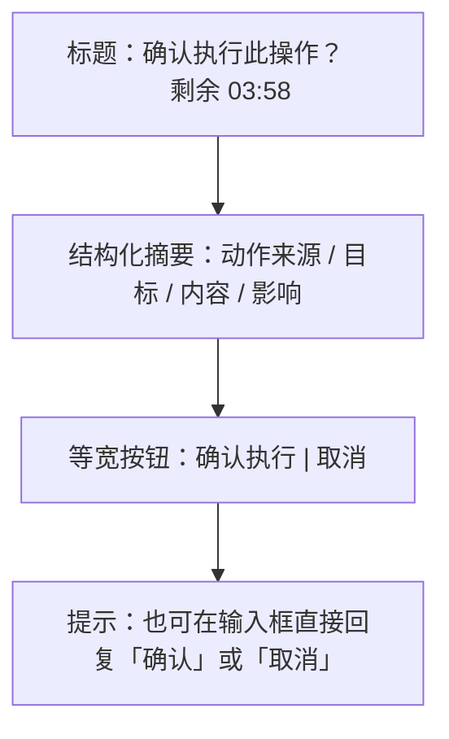
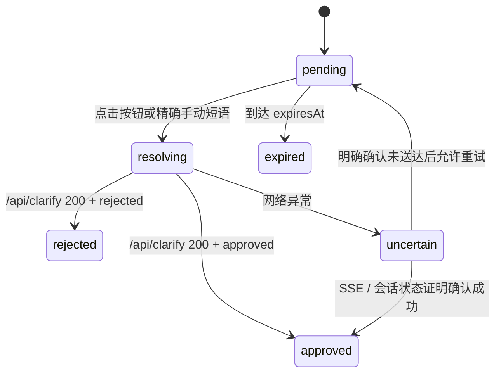

# Near 通用动作确认卡（Action Confirmation）

Planned-with: GPT-5.6 Sol
Suggested-Impl-Model: gpt-5.6-sol-medium

> **Goal**：为 Near Desktop 增加可复用的通用动作确认原语。智能体在执行不可逆或外部写操作前，可以展示一张内联确认卡；用户既可点击等宽的「确认 / 取消」按钮，也可在输入框手动回复，两条路径必须解析为同一个确认结果并让当前智能体回合继续执行。

> **Architecture**：复用现有 `request_clarification` 的阻塞 gate 与 `/api/clarify` 回调通道，不新增确认服务端 API，也不把 UI 写死为 Agent Mail。新增 `request_action_confirmation` Studio tool，借助结构化 `context.kind = "action_confirmation"` 驱动 Desktop 渲染专用卡片；Agent Mail 仅作为首个接入该通用原语的 skill。

> **Tech Stack**：Python async runtime / SSE、FastAPI 现有 `/api/clarify`、React 18、Zustand、TypeScript、Tailwind CSS、Vitest、pytest。

---

## 1. 背景、根因与证据链

### 1.1 当前 Agent Mail 两阶段确认为什么体验不稳定

当前托管 skill 位于 `desktop/electron/main.ts` 的 `ensureQqmailSkill()`，发送流程是：

1. 智能体运行 `agently-cli message +send`，取得腾讯服务端签发的 `ctk_xxx`；
2. 智能体输出普通文本，要求用户另发一条「确认」；
3. 下一轮模型从历史中找回 token，再运行完全相同参数并附加 `--confirmation-token`。

这条链路有两个问题：

- token 从签发到真正消费之间跨越了完整用户轮次和完整模型轮次，容易撞到 Agent Mail 约 5 分钟 TTL；
- 普通文本没有机器可读的 pending state，Desktop 不知道这是一项可确认动作，无法提供按钮、倒计时、去重和过期态。

本机已经验证：同一 token、同一参数在签发后立即消费可返回 `{"ok": true, "data": {"queued": true}}`。因此本 plan 不修改 `agently-cli`，而是缩短和结构化 Near 内部的人机确认链路。

### 1.2 仓库内已有可复用能力

- `agenticx/cli/agent_tools.py:304`：`request_clarification` Studio tool schema。
- `agenticx/cli/agent_tools.py:2347`：`_request_clarification()` 在同一工具调用中阻塞等待用户回复。
- `agenticx/runtime/clarify.py:64`：`AsyncClarifyGate` 保存 pending future，并支持按 `request_id` 幂等 resolve。
- `agenticx/studio/server.py:2367`：`POST /api/clarify` 已按 `session_id + agent_id + request_id` 精确恢复 gate。
- `agenticx/studio/server.py:364-412`：`_persist_clarification_prompt()` 已把 prompt、options 与完整 context 写入 `messages.json`；动作确认可通过 `context.kind` 复用这条持久化链路，无需修改敏感入口文件。
- `desktop/src/components/ChatPane.tsx:8509`：Desktop 已接收 `clarification_required` SSE。
- `desktop/src/components/messages/ClarificationCard.tsx`：已有内联交互卡、提交中、失败和不确定网络态范式。
- `desktop/src/components/messages/InlineConfirmCard.tsx`：目前只是未接线的 11 行占位组件，可扩展为本需求的通用确认卡。
- `desktop/src/components/ConfirmDialog.tsx`：现有居中 Modal 服务于 shell / 文件写入等**权限确认**，不应被本需求替换。

### 1.3 产品决策

本需求的确认语义分为三类，必须保持边界：

| 类型 | 示例 | UI / 通道 |
|---|---|---|
| 权限确认 | shell 高风险命令、写文件 | 继续使用 `confirm_required` + `ConfirmDialog` / `/api/confirm` |
| 开放式澄清 | 方案选择、颜色、缺失参数 | 继续使用 `request_clarification` + `ClarificationCard` |
| **动作确认（本 plan）** | 发邮件、提交审批、发布内容、删除外部资源 | 新增 `request_action_confirmation` + 通用 `InlineConfirmCard`，底层复用 clarify gate |

`Run Everything` 只能绕过权限确认，**不得**自动通过动作确认。

---

## 2. 用户体验规格

### 2.1 卡片布局

确认卡内联在消息流中，不打开全屏或居中 Modal，不抢占输入框焦点。



视觉要求：

- 外壳复用聊天消息语义：`rounded-xl`、细边框、`bg-surface-card`，避免厚重白边和大面积警告黄。
- 两个按钮使用 `grid grid-cols-2` 或等效 `flex-1`，宽度严格相等，高度严格相等。
- 主按钮：
  - 背景：`var(--ui-btn-primary-bg)`
  - 文字：`var(--ui-btn-primary-text)`
  - 边框：`var(--ui-btn-primary-border)`
- 取消按钮：
  - 背景透明；
  - 文字使用主题色；
  - 边框使用 `var(--ui-btn-primary-border)`，hover 仅加轻微主题色透明底。
- 不硬编码 cyan / emerald / purple；必须跟随 blue / green / pink / yellow / white 主题色。
- 按钮按下采用轻量 `active:scale-[0.985]`，不使用弹跳、发光或渐变。
- pending 时显示倒计时；resolved 后折叠为「已确认」或「已取消」，按钮消失。

### 2.2 点击与手动输入等价

按钮和输入框必须汇聚到同一个 resolver：

- 点击主按钮 → `approved`
- 点击取消按钮 → `rejected`
- 输入精确短语「确认」「确认发送」「同意」「继续」「yes」「y」「ok」→ `approved`
- 输入精确短语「取消」「拒绝」「不用了」「no」「n」→ `rejected`

匹配必须是**整条消息精确匹配**（忽略首尾空格和英文大小写），不得把「我还没确认」「先不要取消任务」等自然语言误判为决策。

当同一 pane 存在多个 pending action 时：

- 按钮始终按其 `request_id` 精确 resolve；
- 手动短语因目标不唯一而不自动 resolve，继续作为普通用户消息发送。

### 2.3 状态与失败处理

状态机：



规则：

- `resolving` 时两个按钮同时禁用，防止双击。
- HTTP 404 表示请求已处理或已失效，卡片显示明确状态，不伪装成功。
- 网络异常可能已经送达，不立即恢复为可点击；显示「请求可能已送达，请稍候观察」。
- 到期后按钮禁用，显示「确认已失效，请让智能体重新生成」。
- 用户点击或手动确认后，卡片自身就是可见操作记录；不额外生成重复的系统气泡。

---

## 3. 通用协议设计

### 3.1 `request_action_confirmation` 工具输入

在 `agenticx/cli/agent_tools.py` 的 `STUDIO_TOOLS` 中新增：

```json
{
  "name": "request_action_confirmation",
  "arguments": {
    "title": "确认发送这封邮件？",
    "summary": [
      {"label": "发件人", "value": "damon7337@agent.qq.com"},
      {"label": "收件人", "value": "1375032786@qq.com"},
      {"label": "主题", "value": "物理学不存在了"},
      {"label": "正文", "value": "物理学不存在了"}
    ],
    "approve_label": "确认发送",
    "reject_label": "取消",
    "expires_in_seconds": 240,
    "source": "Agent Mail"
  }
}
```

字段约束：

- `title`：必填，1–200 字符。
- `summary`：0–12 行；每行 `label` 1–40 字符、`value` 最多 1000 字符。
- `approve_label` / `reject_label`：可选，默认「确认执行」/「取消」，各最多 20 字符。
- `expires_in_seconds`：可选，限制在 30–1800 秒；Agent Mail 固定传 240 秒，为服务端约 5 分钟 TTL 预留缓冲。
- `source`：可选，仅用于用户可见来源和诊断，不参与权限放行。
- 工具不得接收或回显 secret、OAuth token、confirmation token；Agent Mail 的 `ctk_xxx` 继续留在前一条 CLI tool result 中。

### 3.2 复用 clarify 传输

`_request_action_confirmation()` 不新增 gate，而是：

1. 生成 `request_id`；
2. 构造受控 context：

```python
{
    "kind": "action_confirmation",
    "title": title,
    "summary": normalized_summary,
    "approve_label": approve_label,
    "reject_label": reject_label,
    "source": source,
    "expires_at_ms": int((time.time() + effective_timeout) * 1000),
}
```

3. 通过 `AsyncClarifyGate` 发出既有 `clarification_required`，options 固定为 approve / reject 两项；
4. 以 `asyncio.wait_for` 对本次请求施加 `effective_timeout`；取消时必须确保 gate pending future 被清理；
5. 将答案转换为明确 tool result：
   - approved：`[ACTION_CONFIRMED] 用户已确认执行。`
   - rejected：`[ACTION_REJECTED] 用户已取消执行。不得继续该动作。`
   - timeout：`[ACTION_CONFIRMATION_EXPIRED] 确认已失效。不得继续该动作，若仍需执行必须重新生成预览。`
   - unattended：`[ACTION_CONFIRMATION_SUSPENDED] 无人值守会话不能确认外部写操作。`

禁止直接把普通 `request_clarification` 的「默认推进」语义用于动作确认。

虽然传输层复用 `clarification_required` / `/api/clarify`，产品语义和前端类型仍必须独立。`_persist_clarification_prompt()` 会继续保存 `metadata.kind = "clarification"`，Desktop 恢复时以 `metadata.context.kind = "action_confirmation"` 分流为动作确认卡；这样既不新增 API，又可在切换 session / 重载后显示 pending 或 resolved 状态。

### 3.3 Desktop 识别

`ChatPane` 收到 `clarification_required` 时：

- `context.kind !== "action_confirmation"`：完全保留现有 ClarificationCard 分支；
- `context.kind === "action_confirmation"`：
  - 解析并校验结构化 context；
  - patch 当前 `request_action_confirmation` tool row，写入 `message.actionConfirmation`；
  - 不打开 `ConfirmDialog`，也不调用 `onOpenClarification`；
  - 保持 SSE 回合打开，等待 `/api/clarify` resolve 后同一回合继续。

---

## 4. In scope / Out of scope

### In scope

- 通用 `request_action_confirmation` Studio tool。
- 通用内联动作确认卡。
- 点击与手动输入两条等价路径。
- 倒计时、过期、重复点击、跨 pane / 跨 session 隔离。
- Agent Mail 托管 skill 迁移为通用动作确认工具的首个调用方。
- light / dim / dark 与全部主题色回归。

### Out of scope

- 不修改腾讯 Agent Mail 服务端或 `agently-cli`。
- 不修改现有权限确认策略、`ConfirmDialog`、`Run Everything` 语义。
- 不把所有历史 `request_clarification` 自动改为确认卡。
- 不修改 enterprise 前后台。
- 不新增 IPC。
- 不修改 `agenticx/studio/server.py`；复用现有 `/api/clarify`。
- 不为任意 bash stdout 做脆弱 JSON 猜测；确认卡必须由智能体显式调用结构化工具产生。
- 不在本次同时迁移所有外部连接器；只接入 Agent Mail，其他场景后续按同一工具渐进迁移。

---

## 5. Suggested-Impl-Model

| 子任务 | 推荐模型 | 理由 |
|---|---|---|
| Python 通用确认工具、timeout 与 gate 清理 | `gpt-5.6-sol-medium` | 异步取消、SSE 与安全语义耦合，需强推理 |
| Desktop 状态汇流、跨 pane 隔离、手动输入拦截 | `gpt-5.6-sol-medium` | 多窗格状态一致性和 in-flight 队列风险较高 |
| 卡片视觉与主题适配 | `claude-sonnet-5-thinking-low` | 单组件视觉打磨，兼顾品位与成本 |
| 单元测试补齐 | `composer-2.5-fast` | 纯函数与固定协议断言，低风险样板工作 |

---

## 6. 实施任务

### Task 1：先定义通用动作确认协议与纯函数

**Files**

- Create: `desktop/src/utils/action-confirmation.ts`
- Create: `desktop/tests/action-confirmation.test.ts`
- Modify: `desktop/package.json`（新增 `test:action-confirmation` 脚本）

**先写失败测试**

覆盖：

1. 合法 `context.kind = action_confirmation` 可解析为强类型对象；
2. 缺 `requestId` / `sessionId` / title 时返回 `null`；
3. summary 超长时截断，未知字段不透传；
4. 中英文 approve / reject 精确短语匹配；
5. 含额外自然语言的句子不匹配；
6. 单 pending 可由手动短语 resolve，多 pending 返回 ambiguous；
7. 只在 `ownerSessionId === pane.sessionId` 时命中；
8. `expiresAt <= Date.now()` 返回 expired；
9. resolve payload 始终使用对应 `requestId + sessionId + agentId`。

建议导出：

```ts
export type ActionConfirmationDecision = "approved" | "rejected";

export function parseActionConfirmationContext(...): PendingActionConfirmation | null;
export function matchActionConfirmationReply(text: string): ActionConfirmationDecision | null;
export function findResolvableActionConfirmation(...): PendingActionConfirmation | null;
export function isActionConfirmationExpired(...): boolean;
export function buildActionConfirmationAnswer(...): {
  answerText: string;
  selectedOptions: string[];
};
```

**验证**

```bash
npm --prefix desktop run test:action-confirmation
```

Expected：新增测试全部 PASS。

---

### Task 2：实现后端通用阻塞工具

**Files**

- Modify: `agenticx/cli/agent_tools.py`
  - `STUDIO_TOOLS` 中 `request_clarification` 邻近位置新增 schema；
  - `_request_clarification()` 邻近位置新增 `_request_action_confirmation()`；
  - `dispatch_tool_async()` 的 `request_clarification` 分支邻近位置新增 dispatch。
- Modify: `agenticx/runtime/prompts/meta_agent.py:970-974`
  - 在开放式澄清与权限确认之间补充「外部动作确认」规则。
- Create: `tests/test_request_action_confirmation.py`

**先写失败测试**

1. 工具 schema 存在，`title` required，summary item shape 完整；
2. approved 答案返回 `[ACTION_CONFIRMED]`；
3. rejected 答案返回 `[ACTION_REJECTED]` 且包含「不得继续」；
4. timeout 返回 `[ACTION_CONFIRMATION_EXPIRED]` 并清理 pending；
5. unattended 返回 suspended，不阻塞、不自动通过；
6. event context 必含 `kind/title/summary/labels/expires_at_ms`；
7. `expires_in_seconds` 被 clamp 到 30–1800；
8. summary / labels 超长被归一化；
9. context 不包含调用方传入的任意 `kind` 或 secret 字段。

**实现约束**

- 所有新增 Python 注释 / docstring 使用英文。
- 不改 `AsyncClarifyGate` 的全局默认 1800 秒；只在 action wrapper 对单次 await 施加 timeout。
- 不新增 `/api/action-confirm`，避免重复 gate 与重复路由。
- 若取消 await，确认 `AsyncClarifyGate.request_clarification()` 的 `finally` 会移除 pending。

**验证**

```bash
pytest -q tests/test_request_action_confirmation.py tests/test_request_clarification.py
```

Expected：全部 PASS，无 pending task warning。

---

### Task 3：扩展 Store 数据模型，保持旧快照兼容

**Files**

- Modify: `desktop/src/store.ts`
  - 在 `PendingConfirm` / `PendingClarification` 附近新增 `PendingActionConfirmation`；
  - `Message` 新增可选 `actionConfirmation`；
  - 所有 message patch / hydrate 的 Pick 联合中加入该字段，但保持 optional。

建议类型：

```ts
export type ActionConfirmationStatus =
  | "pending"
  | "resolving"
  | "approved"
  | "rejected"
  | "expired"
  | "uncertain";

export type PendingActionConfirmation = {
  requestId: string;
  sessionId: string;
  agentId: string;
  title: string;
  summary: Array<{ label: string; value: string }>;
  approveLabel: string;
  rejectLabel: string;
  source?: string;
  expiresAtMs?: number;
  status: ActionConfirmationStatus;
  error?: string;
};
```

**AC**

- 旧 localStorage pane snapshot 缺字段时正常恢复；
- action state 不写入全局 active session，不允许跨 pane 读取。

---

### Task 4：实现有设计品位的通用确认卡

**Files**

- Modify: `desktop/src/components/messages/InlineConfirmCard.tsx`
- Modify: `desktop/src/components/messages/MessageRenderer.tsx`
- Modify: `desktop/src/components/messages/group-tool-messages.ts`
- Modify: `desktop/src/components/messages/group-tool-messages.test.ts`
- Reference only: `desktop/src/components/messages/ClarificationCard.tsx`
- Reference only: `desktop/src/components/messages/im-layout.ts`
- Reference only: `desktop/src/index.css:497-533`

**组件契约**

```ts
type Props = {
  confirmation: PendingActionConfirmation;
  groupChatRail?: boolean;
  onResolve: (
    confirmation: PendingActionConfirmation,
    decision: ActionConfirmationDecision,
  ) => Promise<void> | void;
};
```

**视觉验收**

- 使用两列等宽布局，两个按钮的 bounding box 宽度差不超过 1px；
- 主按钮完全使用主题 token；
- 取消按钮透明底 + 同主题色描边；
- dark / dim / light 均可读；
- blue / green / pink / yellow / white 五种主题色均无硬编码串色；
- 窄 pane 下摘要自动换行，按钮不溢出；
- pending / resolving / approved / rejected / expired / uncertain 六态可辨识；
- `role="dialog"`、标题关联、按钮有明确 accessible name；
- 倒计时尊重 `prefers-reduced-motion`，只更新文字，不做持续闪烁动画。

**MessageRenderer 接线**

- `message.actionConfirmation` 优先渲染 `InlineConfirmCard`；
- 普通 `message.inlineConfirm` 仍走现有权限 / group confirm 的轻按钮，不改变语义；
- `forceExpand` 对 action confirmation 为 true，避免 pending 卡被工具折叠隐藏。
- `canGroupToolMessage()` 对带 `actionConfirmation` 的消息返回 false，禁止把待确认卡折进 `TurnToolGroupCard`。

---

### Task 5：SSE 接线和统一 resolver

**Files**

- Modify: `desktop/src/components/ChatPane.tsx`
  - `clarification_required` 分支（约 `8509+`）；
  - `sendChat()`（约 `6941+`）；
  - `resolveGroupInlineConfirm()` 邻近位置新增 action resolver；
  - MessageRenderer props 接线（约 `6216+` / `6266+`）。
- Modify: `desktop/src/utils/session-message-map.ts:280-301`
  - 在现有 clarification metadata 恢复逻辑中识别 `metadata.context.kind === "action_confirmation"`；
  - 使用 `clarification_answered` / `clarification_answer` 恢复 approved / rejected 状态。
- Create: `desktop/tests/session-message-action-confirmation.test.ts`

**结构化事件处理**

当 `context.kind === "action_confirmation"`：

1. 使用 Task 1 纯函数校验；
2. 找到当前运行中的 `request_action_confirmation` tool row；
3. patch `actionConfirmation`，若找不到则创建唯一 tool row；
4. 以 `requestId` 去重，SSE 重放不得产生第二张卡；
5. 不执行普通 clarification 分支。

**会话恢复**

- pending：从持久化的 clarification tool row + action context 重建确认卡；
- resolved：从 `clarification_answered` 与 `selected_options` 重建「已确认 / 已取消」；
- expired：恢复时若 `expiresAtMs <= Date.now()`，直接显示失效态，不复活按钮；
- 所有恢复消息继续受 `ownerSessionId` / 当前 pane session 过滤。

**统一 resolver**

建议单一入口：

```ts
async function resolveActionConfirmation(
  confirmation: PendingActionConfirmation,
  decision: ActionConfirmationDecision,
  source: "button" | "manual",
): Promise<void>
```

流程：

1. 校验 `pane.sessionId === confirmation.sessionId`；
2. 先把卡片置为 `resolving`；
3. POST 既有 `/api/clarify`：
   - `answer_text`: `""`
   - `selected_options`: `[approveLabel]` 或 `[rejectLabel]`
4. 200 后置为 approved / rejected；
5. 404 置为 expired；
6. 网络异常置为 uncertain，不立即允许重复点击。

**手动输入拦截**

在 `sendChat()` 真正进入 in-flight / queue 逻辑前：

- 查找当前 pane、当前 session 唯一 pending action；
- 若输入为精确确认 / 取消短语，调用同一 resolver 并 `return`；
- 不再创建第二个 `/api/chat` LLM 回合；
- 输入非精确短语或存在多个 pending 时，保持原发送逻辑。

这里的“相当于发送确认 / 取消”是**行为等价**：按钮与手动文本均恢复同一个被阻塞的工具调用。卡片 resolved 状态作为可见审计记录，不额外制造重复气泡。

**并发 AC**

- double-click 只产生一个 POST；
- pane A 的手动「确认」不能 resolve pane B；
- session 切换后旧卡按钮不能 resolve 新 session；
- 用户在普通聊天中单独说「确认」但无 pending action 时，仍作为普通消息发送。

**权限确认边界**

`request_action_confirmation` 只解决业务动作确认，不授予 shell 执行权限。若用户的权限策略仍要求确认 `bash_exec`，第二阶段 CLI 可能继续出现既有 `ConfirmDialog`；本 plan 不把 `agently-cli` 加入 shell 安全白名单，也不借动作确认绕过权限策略。

---

### Task 6：Agent Mail 作为首个接入方

**Files**

- Modify: `desktop/electron/main.ts:5702-5758` `ensureQqmailSkill()`
- Modify: `desktop/electron/native-connectors-core.ts`
  - 抽取可测试的 `buildQqmailManagedSkill(binaryPath)`，避免继续在 `main.ts` 维护不可测长模板。
- Modify: `desktop/tests/native-connectors-core.test.ts`

**Skill 流程改写**

```text
1. 无 --confirmation-token 执行原命令，取得 ctk 与 summary。
2. 立即调用 request_action_confirmation：
   - title / labels 使用邮件语义；
   - summary 展示 from / to / cc / subject / body 摘要 / attachment_count；
   - expires_in_seconds = 240。
3. 工具返回 ACTION_CONFIRMED：
   - 立刻复用原命令的完全相同参数；
   - 只追加刚取得的 --confirmation-token；
   - 禁止先再次运行无 token 命令。
4. 返回 ACTION_REJECTED / EXPIRED / SUSPENDED：
   - 不执行发送；
   - expired 后不得自动循环申请新 token，等用户再次明确发起。
```

**测试断言**

- 生成 skill 包含 `request_action_confirmation`；
- 包含「相同参数 + 原 token」约束；
- 包含 `expires_in_seconds = 240`；
- 包含取消 / 过期不得继续；
- 不再要求智能体用普通正文结束本轮等待下一条用户消息。

`getQqmailStatus()` 已在 connected 状态调用 `ensureQqmailSkill()`，因此完整重启 Desktop 并刷新连接器状态即可覆盖 `~/.agenticx/skills/near-connectors/qqmail/SKILL.md`；不要求用户重连 OAuth。

---

### Task 7：回归、视觉验收与冷启动

**自动化验证**

```bash
pytest -q \
  tests/test_request_action_confirmation.py \
  tests/test_request_clarification.py \
  tests/test_studio_server.py -k "confirm or clarification or action"

npm --prefix desktop run test:action-confirmation
npm --prefix desktop run test:native-connectors
npm --prefix desktop run build
```

Expected：

- Python 测试全绿；
- Vitest 全绿；
- Vite + Electron TypeScript build 成功；
- 无新增 IDE lint diagnostics。

**Desktop 冷启动**

由于 `desktop/electron/main.ts` 被修改，不能只刷新渲染进程：

1. 完整退出当前 `npm run dev` / Electron；
2. 重新执行 `npm run dev`；
3. 打开「设置 → 连接器」，触发 Agent Mail status 刷新；
4. 核对托管 skill 已更新。

**人工 E2E**

1. Agent Mail 发送：
   - 首阶段取得 token；
   - 原地出现确认卡；
   - 点击「确认发送」后在 token 有效期内直接 `queued: true`；
   - 收件箱实际收到一封且仅一封邮件。
2. 取消：
   - 点击取消；
   - 不出现第二次带 token 的 CLI；
   - 卡片显示已取消。
3. 手动确认：
   - 输入框键入「确认」；
   - 与按钮走同一 requestId；
   - 不开启额外 LLM 回合。
4. 手动取消同理。
5. 过期：
   - 倒计时到 0；
   - 按钮禁用；
   - 不允许消费旧 token。
6. 多窗格：
   - pane A / B 同时存在确认卡；
   - 操作 A 不改变 B。
7. 视觉：
   - dark / dim / light；
   - blue / green / pink / yellow / white；
   - 宽 pane 与窄 pane；
   - 两按钮等宽且主题一致。

---

## 7. Requirements / Acceptance Criteria

### FR-1：通用性

任何 Studio skill / agent 均可调用 `request_action_confirmation` 生成确认卡，不依赖 Agent Mail 字段。

**AC-1**

- 用非邮件样例（如「发布文章」）调用工具，仍显示通用标题、摘要和按钮。
- UI 代码中不出现 `qqmail` / `email` 分支。

### FR-2：等宽、主题化按钮

主按钮实色、取消按钮镂空，二者严格等宽，并跟随主题色。

**AC-2**

- 两按钮 bounding box 宽度差 ≤ 1px；
- 五种主题色和三种明暗主题通过人工截图验收；
- 组件不硬编码品牌色。

### FR-3：点击与手动输入等价

按钮和精确手动短语必须恢复同一个 pending gate。

**AC-3**

- 同一 requestId 下点击 / 手动各自只产生一个 `/api/clarify`；
- 普通聊天中的「确认」在无 pending 时不被吞掉；
- 多 pending 时不猜目标。

### FR-4：同回合继续

确认后智能体在原 tool call / 原 LLM 回合中继续，不重新请求模型解释用户的「确认」。

**AC-4**

- Agent Mail 的第二阶段命令在确认 resolve 后立即运行；
- 不再出现「你已确认，但模型 10 分钟后才调用 CLI」链路。

### FR-5：安全失败

取消、过期、无人值守和不确定网络态均不得默认批准。

**AC-5**

- `Run Everything` 不跳过动作确认；
- timeout / suspended 的 tool result 明确写出不得继续；
- 双击、404、跨 session 均不会执行外部动作两次。

### NFR-1：兼容

- 现有权限 `ConfirmDialog` 行为不变；
- 现有 `ClarificationCard` 行为不变；
- 旧 pane localStorage 快照可恢复；
- 不新增 API / IPC，不修改 `server.py`。
- action confirmation 的 pending / resolved 状态复用 `_persist_clarification_prompt()` 与 `/api/clarify` 现有持久化，不另建第二套 action store。

### NFR-2：可维护

- context 解析、手动短语匹配、pending 选择全部落在纯函数模块并有 Vitest；
- Agent Mail skill 模板抽成可测试纯函数；
- 组件只消费强类型 props，不自行解析任意 tool stdout。

---

## 8. 实施顺序与提交建议

建议按三段独立可验收 commit 推进：

1. `feat(runtime): add generic action confirmation primitive`
   - Python tool、prompt、pytest。
2. `feat(desktop): render theme-aware action confirmation cards`
   - Store、纯函数、卡片、SSE、手动输入、Vitest。
3. `feat(connectors): migrate Agent Mail to action confirmation`
   - 托管 skill、connector tests、E2E。

提交时只暂存本 plan 与上述直接改动文件，禁止带入工作区现有无关 untracked 文件。每个 commit 使用本 plan 的 `Plan-Id` / `Plan-File` trailer，并由用户提供实际 `Impl-Model` 后再提交。

Plan-Id: `2026-07-14-near-general-action-confirmation-card`
Plan-File: `.cursor/plans/2026-07-14-near-general-action-confirmation-card.plan.md`
