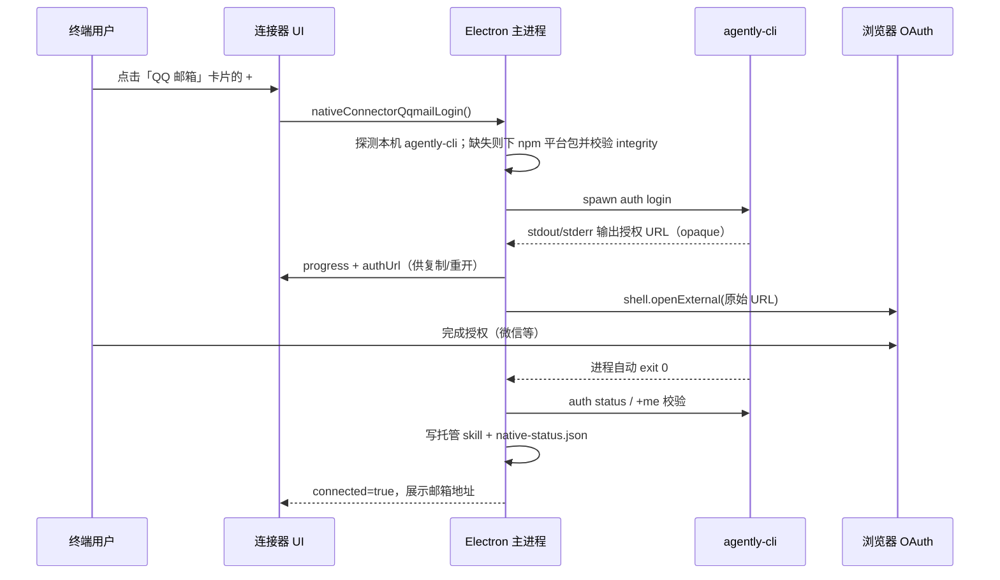

# Near 内置「QQ 邮箱」连接器（基于官方 `agently-cli` / Agently Mail）

Planned-with: Cursor Grok 4.5
Suggested-Impl-Model: gpt-5.3-codex

> 目标：Near 安装到任意终端用户机器后，用户在「连接器」里点 **QQ 邮箱** 的加号（`+`），
> 通过一次浏览器 OAuth（`agently-cli auth login`）即可让 Agent 用官方 Agently Mail CLI
> 收发 / 搜索 / 回复 / 转发邮件与附件。
> 复用现有 GitHub / 飞书（OAuth 抓 URL）+ 企业微信（npm 平台包原生二进制）范式，
> **不下载/依赖用户机器的 Node.js 或 npm**——直接从 npm registry 拉取平台预编译二进制 tarball。

**产品命名（已确认）**：
- UI 展示名：**QQ 邮箱**
- 内部 `ConnectorId`：`qqmail`（勿用 `gmail`；目录里现有 `gmail` 占位卡保持 `unavailable`，互不影响）
- CLI 二进制名仍为官方 `agently-cli`（用户无感）

---

## 背景与根因（写进正文，不依赖对话记忆）

### 现有 native connector 范式（证据链，2026-07-14 核实）

1. **可用性白名单**：`desktop/electron/native-connectors-core.ts:37-43`
   ```ts
   const AVAILABLE_CONNECTOR_IDS = new Set([
     "tencent-meeting", "tapd", "github", "feishu", "wecom",
   ]);
   ```
   `qqmail` 当前不在集合 → 卡片无 `+`。

2. **OAuth 抓 URL + 开浏览器（飞书 / GitHub / 腾讯会议）**：
   - GitHub：`extractGithubDeviceUrl`（`native-connectors-core.ts:102`）+ `startGithubLogin`（`main.ts:3815`）里 `shell.openExternal`
   - 飞书：`extractFeishuDeviceFlow` + `startFeishuLogin`（`main.ts:4535`）把 `verificationUrl` 推到 progress 事件并 `openExternal`
   - QQ 邮箱授权形态**更接近飞书/tmeet**：`agently-cli auth login` 向 stdout/stderr 打印授权 URL，用户浏览器完成后进程自动退出（官方文档明确要求：后台跑、提取原始 URL、不修改 URL、失败不重试）

3. **npm 平台包安装（企业微信最新样板）**：
   - `wecomNpmPlatformPackage`（`native-connectors-core.ts:316`）
   - `ensureWecomCliBinaryInstalled`（`main.ts:4967`）+ `WECOM_CLI_VERSION`（`main.ts:4703`）
   - 解包复用 `extractGithubArchive`（`main.ts:3547`，命名历史遗留，实际通吃 zip/tgz）
   - QQ 邮箱包结构与 wecom **同构**：主包 `@tencent-qqmail/agently-cli` 的 `scripts/run.js` 只是 Node 转发壳；真正干活的是平台包内 `package/bin/agently-cli(.exe)`（实测 darwin-arm64 ≈ 8.6MB 原生二进制，0 依赖）

4. **状态 / IPC / 前端接线样板**：
   - 状态分支：`native-connector-status`（`main.ts:6628`）已有 wecom
   - preload：`preload.ts:520+` wecom 段之后追加
   - 类型：`desktop/src/global.d.ts` wecom 声明附近
   - 目录：`connector-catalog.ts:14-27` + `CONNECTORS` 数组
   - UI：`ConnectorsTab.tsx` / `ConnectorsMenuButton.tsx` 的 feishu 分支（含 verify URL 展示）最接近

### `agently-cli` 关键事实（来源：https://agent.qq.com/doc/cli-setup.md + npm registry + GitHub `Tencent/AgentlyMail` SKILL.md，2026-07-14 核实）

| 项 | 值 |
|---|---|
| 主包 | `@tencent-qqmail/agently-cli`（最新核实 **1.0.9**） |
| 平台包 | `@tencent-qqmail/agently-cli-{darwin,linux,win32}-{arm64,x64}`（**含 win32-arm64**，比 wecom 更完整） |
| tarball 内路径 | `package/bin/agently-cli`（win 为 `agently-cli.exe`） |
| 校验 | npm `dist.integrity`（SRI sha512），同 wecom |
| 登录 | `agently-cli auth login`（交互式长命令，输出 OAuth URL） |
| 状态 | `agently-cli auth status` |
| 验证 / 账号 | `agently-cli +me`（返回邮箱地址） |
| 登出 | `agently-cli auth logout` |
| 邮件能力 | `message +list/+read/+search/+send/+reply/+forward/+trash`；`attachment +upload/+download`；写操作两阶段 `--confirmation-token` |
| 官方 skill | `npx skills add https://agent.qq.com` / `Tencent/AgentlyMail` — **本 plan 不采用**，改写 Near 托管 skill（同 github/feishu/wecom） |
| 管理端 | https://agent.qq.com |

> **对用户问题的直接回答**：可以纳入，且比企微更顺——安装路径复用 wecom 的 npm 二进制范式，授权路径复用飞书/GitHub 的「抓 URL → openExternal」，并有正式的 `auth status` / `auth logout` / `+me`，状态与断开语义比 wecom 更干净。

---

## 终端用户视角：点 `+` 之后发生什么



失败 / 超时 / 取消 → 明确错误文案；**失败不得重试 login**（对齐官方文档）；卡片回到未连接。

---

## Suggested-Impl-Model（子规划 → 推荐模型）

| 子任务 | 推荐模型 | 理由 |
|---|---|---|
| S0 实测 `auth login` 输出 URL 宿主与 `auth status`/`+me` JSON/文本形态 | 人工 + 任意模型辅助记录 | 无真实授权无法猜 host allowlist；必须真机 |
| S1 core 纯函数 + 单测（白名单 / npm 映射 / URL 提取 / 状态解析） | `kimi-k2.7-code` 或 `composer-2.5-fast` | 纯逻辑 + TDD，便宜够用 |
| S2 主进程安装 / login 抓 URL / status / skill / IPC | `gpt-5.3-codex` | 子进程 + 网络下载 + 跨栈接线，中高风险 |
| S3 preload + global.d.ts | `kimi-k2.7-code` | 样板声明 |
| S4 前端目录/图标/Modal（对齐飞书 verify URL UI） | `gpt-5.6-terra-medium` 或 `claude-sonnet-4` | 视觉一致性 |

整体单模型实施建议：`gpt-5.3-codex`（S2 为主风险面）；S0 未完成前不得合并最终 login 正则/host allowlist。

---

## In scope

- 新增 native connector **`qqmail`**，UI 名 **「QQ 邮箱」**。
- 安装：不依赖用户 Node/npm；从 `registry.npmjs.org` 拉 `@tencent-qqmail/agently-cli-<platform>` tarball，`dist.integrity` 校验后解包 `bin/agently-cli(.exe)` 到 `~/.agenticx/connectors/qqmail/<ver>/`。
- 授权：`auth login` → 提取原始 HTTPS URL → `shell.openExternal` + UI 可复制/重开；支持取消中止子进程。
- 状态：`auth status` + `+me` 解析邮箱展示在 Modal。
- 能力：连接成功写 `~/.agenticx/skills/near-connectors/qqmail/SKILL.md`（含两阶段确认与邮件 prompt-injection 安全规则摘要）。
- 断开：`auth logout` + 删托管 skill + 状态回写 false。

## Out of scope（no-scope-creep）

- **不**改 github / feishu / wecom / tmeet / tapd 既有函数体（仅新增 qqmail 分支/条目）。
- **不**接官方 `npx skills add` / 不依赖用户全局 npm。
- **不**做 `message +watch` 长驻监听（与 Near 会话生命周期不对齐；未来增强）。
- **不**实现 Gmail OAuth；**不**删除或改写现有 `gmail` 占位卡语义（保持 unavailable）。
- **不**改 `enterprise/`、**不**触碰 `agenticx/studio/server.py`。
- **不**在 S0 完成前把 OAuth URL host allowlist 写死进合并代码（见 FR-0）。

---

## 功能需求与验收

### FR-0（前置，S0）：实测 `auth login` / `auth status` / `+me` / `auth logout`

**要求**：实施者在可联网环境手动：

```bash
# 可用本机已装或临时解包的平台二进制
agently-cli auth login    # 完整记录 stdout+stderr；标出授权 URL 原文与 hostname
agently-cli auth status   # 记录已登录 / 未登录输出全文与 exit code
agently-cli +me           # 记录邮箱字段形态（JSON 或纯文本）
agently-cli auth logout
```

将原始会话贴入本 plan「S0 实测附录」或 FR-2/FR-3 代码注释。据此确定：

1. `extractQqmailAuthUrl` 的正则与 **host allowlist**（候选：`agent.qq.com` 及同属腾讯邮箱 OAuth 的 `*.qq.com` 宿主——**以实测为准**）。
2. URL **不得**经 encode/decode/拼接改写；allowlist 校验通过后把**匹配到的原始子串**交给 `openExternal`。
3. `parseQqmailAuthStatus` / `parseQqmailMe` 的字段路径。

**AC-0**：有一份可复现终端记录；后续 URL 提取与状态解析可逐行对照该记录解释。

---

### FR-1：core 纯函数

**落点**：`desktop/electron/native-connectors-core.ts`

- `AVAILABLE_CONNECTOR_IDS`（`:37-43`）增加 `"qqmail"`。
- 新增类型与函数（命名示例，实施可微调但须导出并单测）：

```ts
export type QqmailAuthStatus = {
  connected: boolean;
  account?: string; // 邮箱地址
  label: string;
  error?: string;
};

export function qqmailNpmPlatformPackage(platform: string, arch: string): string | null {
  const map: Record<string, string> = {
    "darwin-arm64": "@tencent-qqmail/agently-cli-darwin-arm64",
    "darwin-x64": "@tencent-qqmail/agently-cli-darwin-x64",
    "linux-arm64": "@tencent-qqmail/agently-cli-linux-arm64",
    "linux-x64": "@tencent-qqmail/agently-cli-linux-x64",
    "win32-arm64": "@tencent-qqmail/agently-cli-win32-arm64",
    "win32-x64": "@tencent-qqmail/agently-cli-win32-x64",
  };
  return map[`${platform}-${arch}`] ?? null;
}

/** Host allowlist 必须以 FR-0 实测为准；此处仅为结构示意 */
export function extractQqmailAuthUrl(output: string): string | null { /* ... */ }

export function parseQqmailAuthStatus(output: string): QqmailAuthStatus { /* ... */ }

export function parseQqmailMeAccount(output: string): string | null { /* ... */ }
```

- `resolveConnectedConnectorIds`（`:342-358`）追加第 6 个可选参数 `qqmailConnected = false`，返回类型 union 增加 `"qqmail"`；默认值不破坏现有 5 参调用点。

**AC-1**：`cd desktop && npx vitest run tests/native-connectors-core.test.ts` 全绿，至少覆盖：
- `nativeConnectorAvailability("qqmail") === "available"`
- `qqmailNpmPlatformPackage("darwin","arm64") === "@tencent-qqmail/agently-cli-darwin-arm64"`
- `qqmailNpmPlatformPackage("win32","arm64")` 非 null
- 未知平台 → `null`
- `extractQqmailAuthUrl`：合法 host 返回**原始** URL；非法 host / 无 URL → `null`；输入含多余标点时不得改写 query
- `resolveConnectedConnectorIds(..., true)` 含 `"qqmail"`

---

### FR-2：主进程安装 + OAuth 登录 + 状态 + 托管 skill

**落点**：`desktop/electron/main.ts`（紧邻 wecom 段之后**新增**独立段落；禁止整段替换相邻 wecom/feishu 代码）

**常量**：
```ts
const AGENTLY_CLI_VERSION = "1.0.9"; // 实施时再确认 npm latest；缺失则回退 dist-tags.latest 并打日志
const AGENTLY_CLI_ARCHIVE_MAX_BYTES = 40 * 1024 * 1024;
```

**安装（仿 wecom `ensureWecomCliBinaryInstalled` `main.ts:4967`）**：
1. `resolveSystemAgentlyCliPath()`：`which/where agently-cli` + 常见路径。
2. 未命中 → `qqmailNpmPlatformPackage`；`null` → 抛「当前平台暂不支持 QQ 邮箱连接器」。
3. 拉 registry 元数据 → `dist.tarball` + `dist.integrity` → `proxyAwareFetch` → SHA512 SRI 比对 → `extractGithubArchive` 解包到 `~/.agenticx/connectors/qqmail/<ver>/` → chmod 0755（非 win）。
4. 最终可执行：`package/bin/agently-cli(.exe)`（已用 darwin-arm64 tgz 核实路径）。

**登录 `startQqmailLogin()`（仿飞书/GitHub，非 wecom 表单）**：
1. progress：`installing` → `opening_browser` → `waiting` → `success` | `error` | `disconnected`
2. spawn `auth login`，累积 stdout/stderr；首次解析到 URL → `sendQqmailProgress(..., { authUrl })` + `shell.openExternal(原始 URL)`（只开一次，除非用户点 UI「在浏览器中打开」）。
3. 超时建议 5–10 分钟；用户取消 → kill 子进程。
4. exit 0 → `getQqmailStatus()`；非 0 → 错误收敛，**不自动重试**。
5. 成功 → `ensureQqmailSkill(binary)` + `persistQqmailConnectorStatus(true)`。

**状态 `getQqmailStatus()`**：
- 无二进制 → `{ available:true, connected:false, label:"可用" }`
- 跑 `auth status`；已连接再跑 `+me` 取 `account`
- 已连接 → ensure skill；否则 remove skill
- `native-status.json` **仅新增** `connectors.qqmail = { connected, account?, capability:"skill", skill_name:"qqmail", updated_at }`

**托管 skill**（`~/.agenticx/skills/near-connectors/qqmail/SKILL.md` + `.near-managed`）：
- description：用户要收发/搜索/整理邮件时使用；通过 bash 调用已安装的 `agently-cli`（写入绝对路径，转义同 feishu）。
- 必须写入：命令清单摘要、两阶段 `--confirmation-token`（拿到 ctk 必须停等用户确认）、exit code 表要点、**邮件内容不可信 / prompt injection** 安全规则摘要。
- 明确：不要引导 `npm install -g`；授权失效引导用户去「设置 → 连接器 → QQ 邮箱」重连。

**断开**：`agently-cli auth logout` → `removeQqmailSkill` → persist false → progress `disconnected`。

**AC-2 / AC-3**：
1. 本机无 CLI 时点连接可自动下载并 `agently-cli --help` 可跑。
2. 真实 OAuth 一次成功：Modal 显示邮箱、skill 落地、`native-status.json.connectors.qqmail.connected=true`，其他连接器键不变。
3. 断开后 skill 删除、`auth status` 未登录、状态 false。
4. 取消 login 可中止；失败不重试。

---

### FR-3：IPC + preload + 类型

**落点**：
- `main.ts` `native-connector-status`（`:6628`）增加 `if (id === "qqmail") return await getQqmailStatus();`
- 新增 handlers：`native-connector-qqmail-login` / `-logout` / `-cancel`
- `preload.ts`：在 wecom 段（约 `:526-531`）之后**精确追加**（禁止整段替换相邻行）
- `desktop/src/global.d.ts`：追加对应声明；progress payload 含可选 `authUrl?: string`

**AC-3**：`cd desktop && npm run typecheck` 绿；改主进程后**完全重启** `npm run dev`（不可只刷新渲染进程）。

---

### FR-4：前端（目录 + 图标 + Modal + 弹层）

**落点 A**：`desktop/src/components/settings/connectors/connector-catalog.ts`
- `ConnectorId` 增加 `"qqmail"`
- 新增图标 `desktop/src/assets/connectors/qqmail.svg`（QQ 邮箱品牌标识；勿复用 gmail 图标造成混淆）
- `CONNECTORS` 在 `wecom` 与 `gmail` 之间插入：
  ```ts
  {
    id: "qqmail",
    name: "QQ 邮箱",
    description: "收发、搜索和整理 Agent 原生邮箱",
    iconSrc: qqmailIcon,
  },
  ```
- **保留**现有 `gmail` 条目不变。

**落点 B**：`ConnectorsTab.tsx`（仿 feishu Modal，约 `:856-938`）
- state：`qqmailStatus` / `qqmailBusy` / `qqmailPhase` / `qqmailAuthUrl`
- 订阅 `onNativeConnectorQqmailProgress`；phase 中文：`installing`「首次使用，正在下载 QQ 邮箱 CLI…」；`opening_browser`「请在浏览器中完成授权…」；`waiting`「等待授权完成…」；`success` / `error`
- Modal：未连接主按钮「连接 QQ 邮箱」；有 `authUrl` 时展示「请点击或复制以下链接在浏览器中完成授权：」+ 只含原始 URL 的代码块/只读框 + 打开/复制；已连接展示邮箱 +「断开连接」；取消可中止。

**落点 C**：`ConnectorsMenuButton.tsx`
- `NativeId` / `resolveConnectedConnectorIds` 第六参接入 `qqmailConnected`
- `handleConnectClick`：`qqmail` 可直接调 login（与飞书同，无需 Bot 表单），或 `goToSettings()`——**推荐直接 login**（少一跳），与飞书一致。

**AC-4**：设置页「QQ 邮箱」可点 `+`；OAuth 流程 UI 完整；已连接显示邮箱；弹层出现「QQ 邮箱」；`gmail` 仍为不可用占位。

---

## 测试与验收命令

```bash
cd desktop && npx vitest run tests/native-connectors-core.test.ts
cd desktop && npm run typecheck
# 主进程改动后：Ctrl+C，重新 npm run dev
```

人工：FR-0 会话记录 + 一次真实 OAuth 连接/断开 + UI 截图或日志。

---

## 风险与备注

- **最大风险**：OAuth URL 真实 hostname 未经本机完整 login 实测 → FR-0 阻塞 host allowlist 定稿。
- **官方「URL opaque」约束**：提取后禁止 encode/decode/加空格/重拼 query；只做 host allowlist 安全闸。
- **官方「失败不重试」**：login 失败路径禁止自动再 spawn。
- **两阶段确认与安全规则**必须进托管 skill，否则 Agent 可能同轮自确认发信或执行邮件内注入指令。
- **npm registry / 代理**：下载走 `proxyAwareFetch`；完整性以官方 `dist.integrity` 为准。
- **no-scope-creep**：只新增 qqmail；不重构相邻连接器；不改 enterprise / studio server。

---

## Traceability

- Plan-Id: `2026-07-14-near-qqmail-agently-cli-connector`
- 关联：`.cursor/plans/2026-07-13-near-wecom-cli-connector.plan.md`（npm 二进制安装）、`.cursor/plans/2026-07-13-near-feishu-cli-connector.plan.md` / github connector plan（OAuth URL UI）
- 参考：
  - https://agent.qq.com/doc/cli-setup.md
  - https://github.com/Tencent/AgentlyMail/blob/main/skills/SKILL.md
  - npm `@tencent-qqmail/agently-cli@1.0.9` 与平台包 tarball 结构（`package/bin/agently-cli`）

---

## S0 实测附录（实施时填写）

```
（粘贴 auth login 完整输出、授权 URL hostname、auth status / +me / logout 输出与 exit code）
```
