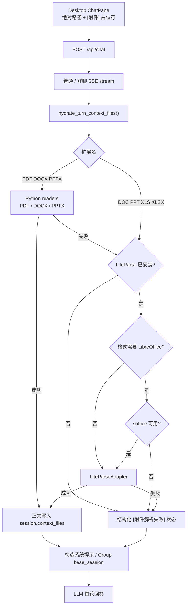

# Desktop 文档附件确定性解析实施计划

Planned-with: GPT-5.6 Sol

Suggested-Impl-Model: gpt-5.6-sol-medium

> **Plan-Id:** `2026-07-16-desktop-document-attachment-hydration`  
> **实施入口:** 使用 `executing-plans` skill 按阶段实施；每个阶段先写失败测试，再写最小实现。  
> **目标:** 用户在 Desktop 首轮消息中附加 PDF 或 Office 文档后，模型无需猜测文件位置或依赖自主工具调用，即可获得可用正文；解析能力缺失时，系统必须承认附件已收到并给出准确、可操作的依赖提示。  
> **架构:** 在 `agx serve` 的聊天流启动后、系统提示构造前，对本轮文档占位符执行确定性水合。PDF/DOCX/PPTX 优先使用随 Desktop 后端打包的 Python readers；旧 Office、Excel 等格式使用 LiteParse，且按格式检测 LibreOffice。解析结果或结构化失败状态写入 `session.context_files`，占位符仅保留为异常兜底。  
> **技术栈:** Python 3.10+、FastAPI/SSE、AgenticX knowledge readers、LiteParse CLI、LibreOffice、pytest、Electron/React（本计划不修改 Desktop UI）。

---

## 0. 方案判断

Grok 4.5 提出的方向“上传后由后端主动解析，失败时给明确依赖提示，不再把成败押在模型是否主动调用 `liteparse`”是合理的；但必须做三处修正后才能实施：

1. **不能把所有文档都强制路由到 LiteParse。**
   - `agenticx/knowledge/readers/pdf_reader.py`、`word_reader.py`、`powerpoint_reader.py` 已能处理 PDF、DOCX、PPTX。
   - 这些 Python 依赖已属于 Desktop runtime，并由 PyInstaller 打包；它们应成为上述格式的默认路径。
   - 如果仍统一要求用户安装 Node 版 LiteParse，会让本可开箱即用的 PDF 简历退化为外部依赖。

2. **LibreOffice 不能被描述成 LiteParse 的替代品。**
   - 当前仓库没有独立的 `soffice` 文档解析工具。
   - LibreOffice 只作为 LiteParse 转换旧 Office / Excel 的下游依赖。
   - “只有 LibreOffice、没有 LiteParse”时，聊天侧仍不能解析 `.doc/.ppt/.xls/.xlsx`；错误必须明确指出仍缺 LiteParse。

3. **不能只改占位文案。**
   - 文案只能提高模型主动调用工具的概率，无法保证依赖存在、调用成功或调用正确路径。
   - 正确修复必须在模型运行前完成正文水合；失败也要写入结构化状态，使模型知道“附件存在，但当前环境无法解析”，禁止再搜索分身 workspace 后声称文件不存在。

因此，本计划采纳 Grok 4.5 的主方向，但不采用“所有格式统一 LiteParse”与“只靠提示词兜底”的版本。

---

## 1. 根因与证据链

### 1.1 Desktop 已成功取得真实绝对路径

- `desktop/src/components/ChatPane.tsx:6766-6779` 的 `parseLocalFile()` 对 PDF/Office 调用 `window.agenticxDesktop.getPathForFile(file)`，并把绝对路径保存到 `AttachedFile.sourcePath`。
- `desktop/src/components/ChatPane.tsx:7689-7708` 的 `sendChat()` 使用 `buildContextFileKeyFromAttachment()` 将该绝对路径作为 `context_files` key。
- 因此，本次异常不是“附件没上传”或“路径丢失”。

### 1.2 发送给后端的 value 只有占位符

- 同一分支把内容固定写为：

```typescript
content: `[附件] ${file.name}`
```

- `sendChat()` 又将 `ready.content` 原样放入请求。
- 实际 session 中的 `context_files_refs.json` 已记录正确 PDF 路径，但 `messages.json` 的附件大小是占位符 UTF-8 长度 58 字节，不是真实文件大小。

### 1.3 后端没有水合步骤

- `agenticx/studio/server.py:1607-1616` 的 `_normalize_context_files()` 只做字符串规范化。
- `agenticx/studio/server.py:2451-2452` 直接把占位符更新到 `session.context_files`。
- `agenticx/runtime/prompts/meta_agent.py:457-474` 将占位符原样写进系统提示。
- 现有提示只笼统建议普通路径可用于 `file_read`；但 `file_read` 对 PDF/Office 是错误工具，正确工具应是文档 reader 或 `liteparse`。

### 1.4 当前成功依赖模型偶然选对工具

- 首轮模型先在分身 workspace 中执行 `list_files` / `find`，最终错误地回复“没有找到简历”。
- 用户第二轮再次 `@文件名` 后，模型才找到绝对路径并调用 `liteparse`，随后成功解析。
- 这证明附件链路是“路径已到达、正文未到达、工具决策不确定”，不是用户操作问题。

### 1.5 当前依赖组合的真实能力

- PDF：默认可走 Python `PDFReader`，不应要求 LiteParse 或 LibreOffice。
- DOCX：默认可走 Python `WordReader`，不应要求 LibreOffice。
- PPTX：默认可走 Python `PowerPointReader`，不应要求 LibreOffice。
- DOC/PPT/XLS/XLSX：当前稳定路径是 LiteParse；仓库又将这些格式列入 `_LIBREOFFICE_REQUIRED_EXTS`，因此需要 LiteParse + LibreOffice。
- 只有 LibreOffice：当前没有直接调用 `soffice` 的产品级解析入口，不能独立完成上述格式解析。
- 只有 LiteParse、没有 LibreOffice：PDF/图片通常可解析；旧 Office/Excel 必须快速失败并提示安装 LibreOffice。

---

## 2. 需求与验收标准

### FR-1：首轮确定性水合文档正文

收到 `context_files` 后，只对 value 为 `[附件] ...` 或 `[文件引用] ...`、key 为本机绝对文件路径、扩展名属于允许列表的本轮条目执行解析。

允许列表：

```python
{".pdf", ".doc", ".docx", ".ppt", ".pptx", ".xls", ".xlsx"}
```

解析必须发生在对应聊天流内部、系统提示构造之前，避免阻塞 `/api/chat` 返回 `StreamingResponse` 的 HTTP 握手。

**AC-1.1**

- 上传 PDF 并在同一条消息要求总结。
- 第一轮系统提示中的该 `context_files` value 包含 PDF 抽取文本，不再只是 `[附件] filename.pdf`。
- 模型无需调用 `list_files`、`find`、`bash_exec` 或 `liteparse` 即可回答。

**AC-1.2**

- 普通文本 `context_files`、skill 虚拟 key、图片 `image_inputs` 保持原行为。
- 已经含真实正文的 context item 不重复解析。

### FR-2：按格式选择最低依赖解析器

路由规则必须固定为：

```text
PDF / DOCX / PPTX
  -> Python native reader
  -> native reader 失败且 LiteParse 已安装时，允许 LiteParse 兜底
  -> 两路均失败时返回结构化失败

DOC / PPT / XLS / XLSX
  -> 检查 LiteParse
  -> 再检查 LibreOffice
  -> 两者齐备才调用 LiteParse
```

**AC-2.1**

- 模拟 LiteParse 和 LibreOffice 均未安装时，PDF 仍可通过 stubbed native reader 成功水合。

**AC-2.2**

- 模拟只有 LibreOffice、没有 LiteParse，XLSX 返回 `liteparse_missing`，不得声称 LibreOffice 已足够。

**AC-2.3**

- 模拟只有 LiteParse、没有 LibreOffice，XLSX 返回 `libreoffice_missing`，包含当前平台安装命令。

**AC-2.4**

- 模拟两者均可用，XLSX 通过 LiteParse 返回正文。

### FR-3：解析失败时承认附件存在

失败不得删除附件、不得把 value 恢复为含糊占位符，也不得让模型自行猜测。写入 session 的失败 value 必须使用稳定格式：

```text
[附件解析失败]
文件：<basename>
状态码：<stable_code>
原因：<user-facing reason>
处理建议：<actionable hint>
```

稳定状态码至少包含：

```text
path_missing
path_not_file
unsupported_extension
file_too_large
liteparse_missing
libreoffice_missing
parse_timeout
parse_failed
empty_content
```

**AC-3.1**

- LiteParse 缺失时，模型看到的是“附件已收到，但当前格式缺少 LiteParse”，不得回复“工作区没有找到文件”。

**AC-3.2**

- 失败状态不得包含 Python traceback、Node stack、用户目录之外的敏感环境信息或重复安装提示。

### FR-4：有界资源消耗与上下文预算

水合必须限制：

- 每轮最多解析 4 个文档。
- 单文件最大 25 MiB；超过后写入 `file_too_large`。
- 同时最多解析 2 个文档。
- 单文件超时 30 秒。
- 单文件注入正文最多 8,000 字符。
- 一轮所有 context files 注入总预算最多 16,000 字符。

超出正文预算时追加稳定标记：

```text
...(document context truncated)
```

**AC-4.1**

- 5 个占位文档中只有前 4 个进入解析器，第 5 个得到有意义的资源限制状态。
- 解析超时不会中止整个聊天轮次。
- 多文件不会突破总字符预算。

### FR-5：附件历史元数据使用真实文件大小

`_history_attachments_from_context_files()` 在 `source_path` 是现存普通文件时，应使用 `Path.stat().st_size`；只有路径不可读时才回退到 value 的 UTF-8 长度。

**AC-5.1**

- 728 KiB PDF 经 session 重载后仍显示约 728 KiB，不再显示 58 B。
- 路径消失时历史记录生成仍不抛异常。

### FR-6：正常聊天与群聊行为一致

普通 Meta / 分身聊天与群聊都必须在各自系统提示或 `base_session` 被消费前完成相同水合，不允许一条链路修好、另一条仍依赖模型自行找文件。

**AC-6.1**

- `/api/chat` 普通路径和 `group_id` 路径都调用同一个水合 helper。
- 两条路径都保留原始附件历史 metadata。

---

## 3. 目标架构



---

## 4. 实施任务

### Task 1：建立与 KB 解耦的共享文档正文提取器

**Files**

- Create: `agenticx/tools/document_text.py`
- Modify: `agenticx/studio/kb/runtime.py:1191-1326`
- Modify: `agenticx/tools/adapters/liteparse.py:52-76`
- Create: `tests/tools/test_document_text.py`
- Modify: `tests/test_kb_runtime.py:707-818`

**Step 1：先写失败测试**

在 `tests/tools/test_document_text.py` 覆盖：

1. `test_pdf_uses_native_reader_without_liteparse`
2. `test_docx_uses_native_reader_without_libreoffice`
3. `test_pptx_uses_native_reader_without_libreoffice`
4. `test_xlsx_requires_liteparse_before_libreoffice`
5. `test_xlsx_requires_libreoffice_after_liteparse`
6. `test_xlsx_uses_liteparse_when_dependencies_exist`
7. `test_native_reader_can_fallback_to_liteparse`
8. `test_parser_returns_empty_content_error`
9. `test_parser_translates_raw_libreoffice_error`

测试不得运行真实 CLI，全部 monkeypatch reader、`LiteParseAdapter` 与 executable probe。

**Step 2：验证测试先失败**

```bash
pytest -q tests/tools/test_document_text.py
```

Expected: FAIL，因为共享模块和异常类型尚不存在。

**Step 3：实现共享模块**

`agenticx/tools/document_text.py` 顶部使用仓库标准 module docstring 并包含 `Author: Damon Li`。所有 imports 放在文件顶部，不使用相对 import。

公开类型：

```python
class DocumentTextError(RuntimeError):
    code: str
    user_message: str
    install_hint: str | None


async def read_document_text(path: Path) -> str:
    ...


def read_document_text_sync(path: Path) -> str:
    ...


def libreoffice_available() -> bool:
    ...


def libreoffice_install_hint() -> str:
    ...
```

实现要求：

- `read_document_text()` 是异步主入口。
- native readers 的 `read()` 返回 coroutine 时直接 `await`，不得在 FastAPI event loop 中调用 `asyncio.run()`。
- `read_document_text_sync()` 仅供当前 KB worker 同步路径调用，并在 docstring 中明确不能从运行中的 event loop 调用。
- 从 reader 文档对象中统一抽取非空 `content`。
- LiteParse 相关异常统一转换成 `DocumentTextError`，禁止透传原始多行 stack。

**Step 4：修正 LiteParse 可用性探测**

`LiteParseAdapter.is_available()` 不得把“系统存在任意 `npx`”等价为“LiteParse 已安装”，避免聊天过程中隐式联网下载 npm 包。

`_find_cli()` 按以下顺序查找：

1. 构造时显式 `cli_path`
2. PATH 中的 `liteparse` / Windows 对应命令
3. 项目或仓库的 `node_modules/.bin/liteparse`

不再使用裸 `npx liteparse` 自动安装。安装仍由用户在设置页或终端明确执行。

**Step 5：让 KB 保持兼容**

`agenticx/studio/kb/runtime.py` 保留现有私有函数名作为兼容 wrapper：

```python
def _read_document_text(source_path: str) -> str:
    try:
        return read_document_text_sync(Path(source_path).expanduser())
    except DocumentTextError as exc:
        raise KBError(exc.user_message) from exc
```

`_read_with_liteparse()`、`_libreoffice_available()`、`_libreoffice_install_hint()` 同样保留薄 wrapper，避免 `kb/routes.py`、Brain 和既有调用点在本计划中发生无关重构。

**Step 6：更新既有测试 monkeypatch 落点**

`tests/test_kb_runtime.py` 从测试私有实现细节改为测试 wrapper 的错误翻译和路由结果；共享路由矩阵全部放在 `tests/tools/test_document_text.py`。

**Step 7：运行测试**

```bash
pytest -q tests/tools/test_document_text.py tests/test_kb_runtime.py tests/test_kb_routes.py
```

Expected: PASS。

---

### Task 2：实现 context_files 占位符水合

**Files**

- Create: `agenticx/studio/context_file_hydration.py`
- Create: `tests/test_context_file_hydration.py`

**Step 1：先写失败测试**

覆盖：

1. `test_hydrates_pdf_placeholder_from_absolute_path`
2. `test_does_not_reparse_existing_text_content`
3. `test_ignores_skill_virtual_key`
4. `test_ignores_image_marker`
5. `test_missing_path_becomes_structured_failure`
6. `test_parser_failure_preserves_attachment_identity`
7. `test_limits_files_per_turn`
8. `test_limits_concurrency_to_two`
9. `test_times_out_one_file_without_failing_others`
10. `test_truncates_each_document_to_context_budget`

**Step 2：验证测试先失败**

```bash
pytest -q tests/test_context_file_hydration.py
```

Expected: FAIL，因为 helper 尚不存在。

**Step 3：实现纯 helper**

公开入口：

```python
@dataclass(frozen=True)
class ContextHydrationReport:
    attempted: int
    succeeded: int
    failed: int
    skipped: int


async def hydrate_turn_context_files(
    turn_context_files: dict[str, str],
    session_context_files: dict[str, str],
) -> ContextHydrationReport:
    ...
```

关键行为：

- 仅识别精确前缀 `[附件] ` 与 `[文件引用] `。
- 仅处理绝对路径、普通文件、允许扩展名。
- 先检查已有 `session_context_files[path]`：若同一路径已经是正文，不用 incoming 占位符覆盖它。
- 使用 `asyncio.Semaphore(2)` 限制并发。
- 使用 `asyncio.wait_for(..., timeout=30)` 限制单文件时间。
- 成功后把正文写回 `session_context_files[path]`。
- 失败后写入稳定的 `[附件解析失败]` block。
- 不修改 `turn_context_files`，保证消息历史仍基于用户本轮原始附件引用生成。
- 日志只记录状态码、扩展名、耗时；不得打印文档正文或完整用户目录。

**Step 4：运行测试**

```bash
pytest -q tests/test_context_file_hydration.py
```

Expected: PASS。

---

### Task 3：统一 context_files 的提示预算与失败语义

**Files**

- Create: `agenticx/runtime/context_file_budget.py`
- Modify: `agenticx/runtime/prompts/meta_agent.py:454-474`
- Modify: `agenticx/runtime/agent_runtime.py:801-807`
- Create: `tests/test_context_file_prompt.py`

**Step 1：先写失败测试**

覆盖：

1. `test_context_prompt_includes_hydrated_document_text`
2. `test_context_prompt_does_not_claim_failed_attachment_is_missing`
3. `test_context_prompt_limits_one_file_to_8000_chars`
4. `test_context_prompt_limits_all_files_to_16000_chars`
5. `test_runtime_context_serialization_uses_same_budget`

**Step 2：验证测试先失败**

```bash
pytest -q tests/test_context_file_prompt.py
```

Expected: FAIL。

**Step 3：实现共享预算函数**

`agenticx/runtime/context_file_budget.py` 定义：

```python
MAX_CONTEXT_FILE_CHARS = 8_000
MAX_CONTEXT_FILES_TOTAL_CHARS = 16_000
TRUNCATION_MARKER = "\n...(document context truncated)"


def serialize_context_files(context_files: Mapping[str, str]) -> str:
    ...
```

`meta_agent._build_context_files_block()` 与 `agent_runtime._serialize_context_files()` 必须复用同一预算函数，避免 Meta 首轮和后续 runtime/tool round 看到不同内容。

**Step 4：更新系统提示语义**

替换当前笼统的“普通文件路径可用于 file_read”提示，明确：

- context block 已有正文时直接使用正文。
- `[附件解析失败]` 表示附件真实存在但环境无法解析；不得声称未找到文件，也不得在 workspace 中盲搜同名文件。
- 失败 block 已给依赖原因时，不得重复调用同一解析工具。
- 仅遇到未水合的文档占位符时，才允许按绝对路径调用 `liteparse`；PDF/Office 不得使用 `file_read`。
- `skill:` 虚拟 key 规则保持不变。

**Step 5：运行测试**

```bash
pytest -q tests/test_context_file_prompt.py
```

Expected: PASS。

---

### Task 4：接入普通聊天和群聊 SSE

**Files**

- Modify: `agenticx/studio/server.py:2409-2452`
- Modify: `agenticx/studio/server.py:2669-2786`
- Modify: `agenticx/studio/server.py:2992-3178`
- Modify: `tests/test_studio_server.py`

**重要编辑约束**

`agenticx/studio/server.py` 是本地后端唯一入口，顶部 import 区极其敏感：

- 只能精确新增 `context_file_hydration` 所需 import。
- 禁止整段替换相邻 imports。
- 修改前后逐行检查 `agenticx.avatar.group_chat.GroupChatRegistry` 等既有 imports 未被删除。
- 完成后必须执行本计划第 6 节的冷启动 smoke。

**Step 1：先写失败测试**

在 `tests/test_studio_server.py` 增加：

1. `test_chat_hydrates_document_before_building_meta_prompt`
2. `test_chat_keeps_running_when_document_hydration_fails`
3. `test_group_chat_hydrates_document_before_router_turn`
4. `test_chat_does_not_hydrate_plain_context_twice`

测试通过 monkeypatch `hydrate_turn_context_files()` 与捕获 prompt/base session 验证顺序，不运行真实解析器。

**Step 2：验证测试先失败**

```bash
pytest -q \
  tests/test_studio_server.py::test_chat_hydrates_document_before_building_meta_prompt \
  tests/test_studio_server.py::test_chat_keeps_running_when_document_hydration_fails \
  tests/test_studio_server.py::test_group_chat_hydrates_document_before_router_turn
```

Expected: FAIL。

**Step 3：保留本轮 context map**

在 `_normalize_context_files()` 后只规范化一次：

```python
turn_context_files = _normalize_context_files(payload.context_files)
```

不要立即用占位符无条件覆盖已经水合的 session 内容。水合 helper 负责 merge。

历史附件构造继续使用 `turn_context_files`，禁止改用水合后的正文，以免把正文长度误当附件大小。

**Step 4：在普通聊天 stream 中水合**

在 `_produce_meta_events()` 开始后、`build_meta_agent_system_prompt()` 之前：

1. 发出一次无独立聊天气泡的 `tool_progress`：

```json
{
  "type": "tool_progress",
  "data": {
    "name": "document_parse",
    "elapsed_seconds": 0
  }
}
```

2. `await hydrate_turn_context_files(turn_context_files, session.context_files)`。
3. 完成后再构造 `sys_prompt`。
4. 水合失败只形成 context failure block，不抛出整轮 runtime error。

该位置确保：

- FastAPI 已返回 SSE response，不因解析阻塞握手。
- 模型第一轮已能看到正文或明确失败。
- Desktop 现有 `tool_progress` 处理会提供存活信号，不新增独立噪音气泡。

**Step 5：在群聊 stream 中复用同一 helper**

在 `_group_chat_stream()` 内、创建/调用 `GroupChatRouter.run_group_turn()` 前执行相同水合。不得复制解析规则，只调用 helper。

**Step 6：运行服务测试**

```bash
pytest -q tests/test_studio_server.py tests/test_context_file_hydration.py
```

Expected: PASS。

---

### Task 5：修复附件持久化大小

**Files**

- Modify: `agenticx/studio/server.py:1712-1798`
- Modify: `tests/test_studio_server.py`

**Step 1：先写失败测试**

增加：

1. `test_context_file_attachment_uses_source_file_size`
2. `test_context_file_attachment_size_falls_back_when_path_missing`

**Step 2：验证测试先失败**

```bash
pytest -q \
  tests/test_studio_server.py::test_context_file_attachment_uses_source_file_size \
  tests/test_studio_server.py::test_context_file_attachment_size_falls_back_when_path_missing
```

Expected: 第一个测试 FAIL，当前实现使用占位符字节数。

**Step 3：最小实现**

在识别到真实 `source_path` 后：

```python
try:
    size_val = Path(source_path).stat().st_size
except (OSError, ValueError):
    size_val = len(body.encode("utf-8"))
```

不读取文件正文，不改变附件 `name`、`kind`、`reference_token`、`source_path` 字段。

**Step 4：运行测试**

```bash
pytest -q tests/test_studio_server.py
```

Expected: PASS。

---

### Task 6：回归验证与冷启动验收

**Files**

- No production file changes in this task.

**Step 1：运行目标测试集**

```bash
pytest -q \
  tests/tools/test_document_text.py \
  tests/test_context_file_hydration.py \
  tests/test_context_file_prompt.py \
  tests/test_agent_tools.py \
  tests/test_kb_runtime.py \
  tests/test_kb_routes.py \
  tests/test_studio_server.py
```

Expected: 全部 PASS。

**Step 2：运行 Python 静态检查**

```bash
python -m compileall \
  agenticx/tools/document_text.py \
  agenticx/studio/context_file_hydration.py \
  agenticx/runtime/context_file_budget.py \
  agenticx/runtime/prompts/meta_agent.py \
  agenticx/runtime/agent_runtime.py \
  agenticx/studio/server.py
```

Expected: exit 0，无 SyntaxError。

如果仓库当前可用 Ruff，再运行：

```bash
ruff check \
  agenticx/tools/document_text.py \
  agenticx/studio/context_file_hydration.py \
  agenticx/runtime/context_file_budget.py \
  agenticx/runtime/prompts/meta_agent.py \
  agenticx/runtime/agent_runtime.py \
  agenticx/studio/server.py \
  tests/tools/test_document_text.py \
  tests/test_context_file_hydration.py \
  tests/test_context_file_prompt.py
```

Expected: exit 0。

**Step 3：执行强制 `agx serve` 冷启动 smoke**

选择未占用临时端口，例如 `18766`：

```bash
agx serve --host 127.0.0.1 --port 18766
```

在另一终端使用本机 token（如服务启用了 token）验证：

```bash
curl --noproxy '*' -fsS http://127.0.0.1:18766/api/session
curl --noproxy '*' -fsS http://127.0.0.1:18766/api/avatars
curl --noproxy '*' -fsS http://127.0.0.1:18766/api/sessions
```

Expected:

- `agx serve` 进程保持存活。
- 三个核心 API 均返回 HTTP 200。
- 日志无 `NameError`、import error 或启动 traceback。

**Step 4：人工依赖矩阵验证**

使用隔离 PATH 或 monkeypatch 构建四种环境：

1. 无 LiteParse、无 LibreOffice：PDF 首轮成功；XLSX 返回 `liteparse_missing`。
2. 仅 LibreOffice：PDF 首轮成功；XLSX 仍返回 `liteparse_missing`。
3. 仅 LiteParse：PDF 可成功；XLSX 返回 `libreoffice_missing`。
4. LiteParse + LibreOffice：PDF 与 XLSX 均成功。

**Step 5：复现原始用户路径**

新建 session，第一条消息同时附加一份 PDF 简历并要求基于简历输出反馈：

- 附件卡片显示真实大小。
- 状态区短暂显示 `document_parse` 活跃状态，不出现独立刷屏气泡。
- 第一轮回答直接引用简历内容。
- session 的 `messages.json` 保留 `source_path` 和真实 size。
- 模型不执行 `list_files`、全盘 `find`，也不回复“请重新上传简历”。

---

## 5. In scope

- Desktop 本地文件附件经 `/api/chat` 进入普通聊天或群聊的 PDF/Office 首轮解析。
- PDF/DOCX/PPTX 的内置 Python reader 路由。
- DOC/PPT/XLS/XLSX 的 LiteParse + LibreOffice 依赖检测。
- 解析失败状态注入、上下文预算、附件真实大小持久化。
- KB 仅做共享提取器兼容接线，保持现有外部行为。
- `server.py` 强制冷启动 smoke。

## 6. Out of scope

- 不修改 `desktop/src/components/ChatPane.tsx` 的附件选择、卡片或发送结构。
- 不处理工作区面板 `@PDF` 当前可能无法加入 `context_files` 的独立问题；后续应单独立项，避免将上传附件修复扩大为所有引用入口重构。
- 不处理微信、飞书等 IM adapter 的媒体占位符。
- 不新增直接调用 LibreOffice/`soffice` 的解析器；LibreOffice 本期仍只是 LiteParse 的格式转换依赖。
- 不自动安装 npm 包、LibreOffice 或其他系统依赖。
- 不修改图片 `image_inputs`、视觉模型判断或图片持久化链路。
- 不修改知识库索引、embedding、chunking 或检索逻辑。
- 不承诺扫描件 PDF OCR；本期仅沿用 native PDF reader 与可选 LiteParse 能力。
- 不将完整二进制或无限长度正文写入 session。
- 不顺手清理 `server.py` 现有 inline imports、异常吞噬或其他历史技术债。

---

## 7. 风险与控制

### 风险 1：解析延迟导致首 token 变慢

- 在 SSE stream 内执行，先完成 HTTP 握手。
- 发 `tool_progress` 提供存活信号。
- 单文件 30 秒超时、并发 2、每轮最多 4 个文件。
- 单文件失败不阻断其他文件和主聊天。

### 风险 2：附件可被伪造为任意路径

- 只接受本轮 `context_files` 中的绝对路径、普通文件和扩展名 allowlist。
- 延续现有 Desktop token 与本机权限边界。
- 不接受目录、device、pipe 或虚拟 `skill:` key。
- 不在日志打印正文。

### 风险 3：上下文膨胀

- 单文件 8,000 字符、总计 16,000 字符。
- Meta prompt 与后续 runtime 使用同一 serializer，避免预算漂移。
- 超限有明确截断标记。

### 风险 4：KB 行为回归

- 保留 `studio/kb/runtime.py` 私有函数兼容 wrapper。
- 共享模块先由既有 KB 测试锁定行为，再接聊天。
- 不改 ingest、chunk、embedding 与索引持久化。

### 风险 5：`server.py` import 回归导致 Desktop 全空

- 只精确新增目标 import，不替换 import block。
- 执行 `agx serve` 冷启动。
- `/api/session`、`/api/avatars`、`/api/sessions` 必须全部返回 200。

---

## 8. 提交建议（实施时使用，本次不提交）

建议拆成三个可独立验证的 commit：

1. `fix(document): add dependency-aware text extraction`
   - Shared extractor、LiteParse 探测、KB compatibility wrappers、单元测试。

2. `fix(studio): hydrate document attachments before model turns`
   - Hydration helper、prompt budget、普通/群聊接线、服务测试。

3. `fix(studio): persist real document attachment sizes`
   - 历史 metadata 修复、回归测试、冷启动证据。

每个 commit 只暂存本计划涉及文件，并使用以下 trailer 顺序：

```text
Plan-Id: 2026-07-16-desktop-document-attachment-hydration
Plan-File: .cursor/plans/2026-07-16-desktop-document-attachment-hydration.plan.md
Plan-Model: GPT-5.6 Sol
Impl-Model: <实施时由用户确认的实际模型>
Made-with: Damon Li
```

禁止在未确认实际实施模型前填写或猜测 `Impl-Model`。
