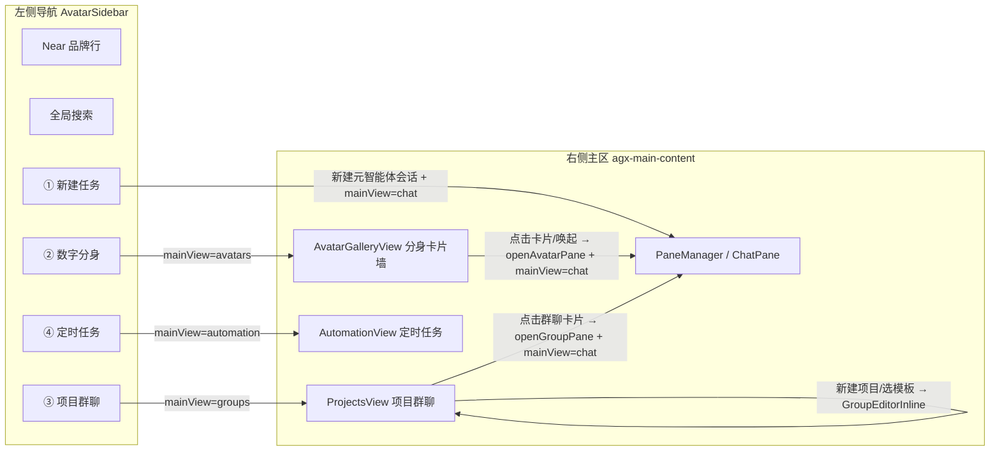

# Near Desktop 导航栏 按钮式导航重塑（主规划）

Planned-with: claude-opus-4.8

> 目标：把 Near Desktop 左侧导航从「直接平铺分身列表 / 群聊列表 / 定时列表」的三段可折叠列表，改造成 **「按钮导航 + 右侧主区视图」**。四个入口按钮（各带设计图标）：**新建任务 / 数字分身 / 项目群聊 / 定时任务**；点击后在**右侧主区域内联展示**对应内容（不是弹窗）。保留 Near 自身的品位与暗色极客气质，不做像素级复刻外部参考产品。

---

## 1. 背景与现状（根因/证据链，实施者可据此自判）

- 左侧导航主组件：`desktop/src/components/AvatarSidebar.tsx`（`export function AvatarSidebar()` L88）。当前结构自上而下：
  - macOS 交通灯占位（L791–792）
  - Meta-Agent 品牌行「Near vX.Y.Z」（L794–820），点击 `openOrFocusPane(null, META_AGENT_DISPLAY_NAME)`
  - 全局搜索 `GlobalSearchTrigger`（L822）
  - **分身分组**（L826–915）：`avatars.map` 渲染每个分身行，点击 `openOrFocusPane(avatar.id, avatar.name)`（L874）
  - **群聊分组**（L928–999）：`groups.map`，点击 `openOrFocusGroupPane(group)`（L966）
  - **定时分组**（L1011–…）：本地 `automationTasks.map`，点击 `openOrFocusAutomationPane(task)`（L1055）
- 主区渲染：`desktop/src/App.tsx` 的 `agx-main-content`（L2352–2367）只渲染 `PaneManager`（Pro）或 `LiteChatView`（Lite）。**当前没有任何「主区视图路由」状态**——主区永远是聊天窗格（`PaneManager` → `ChatPane`）。这是本次改造的核心缺口：需要新增一个 `mainView` 状态来切换主区展示「聊天 / 分身墙 / 项目群聊 / 定时任务」。
- 打开聊天窗格的三套核心逻辑目前**内嵌在 `AvatarSidebar` 组件里**：
  - `openOrFocusPane(avatarId, name)`（L411–514，含跨重启 remembered session 恢复 + `listSessions` 兜底）
  - `openOrFocusGroupPane(group)`（L536–573）
  - `openOrFocusAutomationPane(task)`（L575–658）
  改造后这些逻辑要被「分身墙卡片」「项目群聊卡片」复用，因此需抽成共享 hook（见子规划 A），避免复制粘贴导致会话恢复行为分叉。
- 「新建对话」现有机制：`ChatPane.tsx` 内 `createNewTopic(inherit, sessionMode)`（L9297–9315）——清空当前 pane 消息、置空 sessionId、标记 `markPaneAwaitingFreshSession`，延迟到首次发送才真正 `createSession`。目前**只能由 ChatPane 内部按钮触发**，没有对外事件入口。「新建任务」按钮需要一个跨组件触发通道（见子规划 A，新增 `agenticx:pane:new-topic` CustomEvent）。
- 定时任务界面已高度自包含：`desktop/src/components/automation/AutomationTab.tsx`（`AutomationTab`）+ 子组件 `TemplateGrid` / `TaskList` / `TaskFormPanel`，可直接在主区内联复用（见子规划 D）。
- 群聊「新建/编辑」弹窗目前是 `AvatarSidebar.tsx` 内联的 `GroupEditorInline`（L1246–1463），提交走 `window.agenticxDesktop.createGroup / updateGroup / deleteGroup`。项目群聊视图要复用它，需先抽成独立文件（见子规划 C）。
- 图标体系：混用 `lucide-react` + 自定义 SVG（如 `desktop/src/components/icons/AutomationTaskIcon.tsx`）。颜色体系：`desktop/src/utils/avatar-color.ts`（`avatarBgClass` / `groupColorByIndex` / `avatarTintBg` 等）。

---

## 2. 目标交互模型（本次要达到的最终形态）

四个入口的具体行为（详见对应子规划）：

1. **新建任务** — 主行为按钮（视觉上最突出）。点击 → 切 `mainView='chat'`、聚焦元智能体窗格 `pane-meta`、在其中**开启一段全新会话**（复用 `createNewTopic` 语义，不继承上下文）。
2. **数字分身** — 点击 → 切 `mainView='avatars'`，主区展示**分身卡片墙**（参考图 6）。每张卡片展示头像/名称/角色描述，卡片带一个主操作按钮（参考产品叫「召唤」，Near 改叫 **「唤起」**）。点击卡片任意处或「唤起」按钮 = 现在点击侧栏分身的效果（`openAvatarPane` 打开/聚焦该分身窗格并切回聊天）。
3. **项目群聊** — 点击 → 切 `mainView='groups'`，主区**内联**展示项目群聊页（参考图 3，不是弹窗）：顶部标题区 + 「+ 新建群聊」+「我的群聊」卡片网格 +「群聊模板」网格（参考图 5，Near 自研模板）。点击群聊卡片 = `openGroupPane`（打开/聚焦群聊窗格并切回聊天）；「新建群聊」/选模板 → 复用 `GroupEditorInline`。
4. **定时任务** — 点击 → 切 `mainView='automation'`，主区**内联**展示当前设置页的「定时任务」内容（复用 `AutomationTab`，不是弹窗）。

命名决策（可由用户改写）：卡片主操作按钮用 **「唤起」**（贴合 Near「绝对理性」极客气质，比「召唤」更克制有品位）。备选：`接入` / `连线` / `唤醒`。

---

## 3. 拆分为 4 份子规划（依赖关系与推荐实施模型）

子规划 A 是地基，B/C/D 相互独立、均依赖 A。建议按 A → (B‖C‖D) 顺序推进。

| 子规划 | 文件 | 范围一句话 | Suggested-Impl-Model | 理由 |
|---|---|---|---|---|
| **A 导航地基** | `.cursor/plans/2026-07-16-near-nav-foundation.plan.md` | 新增 `mainView` store 状态 + 抽 `usePaneNavigation` hook + 侧栏改 4 按钮 + App 主区视图路由 + 新建任务事件通道；创建 B/C/D 的空壳视图组件 | `gpt-5.6-terra-medium` | 跨 store/App/sidebar/ChatPane 的接线与既有会话恢复逻辑抽取，回归风险高、审美需求低，宜用强推理代码档 |
| **B 分身卡片墙** | `.cursor/plans/2026-07-16-near-nav-avatars-gallery.plan.md` | 实现 `AvatarGalleryView`（卡片墙 + 「唤起」按钮） | `claude-opus-4-8-thinking-medium` | 纯前端视觉重塑，需要审美与品位 |
| **C 项目群聊视图** | `.cursor/plans/2026-07-16-near-nav-projects-groups.plan.md` | 抽 `GroupEditorInline` 独立文件 + `ProjectsView`（我的群聊网格 + 群聊模板网格 + 新建）+ `group-templates.ts` | `claude-opus-4-8-thinking-medium` | 视觉 + 模板信息架构设计，需审美且有中等逻辑 |
| **D 定时任务视图** | `.cursor/plans/2026-07-16-near-nav-automation-view.plan.md` | `AutomationView` 内联复用 `AutomationTab` 到主区 | `composer-2.5-fast` | 以复用为主、低风险样板接线 |

> 上表为建议；最终 `Impl-Model` 以实际使用为准、由用户确认。

---

## 4. 全局 In scope / Out of scope（no-scope-creep 边界）

**In scope（本 4 份子规划合计）**
- 新增 store 字段 `mainView` 及 `setMainView`，默认 `'chat'`。
- 抽取 `usePaneNavigation` hook（承载 openMetaPane/openAvatarPane/openGroupPane/openAutomationPane/newMetaTask，逻辑等价现状）。
- `AvatarSidebar` 移除三段列表渲染，改为 4 个按钮导航（保留品牌行 + 全局搜索）。
- App.tsx `agx-main-content` 增加 `mainView` 视图路由。
- 新增视图组件：`AvatarGalleryView`、`ProjectsView`、`AutomationView`。
- 抽 `GroupEditorInline` 到独立文件（行为等价）；新增 `group-templates.ts` 前端静态模板。
- 「新建任务」→ 元智能体全新会话通道（`agenticx:pane:new-topic` 事件）。

**Out of scope（本次不做，明确边界）**
- 不改后端 `agenticx/studio/server.py` 及任何 Python 代码（纯 Desktop 前端改造）。
- 不改群聊/定时/分身的**后端 API 契约**（沿用 `createGroup/updateGroup/loadAutomationTasks/...`）。
- 不做侧栏「最近任务/会话列表」区（参考产品侧栏底部的「任务」列表）——用户明确「先有这四个按钮」，此列表列为**未来增强**。
- 不改 Lite 模式（`LiteChatView`）。
- 不改 `ChatPane` 内部对话逻辑（除新增一个 new-topic 事件监听）。
- 不删除 `openSettings("automation")` 能力（设置页定时 Tab 仍保留，主区视图是新增入口而非替换）。
- 不做侧栏区高度拖拽（`sidebar-section-heights.ts`）——三段列表移除后该拖拽逻辑随之作废，相关 import 顺手清理即可，但不新增拖拽能力。

---

## 5. 全局验收（AC，最终整体形态）

- **AC-G1** Pro 模式下左侧导航不再出现「分身(N)」「群聊(N)」「定时(N)」三段列表，而是 4 个带图标按钮：新建任务 / 数字分身 / 项目群聊 / 定时任务。品牌行与全局搜索保留。
- **AC-G2** 点「数字分身」右主区内联出现分身卡片墙（非弹窗）；点某卡片 → 打开该分身聊天窗格且主区切回聊天，行为与旧侧栏点分身一致（含 session 恢复）。
- **AC-G3** 点「项目群聊」右主区内联出现项目群聊页（非弹窗），含「我的群聊」网格 + 「群聊模板」网格 + 「新建群聊」；点群聊卡片 → 打开群聊窗格并切回聊天；点模板/新建 → 出现 `GroupEditorInline` 且能成功建群（真实 `createGroup`）。
- **AC-G4** 点「定时任务」右主区内联出现定时任务页（非弹窗），等价设置页「定时任务」Tab（模板、任务列表、增删改、立即执行、抑制睡眠开关均可用）。
- **AC-G5** 点「新建任务」→ 主区聊天，元智能体窗格开启一段空白新会话（无历史消息残留）；发送首条消息后正常创建会话。
- **AC-G6** 冒烟：`cd desktop && npm run build` 通过（typecheck + vite build 绿）；`npm run dev`（端口 5713）冷启动无报错，四个按钮切换主区无控制台错误。
- **AC-G7** 无回归：现有多窗格、历史会话切换、飞书/微信绑定 badge、断点续开等不受影响（因 `panes`/`PaneManager` 结构未变，仅新增 `mainView` 包裹层）。

---

## 6. 提交与追溯

- 每份子规划实现完成后按 `/commit --spec=<subplan_path>` 注入 `Plan-Id`/`Plan-File`，并带 `Plan-Model` / `Impl-Model` / `Made-with: Damon Li`。
- 建议 commit 分组：foundation（A）一提 → gallery（B）一提 → projects（C）一提 → automation（D）一提；每提前本地 `npm run build` 绿。
