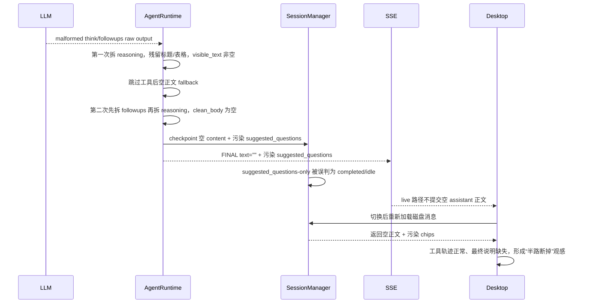

# Near 终局回复完整性与历史一致性加固计划

Planned-with: GPT-5.6 Sol

Suggested-Impl-Model: Cursor Grok 4.5 Medium

> 本计划面向无本次对话上下文的实施模型。按任务顺序执行，严格 TDD；不得把“隐藏异常 chips”当作完成，必须从 Runtime 终局协议根治。

## 目标

根治 Meta-Agent 在工具实际执行完成后，因模型输出的 `<think>` / `<followups>` 边界错乱而落盘为空正文、污染推荐追问，并在会话切换后稳定呈现为“工具执行到一半断掉”的生产级缺陷。

完成后必须保证：

1. Runtime 对选定的 authoritative 终局正文源只做一次规范化；正文与推荐追问来自同一解析结果，reasoning 优先取该结果，缺失时兼容 provider 独立 reasoning 字段。
2. 交叉嵌套、缺失闭合、提示词残片等 malformed 输出不能绕过工具后空正文兜底。
3. 任何交互式 FINAL 都有用户可见正文；推荐追问不能单独充当“完成”证据。
4. FINAL SSE、`messages.json`、`messages_tail.json`、`agent_messages.json` 与 Desktop 切换前后的展示保持一致。
5. 对白名单同步原子工具（本期仅 `create_avatar`）已经成功返回并通过 sanitizer 的公开 `message`，优先用该确定性结果生成降级收尾；无法确认业务成功时使用中性失败说明，禁止误报“已完成”。

## 推荐实施模型分工

| 子任务 | 推荐模型 | 理由 |
|---|---|---|
| A. 终局协议状态机与 Python 单测 | Cursor Grok 4.5 Medium | 需要处理交叉标签、截断和兼容 wrapper，强度适中但必须严谨 |
| B. AgentRuntime 单一终局收口 | Cursor Grok 4.5 Medium | 跨多轮工具状态、FINAL 与 checkpoint，一致性风险较高 |
| C. SessionManager 完成态口径 | Cursor Grok 4.5 Medium | 纯函数和既有状态归一化测试为主 |
| D. Desktop 防御与历史恢复 | Cursor Grok 4.5 Medium | React/Zustand 双路径接线，计划已给精确落点 |
| E. 跨层验收与回归 | Cursor Grok 4.5 Medium | 以固定命令和断言矩阵执行，无需额外架构判断 |

## 事故证据与已确认根因

### 事故会话

- Session：`e4e127cc-b231-47cb-8bf9-bfda25413fed`
- 分身创建工具已经成功：
  - `create_avatar` 返回 `ok: true`
  - avatar id：`2c3f458a4878`
  - `~/.agenticx/avatars/2c3f458a4878/avatar.yaml` 已存在
- 最终 `messages.json` assistant 行：

```json
{
  "content": "",
  "suggested_questions": [
    "block with exactly 3 lines from user perspective.</think>",
    "**分身「侠客」已创建完成。**",
    "| 项目 | 内容 |"
  ],
  "reasoning": "The avatar has been created successfully... Plus the mandatory"
}
```

- `memory_append` 首次因 `streamed_tool_call_truncated` 被丢弃，下一轮重试成功；这增加了触发概率，但不是空正文根因。
- 用户切换会话后，Desktop 从磁盘权威快照恢复，稳定展示工具轨迹和污染 chips，因此看起来像“执行到一半断掉”。

### 可执行最小复现

当前两个 parser 对以下 raw output：

```text
<think>The avatar has been created successfully. Plus the mandatory<followups>block with exactly 3 lines from user perspective.</think>
**分身「侠客」已创建完成。**
| 项目 | 内容 |
</followups>
```

实际产生：

```text
第一次 _split_reasoning_and_body(raw):
visible_text = "**分身「侠客」已创建完成。**\n| 项目 | 内容 |\n</followups>"

split_final_answer_and_followups(raw):
final_text = "<think>...Plus the mandatory"
suggested_questions = 事故中的三条污染内容

第二次 _split_reasoning_and_body(final_text):
clean_body = ""
```

因此根因已经确认，不是推测：

- Runtime 先用 `_visible_text` 判断是否需要 fallback；
- 随后用另一解析顺序得到 `_clean_body`；
- malformed 交叉标签令 `_visible_text != ""`、`_clean_body == ""`；
- fallback 被绕过，空正文仍进入 FINAL、checkpoint 和持久化。

### 端到端故障链



## 不是根因的部分

- 不是 `create_avatar` 未执行：工具结果与 avatar 文件均证明创建成功。
- 不是会话切换丢失正确正文：内存态从未收到完整正确正文，磁盘也已保存错误终态。
- 不是 FINAL checkpoint 未写：此前持久化加固正常工作，本案是“正确持久化了错误数据”。
- 不是 pending tool result 顺序问题：截图中工具卡顺序正确，相关对账已由既有修复覆盖。
- 不是 Runtime 不识别 `<think>`：`_split_reasoning_and_body()` 实际通过字符拼接识别标准 `<think>` / `</think>`。
- 不是确认卡超时本身：第一次确认超时后重新确认，后续创建已成功。超时仅是正常 HITL 状态。

## 产品级终态不变量

### INV-1：单一解析结果

同一份模型 raw output 只能经过一个 canonical parser，统一产出：

```python
ParsedAssistantOutput(
    reasoning: str,
    visible_body: str,
    suggested_questions: tuple[str, ...],
    protocol_errors: tuple[str, ...],
)
```

reason-only retry、工具后 fallback、history append、FINAL payload 和 checkpoint 必须复用该对象，不得再各自按不同顺序拆标签。

### INV-2：交互式 FINAL 必须有正文

对 `not _is_system_trigger` 的普通交互式轮次：

- FINAL `data.text.strip()` 必须非空；
- `session.chat_history` 末条 assistant `content` 必须与 FINAL `data.text` 相同；
- `suggested_questions` 不得在正文为空时存在。
- 每条新生成的 display/chat-history 终局 assistant 行与 FINAL payload 必须写 `turn_terminal=true`；工具前言在 display/chat-history 写 `turn_terminal=false`。Provider-facing `agent_messages` 不携带 runtime-only marker，完成态不得再只靠文本猜测。

### INV-3：推荐追问从属于正文

推荐追问是正文后的附属 UI 数据，不是独立回复：

- 没有可见正文时，推荐追问必须为空；
- malformed 标签、控制符、Markdown 结构残片不得进入 chips；
- `suggested_questions` / `</followups>` 不能单独把轮次判成 completed。

### INV-4：工具结果兜底不误报

- 当前仅 `create_avatar` 被列入同步原子、可公开终局摘要白名单。其结构化结果必须同时满足 `ok is true`、无 `queued` / `pending` / `skipped` / `already_running` 等非终态字段、`message` trim 后长度 `1..500`，模型正文为空时才可使用该公开 `message`。
- 其他内置工具、MCP 与外部工具默认不可信，不得因恰好返回 `ok=true + message` 就提升为 assistant FINAL。
- 没有可信公开摘要时，只能说明“工具执行已结束但最终说明生成异常”，不得笼统宣称任务成功。
- confirmation expired/rejected/suspended、`ERROR:`、明显失败结果不得进入成功摘要。

### INV-5：切换前后同态

同一 session 在 live SSE、流结束 merge、切走再切回、完全重启后：

- assistant 正文一致；
- chips 一致且合法；
- 工具顺序一致；
- execution state 与是否存在完成正文一致。

“完成”仅表示本轮协议已终止并有可见说明，不等价于用户任务业务成功：

- `model_final` / `malformed_model_final_recovered` / `tool_result_fallback` / `tool_turn_empty_fallback` / `empty_response_fallback` 均为可见终局，execution state 进入 idle；
- 业务是否成功由正文和工具状态表达；
- 任何降级终局不得诱导用户直接重放原始副作用请求。

## In scope

- 新增纯 Python 终局协议 parser。
- `agenticx/runtime/agent_runtime.py` 的普通 Meta/Agent 无-tool-calls 终局分支，以及同文件 status-query / loop-halt synthetic FINAL 旁路的统一终局 helper 接线。
- 工具公开成功摘要的最小提取与降级正文。
- `agenticx/studio/session_manager.py` 的完成态/强终态判定。
- Desktop 的 recommended questions 清洗、无正文 chips 门禁、空 FINAL 防御。
- ChatPane（Pro）与 ChatView（Lite）保持同一终态策略。
- Python/TypeScript 单测、Desktop build、服务冷启动与切换恢复验收。

## Out of scope

- 不修改 `agenticx/studio/server.py`，尤其禁止触碰其敏感 import 区。
- 不修改 `create_avatar`、AvatarRegistry 或分身配置落盘逻辑。
- 不调整 action confirmation 的 TTL、确认卡视觉或确认协议。
- 不修改具体 LLM provider；修复必须与 Kimi/MiniMax/GLM/OpenAI 等模型无关。
- 不重构 SSE event hub、SessionManager 整体持久化架构或 ChatPane 大组件。
- 不修改已有历史 session 文件；旧坏数据只在 UI 映射时防御，不做自动回填。
- 不新增 recommendation 数量配置；继续使用系统提示约定的恰好三条。
- 不顺手处理 max-tool-rounds、子智能体、群聊、Enterprise 或附件链路。

## 方案设计

### A. 新增 canonical assistant output parser

**Create：**

- `agenticx/runtime/assistant_output.py`
- `tests/test_assistant_output_parser.py`
- `tests/fixtures/assistant_output_protocol_cases.json`

**模块要求：**

- 顶部 module docstring 必须含 `Author: Damon Li`。
- comments/docstrings 使用英文。
- 不依赖 Session、LLM、ConfigManager、Desktop 或 I/O，保持纯函数。
- import 全部放文件顶部。

**建议 API：**

```python
from dataclasses import dataclass


@dataclass(frozen=True)
class ParsedAssistantOutput:
    reasoning: str
    visible_body: str
    suggested_questions: tuple[str, ...]
    protocol_errors: tuple[str, ...]

    @property
    def malformed(self) -> bool:
        return bool(self.protocol_errors)


def parse_assistant_output(raw: str) -> ParsedAssistantOutput:
    ...


def sanitize_suggested_questions(
    raw: object,
    visible_body: str,
) -> tuple[str, ...]:
    ...


def sanitize_public_tool_summary(raw: str) -> str | None:
    ...


class AssistantOutputStreamParser:
    def feed(self, chunk: str) -> str:
        """Return only the newly safe-to-stream visible/reasoning delta."""

    def finalize(self) -> ParsedAssistantOutput:
        """Finalize the accumulated turn with the same tokenizer state."""
```

`AssistantOutputStreamParser` 必须持有：

- `carry`：可能是 reserved tag 前缀的跨 chunk 尾巴；
- `stack`：当前 think/followups 嵌套；
- body/reasoning/followup buffers；
- protocol errors；
- 已发送安全流边界。

`feed()` 每个字符最多处理常数次，整轮 O(n)；禁止每个 token 重新扫描全部 raw
造成 O(n²)。`FollowupStreamEmitter` 只委托该对象，不保留第二套标签规则。

**解析算法必须是单遍标签状态机，不得继续组合两个互不知情的正则 parser。**

支持标签：

- `<think>` / `</think>`
- `<followups>` / `</followups>`
- 大小写不敏感
- 对 `< think >`、带属性、换行、零宽字符等可还原为保留标签名的 tag-like 变体：记录 `noncanonical_reserved_tag` 并隔离，不得当普通正文透出。

状态与文本归属：

```text
stack == []                  -> visible_body
stack == ["think"]           -> reasoning
stack == ["followups"]       -> followup buffer
stack depth > 1 / 错序闭合    -> 丢弃该段并记录 protocol_error
```

关键规则：

1. `<think>` 与 `<followups>` 不允许嵌套。
2. closing tag 必须与 stack 顶匹配；错序时记录错误，并移除对应未闭合 tag，使 parser 能继续收敛。
3. 结束时 stack 非空，记录 `unclosed_think` / `unclosed_followups`。
4. 仅允许一个完整 `<followups>` block；多个 block 记录 `multiple_followups` 并丢弃全部推荐追问。
5. 任一 followups 相关 nesting/order 错误时，该 block 的全部内容不可转成正文或 chips。
6. 可见正文保留标签之外的普通 Markdown，不擅自改写。
7. malformed 时允许保留已在合法 NORMAL 状态生成的正文，但推荐追问全部丢弃。
8. malformed 时 Runtime 不持久化该段 reasoning，避免 prompt/控制信息泄漏到历史 Thought 块。
9. stray closing tag、连续错序闭合、malformed block 结束后的恢复位置必须由共享 golden fixture 给出逐例期望，实施者不得自行猜测。

**推荐追问校验：**

- `visible_body.strip()` 为空：返回空 tuple。
- 必须恰好三条非空行；少于或多于三条均丢弃整个集合。
- 每条 trim 后长度 `1..160`。
- 任一行含 `<think`、`</think`、`<followups`、`</followups`：丢弃整个集合。
- 任一行是 fenced code、Markdown heading、Markdown table row/separator：丢弃整个集合。
- 复用/迁移现有 MiniMax 控制符清洗逻辑；清洗后再校验长度与非空。
- 不做“必须含我/帮我”等中文语义硬判，避免误伤“有哪些分身可用？”这类合法用户视角问题。
- `parse_assistant_output()` 与 SessionManager 必须共同调用导出的 `sanitize_suggested_questions()`，禁止各写一份规则。

**共享 fixture：**

`tests/fixtures/assistant_output_protocol_cases.json` 至少为每个 case 提供：

```json
{
  "name": "cross_nested_incident",
  "raw": "<think>r<followups>x</think></followups>",
  "reasoning": "r",
  "visible_body": "",
  "suggested_questions": [],
  "protocol_errors": ["nested_reserved_tag", "mismatched_close"],
  "malformed": true
}
```

Python parser 测试与 Desktop TypeScript parser 测试必须读取同一 fixture，防止两端再次漂移。

**固定 protocol error code（去重、保持首次出现顺序）：**

```text
nested_reserved_tag
mismatched_close
stray_close
unclosed_think
unclosed_followups
multiple_followups
noncanonical_reserved_tag
missing_visible_body
invalid_followup_count
invalid_followup_line
```

**fixture 必须按以下 golden oracle 落盘，不得由实施者根据实现反推：**

1. `well_formed`
   - raw：`<think>r</think>正文<followups>问题1\n问题2\n问题3</followups>`
   - reasoning：`r`
   - visible body：`正文`
   - SQ：`["问题1","问题2","问题3"]`
   - errors：`[]`
2. `uppercase_well_formed`
   - raw：`<THINK>r</THINK>正文<FOLLOWUPS>问题1\n问题2\n问题3</FOLLOWUPS>`
   - 期望同 1，errors：`[]`
3. `cross_nested_incident`
   - raw：`<think>r<followups>prompt</think>\n**标题**\n|a|b|\n</followups>`
   - reasoning：`r`
   - visible body：`""`
   - SQ：`[]`
   - errors：`["nested_reserved_tag","mismatched_close"]`
4. `reverse_nested`
   - raw：`<followups>问题1<think>r</think>\n问题2\n问题3</followups>正文`
   - reasoning：`""`
   - visible body：`正文`
   - SQ：`[]`
   - errors：`["nested_reserved_tag"]`
5. `stray_close`
   - raw：`正文</think>尾部`
   - reasoning：`""`
   - visible body：`正文尾部`
   - SQ：`[]`
   - errors：`["stray_close"]`
6. `continuous_mismatch_then_recover`
   - raw：`<think>r<followups>x</think>y</followups>正文`
   - reasoning：`r`
   - visible body：`正文`
   - SQ：`[]`
   - errors：`["nested_reserved_tag","mismatched_close"]`
7. `unclosed_think`
   - raw：`正文<think>r`
   - reasoning：`r`
   - visible body：`正文`
   - SQ：`[]`
   - errors：`["unclosed_think"]`
8. `unclosed_followups`
   - raw：`正文<followups>问题1\n问题2\n问题3`
   - reasoning：`""`
   - visible body：`正文`
   - SQ：`[]`
   - errors：`["unclosed_followups"]`
9. `multiple_followups`
   - raw：`正文<followups>甲\n乙\n丙</followups><followups>丁\n戊\n己</followups>`
   - reasoning：`""`
   - visible body：`正文`
   - SQ：`[]`
   - errors：`["multiple_followups"]`
10. `noncanonical_reserved_tag`
    - raw：`< Think >secret</ Think >正文`
    - reasoning：`secret`
    - visible body：`正文`
    - SQ：`[]`
    - errors：`["noncanonical_reserved_tag"]`
11. `followups_without_body`
    - raw：`<followups>问题1\n问题2\n问题3</followups>`
    - reasoning：`""`
    - visible body：`""`
    - SQ：`[]`
    - errors：`["missing_visible_body"]`

Python `ParsedAssistantOutput.protocol_errors` 与 TypeScript `protocolErrors`
必须逐项等于 fixture；`malformed == protocol_errors.length > 0`。

- Python test 用 `Path(__file__).parent / "fixtures" / ...` 读取。
- Desktop Vitest 从 `desktop/` cwd 用
  `path.resolve(process.cwd(), "../tests/fixtures/assistant_output_protocol_cases.json")`
  读取；只在测试中使用 Node `fs`，生产 bundle 不 import 仓库外 JSON。

**兼容 wrapper：**

- 将 `_MINIMAX_ARTIFACT_RE` 与清洗实现迁入 `assistant_output.py`；
  `followup_stream.py` 通过顶部 import 重新导出
  `strip_model_control_artifacts`，保留既有导入路径，避免 circular import。
- `agenticx/runtime/followup_stream.py::split_final_answer_and_followups`
  - 内部改为调用 `parse_assistant_output()`；
  - 返回 `(parsed.visible_body, list(parsed.suggested_questions))`；
  - 保持现有调用方和测试签名。
- `FollowupStreamEmitter.finalize_text()` 同样调用 canonical parser。
- `FollowupStreamEmitter.feed_append()` 必须复用 canonical tokenizer 的增量标签识别规则：
  - 跨 chunk 保留未决 `<followups>` 前缀；
  - 大小写不敏感；
  - reasoning 仍按现有产品能力流给 Desktop 的 ReasoningBlock；
  - followups 内容在完整校验前不得作为普通 TOKEN 发出；
  - 不改变正常正文 token 的实时性。
- `agenticx/runtime/agent_runtime.py::_split_reasoning_and_body`
  - 保留现有函数签名供测试/内部调用兼容；
  - 内部返回 `(parsed.reasoning, parsed.visible_body)`；
  - 终局主路径不得分别再调用 wrapper 两次。

### B. AgentRuntime 终局只规范化一次

**Modify：**

- `agenticx/runtime/agent_runtime.py`

**精确锚点：**

- `_split_reasoning_and_body`：约 L1333-L1366
- `run_turn()` 每轮状态初始化：约 L2150-L2180
- `response.content` 收口：约 L3070-L3125
- `if not tool_calls:` 终局：约 L3191-L3395
- 工具结果 `raw_result`：约 L3911-L3933
- tool row append：约 L4047-L4074

#### B1. 本轮可信公开工具摘要

在模块级新增纯 helper：

```python
_PUBLIC_TERMINAL_MESSAGE_TOOLS = frozenset({"create_avatar"})


def _extract_public_tool_result_summary(
    tool_name: str,
    raw_result: str,
) -> str | None:
    if tool_name not in _PUBLIC_TERMINAL_MESSAGE_TOOLS:
        return None
    try:
        payload = json.loads(str(raw_result or ""))
    except Exception:
        return None
    if not isinstance(payload, dict) or payload.get("ok") is not True:
        return None
    if any(payload.get(key) for key in ("queued", "pending", "skipped", "already_running")):
        return None
    message = payload.get("message")
    if not isinstance(message, str):
        return None
    return sanitize_public_tool_summary(message)


ToolTurnOutcome = Literal["success", "failed", "pending", "unknown"]


def _classify_tool_turn_outcome(
    tool_name: str,
    raw_result: str,
) -> ToolTurnOutcome:
    ...
```

约束：

- 只允许白名单中的同步原子内置工具；MCP/外部工具默认拒绝。
- 只读取显式 `message`，不把整个 JSON/tool result 复制给用户。
- `sanitize_public_tool_summary()` 拒绝 reasoning/followups 标签及其非规范变体、不可见控制字符、零宽字符与模型控制 token；拒绝而不是“清洗后继续宣称成功”。
- 不支持 `ACTION_*` marker，不把 `OK:` 任意文本泛化成业务成功。
- 在 `run_turn` 初始化 `public_tool_summaries: list[str] = []`。
- 每次获得未 compact 的 `raw_result` 后提取；非空且未重复才 append，最多保留最近三条。
- 后续 memory/telemetry 工具没有公开 message 时，不清除前面 `create_avatar` 的可信摘要。
- outcome classifier 固定规则：
  - `[ACTION_CONFIRMED]`、`OK:`、JSON `ok=true` 且无非终态字段 → `success`；
  - `ERROR:`、`❌`、`CANCELLED:`、`[ACTION_REJECTED]`、`[ACTION_CONFIRMATION_EXPIRED]`、`[ACTION_CONFIRMATION_SUSPENDED]`、JSON `ok=false` → `failed`；
  - JSON 含 `queued` / `pending` / `skipped` / `already_running` 真值 → `pending`；
  - 其它未识别结果 → `unknown`。
- 记录 public summary 时保存其 outcome 序号，并重置 `unresolved_after_public_summary=false`；这允许“早先确认超时、后来重新确认并成功 create_avatar”的事故序列正确使用最终成功摘要。
- public summary 之后的 `failed` / `pending` / `unknown` 设置
  `unresolved_after_public_summary=true`；后续普通 `success`（例如
  `memory_append` 的 `OK: appended`）保持 false。
- 无效工具名、权限拒绝、不在允许列表、hook block 等 pre-dispatch
  continue 路径必须调用统一 `_record_tool_turn_outcome("failed")`；不能只在
  `raw_result` 锚点分类。
- 最终只有 `public_tool_summaries` 非空且
  `unresolved_after_public_summary is false` 才能使用公开摘要。

#### B2. Canonical parse 作为唯一终局真相

**先固定 raw source 优先级，禁止实施者自行选择：**

1. 保存 invoke/stream 阶段累积的 `streamed_raw`，不得在读取 `response.content` 时丢失。
2. `response.content` 非空时，它是 authoritative body/followups source。
3. `response.content` 为空而 `streamed_raw` 非空时，使用 `streamed_raw`。
4. 二者都为空时才进入现有 sync-stream fallback；fallback 产生 `raw_tail` 后以它替换 source。
5. `response.reasoning_content` / `response.reasoning` 只作为独立 reasoning fallback，不与正文 source 拼接。
6. 流式 source 与 final source 不一致时记录结构化计数/日志字段，不记录两份原文。

同时记录 `authoritative_source_kind`：

- `final_content`：reasoning 只能取该 source 的 parsed reasoning，缺失时取同一 response 的独立 reasoning 字段；禁止回退废弃 stream reasoning。
- `streamed_raw`：reasoning 取 parsed reasoning，缺失时才取 `_streamed_reasoning`。
- `sync_fallback`：reasoning 只取 fallback parser 结果。
- 任一 source malformed：reasoning 为空。

在现有 `ac_clean` 锚点创建当前 source 的唯一 `ParsedAssistantOutput`：

- `ac_clean`、widget/data-source guards、reason-only retry 与 no-tool terminal branch 全部复用该对象；
- 仅当 sync-stream fallback 产生不同 `raw_tail` 时允许重新 parse 并替换对象；
- no-tool terminal branch 内不得再调用第二遍 wrapper。

**Before：**

```python
_, _visible_text = _split_reasoning_and_body(response_text)
...
final_text, sug_list = split_final_answer_and_followups(response_text)
...
if not _visible_text.strip() and executed_tool_names:
    final_text = ...
...
_reasoning_text, _clean_body = _split_reasoning_and_body(final_text)
```

**After intent：**

```python
parsed = parse_assistant_output(authoritative_raw)

if (
    not parsed.visible_body.strip()
    and not _is_system_trigger
    and reason_only_retry < 1
):
    inject_reason_only_nudge()
    continue

# If the existing sync-stream fallback produced raw_tail, parse raw_tail here
# and replace `parsed`; do not parse the same source in a different order.

if parsed.malformed:
    reasoning_text = ""
elif authoritative_source_kind == "final_content":
    reasoning_text = parsed.reasoning or _nonstream_reasoning
elif authoritative_source_kind == "streamed_raw":
    reasoning_text = parsed.reasoning or _streamed_reasoning
else:
    reasoning_text = parsed.reasoning
clean_body = parsed.visible_body
suggestions = list(parsed.suggested_questions)

if not clean_body.strip() and not _is_system_trigger:
    suggestions = []
    if public_tool_summaries and not unresolved_after_public_summary:
        clean_body = "\n".join(public_tool_summaries[-3:])
        terminal_reason = "tool_result_fallback"
    elif executed_tool_names:
        clean_body = (
            "工具执行已经结束，但模型未能生成完整的最终说明。"
            "上方工具结果已保留，请查看结果后明确下一步。"
        )
        terminal_reason = "tool_turn_empty_fallback"
    else:
        clean_body = "本轮模型未能生成完整的可见回复，请重新提问。"
        terminal_reason = "empty_response_fallback"
else:
    terminal_reason = (
        "malformed_model_final_recovered"
        if parsed.malformed
        else "model_final"
    )
```

注意：

- nudge 仍最多一次，防止无限循环。
- nudge 用 `parsed.visible_body` 判定，不得用 raw `response_text.strip()`。
- retry 耗尽后不得再生成空 FINAL。
- `_is_system_trigger` 保持现有行为，不新增用户可见合成回复。
- 合法独立 `reasoning_content` 仍按 source-bound 规则进入 reasoning 字段；只有 protocol malformed 时丢弃 reasoning，不能误伤正常非流式 Thought 持久化，也不能把废弃流 canary reasoning 带进最终 Thought。
- 工具后降级文案禁止提示“重试原始请求”，避免 `create_avatar` 等副作用被再次执行。
- malformed 时记录 warning，但不得日志输出完整 raw text或 reasoning：

```text
terminal_output_recovered session=<id> round=<n>
reason=<terminal_reason> protocol_errors=<codes> tools=<names>
```

#### B3. 单点构造 history 与 FINAL

在 `AgentRuntime` 抽取统一 async helper：

```python
async def _finish_terminal_reply(
    self,
    session: StudioSession,
    *,
    clean_body: str,
    reasoning_text: str = "",
    suggestions: Sequence[str] = (),
    reasoning_seconds: int | None = None,
    references: Sequence[dict[str, Any]] = (),
    searched_queries: Sequence[str] = (),
    usage_metadata: Mapping[str, Any] | None = None,
    terminal_reason: str,
    agent_id: str,
    is_system_trigger: bool,
) -> RuntimeEvent:
    ...
```

helper 内严格顺序：

1. **任何副作用之前**先校验：

   ```python
   if not is_system_trigger and not clean_body.strip():
       raise RuntimeError("interactive FINAL must have visible body")
   ```

2. 更新最后一条无 tool_calls 的 `session.agent_messages`：
   - 只更新 `content = clean_body`；
   - malformed 时不写 reasoning prompt 残片；
   - **不得写 runtime-only metadata**，避免未知字段进入 provider messages。
3. 带 tool_calls 的 assistant 前言写入 `chat_history` 时保留
   `metadata.turn_terminal=false`；不能继续只存 role/content。
4. append `session.chat_history`：

   ```python
   {
       "role": "assistant",
       "content": clean_body,
       "suggested_questions": suggestions,  # only when non-empty
       "reasoning": reasoning_text,          # only when safe/non-empty
       "reasoning_seconds": reasoning_seconds,  # only when >= 1
       "references": references,                # only when non-empty
       "searched_queries": searched_queries,    # only when non-empty
       "metadata": {
           "turn_terminal": True,
           "terminal_reason": terminal_reason,
       },
   }
   ```

5. `await self.hooks.run_on_agent_end(clean_body, session)`；hook、
   SessionSummary、FINAL 与 history 必须看到同一清洗正文。
6. 构造 FINAL：
   - `text = clean_body`
   - 同一 suggestions/reasoning/reasoning_seconds/references/searched_queries
   - 现有 `usage_metadata`（仅 FINAL，不写 history）
   - `turn_terminal=true`
   - `terminal_reason`
   - 不含 raw
7. `_persist_final_checkpoint()`。
8. 返回 `RuntimeEvent(FINAL, ...)`，由调用方 `yield await ...`。

普通 no-tool caller 必须在调用 helper 前完成现有
`turn_reference_payload()` 与 `usage_metadata_from_llm_response()` 计算并传入，
禁止因统一 helper 丢失引用、推理时长、缓存遥测或 token usage。synthetic FINAL
使用这些 enrichment 的空默认值。

所有可达 FINAL 生产点必须调用该 helper：

- 普通 no-tool final；
- status query 预算上限；
- status query cooldown；
- status query 重复查询拦截；
- status query 频率拦截；
- loop-halt summary。

现有 `_append_terminal_assistant()` 可并入该 helper或改为仅构造数据，禁止再有
绕过 marker/hook/checkpoint 的旁路 FINAL。

`metadata.turn_terminal` 与 `metadata.terminal_reason` 不是无消费者诊断字段：

- SessionManager 新消息完成态以 `turn_terminal` 为主证据；
- Desktop completion helper 同步读取该字段；
- 测试按 `terminal_reason` 区分正常、可信工具摘要与中性降级；
- 旧消息无该字段时才进入保守 legacy heuristic。
- `agent_messages.json` 只断言正文与 FINAL 一致，不要求 terminal metadata；
  marker 只存在于 UI/chat-history 真相源和 FINAL payload。

### C. SessionManager 完成态口径修正

**Modify：**

- `agenticx/studio/session_manager.py`
- `tests/test_completeness_truth.py`
- `tests/test_session_manager_persistence.py`

**精确锚点：**

- `_visible_assistant_body`：约 L54-L71
- `_messages_last_turn_has_completed_reply`：约 L74-L112
- `_last_turn_has_terminal_assistant_reply`：约 L670-L698
- `test_list_sessions_idle_when_running_metadata_but_terminal_reply`：约 L678

#### C1. 可见正文复用 canonical parser

`_visible_assistant_body(content)` 改为调用 `parse_assistant_output(content).visible_body`，保留现有函数签名。

SessionManager 先保留完整 `ParsedAssistantOutput`：

- `parsed.malformed` 时 detached `msg["suggested_questions"]` 强制为空；
- 仅 `not parsed.malformed` 时调用
  `assistant_output.sanitize_suggested_questions(raw, parsed.visible_body)`；
- 禁止拼装伪 `<followups>` 字符串或复制校验规则。

#### C2. completed 不能由 SQ-only 触发

`_messages_last_turn_has_completed_reply()` 中：

- 新格式消息优先读取 `metadata.turn_terminal`：
  - `true` 且 canonical visible body 非空：completed；
  - `false`：工具前言/中间态，不得 completed；
  - 同一 user turn 里只要出现显式 marker，必须找到最后一个 `true` 才算完成，禁止回退文本猜测。
- 只有该 user turn 全部 assistant 行都没有 `turn_terminal` 时，才进入 legacy heuristic：非空可见正文且不是中断占位；
- `metadata.source == "interrupted-partial"` 永远不作为 completed terminal；
- 删除“非空 suggested_questions 即完成”；
- 删除“content 包含 `</followups>` 即完成”；
- 保留“reply 后出现新的 assistant tool_calls 则未完成”的既有逻辑。

#### C3. active-running 强终态必须同时有正文

`_last_turn_has_terminal_assistant_reply()` 中：

- 新格式行仅当 `metadata.turn_terminal is true` 且 canonical visible body 非空，才允许把 active `running` 提前 normalize 为 `idle`；fallback body-only 同样是合法终局。
- `turn_terminal=false`、仅 body、仅 SQ、仅 `</followups>` 都不能作为 active-runtime 的强终态。
- 旧格式行没有 marker 且 `parsed.malformed is false` 时，才允许使用“visible body + 通过 `sanitize_suggested_questions()` 的 SQ”作为兼容强信号。
- suggestions 配置关闭的新格式 FINAL 依靠显式 marker，不再出现永久 spinner。

#### C4. 兼容边界

- 不迁移旧消息。
- 已是 `execution_state=idle` 的历史 session 仍走 fast path，不因旧坏数据自动变更 metadata。
- 只有 stale `running` / `interrupted` 的归一化判断采用新口径。
- 新格式 `tool_turn_empty_fallback` / `empty_response_fallback` 是“协议已结束但业务降级”，execution state 为 idle；不得误标业务成功，正文必须明确异常。

### D. Desktop defense-in-depth

**Create：**

- `desktop/src/utils/assistant-output.ts`
- `desktop/src/utils/assistant-output.test.ts`

**Modify：**

- `desktop/src/utils/session-message-map.ts`
- `desktop/src/utils/session-message-merge.ts`
- `desktop/src/utils/task-stall-policy.ts`
- `desktop/src/utils/task-stall-policy.test.ts`
- `desktop/src/utils/im-bubble-actions.ts`
- `desktop/src/components/messages/ImBubble.tsx`
- `desktop/src/components/messages/ImBubble.test.tsx`
- `desktop/src/components/messages/StallRecoveryCard.tsx`
- `desktop/src/components/ChatPane.tsx`
- `desktop/src/components/ChatView.tsx`

#### D1. 统一 TS 清洗函数

```ts
export type ParsedAssistantOutputForUi = {
  visibleBody: string;
  suggestedQuestions: string[];
  protocolErrors: string[];
  malformed: boolean;
};

export function parseAssistantOutputForUi(
  raw: string,
): ParsedAssistantOutputForUi {
  // Mirror the backend stack/tokenizer contract and shared golden fixture.
}

export function assistantVisibleBodyForUi(content: string): string {
  return parseAssistantOutputForUi(content).visibleBody;
}

export function sanitizeSuggestedQuestions(
  raw: unknown,
  visibleBody: string,
): string[] {
  if (!visibleBody.trim() || !Array.isArray(raw)) return [];
  const lines = raw.map(...trim...);
  if (lines.length !== 3) return [];
  if (lines.some(isProtocolOrMarkdownArtifact)) return [];
  return lines;
}

export function normalizeFinalAssistantPayload(
  rawText: unknown,
  rawQuestions: unknown,
  rawTurnTerminal: unknown,
  rawTerminalReason: unknown,
): {
  text: string;
  suggestedQuestions: string[];
  incomplete: boolean;
  turnTerminal: boolean;
  terminalReason?: string;
} {
  const parsed = parseAssistantOutputForUi(String(rawText ?? ""));
  const text = parsed.visibleBody.trim();
  const terminalReason = String(rawTerminalReason ?? "").trim() || undefined;
  return {
    text,
    suggestedQuestions: parsed.malformed
      ? []
      : sanitizeSuggestedQuestions(rawQuestions, text),
    incomplete: !text,
    turnTerminal:
      rawTurnTerminal === true
        ? true
        : rawTurnTerminal === false
          ? false
          : text.length > 0,
    terminalReason,
  };
}
```

规则镜像 Python：

- `parseAssistantOutputForUi()` 返回 body/SQ/protocol errors/malformed，处理 think、followups、大小写、交叉/错序和 marker-only，并读取共享 JSON fixture；
- 无正文返回 `[]`；
- 恰好三条；
- 每条 `1..160`；
- 拒绝 think/followups 标签、code fence、heading、table row/separator；
- 不使用 `any`，输入用 `unknown`。
- `normalizeFinalAssistantPayload()` 是 ChatPane/ChatView 的共同 live FINAL
  入口，确保两者都把非空 final 视为 authoritative replacement。

该 TS helper 仅用于旧磁盘数据、完成态和 UI 防御；后端 canonical parser 仍是协议主真相。Python/TypeScript 必须消费同一 shared fixture，禁止靠两份手写测试“看起来一致”。

#### D2. 历史映射防污染

`session-message-map.ts::mapLoadedSessionMessage()`：

1. 先得到 mapped assistant content。
2. 使用 `parseAssistantOutputForUi()` 解析历史 raw content。
3. `mapped.content = parsed.visibleBody`。
4. reasoning 优先使用独立 `item.reasoning`；缺失且 parser 非 malformed 时才使用 parsed reasoning；malformed reasoning 丢弃。
5. `parsed.malformed` 时 detached SQ 强制为空；仅协议合法时，才将
   `sanitizeSuggestedQuestions(item.suggested_questions, parsed.visibleBody)`
   的非空结果写入 `mapped.suggestedQuestions`。

结果：

- 本事故旧消息切换回来后不再显示三个污染 chips；
- 空 assistant 仍保留给现有 incomplete/stall 机制识别，不伪造完成正文。
- `session-message-merge.ts` 的 assistant body 比较也改用 `assistantVisibleBodyForUi()`，避免 live raw 与 disk canonical final 因不同剥离规则产生重复行。

#### D3. Followup UI 必须有正文

`im-bubble-actions.ts::shouldShowAssistantFollowups()` 新增 `hasBody: boolean`，无正文立即 false。

`ImBubble.tsx` 调用处传入现有 `hasBody`。

`ChatPane.tsx` ReAct 块外 `peeledFollowupAssistant` 直出 chips 的分支，额外要求该消息有可见 body，禁止绕过 `ImBubble` gate。

ChatPane 与 ChatView 的 `commitCurrentStreamIfNeeded()` 提交工具前言/中间
assistant 时写入 `metadata.turn_terminal=false`；最终 payload 到达后由
`normalizeFinalAssistantPayload()` 覆盖为 true。不得让 live 内存消息在磁盘
marker 落盘前回退 legacy heuristic。

`task-stall-policy.ts` 的唯一生产改动点是
`lastTurnHasCompletedAssistantReply()`，外加一个无副作用
`lastTurnHasToolActivity()` helper 供恢复按钮门禁：

- 新格式优先读取 `message.metadata.turn_terminal`；
- legacy 行用 `assistantVisibleBodyForUi()`；
- marker-only、followups-only、SQ-only 返回 false；
- `lastTurnHasToolActivity()` 仅扫描最后一个 user 之后的 tool row 或 assistant tool_calls；
- 禁止改动停滞阈值、自动续跑、Todo、模型回退和其它策略。

#### D4. Live FINAL 同样清洗

`ChatPane.tsx` 约 L8941 与 `ChatView.tsx` 约 L1754：

- 先读取 authoritative `finalText`；
- 调用 `normalizeFinalAssistantPayload()`，只使用其 canonical `text` 与 suggestions；
- canonical `text` 为空或 malformed 时必须令 pending suggestions 为空；
- 不再直接 `map(String).filter(Boolean).slice(0, 3)`。
- 把 FINAL 的 `turn_terminal` / `terminal_reason` 写入 live assistant
  `message.metadata`；磁盘重载后字段必须相同。
- 非空 FINAL 到达时，ChatPane 与 ChatView 都必须用 canonical `finalText`
  **替换**临时 `full/cumulativeFull`；ChatView 不得继续在不一致时拼接
  `\n\n${finalText}`，否则 malformed stream 残片会永久留在 Lite 消息。
- ChatView 会话重载必须复用 `mapLoadedSessionMessage()`；不得手工只复制 content 而绕过 SQ/reasoning/reference 清洗。

#### D5. 空 FINAL 防御

虽然后端修复后不应到达，Desktop 仍需对旧后端/未来回归给出高信号行为：

- ChatPane：收到 `final` 但 authoritative `finalText` 为空，且当前 `full` 无可见正文时：
  - 不提交 chips；
  - 执行一次 `mergeTailFromDisk(requestSessionId)`；
  - 若仍无正文，让既有 Channel C incomplete recovery 生效；
  - 不新增永久重复气泡。
- ChatView：执行同样的“磁盘恢复一次 → 仍空则 incomplete”状态流程，不得只走泛化请求失败入口。
- 两种模式共享状态矩阵：

| 状态 | Pro / Lite 行为 |
|---|---|
| 非空 FINAL | 替换临时流；显示正文；合法 chips 可见 |
| 空 FINAL，磁盘恢复出正文 | 恢复期间保留现有动态状态；恢复后只显示正文，不显示提示 |
| 空 FINAL，磁盘仍为空 | 只显示一次“本轮回复生成不完整”；不显示 chips；不提供会重放原始请求的一键 Retry |
| 打开旧 bodyless idle 历史 | 保持磁盘不改写；消息区显示一次 incomplete 提示；历史标签保持 idle |
| 打开旧 bodyless running/interrupted 历史 | 状态标签保持真实 running/interrupted；不因 SQ 清成 idle |

- 提示在用户开始新一轮、恢复出正文或切换 session 时清除。
- 本计划不新增 `summary_only` continuation，也不修改 `server.py`；在无法证明副作用隔离前，bodyless tool turn 只展示保留的工具结果与中性提示，禁止复用会重放原始请求的一键 Retry。
- `StallRecoveryCard` 新增 `allowResume`（默认 true）：
  - bodyless 且 `lastTurnHasToolActivity()==true` 时传 false，隐藏“恢复执行/换模型继续/中断任务”，只显示“工具结果已保留，请查看后明确下一步”；
  - 无工具的空回复仍可保留现有重试行为；
  - 其它 silent/exhausted 场景行为不变。

## FR / NFR / AC

### FR-1：canonical parser

必须正确区分 reasoning、正文、followups，并识别交叉嵌套、错序闭合、缺失闭合、多 followups。

**AC-1：** 事故 raw 样本解析结果：

- `visible_body == ""`
- `suggested_questions == ()`
- `malformed is True`
- protocol error 包含 nested/mismatched 类错误

### FR-2：交互式 FINAL 非空

一次自动 nudge 后仍无正文，Runtime 生成确定性降级正文。

**AC-2：** 无工具 reasoning-only 场景不再 FINAL `text=""`。  
**AC-3：** 有工具但无可信摘要时使用中性工具结束说明，不写“已完成工具调用”。  
**AC-4：** 白名单 `create_avatar ok=true + message` 后 malformed final，FINAL 正文等于 sanitizer 通过的该 `message`。

### FR-3：推荐追问完整性

推荐追问只有在正文非空、协议完整、三条均通过校验时才出现。

**AC-5：** 事故三条污染内容在 Python parser、SSE live、disk reload 三条路径均不可见。  
**AC-6：** 正常正文 + 三条合法追问仍显示，点击行为不变。

### FR-4：完成态一致

SQ-only/marker-only 不再视为完成。

**AC-7：** 后端 completion helper 与前端 `lastTurnHasCompletedAssistantReply()` 对以下场景结论一致：

- 正文：completed
- 纯 reasoning：incomplete
- SQ-only：incomplete
- malformed followups-only：incomplete
- 正文后又出现 assistant tool_calls：incomplete
- 新格式工具前言 `turn_terminal=false`：incomplete
- 新格式正文 `turn_terminal=true`：completed
- 工具后确定性 fallback 正文：completed

### FR-5：切换恢复一致

**AC-8：** 正常 avatar 创建后切走再切回，工具卡后存在明确创建成功正文。  
**AC-9：** 完全退出 Near 再打开，正文、工具顺序、chips 与退出前一致。

### NFR-1：模型无关

- 不按 provider/model 名称分支。
- 同一 parser 覆盖 Kimi/MiniMax/GLM/OpenAI 兼容输出。

### NFR-2：无敏感泄漏

- 日志只记录 protocol error code、tool name、session id、round，不记录完整 raw/reasoning/tool result。
- fallback 只复用白名单内置工具经 sanitizer 通过的显式公开 `message`，不复制任意 JSON。
- Near 既有合法 ReasoningBlock 产品行为保持不变；本计划只阻止 malformed/protocol-crossed reasoning 持久化，不扩张为 reasoning 数据治理项目。
- canary 测试必须证明 malformed raw、拒绝的 public message 和 tool result 不进入日志、FINAL 或 terminal assistant 正文。

### NFR-3：兼容性

- 保留 `_split_reasoning_and_body()` 和 `split_final_answer_and_followups()` 签名。
- 合法既有 followups 行为不变。
- 旧 session 不自动改写。

### NFR-4：性能

- parser 为单遍 O(n)，每轮终局只解析一次。
- Desktop 历史映射只做小数组和短字符串校验。

### NFR-5：no-scope-creep

- 不修改 plan 的 Out of scope 路径。
- 不重排 ChatPane 其它 SSE 分支。
- 不引入新依赖。

## TDD 实施任务

### Task 1：先锁定 canonical parser 行为

**Files：**

- Create: `tests/test_assistant_output_parser.py`
- Create: `tests/fixtures/assistant_output_protocol_cases.json`
- Create: `agenticx/runtime/assistant_output.py`
- Modify: `agenticx/runtime/followup_stream.py`
- Modify: `agenticx/runtime/agent_runtime.py::_split_reasoning_and_body`

**Step 1：写 RED 测试**

至少覆盖：

1. 正常 `<think>推理</think>正文<followups>三行</followups>`。
2. 无 reasoning 的正文 + followups。
3. 事故交叉嵌套原样样本。
4. unclosed think。
5. unclosed followups。
6. mismatched close。
7. multiple followups。
8. body 为空但有合法三行。
9. 只有两行/四行。
10. 行含 think/followups tag。
11. Markdown table/header/code fence。
12. MiniMax mangled token 清洗兼容。
13. uppercase/mixed-case 标签。
14. tag 内空白/属性/换行/零宽字符等 noncanonical reserved tag。
15. `FollowupStreamEmitter.feed_append()` 跨 chunk 收到 `<fol` + `lowups>` 时不泄漏追问内容。
16. 正常 `<think>` reasoning 仍按现有流式契约输出，不能因防 followups 而消失。

**RED：**

```bash
.venv/bin/python -m pytest tests/test_assistant_output_parser.py tests/test_followup_stream.py -q
```

预期：新模块不存在或事故样本断言失败。

**Step 2：实现最小状态机与兼容 wrapper**

- 不改外部协议。
- 不使用复杂回溯正则代替状态机。

**GREEN：**

```bash
.venv/bin/python -m pytest tests/test_assistant_output_parser.py tests/test_followup_stream.py -q
```

### Task 2：修复 Runtime 终局收口

**Files：**

- Modify: `tests/test_reasoning_only_turn_retry.py`
- Modify: `tests/test_agent_runtime.py`
- Modify: `agenticx/runtime/agent_runtime.py`

**Step 1：修改旧错误 AC**

将：

```text
test_reasoning_only_exhausts_nudge_ends_with_empty_content
```

改为：

```text
test_reasoning_only_exhausts_nudge_emits_visible_retry_fallback
```

断言 FINAL 和 chat history 均为非空中性正文。

**Step 2：新增事故序列 fake LLM**

序列：

1. 第 1 轮发出 `create_avatar` tool_call。
2. fake dispatch 返回：

```json
{
  "ok": true,
  "avatar_id": "avatar-1",
  "name": "侠客",
  "message": "数字分身「侠客」已创建并加入分身列表（id=avatar-1）。"
}
```

3. 第 2 轮返回事故 malformed raw，触发 nudge。
4. 第 3 轮仍返回 malformed/纯 reasoning，触发确定性 fallback。

断言：

- FINAL text 等于 tool result `message`；
- `suggested_questions` 不存在；
- `chat_history[-1]["content"] == FINAL data.text`；
- `agent_messages[-1]["content"] == FINAL data.text`；
- chat history 末行 `metadata.turn_terminal=true`；agent_messages 不含 runtime-only marker；
- reasoning 不含 `block with exactly`；
- checkpoint 看到同一最终正文。
- spy hook `run_on_agent_end` 收到同一最终正文。

**Step 3：新增失败/无摘要分支**

- 工具结果 `ERROR:` → 不生成成功摘要。
- `[ACTION_CONFIRMATION_EXPIRED]` → 不生成成功摘要。
- `ok=false,message=...` → 不生成成功摘要。
- 非白名单工具 `ok=true,message=...` → 不生成成功摘要。
- `create_avatar` 的 message 含 reserved tag、控制字符或零宽字符 → 拒绝摘要，走中性 fallback。
- 较早 `create_avatar` 成功后，后续工具失败/非终态 → 不得继续复用较早成功摘要。
- 较早确认超时、后来 create_avatar 成功、再 memory_append 返回 `OK: appended` → 仍可使用 create_avatar 摘要。
- create_avatar 成功后分别出现权限拒绝、hook block、无效工具名、`CANCELLED:` → 必须走中性 fallback。
- 无工具 → 使用 empty-response 中性正文。

**Step 3a：新增 source-priority 与 reasoning 回归**

- final `response.content` 非空、streamed raw 不同：正文以 final 为准；
- stream 先输出 canary reasoning 后失败，invoke/final response 返回另一 reasoning：最终 Thought 只能含 final response reasoning；
- final content 为空、streamed raw 非空：使用 streamed raw；
- 两者为空：只调用一次 sync fallback；
- 正文非空 + provider 独立 `reasoning_content`：正文不变，reasoning 保留；
- malformed content + 独立 reasoning：reasoning 不持久化；
- tool-call assistant 前言：`metadata.turn_terminal=false`。
- 普通 final 的 `reasoning_seconds`、references、searched_queries、usage_metadata
  在 history/FINAL 中按既有语义保留，token usage SSE 回归仍通过。

**Step 3a-2：覆盖全部 FINAL 生产者**

分别触发普通 final、四类 status-query synthetic final 与 loop-halt：

- chat history 末行 `turn_terminal=true`；
- FINAL payload 同样为 true；
- hook 与 checkpoint 顺序一致；
- 不存在绕过 `_finish_terminal_reply()` 的直接 FINAL yield。

**Step 3b：新增日志保密 canary**

在 raw、reasoning、tool result 与 public message 分别注入唯一 canary，使用
`caplog` 覆盖 malformed、fallback 与异常路径，断言日志只含 session/round/error
codes/tool names，不含任一 canary。

**RED：**

```bash
.venv/bin/python -m pytest \
  tests/test_reasoning_only_turn_retry.py \
  tests/test_agent_runtime.py -q
```

**Step 4：实现 B1-B3**

**GREEN：**重复上述命令。

### Task 3：修正 Studio completion truth

**Files：**

- Modify: `tests/test_completeness_truth.py`
- Modify: `tests/test_session_manager_persistence.py`
- Modify: `agenticx/studio/session_manager.py`

**Step 1：反转旧断言**

- `test_messages_last_turn_completed_true_for_suggested_questions_only`
  → 改名并断言 False。
- `test_messages_last_turn_completed_true_for_followups_marker`
  → 改名并断言 False。

**Step 2：新增场景**

- 正文 + 合法 SQ：True。
- 事故 malformed content + 污染 SQ：False。
- malformed content 仍有合法 NORMAL body，detached SQ 表面为三条合法短句：正文可保留，但 SQ 必须丢弃且不能作为 legacy 强终态。
- stale running + 空正文 SQ-only：保持 running，不提前 idle。
- stale running + 正文 + 合法 SQ：idle。
- interrupted metadata + 确定性 fallback 正文：idle。
- 新格式 user → assistant 工具前言（`turn_terminal=false`）→ tool row → 进程结束：未完成，不得 idle。
- 新格式工具前言 false → tool row → final true：completed/idle。
- `metadata.source=interrupted-partial` 即使有可见 partial body：不算 completed terminal。
- 整个旧 turn 无 marker：继续执行既有 legacy heuristic，兼容历史数据。

**RED：**

```bash
.venv/bin/python -m pytest \
  tests/test_completeness_truth.py \
  tests/test_session_manager_persistence.py -q
```

**Step 3：实现 C1-C4 后 GREEN。**

### Task 4：Desktop 推荐追问与空 FINAL 防御

**Files：**

- Create: `desktop/src/utils/assistant-output.ts`
- Create: `desktop/src/utils/assistant-output.test.ts`
- Modify: `desktop/src/utils/session-message-map.ts`
- Modify: `desktop/src/utils/session-message-merge.ts`
- Modify: `desktop/src/utils/task-stall-policy.ts`
- Modify: `desktop/src/utils/task-stall-policy.test.ts`
- Modify: `desktop/src/utils/im-bubble-actions.ts`
- Modify: `desktop/src/components/messages/ImBubble.tsx`
- Modify: `desktop/src/components/messages/ImBubble.test.tsx`
- Modify: `desktop/src/components/messages/StallRecoveryCard.tsx`
- Modify: `desktop/src/components/ChatPane.tsx`
- Modify: `desktop/src/components/ChatView.tsx`

**Step 1：纯函数 RED 测试**

```bash
cd desktop
npx vitest run \
  src/utils/assistant-output.test.ts \
  src/utils/session-message-merge.test.ts \
  src/utils/task-stall-policy.test.ts \
  src/components/messages/ImBubble.test.tsx
```

新增断言：

- 无正文 + 任意 SQ → `[]`。
- 正文 + 正常三条 → 保留。
- 事故三条 → `[]`。
- malformed content 有非空 NORMAL body + detached 三条表面合法 SQ → `[]`。
- shared fixture 的 Python/TS body、SQ、malformed 结论一致。
- `normalizeFinalAssistantPayload()` 对非空 final 返回 authoritative replacement；对空 final 返回 `incomplete=true` 且 SQ 为空。
- SQ-only last turn → incomplete。
- bodyless tool turn → `lastTurnHasToolActivity()==true`，恢复卡 `allowResume=false`。
- bodyless no-tool turn → `lastTurnHasToolActivity()==false`，可保留既有恢复入口。
- `shouldShowAssistantFollowups({hasBody:false})` → false。

**Step 2：实现 helper、映射和 gate。**

**Step 3：ChatPane/ChatView 只做精确接线。**

- 不重构 reader loop。
- 不改变 token/tool/subagent 分支。
- 保持 final text authoritative。
- 两者必须调用同一个 `normalizeFinalAssistantPayload()`；禁止各自复制分支。
- 若现有测试环境难以直接 mount 两个大组件，至少在 Task 6.3 分别执行 Pro 与 Lite 手工验收；不能只验一种模式。

**GREEN：**重复 Step 1。

### Task 5：专项回归

**Backend：**

```bash
.venv/bin/python -m pytest \
  tests/test_assistant_output_parser.py \
  tests/test_followup_stream.py \
  tests/test_reasoning_only_turn_retry.py \
  tests/test_reasoning_chain_persistence.py \
  tests/test_agent_runtime.py \
  tests/test_completeness_truth.py \
  tests/test_session_manager_persistence.py \
  tests/test_smoke_session_turn_completion.py \
  tests/test_smoke_streaming_tool_truncation.py \
  tests/test_request_action_confirmation.py \
  tests/test_smoke_create_avatar_tool.py -q
```

**Python lint：**

```bash
.venv/bin/python -m ruff check \
  agenticx/runtime/assistant_output.py \
  agenticx/runtime/followup_stream.py \
  agenticx/runtime/agent_runtime.py \
  agenticx/studio/session_manager.py \
  tests/test_assistant_output_parser.py \
  tests/test_followup_stream.py \
  tests/test_reasoning_only_turn_retry.py \
  tests/test_agent_runtime.py \
  tests/test_completeness_truth.py \
  tests/test_session_manager_persistence.py
```

**Desktop：**

```bash
cd desktop
npx vitest run \
  src/utils/assistant-output.test.ts \
  src/utils/task-stall-policy.test.ts \
  src/components/messages/ImBubble.test.tsx \
  src/utils/session-message-merge.test.ts
npm run build
```

预期：全部退出码 0；不得通过删除、skip 或放宽既有断言换绿。

### Task 6：服务与真实 UI 验收

#### 6.1 冷启动

不修改 `server.py`，但该任务触及 Runtime 与 SessionManager，仍执行完整冷启动：

```bash
.venv/bin/agx serve --host 127.0.0.1 --port 8766
```

确认：

- 进程不崩溃；
- `/api/session`、`/api/avatars`、`/api/sessions` 返回 200；
- 日志无 import/circular dependency 错误。

#### 6.2 确定性事故回归

用 Task 2 fake LLM 集成测试生成一个临时 session，不写真实 `~/.agenticx`：

- tool rows 顺序：confirmation → create_avatar → memory_append（可模拟）；
- 最终模型 raw 使用事故交叉标签；
- 逐项读取并对比 FINAL SSE、`messages.json`、`messages_tail.json`、`agent_messages.json`：
  - 末条 terminal assistant content 非空；
  - 内容为白名单可信工具 message 或中性 fallback；
  - FINAL、`messages.json`、`messages_tail.json` 的 `turn_terminal=true` 与 `terminal_reason` 一致；
  - `agent_messages.json` 正文一致且不含 runtime-only marker；
  - 无污染 SQ；
  - safe reasoning 一致，malformed reasoning 均不存在；
  - execution state 与 completion helper 一致。

#### 6.3 Near 手工验收

以下矩阵在 ChatPane（Pro）和 ChatView（Lite）各执行一遍：

1. 创建一个测试分身。
2. 确认卡批准后，等待工具执行结束。
3. 断言工具卡后立即出现明确最终正文。
4. 切换到另一会话，再切回：
   - 正文仍在；
   - 工具顺序不变；
   - 无提示词/表格碎片 chips。
5. 完全退出 Near 后重启，再次打开：
   - 与切换前一致；
   - 历史侧状态不显示“运行中/已中断”矛盾。
6. 关闭推荐追问设置后重复一轮：
   - 正文仍正常；
   - 不依赖 SQ 才能进入 idle。
7. 加载只读事故 fixture 的旧 bodyless idle / running / interrupted 三种状态：
   - idle：历史标签保持 idle，消息区只出现一次 incomplete 提示；
   - running/interrupted：保持真实标签，不因污染 SQ 清成 idle；
   - 不出现会直接重放原始请求的一键 Retry；用户发出新的明确指令后提示清除。

## 代码审查检查单

- [ ] canonical parser 是否真正单遍处理嵌套/错序，而非换一组正则。
- [ ] authoritative raw source 的 final/stream/fallback 优先级是否按计划实现。
- [ ] `run_turn()` 是否在同一 source 上只用一个 `ParsedAssistantOutput` 做 guard 与最终决策。
- [ ] 是否仍存在 `_visible_text` 与 `_clean_body` 分别来自不同解析顺序。
- [ ] interactive FINAL 是否可能 `text=""`。
- [ ] tool fallback 是否仅信任 `create_avatar` 白名单，且不会把失败/超时/拒绝/queued/pending 误报成成功。
- [ ] malformed raw/reasoning/tool result 是否被写入日志。
- [ ] `run_on_agent_end` 是否收到 canonical clean body。
- [ ] 工具前言是否标记 `turn_terminal=false`，最终行是否 `turn_terminal=true`。
- [ ] SQ-only 是否仍能让后端或前端判 completed。
- [ ] ChatPane 和 ChatView 是否都接入清洗。
- [ ] ChatView 是否无条件用非空 FINAL 替换临时 stream，而非拼接。
- [ ] `feed_append()` 是否对大小写/跨 chunk followups 生效且保留正常 reasoning 流。
- [ ] ReAct 直出 followups 是否绕过 `ImBubble` hasBody gate。
- [ ] FINAL checkpoint 是否仍位于 yield 之前。
- [ ] 是否触碰 Out of scope 路径或 `server.py` import 区。

## 风险与回滚

### 风险 1：parser 过严导致合法 SQ 被隐藏

缓解：

- 正文不受影响；
- 不做自然语言语义硬判；
- 正常三行用例覆盖中文问句、祈使句和英文问题。

回滚：

- 只放宽 `sanitize_suggested_questions` 的结构规则，不恢复双 parser。

### 风险 2：工具摘要误泄漏

缓解：

- 只读取白名单同步原子工具（本期仅 `create_avatar`）的 JSON `ok=true` 短 `message`；
- 拒绝 `queued` / `pending` / `skipped` / `already_running` 等非终态字段；
- 通过 `sanitize_public_tool_summary()` 后才可使用；
- 不复制任意 tool content；
- 长度限制 500；
- 日志不打印 message。

回滚：

- 禁用公开摘要提取，统一使用中性 fallback；不回滚非空 FINAL 不变量。

### 风险 3：旧 SQ-only running session 被标为未完成

这是预期语义修正。只影响 stale running/interrupted 归一化；已有 idle 历史不改 metadata。UI 会隐藏污染 chips并提供重试，而不是假装已完成。

### 风险 4：Runtime 热路径回归

缓解：

- parser 为纯函数、单遍 O(n)；
- 保留兼容 wrapper；
- 精确专项测试 + Runtime 全文件测试 + Desktop build。

## 提交建议

按可独立回滚的三个 commit：

1. `fix(runtime): enforce canonical terminal assistant output`
   - plan、canonical parser、Runtime fallback、Python 测试。
2. `fix(studio): require visible body for turn completion`
   - SessionManager 与完成态测试。
3. `fix(desktop): reject bodyless follow-up suggestions`
   - TS helper、映射/gate、ChatPane/ChatView、Vitest。

每个 commit 只暂存本任务文件，并按仓库规则带：

```text
Plan-Id: 2026-07-17-terminal-assistant-output-integrity
Plan-File: .cursor/plans/2026-07-17-terminal-assistant-output-integrity.plan.md
Plan-Model: GPT-5.6 Sol
Impl-Model: Cursor Grok 4.5 Medium
Made-with: Damon Li
```

若实际实施模型不是 Cursor Grok 4.5 Medium，必须以真实模型替换 `Impl-Model`，禁止照抄编造。

## 完成标准

- 事故 raw 的 parser 最小复现从“空正文 + 三条污染 SQ”变为“协议异常 + 空 SQ”。
- Runtime 对其自动 nudge 一次，仍失败后生成非空确定性 fallback。
- `create_avatar` 成功场景优先展示其公开 `message`。
- 新产生的普通交互式 FINAL 不可能为空。
- 后端、前端均不把 SQ-only 当完成。
- live、切换、重启三种视图一致。
- 专项 pytest、Vitest、ruff、Desktop build、服务冷启动全部通过。
- 无 Out of scope 改动，无新增依赖，无测试污染真实 `~/.agenticx`。
