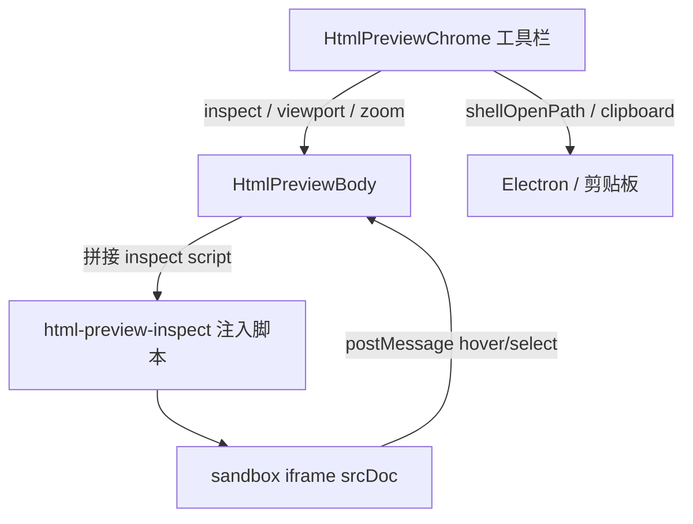

# HTML 预览 Chrome（Trae Work 对齐）

Planned-with: cursor-grok-4.5-high-fast  
Suggested-Impl-Model: cursor-grok-4.5-high-fast

## Goal

Near Desktop 在 HTML 内嵌预览时，补齐 Trae Work 级常规工具栏：选择元素、分享、在浏览器中打开、设备工具栏（尺寸/宽高/缩放/方向），以及元素描边 + 标签名。

## Root cause / 现状

- 已有 `HtmlPreviewBody`（沙箱 `srcDoc`，无 `allow-same-origin`）+ WorkPanel 浏览器 Tab（仅地址栏）+ `WorkspaceFilePreview` 渲染/源码切换。
- 产品刻意「点击 HTML 不直接开系统 Chrome」——本需求**保留默认内嵌**，仅增加显式「在浏览器中打开」按钮。
- 选择元素不能靠父页读 `iframe.document`；须向 `srcDoc` **注入检查脚本**，经 `postMessage` 与父页通信。

## In scope

1. **选择元素**：工具栏开关；悬停绿色描边 + 左上角 tag 标签（如 `section`）；点击选中后仍可保持高亮；Esc / 再点按钮退出。
2. **在浏览器中打开**：本地文件 `shellOpenPath(absPath)`；远程 `http(s)` 用 `openExternal`。
3. **分享**：轻量菜单——复制绝对路径、复制 `file://` URL、在文件管理器中显示（不接云端分享）。
4. **设备工具栏**：开关显示；Size 预设（Responsive / 常见机型）+ 可编辑宽高 + Zoom% + 横竖屏互换；仅约束预览画布，不改源文件。
5. **统一 chrome**：WorkPanel 浏览器 Tab（本地 HTML）与 `WorkspaceFilePreview` HTML 渲染态共用组件。

## Out of scope

- 改默认「点击 HTML → 内嵌」为系统浏览器
- DevTools 完整面板 / 样式编辑 / 源码跳转联动编辑器
- 云端公开链接分享、协作评论
- 远程 `https` iframe 的选择元素（跨域无法注入；按钮仅本地 `srcDoc` 可用）
- Widget 聊天气泡内 HTML（`WidgetBlock`）本轮不接

## Architecture

## Key files

| 动作 | 路径 |
|------|------|
| Create | `desktop/src/utils/html-preview-inspect.ts` |
| Create | `desktop/src/components/workspace/HtmlPreviewChrome.tsx` |
| Modify | `desktop/src/components/workspace/HtmlPreviewBody.tsx` |
| Modify | `desktop/src/components/work-panel/WorkPanel.tsx`（浏览器 chrome 右侧按钮 + 设备条） |
| Modify | `desktop/src/components/workspace/WorkspaceFilePreview.tsx`（HTML 预览顶栏） |
| Create | `desktop/src/utils/html-preview-inspect.test.ts` |
| Create | `desktop/src/components/workspace/html-preview-device.ts`（预设与旋转 helper） |

## FR / AC

- **FR-1 选择元素**：本地 HTML 预览可开关；悬停显示描边+tag；点击不导航。
  - AC-1: `injectHtmlInspectBridge(html)` 输出含 `agx-html-inspect` 监听器；单元测试断言注入片段存在。
  - AC-2: 手动：打开 `.html` → 点「选择元素」→ 悬停见 tag → Esc 退出。
- **FR-2 浏览器打开**：按钮「在浏览器中打开」用系统默认应用打开本地文件。
  - AC-3: 本地路径调用 `shellOpenPath`；默认点击产物仍走内嵌。
- **FR-3 分享**：菜单三项可用（复制路径 / 复制 URL / 访达显示）。
  - AC-4: 复制后剪贴板内容正确。
- **FR-4 设备工具栏**：可显隐；Responsive 填满；固定尺寸居中灰底；缩放与旋转生效。
  - AC-5: 设 375×667 + 50% 后画布视觉变小；旋转互换宽高。
- **FR-5 双入口一致**：WorkPanel 与 WorkspaceFilePreview 工具语义一致（中文 HoverTip）。

## Suggested impl model map

| 子任务 | 推荐模型 | 理由 |
|--------|----------|------|
| 检查脚本 + 设备 helper + 测试 | cursor-grok-4.5 / kimi-code | 纯逻辑 |
| Chrome UI + WorkPanel 接线 | cursor-grok-4.5 | 前端样板，对齐现有 HoverTip |
| 沙箱/postMessage 收口 | gpt-5.x 档（若回归） | 跨文档消息边界 |

## Follow-up：选择元素 → 添加到对话（Trae Work）

已落地（同 Plan-Id）：

1. 选中后浮层：**评论到对话 ⌘J** / **添加到对话 ↵**（胶囊不透明）
2. **评论到对话**：就地弹出「输入你的评论…」→ 回车/按钮 → 输入区 chip 为 `h1 · 评论`（含气泡图标）
3. **添加到对话**：直接 chip（仅 tag）
4. `context_files` 含 `visible_text` / `user_comment` + outerHTML

关键文件：`HtmlElementSelectPopover.tsx`、`WorkspaceHtmlElementQuote`、`buildHtmlElementContextSnippet`、`ChatPane.insertWorkspaceSnippetReference`（`html-element` 分支）

## Follow-up：发出消息对齐 Trae（chip + 模型能懂）

根因（图2 `@span` + 模型背字典）：

1. `composerRefLabel` 曾写成 `tag · comment`，`@span` 匹配失败 → 气泡退化成裸 `@span`
2. 历史附件由 `_history_attachments_from_context_files` 重建时丢掉 `htmlElementRef`，重载后 chip 无法还原
3. 模型侧 `user_input` 只有 `@span`，评论只在 attachment/context 里不够醒目

修复（同 Plan-Id）：

| 落点 | 改动 |
|------|------|
| `ChatPane.insertWorkspaceSnippetReference` | `composerRefLabel` / `@token` = 唯一 `snippetRef`（勿用裸 tag，否则多芯片共享 override 导致评论串台）；显示仍走 `htmlElementRef.tagName` + comment |
| `ChatPane.sendChat` | outbound `user_input` 追加 `htmlElementRef.comment` |
| `reference-attachment.ts` | match/canonicalize 认 `tagName` + resource key |
| `agenticx/studio/html_element_context.py` | 解析 snippet → `html_element_ref` |
| `server.py` `_history_attachments_from_context_files` | 持久化 `html_element_ref` / `composer_ref_label=tag` |
| `session-message-map.ts` | 重载映射 `html_element_ref` → `htmlElementRef` |
| `user-message-inline.tsx` | 已发送气泡：Trae 式 `tag · [bubble] comment` |

AC：选中 span → 评论「这个对吗」→ 发送后气泡为 `span · 这个对吗`（非裸 `@span`）；模型围绕该节点回答，不背 `` 定义。

## Follow-up：分身会话未注入 context_files（模型只见 el-snippet id）

根因（会话 `d55e8f7a-…`，`el-snippet-204e5c8a`，附件 size=1087 证明正文已入库）：

- Meta：`build_meta_agent_system_prompt` → `_build_context_files_block(session)`
- 分身：`_build_avatar_direct_prompt()` **未拼接** context_files；`runtime.run_turn(system_prompt=…)` 覆盖默认 `_build_agent_system_prompt`，模型只见 `@…:el-snippet-…`

修复：`server.py` 分身分支在 skills 之后追加 `_build_context_files_block(session)`；Desktop `resolveReadyAttachment` 优先按 `el-snippet` key 匹配，payload 优先用 `file.snippetContent`。

AC：分身窗格选中元素评论「重述这句话」→ 模型能复述 `visible_text`，不再索要粘贴原文。

## no-scope-creep

- 仅改与 HTML 元素 chip / history 附件相关的路径（含必要的 `server.py` 附件元数据一行接线）
- 不重构 WorkPanel Tab 体系
- 不给远程 iframe 强加 inspect（禁用按钮即可）
- 不改动 Markdown/图片预览工具栏（除 HTML 路径）
- 不实现云端协作评论；「评论到对话」= 加 chip 并聚焦输入框
