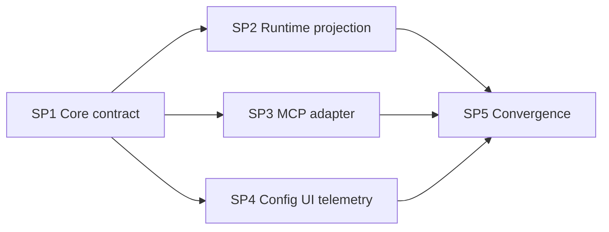

# AgenticX ToolSearch Master DAG

Planned-with: GPT-5.6 Sol  
Suggested-Impl-Model: Cursor Grok 4.5 High Fast  
Plan-Id: `2026-07-21-agenticx-tool-search-master`

## 目标

为 AgenticX Studio / Near Desktop 主对话链路增加**多模型通用、客户端侧**的 ToolSearch：首轮只暴露核心工具 + `tool_search`，模型检索后从下一轮起把命中的内置/MCP **完整 schema** 注入 `tools[]`，从而显著降低首轮工具 schema token；关闭时行为与今天完全一致。

## 为什么必须做（证据链）

1. 今天 Meta/Studio 路径在 `agenticx/studio/server.py` ~L3039–3058 / ~L3701–3713 组装 `effective_tools`（`META_AGENT_TOOLS` / `STUDIO_TOOLS` → `_filter_tools_by_policy`），整表传入 `AgentRuntime.run_turn`。
2. `AgentRuntime.run_turn`（`agenticx/runtime/agent_runtime.py` ~L2067–2084）在 turn 开始固定 `active_tools`，每轮 LLM 调用（~L2592 streaming / ~L2858 invoke）整表传 `tools=`；**没有** per-round 投影。
3. 实测：`META_AGENT_TOOLS` ≈ 77 schemas / ~53k chars / ~15.3k tokens；保守核心集 ≈ 23 tools / ~4.5k tokens（约 30%）。
4. MCP：`list_mcps`（`meta_tools.py` ~L387）只返回名称；`mcp_call`（`agent_tools.py` ~L796）参数是通用 `object`。MCP schema **不在** `tools[]`，但部分路径经 `build_mcp_tools_context`（`studio_mcp.py` ~L1120）注入系统提示（`agent_runtime.py` `_build_agent_system_prompt` ~L1002–1046，截断 6000 chars）。**只做 tools[] 投影而不改这段，省不了 MCP 侧 token。**
5. Claude Code 参考见 `research/codedeepresearch/claude-code/claude-code_tool_search_notes.md`；AgenticX 为多 provider，**首版不走** Anthropic `defer_loading` / `tool_reference`。

## 冻结设计（全 DAG 共享，禁止节点内改口径）

| 决策 | 取值 |
|------|------|
| 协议 | 多模型通用客户端侧；未来 Anthropic hydrator 只能挂在同一投影接口之后 |
| 目录 | 策略过滤后的内置工具 + 已连接 MCP 的 description/inputSchema |
| 首轮暴露 | 显式核心 allowlist + `tool_search` + 会话已加载集合 |
| 检索工具 | `tool_search(query, max_results)`；本地确定性加权；结果只写命中名与“下一轮可调用”，**不把大 schema 写进 chat_history** |
| Schema 生效时机 | 命中后从**下一轮**进入 `tools[]`（同批未加载工具返回专用错误） |
| MCP 公开名 | `mcp__{serverSlug}__{toolSlug}`；provider-safe；≤64 chars；冲突/截断追加稳定短 hash；执行映射回 `MCPHub` routed name |
| MCP fallback | 保留 `list_mcps` → `mcp_call`；ToolSearch off 时绝不把全部 MCP schema 塞进首轮 `tools[]` |
| 内置 defer | **显式 defer allowlist**；新工具默认常驻，审查后才 defer |
| 会话状态 | scratchpad 私有键 `__tool_search_state_v1__`（有序 IDs + catalog fingerprint）；LRU max 24；恢复/压缩后与当前策略/连接求交集 |
| 配置 | `runtime.tool_search.mode: off\|auto\|always`，**默认 `off`**；`auto_schema_token_threshold: 6000` |
| Fail-open | `tool_search` 被工具策略禁用 → 回退今天完整内置工具面 |
| 检索算法 | 无 embedding；exact / `select:` / MCP 前缀 / `+required` / name tokens / hints / description |
| MCP 系统提示 | ToolSearch **启用且 applied** 时，`build_mcp_tools_context` 不得再倾倒全量 schema；只允许名称目录或已加载子集（SP3 落地） |



## 物理 subplans 与推荐模型

| 节点 | Plan-Id / Plan-File | 依赖 | Suggested-Impl-Model | 理由 |
|------|---------------------|------|----------------------|------|
| SP1 | `2026-07-21-tool-search-core-contract` | — | Cursor Grok 4.5 High Fast | 纯模块 + 单测，无接线 |
| SP2 | `2026-07-21-tool-search-runtime-projection` | SP1 | Cursor Grok 4.5 High Fast | runtime 接线，Fake LLM 测 |
| SP3 | `2026-07-21-tool-search-mcp-adapter` | SP1 | Cursor Grok 4.5 High Fast | MCP hub 快照 + prompt 纪律 |
| SP4 | `2026-07-21-tool-search-runtime-settings` | SP1 | Cursor Grok 4.5 High Fast 或 Composer 2.5 | Desktop 表单/IPC 样板 |
| SP5 | `2026-07-21-tool-search-integration-validation` | SP2+SP3+SP4 | Cursor Grok 4.5 High Fast | 汇合与全矩阵；高回归风险 |

**并行纪律：** SP2/SP3/SP4 仅在隔离 worktree 可并行；共享工作区则串行。每节点新 Grok 上下文；父任务审查测试与 diff 后解锁下一节点。最终用独立审查模型做 code review，实现 agent 不自证完成。

## In scope / Out of scope

**In scope：** 内置/MCP schema 按需加载、本地关键词检索、scratchpad 状态、Desktop Runtime GUI、CONTEXT_STATS 遥测、MCP 系统提示倾倒约束、provider-agnostic 回归。

**Out of scope：** Anthropic beta 原生协议、embedding/BM25、市场工具安装搜索、Skill 搜索改造、Enterprise 前台/网关、改变 MCP 连接生命周期、在本 DAG 内把默认改成 `auto`、重构无关 runtime、改 `messages.json` 协议。

**禁止触碰（除非 SP5 证明无法绕开并先获用户确认）：** `agenticx/studio/server.py` 顶部 import 区块。推荐设计不需要改 `server.py`；若必须改，强制冷启动 smoke。

## 根因 → 改动映射

| 根因 | 对应节点 |
|------|----------|
| 每轮整表 `active_tools` | SP1 投影纯函数 + SP2 per-round project |
| 无检索后加载入口 | SP2 注册 `tool_search` + dispatch 上下文 |
| MCP 只有名字/通用 arguments | SP3 catalog + SP5 动态 function 执行 |
| 系统提示倾倒 MCP schema | SP3 改 `build_mcp_tools_context` |
| 无配置/可观测 | SP4 |
| 多路径回归风险 | SP5 |

## Grok / Composer 执行门槛（每个 subplan 必须满足）

1. 精确落点：路径 + 符号 + 行号/锚点片段。  
2. before/after 意图或伪代码。  
3. 根因写在 plan 正文。  
4. 每条 FR 配可执行 AC（测试文件名 + 断言）。  
5. 显式 In/Out of scope + no-scope-creep。  
6. 正则/字段/状态键写全。  

判据：把单个 subplan 交给 Composer 2.5 若仍需反问「改哪个文件/改成什么样/怎么验证」，则该 plan 不达标。

## 最终验收命令（SP5 后）

```bash
pytest -q tests/test_tool_search.py \
  tests/test_agent_runtime_tool_search.py \
  tests/test_tool_search_mcp_catalog.py \
  tests/test_context_budget.py \
  tests/test_meta_tools.py \
  tests/test_studio_mcp_call_async.py

pytest -q tests/test_smoke_streaming_tool_truncation.py \
  tests/test_smoke_openharness_features.py

# desktop/
npm run typecheck && npm run build
```

量化门禁（SP5）：`always` 首轮 serialized tool chars ≤ 完整池 40%；`off` 与改动前工具名集合完全一致；LRU 24；默认保持 `off`。

## 执行顺序建议

1. Plan-only bootstrap commit：本 Master + SP1–SP5 五个文件一并提交（用户确认后）。  
2. SP1 → merge。  
3. SP2 / SP3 / SP4（worktree 并行或串行）。  
4. SP5 汇合验收。  
5. **另立小提交**（本 DAG 外）才可将默认切 `auto`。

## Todos

- [ ] SP1 Core contract
- [ ] SP2 Runtime projection
- [ ] SP3 MCP adapter（含 prompt 倾倒约束）
- [ ] SP4 Config UI + telemetry
- [ ] SP5 Convergence validation
- [ ] （可选，独立 commit）默认 `off` → `auto`
