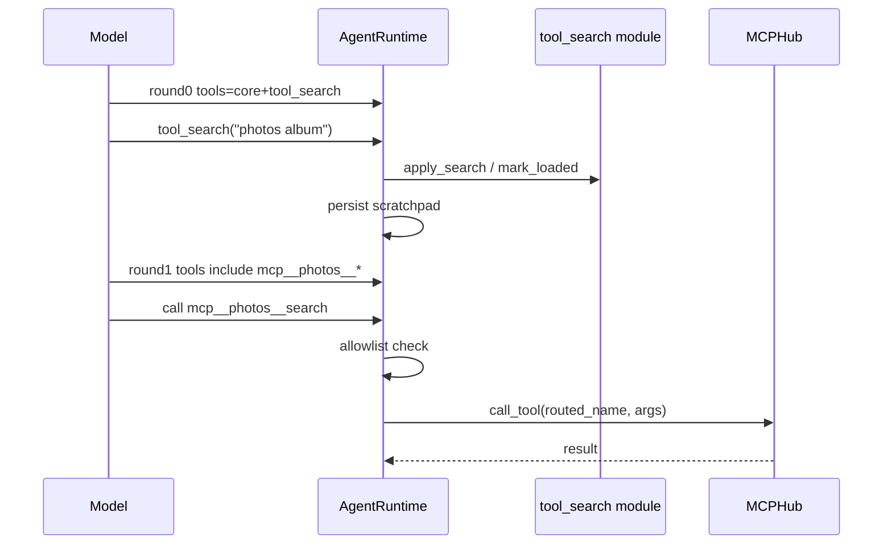

# SP5: ToolSearch Convergence + Validation

Planned-with: GPT-5.6 Sol  
Suggested-Impl-Model: Cursor Grok 4.5 High Fast  
Plan-Id: `2026-07-21-tool-search-integration-validation`  
Parent: `.cursor/plans/2026-07-21-agenticx-tool-search-master.plan.md`  
Depends-on: SP2 + SP3 + SP4 均已合并并复查

## Goal

把 MCP catalog 注入 runtime 投影，实现动态 MCP function 安全执行（经父门禁与现有 hooks），用假相册 MCP 做端到端验收，跑全矩阵与量化门禁；**保持默认 `off`**。

## Architecture



## In scope

- 接线：`tool_search_runtime.build_runtime_context` ← `mcp_tool_catalog.snapshots_to_descriptors`
- `dispatch_tool_async` / runtime：动态 MCP 名 → `MCPHub.call_tool`
- 端到端测试（假 photos MCP）
- 回归矩阵与量化断言
- 确认 `build_mcp_tools_context(defer_schemas=True)` 在 applied 路径生效

## Out of scope / no-scope-creep

- **禁止**把默认 `mode` 改为 `auto`（另立小提交）  
- 不引入 Anthropic beta  
- 不改 Enterprise  
- 不重构无关 compact / loop_detector  
- 尽量不改 `server.py`；若必须，强制冷启动 smoke，且**禁止**整段替换 import 区

---

## FR / AC

| ID | Requirement | AC |
|----|-------------|-----|
| FR-1 | MCP descriptors 进入 catalog | e2e：search 命中 photos |
| FR-2 | 首轮无 photos schema；检索后次轮有 | `test_photos_mcp_e2e` |
| FR-3 | 调用走 hub routed_name，参数按 schema | 假 client 收到正确 original_name/args |
| FR-4 | `mcp_call` 禁用 → MCP 候选 0 | 策略测 |
| FR-5 | 断开后 schema 消失；重连可再加载 | 测 |
| FR-6 | Meta / avatar / automation / group 路径不崩溃 | smoke 或定向测 |
| FR-7 | MiniMax 无 tool_choice 路径不炸 | 既有 smoke + 新测 |
| FR-8 | 量化：always 首轮 chars ≤ 40% full | `test_token_budget_gate` |
| FR-9 | off 工具名集合与 baseline 一致 | `test_off_parity_names` |
| FR-10 | 默认配置仍为 off | 读 `read_tool_search_config()` |

---

## Task 1: 注入 MCP descriptors

**Modify:** `agenticx/runtime/tool_search_runtime.py`（SP2 创建）或 `agent_runtime.py` 组装点

```python
hub = getattr(session, "mcp_hub", None)
snapshots = hub.list_tool_snapshots() if hub else []
mcp_descs = snapshots_to_descriptors(
    snapshots,
    mcp_call_allowed="mcp_call" in full_pool_names,
)
ts_ctx = build_runtime_context(
    session=session,
    full_openai_tools=full_tool_pool,
    mcp_descriptors=mcp_descs,
)
```

每轮 `_project()` 前可刷新 snapshots（支持动态连接），再 `prune_state_to_catalog`。

投影时：loaded 的 MCP descriptor 转为 OpenAI function tool：

```python
{
  "type": "function",
  "function": {
    "name": descriptor.name,  # public name
    "description": descriptor.description,
    "parameters": descriptor.input_schema,
  },
}
```

---

## Task 2: 动态 MCP 执行门禁

**Modify:** `agenticx/cli/agent_tools.py` `dispatch_tool_async` 与/或 `agent_runtime.py` 工具执行分支（~L3741）

伪代码：

```python
if name not in allowed_tool_names:
    if is_known_unloaded(name, runtime_tool_context):
        return NOT_YET_LOADED_ERROR
    return unknown

if is_mcp_public_or_routed(name, runtime_tool_context):
    routed = resolve_mcp_execution_name(name, ...)
    # MUST still require mcp_call in full policy pool (parent gate)
    if "mcp_call" not in full_pool_names:
        return "MCP tools disabled by policy"
    # permissions / hooks / confirmation: reuse paths used by mcp_call
    return await session.mcp_hub.call_tool(routed, arguments)
```

**禁止：**

- 绕过 session permissions / `tool:before_call` hooks  
- 直接读 `hub._tool_routing`（用 SP3 公开 API / descriptor 映射）  
- 把动态 MCP 当成无 schema 的自由 `mcp_call` 旁路而不检查 allowlist  

保留 `mcp_call` 工具本身可用（兼容）。

---

## Task 3: 假相册 MCP e2e

**Create:** `tests/test_tool_search_photos_mcp_e2e.py`（或并入 `test_agent_runtime_tool_search.py`）

假 server `photos` 暴露：

- `search` — `{ "query": string }`  
- `create_album` — `{ "title": string }`  

流程：

1. mode=always，连接假 hub。  
2. Round0 tools 不含 `mcp__photos__search`。  
3. `tool_search("photos album")` → matches 含该 public name。  
4. Round1 tools 含完整 parameters。  
5. 模型调用 `mcp__photos__search` → fake client 记录 `original_name=="search"`。  
6. 断言系统提示 `build_mcp_tools_context` 在 applied 下无大段 schema。

---

## Task 4: 回归矩阵（清单，可多文件）

| 场景 | 最低验证 |
|------|----------|
| Meta `run_turn` streaming | Fake stream + tool_search |
| Avatar / STUDIO_TOOLS | mode=always 不炸 |
| Automation `avatar_id=automation:*` | 工具集过滤后 fail-open 或正常投影 |
| Group / loop | 不引入新 NameError |
| 全局/分身禁用某 defer 工具 | catalog 无该工具；无法加载 |
| 禁用 `mcp_call` | MCP descriptors 空 |
| 中断 / 恢复 / fork session | scratchpad loaded 交集正确 |
| Compaction | compact 后仍 project；状态不丢 |
| MCP 动态 connect/disconnect | 投影跟随 |
| MiniMax | 走 invoke 无 tool_choice 不抛 |
| OpenAI-compatible stream + non-stream | 各 1 |

优先扩展现有：`tests/test_smoke_streaming_tool_truncation.py`、`tests/test_studio_mcp_call_async.py`、`tests/test_meta_tools.py`、`tests/test_context_budget.py`。

---

## Task 5: 量化门禁

在测试中序列化 `json.dumps(tools, ensure_ascii=False)`：

```python
assert len(round0_tools_json) <= int(0.40 * len(full_pool_json))
assert set(off_names) == set(baseline_full_names)
assert loaded_count <= 24
```

用当前 `META_AGENT_TOOLS` 策略过滤后池作为 full。阈值 40% 来自 Master 冻结；若因 CORE allowlist 过大偶发失败，**先收紧 defer 集合或核对 CORE，禁止私自放宽到 60%**——若确需调整，更新 Master 并获用户确认。

---

## Task 6: 最终命令

```bash
pytest -q tests/test_tool_search.py \
  tests/test_agent_runtime_tool_search.py \
  tests/test_tool_search_mcp_catalog.py \
  tests/test_tool_search_photos_mcp_e2e.py \
  tests/test_context_budget.py \
  tests/test_meta_tools.py \
  tests/test_studio_mcp_call_async.py

pytest -q tests/test_smoke_streaming_tool_truncation.py \
  tests/test_smoke_openharness_features.py

cd desktop && npm run typecheck && npm run build
```

若触碰 `agenticx/studio/server.py`：

```bash
agx serve --host 127.0.0.1 --port 18765
# curl --noproxy '*' http://127.0.0.1:18765/api/session 等核心 API 200
```

---

## Rollout gate

- [ ] 全部测试绿  
- [ ] 默认 `read_tool_search_config().mode == "off"`  
- [ ] 独立审查模型完成 code review  
- [ ] 量化门禁通过  

**然后才能**另开 commit：文档/配置示例建议 `auto`，或改代码默认——**不在本 Plan-Id 内完成。**

---

## Commit 边界

允许：SP2/SP3 接线所需最小 diff、e2e/回归测试、本 plan。  
禁止：默认改 `auto`、无关重构、Enterprise、Anthropic beta。
