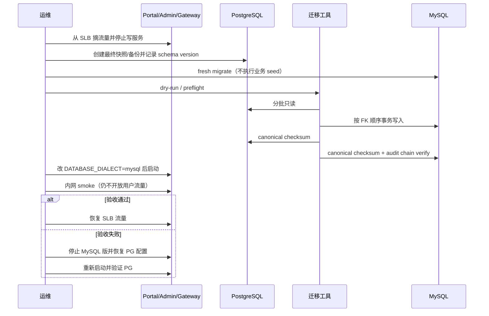

# PostgreSQL → MySQL 离线迁移 Runbook

首期只支持**维护窗口内停机离线迁移**。不做双写、CDC 或近零停机。

详细 Go / No-Go 与命令摘要见 [../database/cutover-runbook.md](../database/cutover-runbook.md)。

## 维护窗口顺序



## 命令

```bash
cd enterprise

# 目标库：仅 migrate，不要对生产目标跑 db:seed
export DATABASE_DIALECT=mysql
export DATABASE_URL=mysql://...
pnpm --filter @agenticx/db-schema db:migrate

PG_SOURCE_DATABASE_URL=postgresql://... \
MYSQL_TARGET_DATABASE_URL=mysql://... \
pnpm db:migrate:pg-to-mysql --dry-run --report .runtime/db-migration-report.json

pnpm db:migrate:pg-to-mysql --batch-size 1000 --report .runtime/db-migration-report.json
pnpm db:verify:pg-to-mysql --report .runtime/db-migration-report.json
```

工具代码：`scripts/db-portability/`。表清单固定 42 张业务表；`usage_records_daily_mv` 为目标侧 VIEW，不搬运数据。

## Go / No-Go

放行前全部满足：

- PostgreSQL 最终备份可恢复
- 迁移报告全部表 `ok`（行数 + checksum）
- audit chain 校验通过
- 登录、聊天、策略、配额、计量、MCP smoke 通过
- 用户流量打开前仍可无损失回退到 PostgreSQL（见 [database-dialect-rollback.md](./database-dialect-rollback.md)）

用户流量打开后，旧 PostgreSQL **不再是最新数据**，禁止直接回切。

## 常见失败

| 症状 | 处置 |
|---|---|
| 目标库非空被拒绝 | 使用空库；或仅在可销毁环境加工具文档中的强制开关 |
| Soft-delete 邮箱冲突 | 确认 MySQL `users.active_email_key` generated column |
| JSON / 时区差异 | 对照 `scripts/db-portability/transforms.ts` 与 fixture 测试 |
